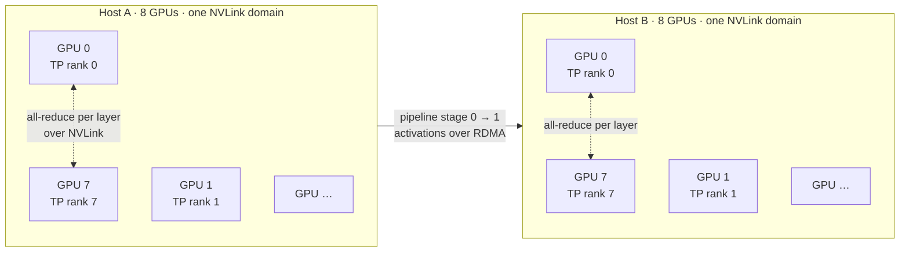
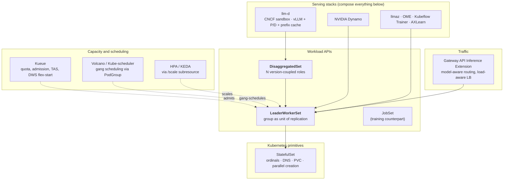

# Module 1: The Multi-Host Inference Problem Space

Before reading a line of LWS source, it is worth being precise about the workload. Multi-host inference is not "a distributed system" in the generic sense — it is a very specific shape, with a very specific set of demands, and almost every LWS design decision is a direct response to one of them. A reader who skips this module will find the controller code full of arbitrary-looking choices; a reader who does not will find it mostly inevitable.

This module covers **the parallelism taxonomy and what each dimension demands**, **prefill/decode disaggregation**, **the orchestration requirements distilled into a checklist**, **why Deployment, StatefulSet, Job, and JobSet each fail that checklist**, **the LWS answer**, **the ecosystem division of labour**, and **the state of the project at v0.9.0**.

!!! info "Provenance"
    Verified against `kubernetes-sigs/lws` at `32a9c37` (2026-08-06), release v0.9.0.

---

## Part 1: The Shape of the Workload

### 1.1 The Arithmetic That Forces the Problem

Weight memory for a dense transformer in bf16 is approximately $2 \times P$ bytes, where $P$ is the parameter count. Add optimizer-free inference overhead — activation buffers, CUDA graphs, the runtime itself — and then the KV cache, which for a batch of $B$ sequences of length $L$ costs roughly

$$
2 \times L \times B \times n_{\text{layers}} \times n_{\text{kv heads}} \times d_{\text{head}} \times \text{bytes per element}
$$

The practical consequence for current frontier models:

| Model class | bf16 weights | Minimum HBM with headroom | Fits on |
| :--- | ---: | ---: | :--- |
| 8B dense | ~16 GB | ~24 GB | 1 × L4 / A100-40 |
| 70B dense | ~140 GB | ~200 GB | 2–4 × H100-80 (one host) |
| 405B dense | ~810 GB | ~1.1 TB | **2 × 8×H100 hosts** |
| 671B MoE (e.g. DeepSeek-class) | ~1.3 TB | ~1.8 TB | **4 × 8×H100 hosts** |

The threshold that matters is not "does it fit on a GPU" but **"does it fit inside one NVLink domain"**. Inside a host, GPUs talk over NVLink/NVSwitch at hundreds of GB/s. Across hosts they talk over RDMA fabric — InfiniBand, RoCE, or a cloud equivalent such as GPUDirect-TCPX — at meaningfully lower bandwidth and higher latency. Crossing that boundary is the event that turns a scheduling problem into an *orchestration* problem, because now the placement of pods relative to each other determines whether the workload is fast, slow, or non-functional.

### 1.2 The Parallelism Taxonomy

Four dimensions of parallelism appear in production inference. They compose multiplicatively, and each makes a different demand of the orchestrator.



| Dimension | What is split | Communication pattern | Bandwidth sensitivity | Orchestration demand |
| :--- | :--- | :--- | :--- | :--- |
| **TP** (tensor) | Every weight matrix, across ranks | `all-reduce` **twice per transformer layer** | Extreme — this is why TP wants to stay inside NVLink | All TP ranks must be co-located in one high-bandwidth domain, started together, and share a world size known at process start |
| **PP** (pipeline) | Layers, into sequential stages | Point-to-point activation hand-off at stage boundaries | Moderate — one transfer per micro-batch per boundary | Stages can span hosts; ordering and addressability of stages matter |
| **EP** (expert) | MoE experts, across ranks | `all-to-all` token dispatch/combine per MoE layer | High and *bursty* — traffic depends on routing | Same co-location pressure as TP, plus load-imbalance sensitivity |
| **DP** (data) | Nothing; independent replicas | None between replicas | Zero | This is the dimension that scales horizontally — and it is exactly what `LeaderWorkerSet.spec.replicas` counts |

The critical observation is that **TP, PP, and EP all live *inside* one serving unit, while DP is *across* serving units.** An orchestrator that only understands "number of pods" cannot express this. It needs to know that these 16 pods are two independent copies of an 8-pod thing, not sixteen of anything.

### 1.3 Prefill/Decode Disaggregation

The second structural fact is that LLM inference has two phases with opposite hardware profiles.

| | Prefill | Decode |
| :--- | :--- | :--- |
| Work | Process the whole prompt, build the KV cache | Generate one token at a time |
| Parallelism available | Massive — all prompt tokens at once | One token per sequence per step |
| Bottleneck | **Compute-bound** (FLOPs) | **Memory-bandwidth-bound** (reading weights + KV cache) |
| Ideal batch | Small batches, long sequences | Large batches, to amortize weight reads |
| Ideal hardware | Highest FLOPs available | Highest HBM bandwidth and capacity |
| Latency SLO | TTFT (time to first token) | ITL / TPOT (inter-token latency) |

Running both phases in the same process forces a compromise: continuous batching interleaves them, and a long prefill stalls every decode in the batch (the "head-of-line blocking" that shows up as ITL spikes). **Disaggregated serving** splits them into separate pools, transferring the KV cache from prefill to decode over the fabric. vLLM and SGLang both support this.

The orchestration consequence is severe and is exactly what `DisaggregatedSet` exists for:

- Prefill and decode pools have **different shapes** (different TP degree, different GPU types, different replica counts).
- Their replica counts must scale **independently** — the optimal P:D ratio depends on prompt-to-generation length ratio and shifts with traffic.
- They are **coupled by version**. A prefill server hands a KV cache to a decode server; the two must agree on layout, quantization, and model revision. Rolling one without the other is a correctness bug, not a performance issue.
- Traffic routing must be **revision-aware**: a request's prefill and decode must land on backends of the *same* revision.

That last requirement is the single most consequential design constraint in [Module 8](08_disaggregatedset.md), and it is why DisaggregatedSet creates one LeaderWorkerSet *per revision per role* rather than using LWS's own `partition` mechanism.

### 1.4 The Requirements Checklist

Distilling Parts 1.1–1.3 into what an orchestrator must actually provide:

| | Requirement | Driven by |
| :--- | :--- | :--- |
| **R1** | A group of $N$ pods is created, scaled, updated, and deleted **as one unit** | TP/PP/EP live inside a group; DP is across groups |
| **R2** | Every pod knows its **rank and world size before the process starts** | Collective libraries need `WORLD_SIZE`/`RANK` at init |
| **R3** | Every pod can **address every other pod** by a stable name, before any pod is Ready | Rendezvous happens during startup, not after |
| **R4** | The group is **co-located** in a chosen topology domain, opt-in | TP/EP bandwidth sensitivity |
| **R5** | Capacity for the whole group is acquired **all-or-nothing** | A half-scheduled group holds GPUs and serves nothing |
| **R6** | A single pod or container failure **recreates the whole group** | Sharded state has no partial-recovery path |
| **R7** | Rollout proceeds **group by group**, with configurable surge and unavailability | Updating half a group produces a mixed-version collective |
| **R8** | Horizontal scaling operates on **group count**, and metrics aggregate per group | DP is the scaling dimension |
| **R9** | Multiple **differently-shaped, version-coupled** groups can be managed and rolled together | Prefill/decode disaggregation |

R1–R8 are LeaderWorkerSet. R9 is DisaggregatedSet.

---

## Part 2: Why the Existing APIs Fall Short

Every one of the built-in workload APIs was tried for this before LWS existed. Understanding exactly where each breaks is the fastest route to understanding why LWS looks the way it does.

| API | R1 group unit | R2 rank | R3 stable DNS | R5 gang | R6 group restart | R7 group rollout | R8 group scale |
| :--- | :---: | :---: | :---: | :---: | :---: | :---: | :---: |
| **Deployment** | ✗ | ✗ | ✗ | ✗ | ✗ | ✗ | ✗ |
| **StatefulSet** | ✗ | partial | ✓ | ✗ | ✗ | ✗ | ✗ |
| **Job** | ✓ (completion) | ✓ (indexed) | partial | via plugins | ✗ | n/a | n/a |
| **JobSet** | ✓ | ✓ | ✓ | ✓ | ✓ | n/a | n/a |
| **LeaderWorkerSet** | ✓ | ✓ | ✓ | ✓ (alpha) | ✓ | ✓ | ✓ |

### 2.1 Deployment

Deployment's model is *interchangeable, anonymous, individually-replaceable* replicas. Every one of those three words is wrong for a sharded model server. Pods get random name suffixes, so there is no rank. There is no per-pod DNS. The rolling update replaces pods individually, so mid-rollout you have a collective with mismatched weights. It is not a near-miss; it is the opposite design.

### 2.2 StatefulSet

StatefulSet gets much closer and is, in fact, what LWS builds on. It gives ordinal identity (`sts-0`, `sts-1`, …), stable per-pod DNS via a headless Service, `podManagementPolicy: Parallel` for simultaneous creation, and PVC templates.

Where it breaks is **dimensionality**. A StatefulSet has exactly one `replicas` knob. For a multi-host model you need two: how many pods per group, and how many groups. Encoding both in one number (`replicas = groups × size`) destroys every group-level operation:

- Rolling update walks pods by ordinal, so it would update pod 7 of group 0 and pod 0 of group 1 as unrelated events — guaranteeing a mixed-version collective.
- Scaling by one adds one pod to a group that needed a whole group.
- HPA cannot express "add a replica of the 8-pod thing".
- Failure handling is per-pod by construction.

There is also no notion of a leader — no single pod to route to, aggregate metrics on, or run the engine's front end.

### 2.3 Job and JobSet

Indexed Job gives you `JOB_COMPLETION_INDEX`, which is a real rank. [JobSet](https://github.com/kubernetes-sigs/jobset) — LWS's sibling project in SIG-Apps — composes multiple Jobs into a gang-scheduled, DNS-addressable unit, and is genuinely excellent for multi-host *training*.

The mismatch is **run-to-completion semantics**. A Job is done when its pods exit successfully; a serving endpoint never exits successfully. Concretely this means: no rolling update (you replace the whole JobSet), no scale subresource for HPA, backoff/retry semantics tuned for batch failure rather than for a hot-standby endpoint, and a lifecycle where "succeeded" is a terminal state you never want to reach.

The upstream position is that JobSet and LWS are complements, not competitors: **JobSet for training, LWS for serving.** The two share a substantial amount of design DNA — gang scheduling, exclusive placement, per-replica DNS — which is why patterns learned in one transfer to the other.

### 2.4 Framework-Specific Operators

Ray, MPI Operator, TorchElastic and friends all solve rank assignment and rendezvous, and are widely used. Their cost is that they bring an entire framework's control plane into your serving path, they are framework-specific, and their failure semantics are the framework's rather than Kubernetes'. LWS's position is that rank assignment and group lifecycle belong in the *workload API*, and the framework should be a detail of the container image — which is why LWS integrates with Ray-based vLLM deployments rather than replacing them ([Module 9](09_inference_engine_integration.md)).

---

## Part 3: The LeaderWorkerSet Answer

### 3.1 The Minimal Object

Here is a complete two-host tensor-parallel deployment, reduced to the fields that matter.

```yaml
apiVersion: leaderworkerset.x-k8s.io/v1
kind: LeaderWorkerSet
metadata:
  name: vllm
spec:
  replicas: 2                              # R8: two independent model servers
  leaderWorkerTemplate:
    size: 2                                # R1: each server is 2 pods (leader + 1 worker)
    restartPolicy: RecreateGroupOnPodRestart  # R6: default
    leaderTemplate:
      spec:
        containers:
          - name: vllm-leader
            image: vllm/vllm-openai:latest
            resources: { limits: { nvidia.com/gpu: "8" } }
    workerTemplate:
      spec:
        containers:
          - name: vllm-worker
            image: vllm/vllm-openai:latest
            resources: { limits: { nvidia.com/gpu: "8" } }
  rolloutStrategy:                         # R7
    type: RollingUpdate
    rollingUpdateConfiguration:
      maxUnavailable: 1
      maxSurge: 0
```

Four pods total, in two groups of two, each group spanning two hosts with 8 GPUs each — 16-way tensor parallelism per group. The API expresses the group count and the group size as separate numbers, and everything else follows.

!!! note "The group name is the API"
    Note the two-level naming: leader pods are `vllm-0`, `vllm-1`; workers are `vllm-0-1`, `vllm-1-1`. The leader pod's name **is** the group name and is used as the owner and the identity anchor throughout the controller. [Module 3](03_group_lifecycle_and_identity.md) covers this in full.

### 3.2 Requirements Mapped to Mechanisms

This table is the roadmap for the rest of the notes.

| Req | Mechanism | Where it lives | Module |
| :--- | :--- | :--- | :--- |
| R1 | Leader StatefulSet with one leader pod per group; a worker StatefulSet owned by each leader pod | `pkg/controllers/leaderworkerset_controller.go`, `pkg/controllers/pod_controller.go` | [3](03_group_lifecycle_and_identity.md), [4](04_lws_reconciler_internals.md) |
| R2 | `LWS_WORKER_INDEX`, `LWS_GROUP_SIZE` injected by a mutating webhook | `pkg/webhooks/pod_webhook.go` | [3](03_group_lifecycle_and_identity.md) |
| R3 | `LWS_LEADER_ADDRESS` + headless Service with `publishNotReadyAddresses: true`; `subdomainPolicy` Shared or UniquePerReplica | `pkg/utils/controller/controller_utils.go`, KEP-173 | [3](03_group_lifecycle_and_identity.md), [7](07_scheduling_placement_and_networking.md) |
| R4 | `leaderworkerset.sigs.k8s.io/exclusive-topology` annotation → injected pod affinity/anti-affinity | `pkg/controllers/pod_controller.go` | [5](05_pod_controller_and_failure_handling.md), [7](07_scheduling_placement_and_networking.md) |
| R5 | `SchedulerProvider` interface → Volcano `PodGroup`, behind the `PodGroupPerReplica` feature gate | `pkg/schedulerprovider/`, KEP-407 | [7](07_scheduling_placement_and_networking.md) |
| R6 | `restartPolicy` + container-restart detection in the pod controller | `pkg/controllers/pod_controller.go` | [5](05_pod_controller_and_failure_handling.md) |
| R7 | Partition walk-down over the leader StatefulSet, plus `maxSurge`/`maxUnavailable` | `rollingUpdateParameters()` | [6](06_rollout_and_revisions.md) |
| R8 | `+kubebuilder:subresource:scale` with `selectorpath=.status.hpaPodSelector`, leader-pods-only selector | `api/leaderworkerset/v1/leaderworkerset_types.go` | [2](02_api_surface_anatomy.md), [6](06_rollout_and_revisions.md) |
| R9 | `DisaggregatedSet` managing N LeaderWorkerSets, one per (slice, revision, role) | `pkg/controllers/disaggregatedset/` | [8](08_disaggregatedset.md) |

### 3.3 Why Two Tiers of StatefulSet

The most-questioned design decision in LWS is the two-tier structure: one leader StatefulSet for the whole LWS, plus one worker StatefulSet per group, owned by the leader *pod*. The obvious alternative — one flat StatefulSet of `replicas × size` pods — fails immediately, as §2.2 showed. The less obvious alternative — the LWS controller creating worker StatefulSets directly — is worth understanding, because the rejected option explains a lot of code.

Making the **leader pod** the owner of the worker StatefulSet buys three things:

1. **Garbage collection is free.** Deleting a leader pod cascades to its worker StatefulSet, which cascades to its worker pods. Group teardown — during scale-down, rolling update, or `RecreateGroupOnPodRestart` — is a single delete plus Kubernetes' own GC. There is no finalizer, and indeed `Reconcile` returns immediately if `DeletionTimestamp` is set.
2. **Group lifecycle is anchored to a real object.** The leader pod's existence *is* the group's existence, which gives the controller a natural place to hang labels (`group-index`, `group-key`) and a natural key for the scale subresource selector.
3. **The rollout gets a free ordering primitive.** Because leader pods are members of a StatefulSet, LWS can drive a group-by-group rollout using the StatefulSet controller's own `partition` mechanism, rather than implementing ordered replacement itself.

The cost, and it is real: worker StatefulSets are **not** in the LWS controller's `Owns()` graph, so the controller needs a second, label-based watch to notice their changes. That is `enqueueLWSRequests` in [Module 4](04_lws_reconciler_internals.md), and forgetting it exists is a common source of "why didn't my reconcile fire" confusion.

---

## Part 4: The Ecosystem Division of Labour

LWS is deliberately small. Knowing what it *refuses* to do is as important as knowing what it does, because a PR that adds a responsibility LWS has explicitly delegated will not be merged.



| Concern | Owner | LWS's role |
| :--- | :--- | :--- |
| Ordinals, stable DNS, PVC binding, parallel pod creation | StatefulSet | Creates StatefulSets and configures them |
| Quota, queueing, admission, topology-aware scheduling, DWS flex-start | Kueue | Wears a `kueue.x-k8s.io/queue-name` label; otherwise passive |
| Gang scheduling | Volcano (via `SchedulerProvider`) | Creates a `PodGroup` per group and labels pods into it |
| Horizontal autoscaling | HPA / KEDA | Exposes `/scale`; publishes a leader-only pod selector |
| Model-aware request routing, prefix-cache-aware load balancing | Gateway API Inference Extension | None — routing is out of scope |
| Model download, quantization, engine flags | The container image | None |
| Prefill/decode role coordination | **DisaggregatedSet** | Same project, layer above |

Two co-design relationships are worth knowing about when reading issues and PRs. **[llm-d](https://github.com/llm-d/llm-d)** (CNCF sandbox) is the reference consumer that both APIs are co-designed with, and several KEPs cite llm-d requirements directly. **JobSet** is the sibling API; when a mechanism exists in one and not the other, the question "should this be shared?" comes up in review, and the honest answer is usually "eventually, via a common library that does not yet exist."

---

## Part 5: Project Status at v0.9.0

### 5.1 Feature Maturity

| Feature | KEP | Maturity | Notes |
| :--- | :--- | :--- | :--- |
| Core group API (leader + workers, dual template) | — | Stable | `leaderworkerset.x-k8s.io/v1` |
| Rolling update with `maxUnavailable`/`maxSurge` | — | Stable | `maxUnavailable > 1` needs the upstream `MaxUnavailableStatefulSet` gate |
| ControllerRevision-based rollout | KEP-238 | Stable | Enables rollback and revision-aware status |
| Exclusive topology placement | — | Stable | Annotation-driven |
| Restart policies / group failure handling | — | Stable | `Default` value deprecated in favour of `None` |
| Startup policy (`LeaderReady`) | KEP-135 | Stable | |
| Subgroups | KEP-115, KEP-257 | Stable | `LeaderWorker` and `LeaderExcluded` policy types |
| Headless Service per group | KEP-173 | Stable | `subdomainPolicy: UniquePerReplica` |
| User-settable `partition` | KEP-511 | Stable | Canary and xPyD rollouts |
| `volumeClaimTemplates` | KEP-622 | Stable | Note the field-forwarding gaps in [Module 7](07_scheduling_placement_and_networking.md) |
| Resizable `size` | KEP-552 | Stable | |
| Gang scheduling | KEP-407 | **Alpha** | Volcano only; `PodGroupPerReplica` feature gate; API may change |
| `RecreateGroupAfterStart` | — | **Experimental** | Annotation-gated, not a spec field |
| DisaggregatedSet | KEP-766 | **Alpha** | Shipped in v0.9.0 |
| DisaggregatedSet slices | KEP-846 | **Alpha** | |
| DisaggregatedSet placement policy | KEP-848 | **Alpha** | |
| DisaggregatedSet per-role HPA | KEP-849 | **Alpha** | `DisaggregatedSetRoleScaler` |
| Fail-fast restart budget | KEP-820 | **Proposal only** | `status: provisional`, no implementation in `pkg/` |

The alpha column is where the contribution opportunities are. See [Appendix B](appendix_pr_opportunities.md).

### 5.2 Adoption

Public adopters listed upstream: **AWS** (EKS multi-node TensorRT-LLM + Triton, and an EFA-enabled EKS Blueprints pattern for multi-node vLLM), **DaoCloud** (default mechanism for cross-node large models), **Google Cloud** (multi-host gen-AI serving on GKE; DeepSeek-R1 671B and Llama 3.1 405B guides), **NVIDIA** (recommended deployment for multi-node NIM), and **Red Hat** (Leader Worker Set Operator on OpenShift via OperatorHub).

Listed integrations: AXLearn, Kubeflow Trainer, llm-d, llmaz, NVIDIA Dynamo, OME, SGLang, and vLLM.

The practical value of this list for a contributor is that it tells you **who will feel your change**. An API change to `leaderWorkerTemplate` touches every one of these; a change to the DisaggregatedSet planner touches llm-d and essentially no one else, which is why alpha DS changes move considerably faster through review.

### 5.3 Governance

LWS lives in `kubernetes-sigs` under **SIG-Apps**. Discussion happens in `#sig-apps` on Kubernetes Slack and on the `kubernetes-sig-apps` mailing list. Approvers at the root `OWNERS` level are a small set — `ahg-g`, `Edwinhr716`, `kerthcet` recur across `OWNERS`, `site/OWNERS`, and the KEP approver lists — so review bandwidth, not disagreement, is usually the rate limiter on a PR. Non-trivial features require a KEP; [Module 11](11_contributor_workflow.md) walks that process.

---

## Lab: Establish the Baseline

The goal is a working two-host tensor-parallel deployment you can return to in every later module. Everything after this assumes you have it.

!!! warning "Scale and verification"
    This lab needs **two nodes with 8 GPUs each** in a single high-bandwidth domain, and a model large enough to genuinely require both. A single-GPU stand-in will run the API paths and teach you nothing about R3, R4, or R5. Commands below are transcribed from upstream examples and GKE documentation and are marked **unverified** where not executed against a live cluster.

### Step 1 — Provision multi-host accelerator capacity (unverified)

```bash
# GKE: a 2-node A3 High pool. Placement policy keeps the nodes in one
# high-bandwidth domain, which is what makes cross-host TP viable.
gcloud container node-pools create a3-pool \
  --cluster=lws-lab --region=us-central1 \
  --machine-type=a3-highgpu-8g \
  --accelerator=type=nvidia-h100-80gb,count=8,gpu-driver-version=latest \
  --num-nodes=2 \
  --placement-type=COMPACT \
  --enable-gvnic
```

Capacity for these machine types is region-limited. If `COMPACT` placement cannot be satisfied, either request a reservation or use Dynamic Workload Scheduler flex-start — and note that flex-start changes the scheduling story enough to matter in [Module 7](07_scheduling_placement_and_networking.md).

### Step 2 — Install LWS

```bash
VERSION=v0.9.0
kubectl apply --server-side -f \
  https://github.com/kubernetes-sigs/lws/releases/download/$VERSION/manifests.yaml

kubectl -n lws-system rollout status deploy/lws-controller-manager
kubectl api-resources | grep -E 'leaderworkerset|disaggregatedset'
```

You should see both `leaderworkersets` (short name `lws`) and, since v0.9.0, `disaggregatedsets` and `disaggregatedsetrolescalers`.

### Step 3 — Deploy the baseline and read the object graph

Use the upstream vLLM example as the starting point, then answer these from the live cluster rather than from the YAML:

```bash
kubectl get lws,sts,svc,pods -o wide
kubectl get controllerrevision
```

Confirm each of the following, which are the claims from Part 3.3:

1. There is **one** StatefulSet named after the LWS, with `replicas` equal to `spec.replicas`.
2. There is **one additional** StatefulSet per group, named after its leader pod.
3. `kubectl get sts <group-name> -o jsonpath='{.spec.ordinals.start}'` returns `1`.
4. `kubectl get sts <group-name> -o jsonpath='{.metadata.ownerReferences[0].kind}'` returns `Pod`, not `LeaderWorkerSet`.
5. `kubectl get svc <lws-name> -o jsonpath='{.spec.publishNotReadyAddresses}'` returns `true`.

### Step 4 — Falsify the StatefulSet argument

Prove §2.2 to yourself rather than taking it on faith. Scale the LWS by one group and watch what changes:

```bash
kubectl scale lws/vllm --replicas=3
kubectl get pods -w
```

Then count: how many pods appeared, and in what order relative to each other? Now consider what a StatefulSet with `replicas: 6` would have done on a `kubectl scale --replicas=7`. The difference between "one more group" and "one more pod" is the entire justification for the API.

### Step 5 — Establish the failure baseline

```bash
# Kill one worker in group 0 and watch the blast radius.
kubectl delete pod vllm-0-1
kubectl get pods -w
```

Record which pods were recreated. This is R6 and the default `RecreateGroupOnPodRestart` policy in action; you will revisit exactly this experiment with a different `restartPolicy` in [Module 5](05_pod_controller_and_failure_handling.md).

### Checkpoint questions

- Why does the *leader* StatefulSet not set `.spec.ordinals.start`, while every worker StatefulSet does?
- If you deleted the leader pod of group 1 directly, what would clean up its worker StatefulSet — the LWS controller, or Kubernetes garbage collection?
- Your model needs 16-way TP but only 8 GPUs fit in an NVLink domain. What does that imply about `size`, and what does it imply about R4?

Continue to [Module 2: API Surface Anatomy](02_api_surface_anatomy.md).
