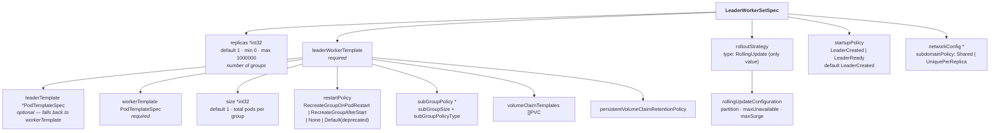
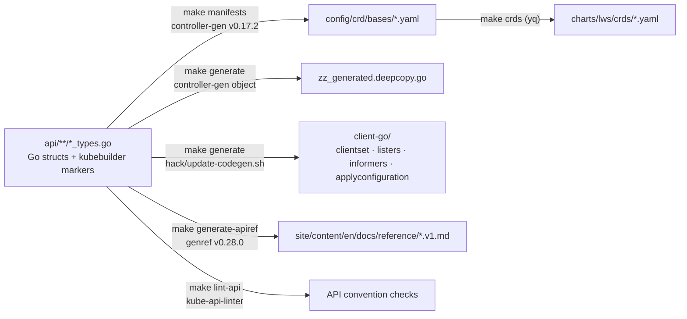

# Module 2: API Surface Anatomy

An API is a contract, and in Kubernetes it is a contract enforced in three places at once: the CRD's OpenAPI schema (structural validation), the admission webhooks (defaulting and semantic validation), and the controller (everything else). A field's real behaviour is the intersection of all three, and reading only the Go struct will mislead you about at least half of them.

This module walks the entire LWS API surface with that layering made explicit: **the three API groups**, **`LeaderWorkerSetSpec` field by field**, **status and conditions**, **the scale subresource**, **the complete defaulting and validation rules**, **the metadata contract** (every label, annotation, and environment variable), **the `Configuration` CRD** that configures the controller itself, and **the codegen and API-linter machinery** you must satisfy to land an API PR.

!!! info "Provenance"
    Verified against `kubernetes-sigs/lws` at `32a9c37` (2026-08-06), release v0.9.0. Type definitions live in `api/leaderworkerset/v1/leaderworkerset_types.go`; webhook rules in `pkg/webhooks/leaderworkerset_webhook.go`.

---

## Part 1: Three API Groups

LWS ships three distinct API groups, and confusing them is a common early mistake — particularly because the *labels* use a different domain (`sigs.k8s.io`) from the *API group* (`x-k8s.io`).

| Group | Version | Kinds | Purpose | Source |
| :--- | :--- | :--- | :--- | :--- |
| `leaderworkerset.x-k8s.io` | `v1` | `LeaderWorkerSet` | The core workload API | `api/leaderworkerset/v1/` |
| `disaggregatedset.x-k8s.io` | `v1` | `DisaggregatedSet`, `DisaggregatedSetRoleScaler` | Multi-role disaggregated serving | `api/disaggregatedset/v1/` |
| `config.lws.x-k8s.io` | `v1alpha1` | `Configuration` | Controller-manager configuration file, **not** a cluster resource | `api/config/v1alpha1/` |

The three CRD manifests are generated into `config/crd/bases/` and mirrored into `charts/lws/crds/`:

```
leaderworkerset.x-k8s.io_leaderworkersets.yaml
disaggregatedset.x-k8s.io_disaggregatedsets.yaml
disaggregatedset.x-k8s.io_disaggregatedsetrolescalers.yaml
```

!!! warning "Labels do not match the API group"
    Every LWS label and annotation is under **`leaderworkerset.sigs.k8s.io/`**, while the API group is **`leaderworkerset.x-k8s.io`**. DisaggregatedSet is self-consistent (`disaggregatedset.x-k8s.io/` for both). This asymmetry is historical and load-bearing — selectors and `kubectl` filters written against the wrong domain silently match nothing.

The `LeaderWorkerSet` kind is registered with short name **`lws`** and four printer columns:

```go
//+kubebuilder:resource:shortName={lws}
//+kubebuilder:printcolumn:name="Ready",type="integer",JSONPath=".status.readyReplicas"
//+kubebuilder:printcolumn:name="Desired",type="integer",JSONPath=".spec.replicas"
//+kubebuilder:printcolumn:name="Up-to-date",type="integer",JSONPath=".status.updatedReplicas"
//+kubebuilder:printcolumn:name="Age",type="date",JSONPath=".metadata.creationTimestamp"
```

Reading `kubectl get lws` therefore gives you the rollout state at a glance: `Desired` is what you asked for, `Up-to-date` is how far the rollout has walked, and `Ready` is how much is actually serving. During a `maxSurge` rollout, none of the three needs to agree with the others.

---

## Part 2: `LeaderWorkerSetSpec`, Field by Field



### 2.1 `replicas` — the group count

```go
// +kubebuilder:default=1
// +kubebuilder:validation:Minimum=0
// +kubebuilder:validation:Maximum=1000000
Replicas *int32 `json:"replicas,omitempty"`
```

This is **the number of leader-worker groups**, not the number of pods. Total pods is `replicas × size`. It is the target of the scale subresource, and the webhook additionally enforces `int64(replicas) * int64(size) <= math.MaxInt32` so the product cannot overflow the int32 used downstream.

`replicas: 0` is legal and is the idiomatic way to park an LWS without deleting it. Note that it interacts with rollout validation: the "maxUnavailable and maxSurge cannot both be 0" rule is *skipped* when `replicas == 0`.

### 2.2 `leaderWorkerTemplate.size` — the group size

```go
// +kubebuilder:default=1
Size *int32 `json:"size,omitempty"`
```

The **total** pod count per group, leader included. `size: 1` means a leader and no workers — and the controller still creates a **0-replica worker StatefulSet** for that group, which surprises people reading `kubectl get sts`. The webhook enforces `size >= 1`.

`size` is **mutable** (KEP-552, "resizable workers"). Changing it triggers a rollout, because it changes the pod template annotation `leaderworkerset.sigs.k8s.io/size` and therefore the revision hash.

### 2.3 `leaderTemplate` and `workerTemplate` — the dual template

`workerTemplate` is required; `leaderTemplate` is optional and **falls back to a deep copy of `workerTemplate`** when nil. This is the "identical templates" convenience path: a homogeneous group needs only one template.

The two-template design exists because in most real deployments the leader is genuinely different. It runs the OpenAPI server, it is the Ray head or the `mpirun` launcher, it exposes the readiness probe the Service routes on, and it often requests slightly different resources. When you *do* supply both, they are independent `PodTemplateSpec`s — there is no merging, no strategic patch, no inheritance.

!!! note "Both templates feed the revision hash"
    Since both templates are part of `leaderWorkerTemplate`, editing either one triggers a rollout of every group. There is no way to update only the worker template.

### 2.4 `restartPolicy` — group failure semantics

```go
// +kubebuilder:default=RecreateGroupOnPodRestart
// +kubebuilder:validation:Enum={Default,RecreateGroupOnPodRestart,RecreateGroupAfterStart,None}
```

| Value | Behaviour | Status |
| :--- | :--- | :--- |
| `RecreateGroupOnPodRestart` | Any pod recreated, or any container/init-container restarted → **the whole group is recreated**. | Default |
| `RecreateGroupAfterStart` | Same, but only once **every pod in the group has left `Pending`**. Suppresses churn during initial scheduling. | Stable |
| `None` | StatefulSet semantics — only the failed pod restarts. | Stable |
| `Default` | Identical to `None`. | **Deprecated**; the defaulting webhook silently rewrites it to `None`. |

The `Default` → `None` rewrite happens in the mutating webhook, so a stored object never retains `Default`. If you see it in a manifest, it came from a pre-rewrite version or from a client that bypassed admission. [Module 5](05_pod_controller_and_failure_handling.md) covers the detection mechanism.

### 2.5 `subGroupPolicy` — partitioning within a group

```go
type SubGroupPolicy struct {
    // +kubebuilder:validation:Enum={LeaderWorker,LeaderExcluded}
    // +kubebuilder:default=LeaderWorker
    Type         *SubGroupPolicyType `json:"subGroupPolicyType,omitempty"`
    SubGroupSize *int32              `json:"subGroupSize,omitempty"`
}
```

Subgroups (KEP-115, KEP-257) partition a group into equal-sized units that can each get their own exclusive-topology domain — the canonical case being one subgroup per host inside a multi-host group.

| Type | Semantics |
| :--- | :--- |
| `LeaderWorker` (default) | The leader participates in a subgroup. If `(size-1) % subGroupSize == 0`, the leader is the "extra" pod and joins the first subgroup, which then has `subGroupSize + 1` members. If `size % subGroupSize == 0`, subgroups are exactly `subGroupSize` and the leader occupies the first slot of the first one. |
| `LeaderExcluded` | The leader is in **no** subgroup. Requires `(size-1) % subGroupSize == 0`. |

!!! danger "The upstream concepts page documents this wrong"
    `site/content/en/docs/concepts/_index.md` describes a value named **`LeaderOnly`** and says it means "a SubGroup is created exclusively for the leader." Neither the name nor the semantics exist in the code — the value is `LeaderExcluded` and it means the opposite. Fixing that page is the highest-value documentation PR currently available; see [Appendix B](appendix_pr_opportunities.md).

`subGroupSize` is **immutable** once set, and cannot be added to or removed from an existing LWS. The webhook enforces all three transitions explicitly.

### 2.6 `rolloutStrategy`

```go
type RollingUpdateConfiguration struct {
    // +kubebuilder:default=0
    Partition *int32 `json:"partition,omitempty"`
    // +kubebuilder:validation:XIntOrString
    // +kubebuilder:default=1
    MaxUnavailable intstr.IntOrString `json:"maxUnavailable,omitempty"`
    // +kubebuilder:validation:XIntOrString
    // +kubebuilder:default=0
    MaxSurge intstr.IntOrString `json:"maxSurge,omitempty"`
}
```

`type` accepts only `RollingUpdate`; there is no `Recreate`. The three knobs are all group-scoped:

- **`partition`** (KEP-511) — groups with index `< partition` are **not** updated. Set it to freeze a rollout at a canary boundary. Defaults to 0. Note the documented interaction: with both `partition` and `maxSurge` set, burst replicas persist until the rollout completes *and* partition is reset to 0.
- **`maxUnavailable`** — how many groups may be unavailable during the update. Percentages round **down**. `maxUnavailable > 1` requires the upstream `MaxUnavailableStatefulSet` feature gate, because it is implemented by passing the value through to the leader StatefulSet.
- **`maxSurge`** — how many groups may exist above `replicas`. Percentages round **up**. Costs a full extra group's worth of accelerators, which for an 8-GPU group is not a small ask.

The arithmetic that consumes these is in [Module 6](06_rollout_and_revisions.md), and it is genuinely non-obvious.

### 2.7 `startupPolicy`

```go
// +kubebuilder:default=LeaderCreated
// +kubebuilder:validation:Enum={LeaderCreated,LeaderReady}
```

`LeaderCreated` builds the worker StatefulSet as soon as the leader pod object exists. `LeaderReady` (KEP-135) waits until the leader pod is **Ready**. Use `LeaderReady` when workers cannot start before the leader is listening — the classic case being an engine whose workers connect to a leader-hosted rendezvous endpoint that would otherwise refuse connections and crash-loop the workers.

The cost of `LeaderReady` is serialized startup: the leader's full model load happens before any worker begins its own. For a large model that can add minutes to every group's cold start, and it interacts badly with gang scheduling, which wants all pods pending simultaneously.

### 2.8 `networkConfig.subdomainPolicy`

```go
// +kubebuilder:validation:Enum={Shared,UniquePerReplica}
```

| Policy | Services created | Leader FQDN | Worker FQDN |
| :--- | :--- | :--- | :--- |
| `Shared` (default) | one, named after the LWS | `my-lws-0.my-lws` | `my-lws-0-1.my-lws` |
| `UniquePerReplica` | one **per group**, named after the leader pod | `my-lws-0.my-lws-0` | `my-lws-0-1.my-lws-0` |

`UniquePerReplica` (KEP-173) exists because a single shared headless Service produces DNS records for every pod in every group — with 100 groups of 8 pods, that is an 800-record response on every lookup, and CoreDNS latency becomes a startup problem. Per-group Services scope each lookup to one group.

The webhook forbids setting `networkConfig` with a nil `subdomainPolicy`, but the field itself is mutable — which means flipping it rewrites every pod's DNS name and forces a full rollout.

### 2.9 `volumeClaimTemplates` and retention

```go
VolumeClaimTemplates []corev1.PersistentVolumeClaim `json:"volumeClaimTemplates,omitempty"`
PersistentVolumeClaimRetentionPolicy *appsv1.StatefulSetPersistentVolumeClaimRetentionPolicy
```

Added by KEP-622, these are forwarded to both the leader and worker StatefulSets. **The forwarding is lossy**, and this is a real trap: `GetPVCApplyConfiguration` in `pkg/utils/controller/controller_utils.go` copies only `accessModes`, `storageClassName`, `volumeMode`, and `resources.{requests,limits}`. Selectors, `dataSource`, `dataSourceRef`, and PVC labels/annotations are **silently dropped**.

Equally notable: the validating webhook does not check `volumeClaimTemplates` at all — not the name/`volumeMount` cross-reference the API doc comment promises, and not immutability. Both gaps are documented in [Appendix B](appendix_pr_opportunities.md).

---

## Part 3: Status and Conditions

```go
type LeaderWorkerSetStatus struct {
    Conditions         []metav1.Condition `json:"conditions,omitempty"`
    ReadyReplicas      int32              `json:"readyReplicas,omitempty"`
    UpdatedReplicas    int32              `json:"updatedReplicas,omitempty"`
    Replicas           int32              `json:"replicas,omitempty"`
    HPAPodSelector     string             `json:"hpaPodSelector,omitempty"`
    ObservedGeneration int64              `json:"observedGeneration,omitempty"`
}
```

| Field | Counts | Gotcha |
| :--- | :--- | :--- |
| `replicas` | Leader StatefulSet's `status.replicas` | **Includes surge replicas.** During a `maxSurge` rollout this exceeds `spec.replicas`. |
| `readyReplicas` | Groups where the leader pod is Running+Ready **and** the worker StatefulSet is ready | Also counts burst replicas |
| `updatedReplicas` | Groups whose leader pod **and** worker StatefulSet carry the current revision hash | Also counts burst replicas |
| `hpaPodSelector` | A serialized selector string | **Computed exactly once**, on first status update, and never recomputed |
| `observedGeneration` | `metadata.generation` at last reconcile | The standard staleness check |

The three condition types are mutually constrained rather than independent:

| Condition | Reason | Meaning |
| :--- | :--- | :--- |
| `Available` | `AllGroupsReady` | At least the minimum groups are up and serving |
| `Progressing` | `GroupsProgressing` | Groups are being created or scaled |
| `UpdateInProgress` | `GroupsUpdating` | A template change is rolling out |

`Available` is forced to `False` whenever `Progressing` or `UpdateInProgress` becomes `True`. `Progressing` and `UpdateInProgress` are **not** mutually exclusive and routinely coexist. The condition arithmetic uses partition-windowed, non-burst counters — different numbers from the three status fields above — which is covered in [Module 4](04_lws_reconciler_internals.md), §status.

---

## Part 4: The Scale Subresource

```go
//+kubebuilder:subresource:status
//+kubebuilder:subresource:scale:specpath=.spec.replicas,statuspath=.status.replicas,selectorpath=.status.hpaPodSelector
```

This is what makes `kubectl scale lws/my-lws --replicas=5` and HPA work. The interesting part is `selectorpath`. `status.hpaPodSelector` resolves to:

```
leaderworkerset.sigs.k8s.io/name=<lws-name>,leaderworkerset.sigs.k8s.io/worker-index=0
```

**Leader pods only.** This is deliberate and worth internalising, because it changes what your HPA metrics mean.

HPA computes `desiredReplicas = ceil(currentReplicas × currentMetric / targetMetric)`, where `currentMetric` for a per-pod metric is the sum over selected pods divided by the *number of selected pods*. If the selector matched all `replicas × size` pods, the denominator would be the pod count while `spec.replicas` is the group count, and the ratio would be wrong by a factor of `size`. Selecting only leaders keeps both sides in group units.

**The practical consequence**: whatever metric you scale on must be **published by the leader pod and represent the whole group**. A per-pod GPU utilization metric scraped from workers is invisible to this HPA. The idiomatic pattern is for the leader to aggregate group-level metrics — queue depth, running requests, KV-cache utilization — and expose them itself. The API doc comment says exactly this.

---

## Part 5: Defaulting and Validation

Both live in `pkg/webhooks/leaderworkerset_webhook.go`, at paths `/mutate-leaderworkerset-x-k8s-io-v1-leaderworkerset` and `/validate-leaderworkerset-x-k8s-io-v1-leaderworkerset`, both with `failurePolicy: Fail` and `sideEffects: None`.

### 5.1 Defaulting

| Condition | Default applied |
| :--- | :--- |
| `restartPolicy` empty | `RecreateGroupOnPodRestart` |
| `restartPolicy == "Default"` | rewritten to `"None"` |
| `rolloutStrategy.type` empty | `RollingUpdate` |
| `rollingUpdateConfiguration` nil | `{maxUnavailable: 1, maxSurge: 0, partition: 0}` |
| `networkConfig` nil, or `subdomainPolicy` nil | `subdomainPolicy: Shared` |

### 5.2 Validation on create and update

| Rule | Why |
| :--- | :--- |
| Name must be **DNS-1035** (`NameIsDNS1035Label`) | The name becomes a Service name, which is stricter than DNS-1123 — it must start with a letter |
| `0 <= replicas <= 1000000` | Schema-level, duplicated in the webhook |
| `size >= 1` | A group must have at least a leader |
| `int64(replicas) * int64(size) <= MaxInt32` | Downstream arithmetic is int32 |
| `maxUnavailable`, `maxSurge`: non-negative, valid percent, `<= 100%` | `ValidatePositiveIntOrPercent` + `IsNotMoreThan100Percent` |
| `partition >= 0` | |
| **`maxUnavailable == 0 && maxSurge == 0 && replicas != 0` → error** | A rollout with neither budget can never make progress. Note the values are *scaled first*, so `10%` of 5 replicas rounds down to 0 and trips this |
| `subgroup-exclusive-topology` annotation without `subGroupSize` → error | The annotation would have nothing to partition |
| `subGroupSize >= 1` | |
| `size % subGroupSize == 0` **or** `(size-1) % subGroupSize == 0` | Subgroups must be equal-sized |
| `subGroupSize <= size` | |
| `LeaderExcluded` requires `(size-1) % subGroupSize == 0` | The leader is excluded, so only the remainder is partitioned |

### 5.3 Immutability on update

| Transition | Result |
| :--- | :--- |
| `subGroupSize` changed | Rejected (`ValidateImmutableField`) |
| `subGroupPolicy` nil → set | Rejected: "cannot enable subGroupSize after the lws is already created" |
| `subGroupPolicy` set → nil | Rejected: "cannot remove subGroupSize after enabled" |
| `networkConfig` set with nil `subdomainPolicy` | Rejected: "cannot set subdomainPolicy as null" |

!!! bug "A latent nil-dereference in the validator"
    `generalValidate` reads `lws.Spec.RolloutStrategy.RollingUpdateConfiguration.MaxUnavailable` **before** the `!= nil` guard two lines below it. In practice the defaulter always populates the struct, so the path is unreachable — but an object created with the mutating webhook unavailable or bypassed would panic the validating webhook rather than being rejected. This is a small, well-scoped correctness PR.

---

## Part 6: The Metadata Contract

The labels, annotations, and environment variables are as much a part of the API as the spec fields, because users select on them, mount them via the Downward API, and read them in entrypoint scripts. All constants live in `api/leaderworkerset/v1/leaderworkerset_types.go` lines 26–99.

### 6.1 Labels

| Key | Applied to | Value |
| :--- | :--- | :--- |
| `leaderworkerset.sigs.k8s.io/name` | Pod, StatefulSet, Service | The LWS name |
| `leaderworkerset.sigs.k8s.io/template-revision-hash` | Pod, StatefulSet | Current revision key |
| `leaderworkerset.sigs.k8s.io/group-index` | Pod, worker StatefulSet | Group ordinal, `0..replicas-1` |
| `leaderworkerset.sigs.k8s.io/group-key` | Pod, worker StatefulSet | A stable hash shared by all pods in the group |
| `leaderworkerset.sigs.k8s.io/worker-index` | Pod | `0` for the leader, `1..size-1` for workers |
| `leaderworkerset.sigs.k8s.io/subgroup-index` | Pod | Only when `subGroupSize` is set |
| `leaderworkerset.sigs.k8s.io/subgroup-key` | Pod | Stable hash shared within a subgroup |

DisaggregatedSet adds `disaggregatedset.x-k8s.io/{name,role,slice,revision}` on LWS, Service, and Pod objects.

The distinction between `group-index` and `group-key` matters. `group-index` is human-readable and reused across group recreations; `group-key` is a hash that changes when the group is recreated, which is what makes it usable as an affinity key that does not accidentally match a previous incarnation of the group.

### 6.2 Annotations

| Key | Applied to | Purpose |
| :--- | :--- | :--- |
| `leaderworkerset.sigs.k8s.io/size` | Pod | Group size; the pod webhook **requires** it and errors without it |
| `leaderworkerset.sigs.k8s.io/replicas` | Leader StatefulSet | Mirrors `spec.replicas` |
| `leaderworkerset.sigs.k8s.io/leader-name` | Worker Pod | The leader pod's name |
| `leaderworkerset.sigs.k8s.io/exclusive-topology` | LWS, Pod | Node-label key defining the exclusive domain |
| `leaderworkerset.sigs.k8s.io/subgroup-exclusive-topology` | LWS, Pod | Same, scoped to a subgroup |
| `leaderworkerset.sigs.k8s.io/subgroup-size` | Pod | Mirrors `subGroupPolicy.subGroupSize` |
| `leaderworkerset.sigs.k8s.io/subgroup-policy-type` | Leader and worker Pod | Mirrors `subGroupPolicy.subGroupPolicyType` |
| `leaderworkerset.sigs.k8s.io/subdomainPolicy` | Leader Pod | Present only when `UniquePerReplica` |
| `leaderworkerset.sigs.k8s.io/leader-requests-tpus` | Pod | Set when the leader requests TPUs |
| `leaderworkerset.sigs.k8s.io/experimental-recreate-group-after-start` | LWS | Experimental gate for `RecreateGroupAfterStart` behaviour |

!!! note "Four keys are missing from the upstream reference table"
    `site/content/en/docs/reference/labels-annotations-and-environment-variables.md` omits `subgroup-policy-type`, `experimental-recreate-group-after-start`, `TPU_PROCESS_ADDRESSES`, and `TPU_PROCESS_PORT`. Adding those four rows is a well-scoped, provenance-clear first PR — the constants are all in the two files cited above.

### 6.3 Environment variables

| Variable | Injected into | Value |
| :--- | :--- | :--- |
| `LWS_LEADER_ADDRESS` | Every container in every pod | Leader FQDN, format depends on `subdomainPolicy` |
| `LWS_GROUP_SIZE` | Every container | `leaderWorkerTemplate.size` |
| `LWS_WORKER_INDEX` | Every container | `0` for leader, `1..size-1` for workers |
| `TPU_WORKER_ID` | TPU pods | Per-subgroup worker id |
| `TPU_WORKER_HOSTNAMES` | TPU pods | Comma-separated peer hostnames |
| `TPU_NAME` | TPU pods | |
| `TPU_PROCESS_ADDRESSES`, `TPU_PROCESS_PORT` | TPU pods | Also injected; undocumented upstream |

Anything exposed only as a label or annotation can be surfaced to the container with the Downward API — the upstream reference page ends with exactly this advice, and it is the right answer for `group-index` and `subgroup-index`.

---

## Part 7: The `Configuration` CRD

`config.lws.x-k8s.io/v1alpha1`, kind `Configuration`, is a **config file format**, not a cluster resource. The controller reads it via `--config`, and `pkg/config/config.go` parses it with `serializer.EnableStrict` — **unknown fields are rejected**, so a typo fails startup rather than being ignored.

| Section | Fields | Defaults |
| :--- | :--- | :--- |
| `webhook` | `port`, `host`, `certDir` | `9443`, —, `/tmp/k8s-webhook-server/serving-certs` |
| `leaderElection` | Standard `LeaderElectionConfiguration` | ID `b8b2488c.x-k8s.io`, lock `leases`, 15s/10s/2s |
| `metrics` | `bindAddress` | `:8443` |
| `health` | `healthProbeBindAddress`, `readinessEndpointName`, `livenessEndpointName` | `:8081`, `/readyz`, `/healthz` |
| `tls` | `minVersion`, `cipherSuites` | Go defaults |
| `internalCertManagement` | `enable`, `webhookServiceName`, `webhookSecretName` | `true`, `lws-webhook-service`, `lws-webhook-server-cert` |
| `gangSchedulingManagement` | `schedulerProvider` | unset (gang scheduling off) |
| `clientConnection` | `qps`, `burst` | `500`, `500` |

Validation (`pkg/config/validation.go`, `pkg/config/tls.go`):

- `schedulerProvider` must be non-empty when `gangSchedulingManagement` is present, and must be in `SupportedSchedulerProviders = {"volcano"}`.
- `webhookServiceName` must be a DNS-1035 label; `webhookSecretName` a DNS-1123 subdomain.
- `minVersion: VersionTLS13` combined with any `cipherSuites` is rejected (TLS 1.3 suites are not configurable in Go). `VersionTLS10` and `VersionTLS11` are rejected outright.

Command-line flags still exist for most of these but are **all marked deprecated** in favour of `--config`. Precedence is flag-wins-if-explicitly-set, implemented with a `flagsSet` map populated by `flag.Visit` — so an unset flag does not clobber a config-file value with its zero default. That pattern is worth copying if you add a knob.

!!! note "There is no feature-gate machinery"
    Grepping the repo for `FeatureGate` finds only KEP templates. Behavioural toggles are the `Configuration` CRD plus one `experimental-` annotation. KEP-407's `feature-gates: [PodGroupPerReplica]` entry describes a gate at the *KEP process* level, satisfied in code by the presence or absence of `gangSchedulingManagement.schedulerProvider`. A PR introducing real `component-base` feature gates would be a substantial and probably welcome piece of infrastructure — but discuss it in an issue first, because it is an architectural decision, not a cleanup.

---

## Part 8: Generating and Linting the API

If you change anything under `api/`, three toolchains must agree before CI passes.



### 8.1 The codegen chain

`hack/update-codegen.sh` runs `kube::codegen::gen_client` over `api/` with `--with-watch --with-applyconfig`, emitting into `client-go/` under package `sigs.k8s.io/lws/client-go`. The code-generator version is pinned to whatever `k8s.io/api` resolves to (currently **v0.36.3**) with the comment "Use same code-generator version as k8s.io/api".

The consequence for a contributor is blunt: **`make verify` regenerates everything and then `git diff --exit-code`s** `config/components api client-go site/ charts/`. Hand-editing any generated file, or forgetting to regenerate after an API change, fails CI. Run `make verify` before pushing.

### 8.2 The Kube API Linter

`make lint-api` runs a **custom-built** golangci-lint binary with the `sigs.k8s.io/kube-api-linter` plugin, configured by `.golangci-kal.yml`. The binary is compiled by `make golangci-lint-kal` from `hack/.custom-gcl.yaml` — it is not downloaded, so the first run takes a while.

Enabled checks, and what each one will reject in an API PR:

| Linter | Rejects |
| :--- | :--- |
| `commentstart` | A field's doc comment that does not start with the **serialized** (JSON) field name. `// Replicas is …` on `json:"replicas"` fails; `// replicas is …` passes. This is the single most common failure. |
| `conditions` | `Conditions` fields without the correct json tags and markers |
| `conflictingmarkers` | A field with both a default and `+required` (the one configured conflict set) |
| `duplicatemarkers` | Exact duplicate markers on a type or field |
| `jsontags` | Any field without a json tag |
| `nodurations` | `metav1.Duration` / `time.Duration` in an API type |
| `nofloats` | Float types in an API type |
| `nonullable` | The `nullable` marker |
| `notimestamp` | Fields named `…Timestamp` |
| `statusoptional` | Non-optional first-level children of `status` |
| `statussubresource` | A root object with `status` but no status subresource |
| `uniquemarkers` | A single-use marker appearing more than once |
| `nophase` | `Phase` fields — use conditions instead |

Notably disabled (with the comment "pending conversation on how and when to enable them"): `integers`, `maxlength`, `nobools`, `nomaps`, `optionalfields`, `optionalorrequired`, `requiredfields`, `ssatags`, `forbiddenmarkers`. If you add a `bool` or a `map`, the linter will not stop you — but a reviewer very well might, because those are Kubernetes API conventions regardless of whether the tool enforces them today.

!!! tip "KAL does not run on DisaggregatedSet"
    The exclusion rule is `path-except: "api/leaderworkerset/*"`, so **`api/disaggregatedset/` and `api/config/` are not linted at all**. Since DisaggregatedSet is the newest and most actively changing API, extending that path pattern — and fixing whatever it surfaces — is a concrete, contained contribution. Expect `commentstart` violations.

---

## Lab: Probe the API Contract

This lab needs no accelerators; a `kind` cluster with LWS installed is sufficient, and it is the fastest way to build an accurate mental model of what admission actually enforces.

### Step 1 — Read the API from the cluster, not the source

```bash
kubectl explain lws.spec --recursive | head -60
kubectl get crd leaderworkersets.leaderworkerset.x-k8s.io \
  -o jsonpath='{.spec.versions[0].schema.openAPIV3Schema.properties.spec.properties.replicas}' | jq
```

Confirm the schema-level defaults and bounds match §2.1. The point of the exercise is that the CRD is the authority a client sees — the Go struct is only its source.

### Step 2 — Watch defaulting happen

Apply the most minimal valid LWS you can write:

```yaml
apiVersion: leaderworkerset.x-k8s.io/v1
kind: LeaderWorkerSet
metadata:
  name: minimal
spec:
  leaderWorkerTemplate:
    workerTemplate:
      spec:
        containers:
          - name: c
            image: nginxinc/nginx-unprivileged:1.27
```

Then diff what you sent against what was stored:

```bash
kubectl get lws minimal -o yaml | yq '.spec'
```

Every field in §5.1 should have appeared. Note in particular that `restartPolicy`, `rolloutStrategy`, and `networkConfig.subdomainPolicy` are now populated, and that a `leaderTemplate` was **not** synthesized — the fallback happens in the controller, not the webhook.

### Step 3 — Falsify each validation rule

Work through §5.2 and try to violate every rule. A few that teach the most:

```bash
# DNS-1035: names must start with a letter.
kubectl create -f - <<'EOF'
apiVersion: leaderworkerset.x-k8s.io/v1
kind: LeaderWorkerSet
metadata: { name: 9invalid }
spec:
  leaderWorkerTemplate:
    workerTemplate: { spec: { containers: [{ name: c, image: nginx }] } }
EOF

# The rounding trap: 10% of 5 replicas rounds down to 0, with maxSurge 0.
# Expect rejection, and read the message carefully.
kubectl patch lws minimal --type=merge -p '{"spec":{"replicas":5,
  "rolloutStrategy":{"rollingUpdateConfiguration":{"maxUnavailable":"10%","maxSurge":0}}}}'

# Subgroup divisibility: size 7, subGroupSize 3 → 7%3=1, 6%3=0 → LeaderWorker OK.
# Now try LeaderExcluded with size 8, subGroupSize 3 → 7%3 != 0 → rejected.
```

For each rejection, find the corresponding line in `pkg/webhooks/leaderworkerset_webhook.go`. The goal is to be able to predict the error message before you run the command.

### Step 4 — Verify the HPA selector claim

```bash
kubectl patch lws minimal --type=merge -p '{"spec":{"replicas":2,"leaderWorkerTemplate":{"size":3}}}'
kubectl get lws minimal -o jsonpath='{.status.hpaPodSelector}'; echo
kubectl get pods -l "$(kubectl get lws minimal -o jsonpath='{.status.hpaPodSelector}')"
```

You should see **2** pods, not 6. Now reason through what would happen to HPA's ratio arithmetic if the selector had omitted `worker-index=0`, and confirm your answer against §4.

Then verify the "computed once" claim: rename nothing, but observe that `hpaPodSelector` never changes across scale operations. Ask yourself what would happen if the LWS name could change (it cannot) — this is the kind of question that makes a reviewer comfortable with an API PR.

### Step 5 — Break the linter on purpose

Clone the upstream repo and make a deliberately non-conforming API change:

```bash
git clone https://github.com/kubernetes-sigs/lws && cd lws
# In api/leaderworkerset/v1/leaderworkerset_types.go, add to LeaderWorkerSetSpec:
#     // MyField is a test.
#     MyField *int32 `json:"myField,omitempty"`
make lint-api
```

Expect a `commentstart` violation, because the comment says `MyField` and the json tag says `myField`. Fix it, re-run, then run the full gate:

```bash
make verify
```

Watch it regenerate the CRDs, the deepcopy functions, the client-go tree, and the API reference docs, then diff them. This is exactly what CI does, and knowing the failure modes before you push saves a review cycle.

Continue to [Module 3: Group Lifecycle and Pod Identity](03_group_lifecycle_and_identity.md).
