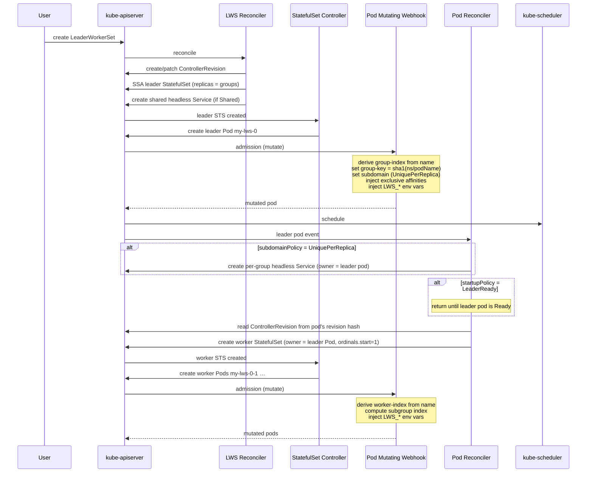
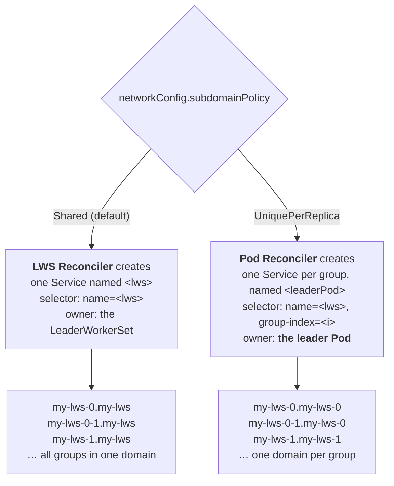
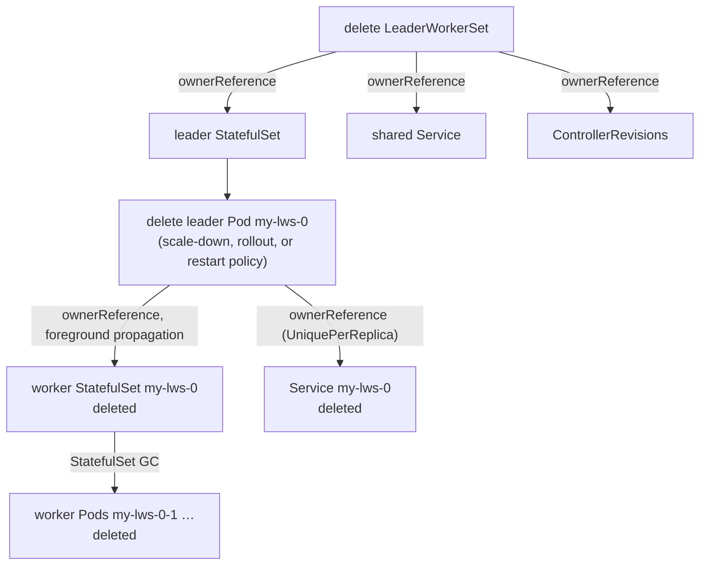

# Module 3: Group Lifecycle and Pod Identity

A group of pods that cannot address each other is not a group; it is a coincidence. This module is about how LWS turns `replicas: 2, size: 4` into eight pods that each know exactly who they are, who the others are, and how to reach them — before any of them starts serving.

The mechanism is spread across four components that each do a small part, and the whole is only comprehensible once you see the hand-offs. This module covers **the naming and ordinal scheme**, **the birth of a group step by step**, **startup policy**, **the pod mutating webhook's identity injection**, **DNS and headless Services**, **subgroups**, **TPU identity**, and **group teardown**.

!!! info "Provenance"
    Verified against `kubernetes-sigs/lws` at `32a9c37` (2026-08-06), release v0.9.0. Primary sources: `pkg/webhooks/pod_webhook.go`, `pkg/controllers/pod_controller.go`, `pkg/utils/pod/pod_utils.go`, `pkg/utils/statefulset/statefulset_utils.go`, `pkg/utils/accelerators/tpu.go`.

---

## Part 1: Names Are the Data Structure

LWS carries essentially no group state of its own. There is no map from group index to pod set anywhere in the controller. Instead, **the pod name encodes the group membership**, and the controller parses it back out whenever it needs to.

### 1.1 The naming scheme

For an LWS named `my-lws` with `replicas: 2, size: 4`:

| Object | Name | Derivation |
| :--- | :--- | :--- |
| Leader StatefulSet | `my-lws` | The LWS name |
| Leader pod, group 0 | `my-lws-0` | STS ordinal 0 |
| Leader pod, group 1 | `my-lws-1` | STS ordinal 1 |
| Worker StatefulSet, group 0 | `my-lws-0` | **The leader pod's name** |
| Worker pods, group 0 | `my-lws-0-1`, `my-lws-0-2`, `my-lws-0-3` | Worker STS ordinals 1..3 |
| Worker pods, group 1 | `my-lws-1-1`, `my-lws-1-2`, `my-lws-1-3` | |

The leader pod name is simultaneously: the group's identity, the worker StatefulSet's name, the worker pods' name prefix, and (under `UniquePerReplica`) the per-group Service name. That single overload is why LWS names must be DNS-1035 labels — the constraint propagates all the way down.

### 1.2 Parsing the name back

`pkg/utils/statefulset/statefulset_utils.go` provides the inverse:

```go
// statefulPodRegex matches a pod name and captures parent + ordinal.
var statefulPodRegex = regexp.MustCompile("(.*)-([0-9]+)$")

func GetParentNameAndOrdinal(name string) (string, int) // returns ("", -1) on no match
```

This one function does a surprising amount of work. Applied to a leader pod `my-lws-1` it yields `("my-lws", 1)` — the LWS name and the **group index**. Applied to a worker pod `my-lws-1-2` it yields `("my-lws-1", 2)` — the **leader pod name** and the **worker index**. The same regex, two different meanings, disambiguated only by whether the caller knows it is looking at a leader or a worker.

Everywhere a worker needs to find its leader, this is how: strip the trailing `-<n>`.

### 1.3 Why worker ordinals start at 1

```go
// constructWorkerStatefulSetApplyConfiguration, pkg/controllers/pod_controller.go
WithOrdinals(appsapplyv1.StatefulSetOrdinals().WithStart(1)).
```

If worker ordinals started at 0, the worker pod names would be `my-lws-1-0 … my-lws-1-2` and `workerIndex` would not agree with `LWS_WORKER_INDEX`: the leader is index 0, so the first worker must be index 1. Starting the worker StatefulSet's ordinals at 1 makes the global index space contiguous and consistent.

This is a hard dependency on the upstream `StatefulSetStartOrdinal` feature. It is why LWS documents Kubernetes **≥ 1.26** as the floor, with the gate needing manual enablement on exactly 1.26. On a cluster where the field is ignored, the worker StatefulSet produces a pod at ordinal 0 named `my-lws-1-0`, which *looks like* a leader pod of a nested LWS — and would recursively spawn StatefulSets forever.

The pod controller guards against exactly this:

```go
// Step 6 of Reconcile — anti-recursion guard, kubernetes-sigs/lws#391
if pod.Annotations[leaderworkerset.LeaderPodNameAnnotationKey] != "" {
    // a "leader-looking" pod that carries a leader-name annotation is really
    // a worker on a cluster that ignored ordinals.start
    log.Error(...); r.Record.Eventf(..., FailedCreate, ...)
    return ctrl.Result{}, nil
}
```

If you see `FailedCreate` events complaining about this, the diagnosis is always the same: the cluster is too old, or the feature gate is off.

---

## Part 2: The Birth of a Group

Eight components participate in creating one group. The order matters, and several of the steps are conditional.



Three observations that are easy to miss and matter a great deal:

1. **The worker StatefulSet is built from the ControllerRevision referenced by the leader pod, not from the live LWS spec.** `pkg/controllers/pod_controller.go` calls `revisionutils.GetRevision(ctx, r.Client, &lws, revisionutils.GetRevisionKey(&pod))` and requeues after one second if the revision is not found yet. This is what keeps a mid-rollout group internally consistent: an old-revision leader gets old-revision workers even though the LWS spec has already moved on.

2. **The worker StatefulSet is create-only.** Step 16 does a `Get`, and only creates on `NotFound`. It is never patched, never server-side-applied, never updated. A template change produces a *new leader pod*, which owns a *new worker StatefulSet*. There is a comment in `setNodeSelectorForWorkerPods` describing update behaviour that the current code does not implement — do not be misled by it.

3. **Two things are keyed off `pod.DeletionTimestamp`.** The pod reconciler returns early if the leader pod is terminating (step 8), which is what stops it from recreating the worker StatefulSet underneath a group that is being torn down. Without that guard, all-or-nothing restart would race against itself.

---

## Part 3: Startup Policy

```go
if lws.Spec.StartupPolicy == leaderworkerset.LeaderReadyStartupPolicy && !podutils.IsPodReady(&pod) {
    return ctrl.Result{}, nil
}
```

That is the entire implementation of KEP-135. `LeaderCreated` (the default) skips the check, so the worker StatefulSet is created the instant the leader pod *object* exists — before it is scheduled, let alone running.

| | `LeaderCreated` (default) | `LeaderReady` |
| :--- | :--- | :--- |
| Worker STS created when | Leader pod object exists | Leader pod is `Ready` |
| Startup shape | Fully parallel | Leader first, then workers |
| Cold start | Leader and workers load weights concurrently | Serialized: leader load, then worker load |
| Good for | Engines with a retrying rendezvous (Ray, torch.distributed with retries) | Engines whose workers hard-fail if the leader endpoint refuses a connection |
| Interacts badly with | — | **Gang scheduling** — the gang wants all pods pending at once, but workers do not exist until the leader is Ready |

The `LeaderReady` cost is real for large models. If leader weight loading takes four minutes, every group's cold start grows by four minutes, and that compounds with a group-by-group rollout: 20 groups × 4 extra minutes is over an hour of additional rollout time. Prefer fixing the engine's retry behaviour if you can.

---

## Part 4: Identity Injection

`pkg/webhooks/pod_webhook.go` is where a pod acquires everything it knows about itself. The webhook is registered at `/mutate--v1-pod` for `create` only, and — critically — the manifest patch `config/webhook/mutating-patch.yaml` adds an object selector:

```yaml
objectSelector:
  matchExpressions:
    - key: leaderworkerset.sigs.k8s.io/name
      operator: Exists
```

Without that, every pod in the cluster would be routed through the LWS webhook. If you are debugging a cluster-wide pod-admission slowdown after installing LWS, verify this selector is present.

!!! note "The pod validating webhook is a no-op"
    `/validate--v1-pod` is registered but `validate()` returns `(nil, nil)` after an early return. It exists as a placeholder. Deleting it, or giving it a purpose, are both defensible PRs.

### 4.1 The leader branch

A pod is a leader if `labels["leaderworkerset.sigs.k8s.io/worker-index"] == "0"`. For a leader:

| Step | Action |
| :--- | :--- |
| 1 | If `group-index` is absent, derive it: `_, ordinal := GetParentNameAndOrdinal(pod.Name)` |
| 2 | If the `subdomainPolicy` annotation is `UniquePerReplica`, set **`pod.Spec.Subdomain = pod.Name`**. (Under `Shared`, the subdomain comes from the StatefulSet's `serviceName`.) |
| 3 | If `group-key` is absent, set it to `Sha1Hash(fmt.Sprintf("%s/%s", namespace, podName))` — a 40-character hex digest |
| 4 | If the `exclusive-topology` annotation is present, call `SetExclusiveAffinities(pod, groupKey, topologyKey, GroupUniqueHashLabelKey)` |
| 5 | Subgroup handling (§6) |

The `group-key` is the interesting one. Why hash the namespace and pod name instead of just using the pod name as the affinity key? Because the value must **change when the group is recreated**. Two pods with the same key are asserted to belong together; if the key were stable across recreations, a freshly-created group could accidentally satisfy its affinity against the terminating pods of its predecessor and land in the wrong topology domain. Hashing name and namespace gives a value that is stable *within* a group's lifetime and distinct across LWSes in different namespaces.

### 4.2 The worker branch

| Step | Action |
| :--- | :--- |
| 1 | `_, workerIndex := GetParentNameAndOrdinal(pod.Name)`; set `worker-index` label |
| 2 | Subgroup index computation and `subgroup-key` (§6) |

Note that a worker's `group-index` label is **not** derived here — it arrives from the worker StatefulSet's pod template, which the pod controller populated when it built the StatefulSet.

### 4.3 Environment variable injection

`podutils.AddLWSVariables(pod)` injects three variables into **every container and every init-container**:

| Variable | Value |
| :--- | :--- |
| `LWS_LEADER_ADDRESS` | `fmt.Sprintf("%s-%s.%s.%s", lwsName, groupIndex, pod.Spec.Subdomain, namespace)` |
| `LWS_GROUP_SIZE` | The `leaderworkerset.sigs.k8s.io/size` annotation |
| `LWS_WORKER_INDEX` | The `leaderworkerset.sigs.k8s.io/worker-index` label |

For `my-lws`, group 3, namespace `default`:

- `Shared`: `my-lws-3.my-lws.default`
- `UniquePerReplica`: `my-lws-3.my-lws-3.default`

Note this is **not a fully-qualified name** — there is no `.svc.cluster.local`. It resolves via the pod's DNS search path, which is fine inside the cluster and will surprise you if you try to use it from outside.

!!! tip "Injection order is load-bearing"
    `addEnvVarsIfNotExists` **prepends** the three LWS variables and then appends the user's own, rather than the other way round. This is deliberate (kubernetes-sigs/lws#152): Kubernetes resolves `$(VAR)` references only against variables defined **earlier** in the list. Front-loading them is what lets a user write

    ```yaml
    env:
      - name: RAY_ADDRESS
        value: "$(LWS_LEADER_ADDRESS):6379"
    ```

    and have it expand. If you ever reorder that function, you break every manifest that does this.

    A user-defined variable with one of the three reserved names is dropped in favour of the injected value — the injected names are seeded into the dedup map first.

---

## Part 5: DNS and Headless Services

Two different components create Services, and which one runs depends on the policy.



Both are created by `controllerutils.CreateHeadlessServiceIfNotExists` with:

```go
ClusterIP: "None"
PublishNotReadyAddresses: true
```

`publishNotReadyAddresses: true` is the load-bearing setting. Rendezvous happens *during* startup: a worker resolves `LWS_LEADER_ADDRESS` before anything is Ready. Without this flag the DNS record would not exist until the leader passed its readiness probe, and every engine's startup would deadlock — the leader is not Ready because the workers have not connected, and the workers cannot connect because the leader has no DNS record.

!!! note "This makes KEP-820's premise stale"
    KEP-820 proposes an init-phase DNS knob on the grounds that "with `publishNotReadyAddresses: false`, peer FQDN may not be resolvable in init phase." LWS's own headless Services already set it to `true` unconditionally, and `test/testutils/validators.go` asserts it. See [Appendix B](appendix_pr_opportunities.md).

The ownership difference matters for garbage collection. The shared Service is owned by the LWS and lives as long as it does. A per-group Service is owned by the **leader pod**, so it is deleted along with the group — which is exactly right, but means the Service is recreated on every group recreation and every rollout step.

### 5.1 When to use `UniquePerReplica`

A shared headless Service produces one DNS A record per pod across the entire LWS. With 100 groups of 8 pods, every `LWS_LEADER_ADDRESS` lookup returns an 800-record response, and CoreDNS becomes a measurable component of cold-start latency. `UniquePerReplica` (KEP-173) scopes each lookup to a single group.

The costs: one extra Service object per group (which at 100 groups is 100 more objects for kube-proxy and CoreDNS to track), and the field is mutable — flipping it rewrites every pod's DNS name and forces a full rollout, during which old and new groups have different FQDN shapes.

---

## Part 6: Subgroups

Subgroups (KEP-115, extended by KEP-257) exist for one reason: a group can be larger than a topology domain. A 16-pod group spanning two 8-GPU hosts wants *each half* pinned to a host, not the whole thing pinned to something that does not exist.

### 6.1 The index arithmetic

```go
func getSubGroupIndex(podCount, subGroupSize, workerIndex int) string {
    if (podCount-1)%subGroupSize == 0 && podCount%subGroupSize != 0 {
        // Leader is the extra pod; it belongs to the first subgroup.
        return fmt.Sprint((workerIndex - 1) / subGroupSize)
    }
    return fmt.Sprint(workerIndex / subGroupSize)
}
```

Two regimes, selected by divisibility:

| Case | Condition | Layout for `size=9, subGroupSize=4` / `size=8, subGroupSize=4` |
| :--- | :--- | :--- |
| **Leader is the extra pod** | `(size-1) % sgs == 0` and `size % sgs != 0` | `size=9, sgs=4`: subgroup 0 = {0 (leader), 1, 2, 3, 4}, subgroup 1 = {5, 6, 7, 8}. The leader joins subgroup 0, making it 5 members. |
| **Even division** | `size % sgs == 0` | `size=8, sgs=4`: subgroup 0 = {0 (leader), 1, 2, 3}, subgroup 1 = {4, 5, 6, 7}. The leader occupies the first slot of subgroup 0. |

The webhook enforces that one of the two conditions holds (`size % sgs == 0 || (size-1) % sgs == 0`), so no other case can be created.

### 6.2 The two policy types

| `subGroupPolicyType` | Leader placement | Extra constraint |
| :--- | :--- | :--- |
| `LeaderWorker` (default) | Leader is in subgroup 0 | — |
| `LeaderExcluded` | Leader is in **no** subgroup | Requires `(size-1) % sgs == 0` |

`LeaderExcluded` (KEP-257) is for the common inference topology where the leader is a coordinator that does not hold a shard. It runs the OpenAPI server and dispatches to workers; pinning it into a worker subgroup would consume a slot in a topology domain that a real shard needs.

In the pod webhook, the leader branch checks this explicitly:

```go
// only assign the leader to subgroup 0 when the policy is not LeaderExcluded
if subGroupSize present && subgroup-index empty && subgroup-policy-type != "LeaderExcluded" {
    labels[SubGroupIndexLabelKey] = "0"
    labels[SubGroupUniqueHashLabelKey] = genGroupUniqueKey(pod.Name, "0")
}
```

!!! danger "The upstream concepts page describes a value that does not exist"
    `site/content/en/docs/concepts/_index.md` documents `SubGroupType: LeaderOnly` and describes it as creating a subgroup *exclusively for* the leader. The real value is `LeaderExcluded` and it means the leader is in *no* subgroup — the opposite. A reader following that page will write a manifest the webhook rejects, and if they guess the right name they will get the opposite behaviour to what they expected. This is the highest-value documentation fix currently outstanding; see [Appendix B](appendix_pr_opportunities.md).

### 6.3 Subgroup keys and affinity

`subgroup-key` is `Sha1Hash("<leaderPodName>/<subGroupIndex>")` — note the helper is generic (`genGroupUniqueKey(a, b) = sha1(a + "/" + b)`), so the parameter names read oddly at the subgroup call site. The key is used exactly like `group-key`, but with `subgroup-exclusive-topology` as the topology key.

A pod can carry **both** sets simultaneously: group-level affinity pinning the group to a rack, and subgroup-level affinity pinning each half to a host. That produces two pod-affinity terms and two anti-affinity terms, all `RequiredDuringSchedulingIgnoredDuringExecution`. The affinity mechanics themselves are covered in [Module 7](07_scheduling_placement_and_networking.md).

---

## Part 7: TPU Identity

`pkg/utils/accelerators/tpu.go` (package `accelerator`) exists because JAX and TPU runtimes want a different identity vocabulary from `LWS_WORKER_INDEX`. A pod "requests TPUs" if any container or init-container has a nonzero `google.com/tpu` in limits (checked first) or requests.

| Constant | Value |
| :--- | :--- |
| `TpuResourceName` | `google.com/tpu` |
| `TpuProcessDefaultPort` | `8476` |
| Injected env | `TPU_WORKER_ID`, `TPU_WORKER_HOSTNAMES`, `TPU_NAME`, `TPU_PROCESS_ADDRESSES`, `TPU_PROCESS_PORT` |

### 7.1 The leader-shift problem

The central subtlety: **the leader may or may not be a TPU worker.** If the leader is a pure coordinator with no TPU, then worker `my-lws-0-1` should be TPU worker *0*, not 1. If the leader does hold TPUs, it is TPU worker 0 and `my-lws-0-1` is TPU worker 1.

The controller resolves this by having the leader tell the workers. `AddTPUAnnotations(leaderPod, annotations)` is called while building the worker StatefulSet, and stamps the worker pod template with:

```
leaderworkerset.sigs.k8s.io/leader-requests-tpus: "true"
```

only when the leader itself requests TPUs. The worker webhook then shifts:

```go
leaderPodName, podWorkerIndex := GetParentNameAndOrdinal(pod.Name)
if pod.Annotations[LeaderRequestsTPUsAnnotationKey] != "true" {
    podWorkerIndex--   // the leader is not a TPU worker; IDs shift down by one
}
```

### 7.2 Multi-container TPU pods

The flat path is multi-container aware. With `n` TPU-requesting containers in a pod:

- Each container gets port `TPU_PROCESS_PORT` if the user set one, else `8476 + i`.
- `TPU_WORKER_ID = podWorkerIndex * numContainers + i`.
- `TPU_WORKER_HOSTNAMES` and `TPU_PROCESS_ADDRESSES` list every peer hostname repeated once per container, in container order.

### 7.3 The subgroup path

`addTPUVariablesSubGroup` is **single-container only** — it takes `containers[0]`. It computes a subgroup-relative worker ID and a hostname window:

```go
tpuWorkerId := workerIndex % subGroupSize
if workerIndex != 0 && pod.Annotations[LeaderRequestsTPUsAnnotationKey] != "true" {
    tpuWorkerId   = (workerIndex - 1) % subGroupSize
    subGroupIndex = (workerIndex - 1) / subGroupSize
}
start := subGroupSize*subGroupIndex + 1
end   := subGroupSize * (subGroupIndex + 1)
```

Then the window shifts depending on whether the leader occupies a slot: for subgroup 0 with a TPU-holding leader, `end -= 1` and the leader's hostname is prepended; for later subgroups with a TPU-holding leader, both `start` and `end` shift down by one.

Two consequences worth knowing:

- Under subgrouping, `TPU_WORKER_ID` is **subgroup-relative** (`0..subGroupSize-1`), not group-relative. A JAX program that assumes global ranks will be wrong.
- `TPU_NAME` is still the **leader pod name**, not a per-subgroup identity. Whether that is correct depends on the runtime's expectations, and it is worth verifying against current JAX/TPU documentation before relying on it.

Both TPU paths are idempotent — they bail out if `TPU_WORKER_HOSTNAMES` or `TPU_WORKER_ID` is already set on the first TPU container.

---

## Part 8: Group Teardown

Teardown is almost entirely Kubernetes garbage collection, which is why there are no finalizers anywhere in LWS.



The pieces that make this work:

- `Reconcile` on the LWS returns immediately when `DeletionTimestamp != nil` — there is nothing to clean up because ownership handles it.
- The group-restart path deletes the leader with `PropagationPolicy: Foreground`, so the worker StatefulSet is fully gone before the leader pod object disappears. Without foreground propagation, the leader could be recreated by its StatefulSet while the old worker StatefulSet still existed.
- The pod reconciler's `pod.DeletionTimestamp != nil` early return prevents it from recreating the worker StatefulSet during the window when the leader is terminating.

There is one guard worth understanding in detail, in `workerPodBelongsToLeader`. When a worker pod triggers a group restart, the controller must verify the worker really belongs to the *current* leader, not a previous incarnation. It walks the ownership chain and checks **UIDs**, not just names:

> pod → controller ref → if `StatefulSet`, `Get` it, require `workerSts.UID == owner.UID`, then require the StatefulSet's own controller to be a `Pod` with the leader's name **and UID**.

Names are reused across group recreations; UIDs are not. Without the UID check, the background deletion of a previous group's worker StatefulSet could trigger the deletion of the freshly recreated leader — an infinite restart loop that is very unpleasant to debug.

---

## Lab: Trace an Identity End to End

The goal is to see every field in Parts 4–6 on a real pod, and to break each mechanism deliberately.

!!! warning "Scale"
    Parts 1–4 of this lab run fine on `kind`. Part 5 (subgroups with exclusive topology) needs at least **two multi-GPU nodes** to be meaningful, because the whole point is pinning subgroups to different hosts. Commands are unverified where they require accelerator capacity.

### Step 1 — Read a leader pod's full identity

Deploy an LWS with `replicas: 2, size: 4` and dump one leader pod:

```bash
kubectl get pod my-lws-1 -o jsonpath='{.metadata.labels}' | jq
kubectl get pod my-lws-1 -o jsonpath='{.metadata.annotations}' | jq
kubectl get pod my-lws-1 -o jsonpath='{.spec.subdomain}'; echo
kubectl get pod my-lws-1 -o jsonpath='{.spec.containers[0].env}' | jq
```

Verify against §4.1 and §4.3:

- `worker-index` is `0`, `group-index` is `1`.
- `group-key` is a 40-character hex string. Compute `echo -n "default/my-lws-1" | sha1sum` and confirm it matches.
- `LWS_LEADER_ADDRESS` is `my-lws-1.my-lws.default` and appears **first** in the env list.

### Step 2 — Confirm the env-var ordering guarantee

Add a container env var that references the injected one:

```yaml
env:
  - name: RENDEZVOUS
    value: "$(LWS_LEADER_ADDRESS):29500"
```

Then check it actually expanded:

```bash
kubectl exec my-lws-1 -- printenv RENDEZVOUS
```

Now imagine `addEnvVarsIfNotExists` appended instead of prepended. What would `printenv` show? (Kubernetes leaves an unresolvable `$(VAR)` as a literal.) This is why the prepend is load-bearing.

### Step 3 — Verify DNS resolves before readiness

Set a readiness probe on the leader that never passes (`exec: ["false"]`), then from a worker:

```bash
kubectl exec my-lws-1-1 -- nslookup my-lws-1.my-lws.default
```

It should resolve despite the leader being not-Ready. Now edit the Service to `publishNotReadyAddresses: false` and repeat — the lookup fails, and you have reproduced the deadlock that flag exists to prevent. (Revert it; the controller will not fight you on this field, so you must undo it yourself.)

### Step 4 — Exercise both subdomain policies

Deploy the same LWS twice, once with each `subdomainPolicy`, and compare:

```bash
kubectl get svc -l leaderworkerset.sigs.k8s.io/name=my-lws
kubectl get pod my-lws-1 -o jsonpath='{.spec.subdomain}'; echo
kubectl exec my-lws-1-1 -- printenv LWS_LEADER_ADDRESS
```

Under `UniquePerReplica`, check the per-group Service's owner:

```bash
kubectl get svc my-lws-1 -o jsonpath='{.metadata.ownerReferences}' | jq
```

It should be the **leader Pod**, not the LWS. Delete the leader pod and confirm the Service goes with it.

### Step 5 — Subgroup arithmetic (unverified, needs 2+ nodes)

Deploy with `size: 9, subGroupSize: 4` and enumerate the assignment:

```bash
kubectl get pods -l leaderworkerset.sigs.k8s.io/name=my-lws \
  -o custom-columns='NAME:.metadata.name,W:.metadata.labels.leaderworkerset\.sigs\.k8s\.io/worker-index,SG:.metadata.labels.leaderworkerset\.sigs\.k8s\.io/subgroup-index'
```

Predict the output from `getSubGroupIndex` before running it. With `size=9, sgs=4`: `(9-1)%4 == 0` and `9%4 != 0`, so the leader-is-extra branch applies and workers use `(workerIndex-1)/4`. Expect subgroup 0 = worker indices 0–4, subgroup 1 = 5–8.

Now try `subGroupPolicyType: LeaderExcluded` with `size: 9, subGroupSize: 4` — `(9-1)%4 == 0`, so it is accepted, and the leader should carry **no** `subgroup-index` label. Then try `size: 10, subGroupSize: 4` with `LeaderExcluded` and confirm the webhook rejects it, quoting the exact message from `validateUpdateSubGroupPolicy`.

### Step 6 — Reproduce the anti-recursion guard (thought experiment)

You almost certainly cannot run a Kubernetes cluster old enough to ignore `ordinals.start`. Instead, read step 6 of `PodReconciler.Reconcile` and answer:

- What pod name would a cluster ignoring `ordinals.start` produce for group 1's first worker?
- Why does that name make the pod indistinguishable from a leader by the `worker-index` label alone?
- What annotation breaks the tie, and where was it set?

If you can answer all three without looking, you understand the naming scheme.

Continue to [Module 4: The LeaderWorkerSet Reconciler](04_lws_reconciler_internals.md).
