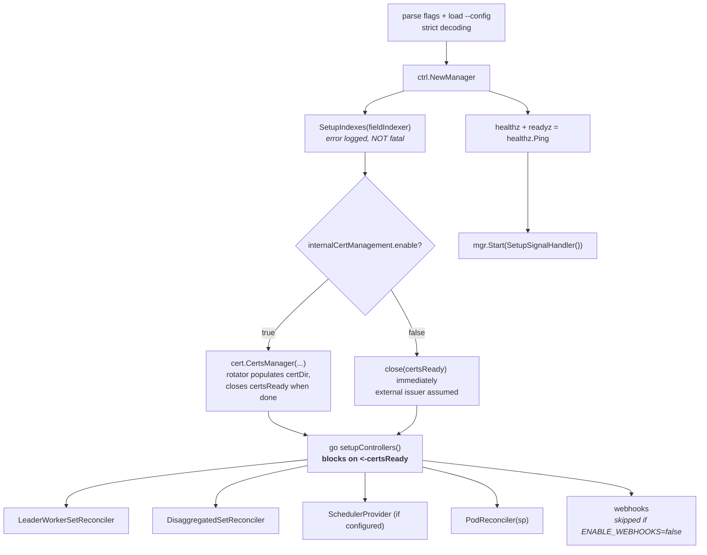
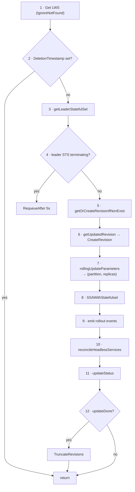

# Module 4: The LeaderWorkerSet Reconciler

This is the module where the abstractions stop and the code starts. `pkg/controllers/leaderworkerset_controller.go` is about 970 lines and does five things: it maintains a ControllerRevision history, it computes rollout parameters, it server-side-applies one StatefulSet, it reconciles a headless Service, and it computes status. Everything else in LWS is downstream of those five.

This module covers **how the manager is wired**, **the twelve-step reconcile**, **how the leader StatefulSet is constructed**, **Server-Side Apply and field managers**, **ControllerRevision in full**, and **the status and condition arithmetic** — which is subtler than it looks and is the source of most "why does `kubectl get lws` say that" questions.

The rollout arithmetic itself is deferred to [Module 6](06_rollout_and_revisions.md); here we treat `rollingUpdateParameters()` as a function that returns a partition and a replica count.

!!! info "Provenance"
    Verified against `kubernetes-sigs/lws` at `32a9c37` (2026-08-06), release v0.9.0. Primary sources: `cmd/main.go`, `pkg/controllers/leaderworkerset_controller.go`, `pkg/utils/revision/revision_utils.go`, `pkg/controllers/metadata.go`, `pkg/cert/cert.go`.

---

## Part 1: Manager Wiring

### 1.1 What gets registered

`cmd/main.go` registers five schemes unconditionally — client-go's, `leaderworkerset/v1`, `disaggregatedset/v1`, the `config` API, and **`scheduling.volcano.sh/v1beta1`**. Volcano types are in the scheme even when gang scheduling is disabled, which is worth knowing because it means the binary depends on Volcano's API module regardless.

Startup order is deliberate:



The `<-certsReady` block is the important part: no controller and no webhook is registered until the serving certificate exists. This is what prevents the API server from routing admission requests to a webhook that cannot yet complete a TLS handshake.

### 1.2 Certificate management

"cert-manager mode" is not a mode in the code. It is simply `internalCertManagement.enable: false`, which closes the channel immediately and assumes something external populates `webhook.certDir`.

Internal mode uses `github.com/open-policy-agent/cert-controller`'s rotator with:

| Setting | Value |
| :--- | :--- |
| CA name / org | `lws-ca` / `lws` |
| DNS name | `<webhookServiceName>.<namespace>.svc` |
| Patched configurations | `lws-validating-webhook-configuration`, `lws-mutating-webhook-configuration` |
| Readiness check | Enabled |

The rotator patches the `caBundle` into both webhook configurations by name. If you rename a webhook configuration in a fork, this silently stops working — the rotator will not find the object and admission will fail closed (`failurePolicy: Fail`).

### 1.3 Watches and the second watch path

```go
func (r *LeaderWorkerSetReconciler) SetupWithManager(mgr ctrl.Manager) error {
    return ctrl.NewControllerManagedBy(mgr).
        For(&leaderworkerset.LeaderWorkerSet{}).
        Owns(&appsv1.StatefulSet{}).
        Owns(&corev1.Service{}).
        Watches(&appsv1.StatefulSet{}, handler.EnqueueRequestsFromMapFunc(enqueueLWSRequests)).
        Complete(r)
}
```

The fourth line is the one that catches people. `Owns(&appsv1.StatefulSet{})` only fires for StatefulSets whose controller reference points at a LeaderWorkerSet — which is the **leader** StatefulSet only. Worker StatefulSets are owned by leader *Pods* ([Module 3](03_group_lifecycle_and_identity.md)), so they are invisible to `Owns`.

`enqueueLWSRequests` closes the gap by mapping any object carrying the `leaderworkerset.sigs.k8s.io/name` label to a reconcile request for that LWS in the same namespace. Without it, a worker StatefulSet becoming ready would not update `status.readyReplicas` until some other event happened to trigger a reconcile.

!!! note "A recent fix worth reading"
    Commit `743f15f` — "fix: ignore unrelated StatefulSets in LeaderWorkerSet watch mapper (#957)" — hardened this mapper. It is a good short read if you want to see the shape of a well-scoped controller bug fix in this project.

### 1.4 The vestigial field index

`SetupIndexes` registers exactly one index:

```go
indexer.IndexField(ctx, &appsv1.StatefulSet{}, lwsOwnerKey /* ".metadata.controller" */,
    func(rawObj client.Object) []string {
        owner := metav1.GetControllerOf(rawObj.(*appsv1.StatefulSet))
        if owner == nil { return nil }
        if owner.APIVersion != apiGVStr || owner.Kind != "LeaderWorkerSet" { return nil }
        return []string{owner.Name}
    })
```

**`lwsOwnerKey` is never used in a `client.MatchingFields` query anywhere in the core control plane.** Every lookup goes through label selectors instead. The index costs memory in the informer cache and buys nothing. Either wiring it up or removing it is a small, self-contained contribution — see [Appendix B](appendix_pr_opportunities.md).

Note also that `SetupIndexes`' error is logged but does **not** call `os.Exit`. A failed index registration leaves the manager running in a partially-initialised state, which is arguably the wrong choice for a startup-time failure.

---

## Part 2: The Reconcile Loop

`Reconcile` is twelve steps in a fixed order. Reading them in order is the fastest way to understand the controller.



Three of these deserve individual attention.

**Step 2 — no finalizers.** `if lws.DeletionTimestamp != nil { return }`. There is no cleanup logic at all; owner references and Kubernetes garbage collection handle everything. If you are tempted to add a finalizer in a PR, be ready to justify why GC is insufficient.

**Step 4 — the drain backoff.** If the leader StatefulSet itself is terminating, the reconciler returns `ctrl.Result{RequeueAfter: 5 * time.Second}` rather than trying to recreate it. Applying a StatefulSet that is mid-deletion produces a confusing partial state; backing off is simpler and correct.

**Step 5 — revision adoption on upgrade.** `getOrCreateRevisionIfNonExist` handles two cases at once: a brand-new LWS with no revisions, and an LWS created by a *pre-ControllerRevision* version of the controller, whose leader StatefulSet already carries a `template-revision-hash` label computed by the old scheme. In the second case the new controller must adopt the existing hash rather than compute a fresh one, or every LWS in the cluster would roll on operator upgrade. §4.4 explains the mechanism.

### 2.1 Event vocabulary

Reading the event stream is often faster than reading logs. The reconciler emits:

| Reason | Action | When |
| :--- | :--- | :--- |
| `CreatingRevision` | Create | A new ControllerRevision was cut |
| `GroupsProgressing` | Create | The leader StatefulSet was created for the first time |
| `GroupsUpdating` | Update | The partition moved: `"Updating replica %d"` or `"Updating replicas %d to %d (inclusive)"` |
| `FailedCreate` / `FailedUpdate` | Create / Update | The SSA patch failed |

The `GroupsUpdating` message distinguishes a single-group step (`oldPartition-1 == partition`) from a multi-group step, which is a quick way to see whether `maxUnavailable > 1` is actually taking effect.

---

## Part 3: Constructing the Leader StatefulSet

`constructLeaderStatefulSetApplyConfiguration(lws, partition, replicas, revisionKey)` builds an **apply configuration**, not a StatefulSet object. The template is `leaderWorkerTemplate.leaderTemplate` if non-nil, else a deep copy of `workerTemplate`, round-tripped through `runtime.DefaultUnstructuredConverter` into a `PodTemplateSpecApplyConfiguration`.

### 3.1 What gets stamped onto the pod template

| Kind | Key | Value |
| :--- | :--- | :--- |
| Label | `leaderworkerset.sigs.k8s.io/worker-index` | `"0"` |
| Label | `leaderworkerset.sigs.k8s.io/name` | `lws.Name` |
| Label | `leaderworkerset.sigs.k8s.io/template-revision-hash` | `revisionKey` |
| Annotation | `leaderworkerset.sigs.k8s.io/size` | `strconv.Itoa(int(*Size))` |
| Annotation | `leaderworkerset.sigs.k8s.io/exclusive-topology` | copied from the LWS annotation if non-empty |
| Annotation | `subgroup-policy-type`, `subgroup-size`, `subgroup-exclusive-topology` | when `SubGroupPolicy != nil` |
| Annotation | `leaderworkerset.sigs.k8s.io/subdomainPolicy` | only when `UniquePerReplica` |

The `worker-index: "0"` label is what makes the leader StatefulSet's selector work, and what the pod webhook keys off to take the leader branch.

### 3.2 Metadata merging

`pkg/controllers/metadata.go` is eight lines and worth quoting because its precedence rule matters:

```go
merged := make(map[string]string)
maps.Copy(merged, userMetadata)
maps.Copy(merged, controllerMetadata)   // controller keys WIN
// returns nil when both are empty
```

STS labels are `lws.Labels` plus `{name, template-revision-hash}`; STS annotations are `lws.Annotations` plus `{replicas}`. Because controller keys are copied second, a user who sets `leaderworkerset.sigs.k8s.io/name` on their LWS cannot corrupt the controller's own labels. Returning `nil` for the empty case avoids emitting an empty map into the apply configuration, which would otherwise cause SSA to claim ownership of an empty field.

### 3.3 The StatefulSet spec

```go
appsapplyv1.StatefulSet(lws.Name, lws.Namespace).WithSpec(appsapplyv1.StatefulSetSpec().
    WithServiceName(lws.Name).
    WithReplicas(replicas).
    WithPodManagementPolicy(appsv1.ParallelPodManagement).
    WithTemplate(&podTemplateApplyConfiguration).
    WithUpdateStrategy(appsapplyv1.StatefulSetUpdateStrategy().
        WithType(appsv1.StatefulSetUpdateStrategyType(lws.Spec.RolloutStrategy.Type)).
        WithRollingUpdate(appsapplyv1.RollingUpdateStatefulSetStrategy().
            WithMaxUnavailable(stsMaxUnavailable).WithPartition(partition))).
    WithSelector(metaapplyv1.LabelSelector().WithMatchLabels(map[string]string{
        leaderworkerset.SetNameLabelKey:     lws.Name,
        leaderworkerset.WorkerIndexLabelKey: "0"})))
```

Four things to note:

1. **`replicas` is the rollout-adjusted value**, not `*lws.Spec.Replicas`. During a `maxSurge` rollout it is `spec.replicas + surge`. This is why `status.replicas` — which is read straight off the StatefulSet — can exceed `spec.replicas`.
2. **`podManagementPolicy: Parallel`.** Leader pods are created simultaneously, not in ordinal order. Requirement R1 from [Module 1](01_multihost_inference_problem_space.md).
3. **The leader StatefulSet deliberately does not set `.spec.ordinals`.** It starts at 0. Only the *worker* StatefulSet sets `WithStart(1)`.
4. **The nested `maxUnavailable` is not the user's `maxUnavailable`:**

```go
stsMaxUnavailableInt := int32(lwsMaxUnavailable + lwsMaxSurge)  // maxSurge already clamped to <= replicas
if stsMaxUnavailableInt < 1 { stsMaxUnavailableInt = 1 }
```

The value handed to the StatefulSet is the *sum* of the LWS's `maxUnavailable` and `maxSurge`, floored at 1. LWS drives group ordering itself via the partition; the StatefulSet's own `maxUnavailable` just needs to be permissive enough not to be the binding constraint. The `< 1` clamp guards the `replicas: 0` case and the `maxUnavailable=0 && maxSurge=0` combination that the webhook should have rejected. Percentages are rounded **down** for `maxUnavailable` and **up** for `maxSurge`.

### 3.4 PVC forwarding

`controllerutils.GetPVCApplyConfiguration(lws)` translates `volumeClaimTemplates` into apply configurations, forwarding only:

- `accessModes`
- `storageClassName`
- `volumeMode`
- `resources.{requests,limits}`

**Silently dropped**: `selector`, `dataSource`, `dataSourceRef`, and any labels or annotations on the PVC template. `persistentVolumeClaimRetentionPolicy` is forwarded verbatim. If you are cloning volumes from snapshots, this is where your `dataSource` disappears.

---

## Part 4: Server-Side Apply

```go
obj, _ := runtime.DefaultUnstructuredConverter.ToUnstructured(leaderStatefulSetApplyConfig)
patch := &unstructured.Unstructured{Object: obj}
err = r.Patch(ctx, patch, client.Apply, &client.PatchOptions{
    FieldManager: "lws",
    Force:        ptr.To[bool](true),
})
```

Three properties fall out of this:

- **Field manager `"lws"`.** Every field the controller sets is attributed to this manager in `metadata.managedFields`. `kubectl get sts my-lws -o yaml --show-managed-fields` shows you exactly which fields the controller owns and which it has left to you.
- **`Force: true`.** Conflicts are resolved in the controller's favour. If you `kubectl edit` the leader StatefulSet's replica count, the next reconcile takes it back without complaint. This is correct — the LWS is the source of truth — but it means manual StatefulSet edits are not a supported debugging technique.
- **Declarative removal.** Because it is an apply rather than a patch, a field the controller *stops* setting is removed from the object. This is why the `mergeMetadata` `nil`-for-empty behaviour matters.

`setControllerReferenceWithStatefulSet` (defined in `pod_controller.go`, despite being used here) injects the owner reference into the apply configuration with `BlockOwnerDeletion(true)` and `Controller(true)`.

There is a `//nolint` and a TODO in the code noting that `client.Apply()` is the modern replacement for `client.Apply` as a patch type. Migrating it is a plausible small PR, but check whether the controller-runtime version in `go.mod` supports the new API first.

---

## Part 5: ControllerRevision

KEP-238 introduced ControllerRevision so that a rollout has a stable notion of "the old template" and so that a group's workers can be built from the same template as their leader even after the LWS spec has moved on. `pkg/utils/revision/revision_utils.go` is adapted from upstream's `pkg/controller/history`.

### 5.1 What is hashed — and what is not

```go
clone := lws.DeepCopy()
if clone.Spec.NetworkConfig == nil {          // upgrade compatibility
    subdomainPolicy := leaderworkerset.SubdomainShared
    clone.Spec.NetworkConfig = &leaderworkerset.NetworkConfig{SubdomainPolicy: &subdomainPolicy}
}
specCopy["networkConfig"] = networkConfig
specCopy["leaderWorkerTemplate"] = template
networkConfig["$patch"] = "replace"
template["$patch"] = "replace"
objCopy["spec"] = specCopy
return json.Marshal(objCopy)
```

| Included in the revision | Excluded |
| :--- | :--- |
| `spec.leaderWorkerTemplate` (both templates, `size`, `restartPolicy`, `subGroupPolicy`, `volumeClaimTemplates`) | `spec.replicas` |
| `spec.networkConfig` | `spec.rolloutStrategy` — including `partition`, `maxSurge`, `maxUnavailable` |
| | `spec.startupPolicy` |
| | **All metadata** — labels and annotations, so changing `exclusive-topology` does **not** cut a revision |
| | `status` |

This exclusion list is the answer to a very common question: **scaling and rollout-knob edits never create a revision and never trigger a rolling update.** Changing `replicas` from 2 to 5 adds three groups at the current revision. Changing `maxSurge` changes how the *next* rollout behaves and does nothing immediately.

It also means the `exclusive-topology` annotation is not versioned. Changing it affects only pods created afterwards, with no rollout to propagate it — a sharp edge worth knowing before you debug why half your groups are placed differently.

The `"$patch": "replace"` markers ensure that restoring a revision **replaces** those subtrees rather than strategic-merging into them. Without that, removing a container from the template would not be undone by a rollback.

### 5.2 Hashing and naming

```go
hf := fnv.New32()
if len(revision.Data.Raw) > 0 { hf.Write(revision.Data.Raw) }
if revision.Data.Object != nil { deepHashObject(hf, revision.Data.Object) }
return rand.SafeEncodeString(fmt.Sprint(hf.Sum32()))
```

FNV-32 over the marshalled patch, then `rand.SafeEncodeString` to map it into an alphabet with no accidentally-offensive substrings. Names are `fmt.Sprintf("%s-%s-%v", prefix, hash, revisionNumber)`, with the prefix truncated to 220 bytes to stay under the 253-byte name limit. The trailing revision number is what prevents a collision when an identical `prefix-hash` reappears in history — for example, when you roll back to a template you previously used.

!!! note "A latent bug in `hashRevision`"
    `deepHashObject` calls `hasher.Reset()` before writing, so if both `Data.Raw` and `Data.Object` were populated, the `Raw` bytes would be silently discarded. In practice only `Raw` is ever set, so the path is unreachable — but it is exactly the kind of thing that becomes a real bug the day someone adds an `Object` producer.

### 5.3 Change detection and the equality cache

`getUpdatedRevision` cuts a candidate revision from the live spec and compares:

```go
return bytes.Equal(lhs.Data.Raw, rhs.Data.Raw) &&
       apiequality.Semantic.DeepEqual(lhs.Data.Object, rhs.Data.Object)
```

If the bytes differ, it does **not** immediately declare an update. It first calls `SetMatchesRevision(lws, currentRevision, revision, r.revisionEqualityCache)`, which re-applies the *existing* revision onto the LWS, re-derives a patch using the *current* serializer, and compares again.

This exists to defeat **serialization drift**. Upgrading the operator can change how client-go marshals a pod template — the classic example being `"creationTimestamp": null` appearing or disappearing — producing byte-different but semantically identical patches. Without this check, every LWS in the cluster would roll on every operator upgrade. The code cites `kubernetes/kubernetes#135017`.

The result is memoized in an LRU of 10,000 entries keyed by:

```go
type revisionEqualityCacheKey struct {
    lwsUID                  types.UID
    lwsGeneration           int64
    revisionResourceVersion string
}
```

Only **positive** results are cached, so a genuine template change is never masked by a stale cache entry.

### 5.4 Revision adoption on operator upgrade

`NewRevision` has a subtlety that is easy to read past:

> `cr.Name` always uses the freshly-computed hash, but `cr.Labels[RevisionKey]` uses the **passed-in** `revisionKey` when it is non-empty.

That is the upgrade path. An LWS created by a pre-ControllerRevision operator has a `template-revision-hash` already stamped on its leader StatefulSet, computed by the old scheme. `getOrCreateRevisionIfNonExist` passes that legacy hash in, so the new ControllerRevision is *labelled* with the hash the live pods already carry. The result: upgrading the operator does not roll the fleet.

### 5.5 Lookup, restore, and truncation

| Function | Behaviour |
| :--- | :--- |
| `GetRevisionKey(obj)` | Reads `labels["leaderworkerset.sigs.k8s.io/template-revision-hash"]`; `""` for nil labels. Used uniformly on Pods, StatefulSets, and ControllerRevisions |
| `GetRevision(ctx, c, lws, key)` | Lists by `{name, template-revision-hash}`; `""` key returns `(nil, nil)`; more than one match logs an error and returns the highest revision |
| `ListRevisions` | Includes objects whose controller ref is nil **or** matches the parent UID — orphans are adopted |
| `ApplyRevision(lws, rev)` | `strategicpatch.StrategicMergePatch` of the revision onto an encoded LWS; this is how the pod controller builds worker StatefulSets from the pod's revision |
| `TruncateRevisions(ctx, c, lws, key)` | Deletes every revision whose key differs from the current one |

!!! warning "There is no `revisionHistoryLimit`"
    LWS keeps exactly **one** revision. `TruncateRevisions` runs only when `updateDone` is true — partition is 0 and every desired replica is updated and ready — but when it runs it deletes everything else.

    The practical consequence: **`kubectl rollout undo` has nothing to undo.** Once a rollout completes, the previous template is gone from the cluster. Rollback means re-applying the old manifest yourself. Adding a `revisionHistoryLimit` field would be a genuinely useful API contribution, and it has precedent in Deployment and StatefulSet — but it is an API change and therefore needs a KEP.

---

## Part 6: Status and Conditions

`updateStatus(ctx, lws, revisionKey)` is where most user-visible confusion originates, because it maintains **two different counting schemes** simultaneously.

### 6.1 The three status fields

```go
lws.Status.Replicas = int(sts.Status.Replicas)          // from a fresh Get of the leader STS
lws.Status.ObservedGeneration = lws.Generation
if lws.Status.HPAPodSelector == "" {                     // computed exactly once
    lws.Status.HPAPodSelector = /* name=<lws>,worker-index=0 */
}
```

`status.replicas` is read straight off the leader StatefulSet, so it **includes surge replicas**. The `HPAPodSelector` guard means it is computed on the first status update and never recomputed — cheap, and safe only because the LWS name is immutable.

### 6.2 The condition counters

`updateConditions` lists leader pods by `{name, worker-index: "0"}` and, for each, `Get`s the worker StatefulSet of the same name. That `Get` is skipped entirely when `noWorkerSts := *Size == 1`.

Six counters are maintained:

| Counter | Predicate |
| :--- | :--- |
| `readyCount` | `(noWorkerSts \|\| StatefulsetReady(sts)) && PodRunningAndReady(pod)` → `status.readyReplicas` |
| `updatedCount` | `(noWorkerSts \|\| GetRevisionKey(sts) == revisionKey) && GetRevisionKey(pod) == revisionKey` → `status.updatedReplicas` |
| `partitionedCurrentNonBurstCount` | groups with `lwsPartition <= index < *spec.Replicas` |
| `partitionedUpdatedNonBurstCount` | the same window, additionally updated |
| `partitionedUpdatedAndReadyCount` | the same window, updated **and** ready |
| `readyNonBurstWorkerCount` | the same window, ready |

The first two feed the status fields and **count burst replicas**. The last four are windowed to `[partition, spec.replicas)` and therefore **exclude** burst replicas. That is the discrepancy: `status.readyReplicas` can report a number that the condition logic does not consider.

### 6.3 Condition selection

```go
if partitionedUpdatedNonBurstCount < partitionedCurrentNonBurstCount {
    conditions = {UpdateInProgress, Progressing}
} else if readyNonBurstWorkerCount == int(*lws.Spec.Replicas) &&
          partitionedUpdatedAndReadyCount == partitionedCurrentNonBurstCount {
    conditions = {Available}
} else {
    conditions = {Progressing}
}
updateDone := (lwsPartition == 0) && partitionedUpdatedAndReadyCount == int(*lws.Spec.Replicas)
```

| Condition | Reason | Message |
| :--- | :--- | :--- |
| `Available` | `AllGroupsReady` | "All replicas are ready" |
| `UpdateInProgress` | `GroupsUpdating` | "Rolling Upgrade is in progress" |
| `Progressing` | `GroupsProgressing` | "Replicas are progressing" |

`setCondition` enforces mutual exclusivity through an `exclusiveConditionTypes` table: `Available` is flipped to `False` when either `Progressing` or `UpdateInProgress` becomes `True`. Note that `Progressing` and `UpdateInProgress` are **not** mutually exclusive and coexist during a rollout. `setConditions` also stamps `observedGeneration` on every stored condition.

`updateDone` is the trigger for revision truncation in step 12. Note it requires `lwsPartition == 0` — so if you leave `partition` set at a non-zero canary boundary, the old revision is never garbage collected. That is intentional and useful: a paused canary keeps its rollback target.

!!! tip "Debugging `Available` never becoming true"
    Work the predicate backwards. `Available` needs *both* `readyNonBurstWorkerCount == spec.replicas` **and** `partitionedUpdatedAndReadyCount == partitionedCurrentNonBurstCount`. The first is about the whole LWS; the second is about the partition window. A non-zero `partition` narrows the second condition but not the first — so a canary that has updated its window successfully but whose *frozen* groups are unhealthy will sit at `Progressing` forever, which is the right answer but not an obvious one.

---

## Lab: Instrument the Reconciler

This lab runs entirely on `kind`. The goal is to see each mechanism from Parts 4–6 directly, and to reproduce the two most confusing behaviours.

### Step 1 — Read the field manager

```bash
kubectl get sts my-lws -o yaml --show-managed-fields | yq '.metadata.managedFields'
```

Identify which entry has `manager: lws`, and enumerate the fields it owns. Then take one it does *not* own and set it by hand:

```bash
kubectl patch sts my-lws --type=merge -p '{"spec":{"minReadySeconds":30}}'
kubectl get sts my-lws -o jsonpath='{.spec.minReadySeconds}'; echo
```

It persists, because `lws` never claims that field. Now try one it does own:

```bash
kubectl scale sts my-lws --replicas=99
sleep 5 && kubectl get sts my-lws -o jsonpath='{.spec.replicas}'; echo
```

`Force: true` takes it straight back. Both outcomes follow from the SSA semantics in Part 4.

### Step 2 — Prove that scaling does not cut a revision

```bash
kubectl get controllerrevision -l leaderworkerset.sigs.k8s.io/name=my-lws
REV_BEFORE=$(kubectl get controllerrevision -l leaderworkerset.sigs.k8s.io/name=my-lws -o name)

kubectl scale lws/my-lws --replicas=4
kubectl patch lws my-lws --type=merge \
  -p '{"spec":{"rolloutStrategy":{"rollingUpdateConfiguration":{"maxSurge":1}}}}'
kubectl annotate lws my-lws leaderworkerset.sigs.k8s.io/exclusive-topology=kubernetes.io/hostname --overwrite

kubectl get controllerrevision -l leaderworkerset.sigs.k8s.io/name=my-lws -o name
```

The revision list should be **unchanged** after all three edits, and no pods should have restarted. Confirm the exclusion list in §5.1 accounts for each of them. Then change the container image and watch a new revision appear.

### Step 3 — Observe the two counting schemes diverge

Set `maxSurge: 1` and trigger a rollout, then poll:

```bash
while true; do
  kubectl get lws my-lws -o jsonpath=\
'{.spec.replicas}{"\t"}{.status.replicas}{"\t"}{.status.readyReplicas}{"\t"}{.status.updatedReplicas}{"\n"}'
  sleep 2
done
```

You should see `status.replicas` exceed `spec.replicas` mid-rollout. Simultaneously watch the conditions:

```bash
kubectl get lws my-lws -o jsonpath='{range .status.conditions[*]}{.type}={.status} {end}'; echo
```

Confirm that `Progressing` and `UpdateInProgress` are both `True` at the same time, and that `Available` is `False`. Map each observation to a specific line in §6.2 and §6.3.

### Step 4 — Strand a revision with `partition`

```bash
kubectl patch lws my-lws --type=merge \
  -p '{"spec":{"rolloutStrategy":{"rollingUpdateConfiguration":{"partition":2}}}}'
# now change the image
kubectl patch lws my-lws --type=json \
  -p '[{"op":"replace","path":"/spec/leaderWorkerTemplate/workerTemplate/spec/containers/0/image","value":"nginxinc/nginx-unprivileged:1.28"}]'

kubectl get controllerrevision -l leaderworkerset.sigs.k8s.io/name=my-lws
```

**Two** revisions should now exist and stay that way, because `updateDone` requires `partition == 0`. Set `partition: 0`, wait for the rollout to complete, and watch `TruncateRevisions` delete the old one. Then confirm §5.5's claim: there is now no way to roll back from within the cluster.

### Step 5 — Trigger the serialization-drift path (reading exercise)

You cannot easily reproduce this without two operator versions, so read `SetMatchesRevision` in `pkg/utils/revision/revision_utils.go` and answer:

- What exactly is compared, and why is comparing `Data.Raw` bytes alone insufficient?
- Why are only *positive* results cached in the LRU? What would break if negatives were cached too?
- The cache key includes `lwsGeneration` and `revisionResourceVersion`. What incorrect behaviour would you get if it included only the LWS UID?

Continue to [Module 5: Pod Controller and Failure Handling](05_pod_controller_and_failure_handling.md).
