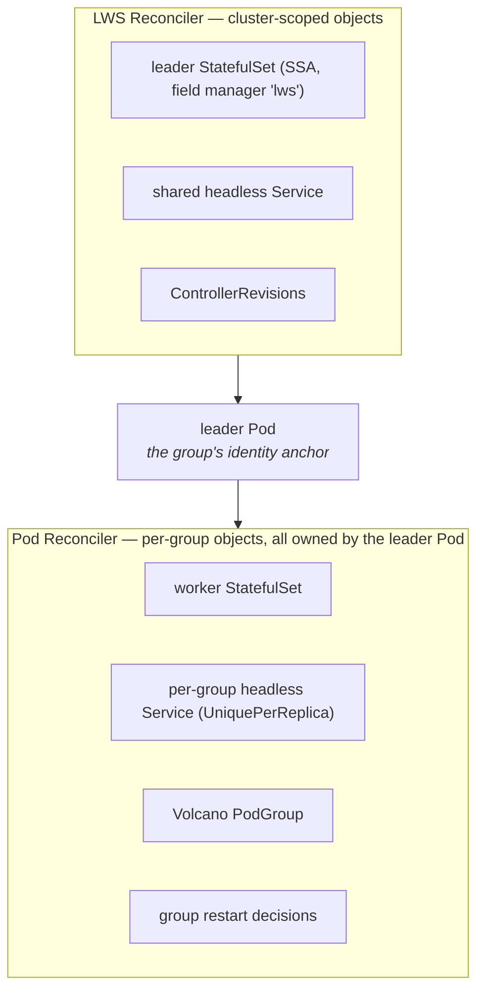
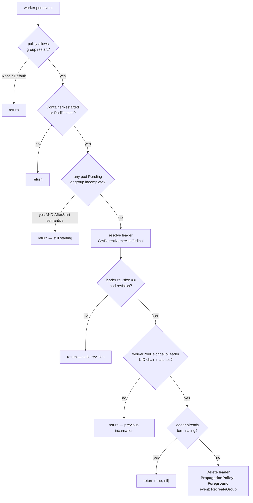

# Module 5: Pod Controller and Failure Handling

Two controllers, and the split between them is not arbitrary. The LWS reconciler ([Module 4](04_lws_reconciler_internals.md)) owns exactly three things: the leader StatefulSet, the shared headless Service, and the ControllerRevisions. **Everything per-group is owned by the leader Pod**, and the pod controller is what creates it.

The pod controller also owns the single most consequential runtime behaviour in LWS: deciding when one pod's failure should take down seven healthy ones. That decision has more guards around it than any other code path in the project, and every guard exists because of a specific bug.

This module covers **the two-controller split**, **the sixteen-step pod reconcile**, **worker StatefulSet construction**, **the restart policies and how a restart is detected**, **the guards against restart loops**, **node failure**, **worker-side topology pinning**, and **KEP-820** — the proposed fail-fast restart budget that is not yet implemented.

!!! info "Provenance"
    Verified against `kubernetes-sigs/lws` at `32a9c37` (2026-08-06), release v0.9.0. Primary sources: `pkg/controllers/pod_controller.go`, `pkg/utils/pod/pod_utils.go`, `keps/820-distributed-preflight-check/README.md`.

---

## Part 1: The Two-Controller Split



The consequence of "everything per-group is owned by the leader Pod" is that **group teardown is a single foreground delete**. No finalizers, no cleanup loops, no orphan reconciliation. Delete the leader pod and the worker StatefulSet, its pods, the per-group Service, and the PodGroup all follow.

The second consequence is a difference in write semantics that is easy to miss:

| Object | How it is written |
| :--- | :--- |
| Leader StatefulSet | **Server-Side Apply**, field manager `lws`, `Force: true` — continuously reconciled |
| Worker StatefulSet | **Create-if-absent** — never updated after creation |
| Headless Services | **Create-if-absent** |
| Volcano PodGroup | **Create-if-absent** |

Only the leader StatefulSet is continuously reconciled. Everything else is created once and replaced wholesale when the group is recreated. This is why a template change produces a new leader pod which owns a new worker StatefulSet, rather than an in-place update.

### 1.1 Watches and the event filter

```go
ctrl.NewControllerManagedBy(mgr).
    For(&corev1.Pod{}).
    Owns(&appsv1.StatefulSet{}).
    WithEventFilter(predicate.NewPredicateFuncs(/* Pod or StatefulSet carrying the LWS name label */))
```

The global event filter is load-bearing for cluster health. Without it, this controller would enqueue every pod event in the cluster. If you add a watch to this controller in a PR, make sure the filter still covers your object type.

---

## Part 2: The Pod Reconcile, Step by Step

Sixteen steps, and roughly half of them are early returns. The early returns *are* the logic.

| # | Step | Notes |
| :--- | :--- | :--- |
| 1 | `Get` pod (`IgnoreNotFound`) | |
| 2 | Require `name` and `worker-index` labels | Hard error otherwise: `"leaderworkerset.sigs.k8s.io/name label is unexpected missing"` |
| 3 | `Get` the LWS (`IgnoreNotFound`) | A deleted LWS means the pods are being GC'd anyway |
| 4 | **`handleRestartPolicy`** | If it deleted the leader, stop here |
| 5 | **Return if not a leader pod** | Worker reconciliation exists *only* for step 4 |
| 6 | **Anti-recursion guard** | A leader-looking pod with a `leader-name` annotation → log, emit `FailedCreate`, return |
| 7 | Create per-group Service if `UniquePerReplica` | Owner is the leader pod |
| 8 | **Return if `pod.DeletionTimestamp != nil`** | Prevents recreating the worker STS under a terminating group |
| 9 | `CreatePodGroupIfNotExists` if a scheduler provider is set | |
| 10 | **Return if `*Size == 1`** | No worker StatefulSet at all |
| 11 | **StartupPolicy gate** | `LeaderReady && !IsPodReady(pod)` → return |
| 12 | `GetRevision` by the **pod's** revision key | `nil` → requeue after 1s |
| 13 | `constructWorkerStatefulSetApplyConfiguration` | |
| 14 | Exclusive topology: set the worker `nodeSelector` | Returns early if `pod.Spec.NodeName == ""` |
| 15 | `setControllerReferenceWithStatefulSet(&pod, sts, scheme)` | Owner is the **leader Pod** |
| 16 | `Get` the STS; **create only on `NotFound`** | `client.IgnoreAlreadyExists` |

Three of these repay close reading.

**Step 5 is why worker pods are reconciled at all.** A worker pod produces a reconcile request, `handleRestartPolicy` runs, and then the function returns. Nothing else about a worker is managed here — the worker StatefulSet manages the worker pods.

**Step 12 reads the pod's revision, not the LWS spec.** `revisionutils.GetRevision(ctx, r.Client, &lws, revisionutils.GetRevisionKey(&pod))`. This is what keeps a group internally consistent mid-rollout: an old-revision leader gets old-revision workers even though `lws.Spec` has moved on. If the revision has not appeared yet, the controller requeues after a second rather than falling back to the live spec — falling back would silently create a mixed-revision group.

**Step 16 is create-only.** There is a comment in `setNodeSelectorForWorkerPods` claiming "the following applying logic will automatically update it to match the leader pods". **The current code does not do this.** Do not rely on it, and consider the comment a documentation bug worth fixing.

---

## Part 3: Constructing the Worker StatefulSet

`constructWorkerStatefulSetApplyConfiguration(leaderPod, lws, currentRevision)`:

```go
currentLws, _ := revisionutils.ApplyRevision(&lws, currentRevision)
template := currentLws.Spec.LeaderWorkerTemplate.WorkerTemplate
```

| Aspect | Value |
| :--- | :--- |
| Name | `leaderPod.Name` |
| Owner | The leader **Pod**, `Controller: true`, `BlockOwnerDeletion: true` |
| Replicas | `*lws.Spec.LeaderWorkerTemplate.Size - 1` — from the **live** spec |
| Pod template | From the **revision-restored** `currentLws` |
| `podManagementPolicy` | `Parallel` |
| `ordinals.start` | **`1`** |
| `serviceName` | `leaderPod.Name`, or `lws.Name` when the policy is `Shared` |
| Selector labels | `{group-index, name, group-key}` — deliberately **without** the revision hash |
| Pod labels | The selector labels plus `template-revision-hash` from the **leader pod** |
| Pod annotations | `size`, `leader-name`, `exclusive-topology`, and the subgroup trio; then `AddTPUAnnotations` |

Two details worth internalising:

**The selector omits the revision hash.** A StatefulSet's selector is immutable, so including a per-revision label would make the object unpatchable across revisions. Since a new revision produces a whole new worker StatefulSet anyway, the stable selector costs nothing.

**Replicas comes from the live spec, the template comes from the revision.** This is a deliberate asymmetry. `size` changes (KEP-552) are picked up immediately, while template changes flow through the revision machinery. It also means the `size` annotation stamped on worker pods reflects the live value, which is what `LWS_GROUP_SIZE` and the TPU arithmetic consume.

---

## Part 4: Restart Policies and Group Recreation

This is the heart of the module. `handleRestartPolicy(ctx, pod, lws) (leaderDeleted bool, err error)`:

```go
policy := lws.Spec.LeaderWorkerTemplate.RestartPolicy
if policy != RecreateGroupOnPodRestart && policy != RecreateGroupAfterStart {
    return false, nil                      // None / Default: never a group restart
}
if !podutils.ContainerRestarted(pod) && !podutils.PodDeleted(pod) {
    return false, nil                      // nothing happened
}
pendingPods, err := r.pendingPodsInGroup(ctx, pod, int(*lws.Spec.LeaderWorkerTemplate.Size))
_, hasRecreateGroupAfterStartAnnotation := lws.Annotations[RecreateGroupAfterStartAnnotationKey]
if pendingPods && (policy == RecreateGroupAfterStart || hasRecreateGroupAfterStartAnnotation) {
    return false, nil                      // group is still starting up; don't churn
}
// ... resolve the leader, run two guards, then delete it
```

### 4.1 The policies

| Policy | Behaviour |
| :--- | :--- |
| `RecreateGroupOnPodRestart` (default) | Any pod deletion or any container restart recreates the group, immediately |
| `RecreateGroupAfterStart` | Same, but suppressed while **any pod in the group is Pending or the group is incomplete** |
| `None` | Short-circuits at line 1 — no group restart, ever |
| `Default` | Rewritten to `None` by the defaulting webhook |

`RecreateGroupAfterStart` exists for a specific, very common failure: a 40 GB model image is being pulled, one pod finishes and its container crash-loops on a missing peer, and the group is destroyed — discarding the image pulls of every other pod, which then start pulling again. The result is a group that never converges. Gating on "no pod is Pending" lets the initial rollout complete before the aggressive restart semantics engage.

!!! warning "The experimental annotation ignores its value"
    ```go
    _, hasRecreateGroupAfterStartAnnotation := lws.Annotations[RecreateGroupAfterStartAnnotationKey]
    ```
    This is a **presence check**. The annotation's value is never read. The upstream docs show `: true`, and the test wrapper `wrappers.RestartGroupAfterStartAnnotation()` sets `"enable"`, and both work — as would `"false"`, `"disabled"`, or the empty string. Anyone who tries to turn the feature *off* by setting `false` will be surprised.

    Given `RecreateGroupAfterStart` is now a first-class enum value in v0.9, the cleanest fix is probably to deprecate the annotation loudly rather than to start parsing its value. Either way it belongs in [Appendix B](appendix_pr_opportunities.md).

### 4.2 Detecting a restart

```go
func ContainerRestarted(pod corev1.Pod) bool {
    if pod.Status.Phase == corev1.PodRunning || pod.Status.Phase == corev1.PodPending {
        for j := range pod.Status.InitContainerStatuses {
            if pod.Status.InitContainerStatuses[j].RestartCount > 0 { return true }
        }
        for j := range pod.Status.ContainerStatuses {
            if pod.Status.ContainerStatuses[j].RestartCount > 0 { return true }
        }
    }
    return false
}
```

Three properties follow from this being `RestartCount > 0` rather than an edge-triggered comparison:

- It is **level-triggered on a monotonic counter**. Once any container has restarted once, the pod is permanently "restarted" until it is replaced. This is fine because the response is to delete the group, which replaces the pod — but it means the condition is sticky, and a group that somehow survives the delete would re-trigger on every reconcile.
- **Init container restarts count.** This is exactly the case KEP-820 targets: an init-container preflight check (an NCCL bandwidth test, say) that fails and restarts will recreate the group, forever, with no budget.
- **Only while Running or Pending.** A pod in `Succeeded` or `Failed` does not trigger on restart count, though `PodDeleted` (`DeletionTimestamp != nil`) covers deletion independently.

### 4.3 Resolving the leader

If the triggering pod is a worker, the leader name comes from `GetParentNameAndOrdinal(pod.Name)` — strip the trailing `-<n>`. Then **two guards** run before anything is deleted.

**Guard 1 — the stale-revision check:**

```go
if revisionutils.GetRevisionKey(&leader) != revisionutils.GetRevisionKey(&pod) {
    return false, nil
}
```

A worker on an old revision during a rollout is about to be replaced anyway. Deleting its leader would be redundant work and would interfere with the orderly rollout.

**Guard 2 — `workerPodBelongsToLeader`, the UID walk:**

> pod → controller ref → if the ref is a `StatefulSet`, `Get` it and require `workerSts.UID == owner.UID`; then require the StatefulSet's own controller to be a `Pod` matching the leader's **name and UID**.

Names are reused across group recreations; UIDs are not. Without the UID comparison, the background deletion of a *previous* incarnation's worker StatefulSet could fire a reconcile that deletes the freshly-recreated leader — an unbounded restart loop that presents as "my group restarts every thirty seconds and I cannot see why."



### 4.4 The delete

```go
r.Delete(ctx, &leader, &client.DeleteOptions{
    PropagationPolicy: &metav1.DeletePropagationForeground,
})
// event: reason "RecreateGroup", action Delete
// "Worker pod %s failed, deleted leader pod %s to recreate group %s"
```

Foreground propagation is required, not cosmetic. The leader pod's own StatefulSet will recreate it as soon as the object is gone. With background propagation, the new leader could appear while the *old* worker StatefulSet still existed — and since the worker StatefulSet is create-if-absent and named after the leader pod, the new leader would adopt the old group's workers. Foreground guarantees the worker StatefulSet is fully deleted first.

### 4.5 `pendingPodsInGroup`

```go
// lists by {name, group-index}
return groupSize != len(podList.Items) || anyPodIsPending(podList)
```

Note it returns true for **both** "a pod is Pending" and "the group has the wrong number of pods". The second case covers the window during which the worker StatefulSet has not yet created all its pods — which is exactly when you least want an aggressive restart.

---

## Part 5: Node Failure

LWS does not implement node-failure handling. It inherits it, and the behaviour follows entirely from the restart policy.

| Policy | What happens when a node dies |
| :--- | :--- |
| `RecreateGroupOnPodRestart` (default) | The node controller evicts the pods; a pod deletion triggers `PodDeleted`; the group is recreated on healthy nodes |
| `RecreateGroupAfterStart` | The same, unless the group still has Pending pods |
| `None` | Only the pods on the dead node are rescheduled; the rest keep running — usually leaving a broken collective |

The default is almost always what you want for a sharded model. `None` is defensible only for workloads where the pods in a group are genuinely independent, which for LWS's target use case is rare.

Note the pod controller holds RBAC for `nodes` with `get;list;watch;update;patch`. The `get` is used by `topologyValueFromPod` (§6). The `update` and `patch` verbs are not exercised by any code path in the core control plane — an over-broad grant that would be a reasonable tightening PR.

---

## Part 6: Topology Pinning, Worker Side

Exclusive placement is implemented asymmetrically, and the asymmetry is the interesting part.

| | Leader pod | Worker pods |
| :--- | :--- | :--- |
| Mechanism | Pod affinity + anti-affinity, injected by the **mutating webhook** | A plain `nodeSelector` on the worker StatefulSet's pod template, set by the **pod controller** |
| Where | `SetExclusiveAffinities` in `pod_webhook.go` | `setNodeSelectorForWorkerPods` in `pod_controller.go` |
| Timing | At admission, before scheduling | After the leader is scheduled |

```go
topologyValue, err := r.topologyValueFromPod(ctx, pod, topologyKey)  // reads node.Labels[topologyKey]
sts.Spec.Template.Spec.WithNodeSelector(map[string]string{topologyKey: topologyValue})
```

The leader is scheduled *first*, its affinity terms claim a topology domain, and then the workers are pinned to that specific domain by value. This is why step 14 returns early if `pod.Spec.NodeName == ""` — the topology value cannot be read until the leader has landed somewhere.

The trade-off: the group's placement is decided by whichever node the *leader* happens to get, and the workers must then fit in that domain or stay Pending forever. This is a real failure mode on a fragmented cluster, and it is the reason gang scheduling ([Module 7](07_scheduling_placement_and_networking.md)) matters for exclusive-topology workloads.

!!! bug "Two small defects in `topologyValueFromPod`"
    1. A missing Node is swallowed by `client.IgnoreNotFound`, returning `("", nil)` — which then sets an **empty node selector value**, matching nothing. An unschedulable worker StatefulSet with no clear error is the result.
    2. The error message for a node lacking the label interpolates the empty `topology` *value* rather than the topology *key*: `"node does not have topology label: %s"`. The message tells you nothing about which label was missing.

    Both are contained, testable fixes.

---

## Part 7: KEP-820 — What Is Proposed, and What Is Not There

KEP-820, "Fail-Fast Restart Budget and Init-Phase DNS for LeaderWorkerSet," is the most actively interesting open proposal touching this module. It is important to be precise about its status.

!!! danger "KEP-820 is not implemented"
    `status: provisional`, and grep confirms it:

    - `maxGroupRestarts` appears **only** inside `keps/820-distributed-preflight-check/README.md`. Zero hits in `api/`, `pkg/`, `config/`, `charts/`.
    - `group-restart-count` / `GroupRestartCount` — no matches in any `.go` file.
    - `LeaderWorkerSetFailed` — no matches. **The `Failed` condition type does not exist.**

    If you are planning work here, you are implementing a proposal, not extending an implementation.

### 7.1 The problem it identifies

§4.2 established that init-container restarts count toward `ContainerRestarted`. A distributed preflight check — an NCCL all-reduce bandwidth test in an init container, which is a genuinely good practice — that fails on a bad NIC will recreate the group, forever, with no budget and no terminal state. The group never becomes `Failed`, because LWS has no `Failed` condition; it sits in `Progressing` indefinitely while burning accelerator hours.

### 7.2 The proposed API

```go
type LeaderWorkerTemplate struct {
    // +optional
    // +kubebuilder:validation:Minimum=0
    MaxGroupRestarts *int32 `json:"maxGroupRestarts,omitempty"`
}
const LeaderWorkerSetFailed LeaderWorkerSetConditionType = "Failed"
const GroupRestartCountAnnotationKey = "leaderworkerset.sigs.k8s.io/group-restart-count"
```

Design decisions worth understanding, because they are the parts a reviewer will push on:

- The counter is persisted as an **annotation**, so it survives a controller restart. The KEP acknowledges that increment-and-delete are not atomic and accepts a best-effort bound.
- The budget is **group-level**, so *any* path into `RecreateGroupOnPodRestart` spends it — not only init-container failures.
- The validating webhook would reject `maxGroupRestarts` unless `restartPolicy: RecreateGroupOnPodRestart`.
- `maxGroupRestarts: 0` makes the first failure terminal.
- Failed replicas are excluded from ready/available accounting, and their pods are **retained** for debugging.

The KEP's "Why No `Failed` Before" section is unusually good context for a new contributor: LWS was designed on a "keep reconciling" model, and its three conditions describe availability, progress, and rollout — not terminal failure. `Failed` was previously ambiguous precisely because there was no retry budget to define it against.

### 7.3 The stale second half

KEP-820's *other* feature proposes `networkConfig.publishNotReadyAddresses` as an opt-in `bool` with `+kubebuilder:default=false`, on the premise that "with `publishNotReadyAddresses: false`, peer FQDN may not be resolvable in init phase."

**That premise does not hold for LWS's own Services.** `pkg/utils/controller/controller_utils.go` hardcodes `PublishNotReadyAddresses: true` in `CreateHeadlessServiceIfNotExists`, and `test/testutils/validators.go` asserts it. A knob defaulting to `false` would be a **regression risk**, not a feature.

This is the single most PR-actionable observation in the whole KEP corpus: a comment on KEP-820 pointing at those two lines would meaningfully improve the proposal, costs nothing, and is a good first interaction with the maintainers.

---

## Lab: Break a Group on Purpose

The goal is to exercise every branch of the flowchart in §4.3 and to reproduce, deliberately, the failure modes the guards exist to prevent.

!!! warning "Scale"
    Steps 1–4 run fine on `kind` with a trivial container. Step 5 (topology pinning) needs **at least two nodes**, and Step 6 needs a multi-node cluster where you can cordon and drain. No accelerators are required for any of it — this module's mechanisms are orthogonal to GPUs.

### Step 1 — Establish the blast radius for each policy

Deploy three LWSes, identical except for `restartPolicy`, each `replicas: 2, size: 4`, running a container you can kill from inside:

```yaml
command: ["/bin/sh", "-c", "trap 'exit 1' TERM; sleep infinity"]
```

For each, kill one worker's main process and record which pods were recreated:

```bash
kubectl exec my-lws-0-2 -- kill 1
kubectl get pods -w
```

| Policy | Expected pods recreated |
| :--- | :--- |
| `RecreateGroupOnPodRestart` | All 4 in group 0; group 1 untouched |
| `None` | Only `my-lws-0-2` |
| `RecreateGroupAfterStart` | All 4 in group 0 (nothing is Pending) |

Confirm the `RecreateGroup` event on the LWS:

```bash
kubectl get events --field-selector reason=RecreateGroup
```

### Step 2 — Make `RecreateGroupAfterStart` actually differ

The policies only diverge while a pod is Pending. Force that state: set a resource request no node can satisfy on the worker template so one worker stays Pending, then crash a different worker.

```bash
kubectl patch lws my-lws --type=json -p '[{"op":"add",
  "path":"/spec/leaderWorkerTemplate/workerTemplate/spec/containers/0/resources",
  "value":{"requests":{"cpu":"1000"}}}]'
```

Under `RecreateGroupOnPodRestart` the group thrashes. Under `RecreateGroupAfterStart` it does not, because `pendingPodsInGroup` returns true. This is the image-pull scenario from §4.1, reproduced deterministically.

### Step 3 — Prove the annotation ignores its value

On an LWS with `restartPolicy: RecreateGroupOnPodRestart`:

```bash
kubectl annotate lws my-lws \
  leaderworkerset.sigs.k8s.io/experimental-recreate-group-after-start=false --overwrite
```

Then repeat Step 2. The behaviour should switch to `AfterStart` semantics **despite the value being `false`**, because line 220 of `pod_controller.go` is a presence check. Having reproduced it, you have the evidence for the [Appendix B](appendix_pr_opportunities.md) item — this is precisely the kind of finding that makes a good, small upstream issue.

### Step 4 — Watch the guards fire

Enable verbose controller logs and trigger a rollout while simultaneously crashing a worker in a not-yet-updated group:

```bash
kubectl -n lws-system logs deploy/lws-controller-manager -f | grep -i 'revision\|belongs\|recreate'
```

You are looking for Guard 1 (`GetRevisionKey(&leader) != GetRevisionKey(&pod)`) declining to recreate a group that the rollout is about to replace anyway. Reason through what would happen without that guard: the group is deleted, recreated at the *old* revision, and then immediately rolled again — doubling the work.

### Step 5 — Topology pinning and its failure mode (2+ nodes)

```bash
kubectl annotate lws my-lws \
  leaderworkerset.sigs.k8s.io/exclusive-topology=kubernetes.io/hostname --overwrite
```

Recreate the LWS (remember from [Module 4](04_lws_reconciler_internals.md) that annotations are excluded from the revision, so this will *not* trigger a rollout on its own). Then:

```bash
kubectl get sts my-lws-0 -o jsonpath='{.spec.template.spec.nodeSelector}'; echo
kubectl get pod my-lws-0 -o jsonpath='{.spec.affinity}' | jq
```

Confirm the asymmetry from §6: the leader has affinity terms, the worker StatefulSet has a plain `nodeSelector` naming the leader's actual node.

Now create the failure mode. With `size: 4` and `exclusive-topology: kubernetes.io/hostname`, all four pods must fit on one node. Set CPU requests so only three fit, and observe: the leader schedules, the workers are pinned to its node, and one worker is Pending forever. The group can never converge, and nothing reports a clear error. This is the argument for gang scheduling.

### Step 6 — Node failure

```bash
kubectl cordon <node-hosting-group-0>
kubectl drain <node> --ignore-daemonsets --delete-emptydir-data
kubectl get pods -w
```

Confirm §5: with the default policy, the *entire* group moves. With `None`, only the evicted pods move — leave that variant running and inspect whether the surviving pods' collective still works. For a real inference engine it will not, which is the empirical argument for the default.

### Checkpoint questions

- Why does `handleRestartPolicy` run **before** the "is this a leader pod" check, rather than after?
- The delete uses foreground propagation. Construct the exact sequence of events that background propagation would allow, and say which object ends up adopted by the wrong owner.
- `ContainerRestarted` is level-triggered on `RestartCount > 0`. What would need to change for the KEP-820 budget to be implementable on top of it?

Continue to [Module 6: Rollouts, Revisions, and Scaling](06_rollout_and_revisions.md).
