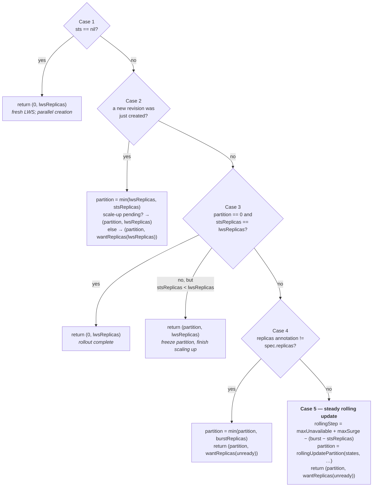

# Module 6: Rollouts, Revisions, and Scaling

Updating a Deployment is easy because its replicas are interchangeable. Updating an LWS is not, because each replica is a multi-pod collective that must be replaced atomically, and because taking one group down means taking `size` accelerators out of service at once. On an 8-GPU-per-group deployment, a careless `maxUnavailable` is the difference between a smooth rollout and a capacity incident.

`rollingUpdateParameters()` is a hundred lines of arithmetic that reduces the whole problem to two numbers — a **partition** and a **replica count** — which are then handed to the StatefulSet controller. This module derives both, line by line, and then traces the upstream worked example through the actual code to show that the derivation is right.

Covered here: **what "updated" means**, **the base arithmetic**, **the five cases**, **the partition walk-down**, **surge reclamation**, **a full worked trace**, **`partition` as a user-facing canary knob**, **scaling**, and **the `MaxUnavailableStatefulSet` dependency**.

!!! info "Provenance"
    Verified against `kubernetes-sigs/lws` at `32a9c37` (2026-08-06), release v0.9.0. Primary source: `pkg/controllers/leaderworkerset_controller.go`, plus KEP-511 and KEP-552.

---

## Part 1: What "Updated" Means

Everything downstream depends on a per-group boolean pair. `getReplicaStates(ctx, lws, stsReplicas, revisionKey) []replicaState` builds a fixed-length slice indexed by group:

```go
type replicaState struct {
    ready   bool
    updated bool
}
```

The construction is more careful than it looks:

1. Leader pods are listed by `{name, worker-index: "0"}` and placed into a slice of length `stsReplicas` using `utils.SortByIndex` keyed on the `group-index` label. Out-of-range or unparseable indices are **dropped**, leaving zero-valued entries — which read as `{ready: false, updated: false}`.
2. Worker StatefulSets are listed by `{name}` and sorted the same way.
3. For index `idx`, the expected name is `fmt.Sprintf("%s-%d", lws.Name, idx)`. **If the pod at that slot has a different name** — or the StatefulSet does, when `Size > 1` — the slot is `{false, false}`. This is how "not yet created" and "currently being rebuilt" are represented without a separate state.
4. Otherwise:

```go
leaderUpdated := revisionutils.GetRevisionKey(&sortedPods[idx]) == revisionKey
leaderReady   := podutils.PodRunningAndReady(&sortedPods[idx])
if *lws.Spec.LeaderWorkerTemplate.Size > 1 {
    updated = leaderUpdated && revisionutils.GetRevisionKey(&sortedSts[idx]) == revisionKey
    ready   = leaderReady   && statefulsetutils.StatefulsetReady(sortedSts[idx])
}
```

A group is **updated** only if *both* its leader pod and its worker StatefulSet carry the current revision key, and **ready** only if the leader pod is Running-and-Ready *and*:

```go
func StatefulsetReady(sts appsv1.StatefulSet) bool {
    return *sts.Spec.Replicas == sts.Status.AvailableReplicas &&
           sts.Status.CurrentRevision == sts.Status.UpdateRevision
}
```

Note that `revisionKey` — the value of `leaderworkerset.sigs.k8s.io/template-revision-hash` — is the **only** definition of "updated". There is no template comparison anywhere in the rollout path. The label propagates automatically: the LWS controller puts it on the leader StatefulSet's pod template, the StatefulSet controller copies it to new leader pods, and the pod controller stamps the worker StatefulSet and its pod template with the *leader pod's* key.

---

## Part 2: The Base Arithmetic

```go
maxSurge, _       = intstr.GetScaledValueFromIntOrPercent(&...MaxSurge,       int(lwsReplicas), true)   // round UP
maxUnavailable, _ = intstr.GetScaledValueFromIntOrPercent(&...MaxUnavailable, int(lwsReplicas), false)  // round DOWN
if maxSurge > int(lwsReplicas) { maxSurge = int(lwsReplicas) }
burstReplicas := lwsReplicas + int32(maxSurge)
```

| Quantity | Rule |
| :--- | :--- |
| `maxSurge` | Percentages round **up**, then clamped to `lwsReplicas` |
| `maxUnavailable` | Percentages round **down** — this is the rounding that makes `10%` of 5 replicas become 0 and trips the webhook |
| `burstReplicas` | `lwsReplicas + maxSurge` — the ceiling on the leader StatefulSet's replica count |

And a deferred clamp that applies to **every** return path:

```go
defer func() {
    stsPartition = max(stsPartition, *lws.Spec.RolloutStrategy.RollingUpdateConfiguration.Partition)
}()
```

This is KEP-511's user-facing `partition` acting as a **floor**. No matter what the algorithm computes, the partition never goes below the value the user set. That single line is the whole canary mechanism.

---

## Part 3: The Five Cases

`rollingUpdateParameters` evaluates five cases in order and returns from the first that matches.



**Case 1** is a fresh LWS. Partition 0 because pods are created in parallel — there is nothing to hold back.

**Case 2** fires on the reconcile where a new ControllerRevision was just cut. `partition := min(lwsReplicas, stsReplicas)` sets the partition **above every existing group**, so nothing updates yet; the burst replicas are created first. If `stsReplicas < lwsReplicas` — a scale-up was pending when the template changed — it returns `lwsReplicas` so the scale-up completes with the *new* template, which is cheaper than creating old-revision groups and immediately replacing them.

**Case 3** detects a completed rollout: `partition == 0 && stsReplicas == lwsReplicas`. It also handles a pure scale-up mid-rollout by freezing the partition and letting replicas grow.

**Case 4** is where the `leaderworkerset.sigs.k8s.io/replicas` annotation earns its existence. It is stamped on the leader StatefulSet by every apply, so it is a persisted record of "the `spec.replicas` value at the last apply." If it disagrees with the current `spec.replicas`, someone scaled the LWS mid-rollout. The response is `partition = min(partition, burstReplicas)` — clamp the partition into the new range — and continue. A malformed or missing annotation is a **hard error return**, which is worth knowing if you ever hand-edit the leader StatefulSet.

**Case 5** is the steady state, and it is Part 4.

---

## Part 4: The Partition Walk-Down

```go
rollingStep := maxUnavailable
// Make sure that we always respect the maxUnavailable, or
// we'll violate it when reclaiming bursted replicas.
rollingStep += maxSurge - (int(burstReplicas) - int(stsReplicas))
partition = rollingUpdatePartition(states, stsReplicas, int32(rollingStep), partition)
```

Since `burstReplicas - stsReplicas` is the surge capacity **not yet materialized**, the expression simplifies to:

$$
\text{rollingStep} = \text{maxUnavailable} + \text{surge already created}
$$

That is the real insight. Surge replicas are extra serving capacity, so every surge replica that actually exists lets you take one more group down without violating the availability budget. At full burst, the step is `maxUnavailable + maxSurge`; before any surge pods exist, it is just `maxUnavailable`.

Now the function itself, which is the densest code in the project:

```go
func rollingUpdatePartition(states []replicaState, stsReplicas, rollingStep, currentPartition int32) int32 {
    continuousReadyReplicas := calculateContinuousReadyReplicas(states)
    var rollingStepPartition = utils.NonZeroValue(stsReplicas - continuousReadyReplicas - rollingStep)

    var unavailable int32
    for idx := 0; idx < int(rollingStepPartition); idx++ {
        if !states[idx].ready { unavailable++ }
    }
    var partition = rollingStepPartition + unavailable

    for idx := min(partition, stsReplicas-1); idx >= rollingStepPartition; idx-- {
        if !states[idx].ready || states[idx].updated { partition = idx } else { break }
    }
    return min(partition, currentPartition)
}
```

Five moves, each with a distinct job:

| | Move | Purpose |
| :--- | :--- | :--- |
| **a** | `calculateContinuousReadyReplicas` counts, **from the tail downward**, groups that are `ready && updated`, stopping at the first that is not | Establishes how much of the high-index end is already done |
| **b** | `rollingStepPartition = stsReplicas − continuousReady − rollingStep` | Push the partition one full step below the finished tail |
| **c** | Count not-ready groups **below** `rollingStepPartition` and add that count back | Groups that are already unhealthy have *already spent* the availability budget; do not spend it twice |
| **d** | Walk **downward** from `partition` while the group is already-updated **or** already-not-ready, never below `rollingStepPartition` | Updating a group that is already updated or already down is free — take it |
| **e** | `min(partition, currentPartition)` | **The monotonicity invariant: the partition only ever moves downward** |

Move (c) is the one people miss. Without it, an LWS with two crashed low-index groups and `maxUnavailable: 2` would take two *more* groups down for the rollout, running four groups short of capacity.

Move (e), combined with the deferred `max(..., spec.partition)` from Part 2, gives the complete invariant:

> The partition is **monotonically non-increasing** within a rollout, and **never crosses the user's canary floor**.

Finally, the unready count that drives replica sizing:

```go
func calculateLWSUnreadyReplicas(states []replicaState, lwsReplicas int32) int32 {
    var unreadyCount int32
    for idx := int32(0); idx < lwsReplicas; idx++ {
        if idx >= int32(len(states)) || !states[idx].ready || !states[idx].updated { unreadyCount++ }
    }
    return unreadyCount
}
```

It scans only `[0, lwsReplicas)` — **surge replicas beyond the desired count never count as unready**, which is what makes surge reclamation terminate.

---

## Part 5: Surge Reclamation

```go
func calculateRollingUpdateReplicas(lwsReplicas, maxSurge, maxUnavailable, unreadyReplicas int32) int32 {
    burstReplicas := lwsReplicas + maxSurge
    if unreadyReplicas <= maxSurge {
        requiredSurgeReplicas := utils.NonZeroValue(unreadyReplicas - maxUnavailable)
        return lwsReplicas + requiredSurgeReplicas
    }
    return burstReplicas
}
```

Two regimes:

- **Many groups still unready** (`unready > maxSurge`): stay at full burst. You need every extra replica.
- **Few groups still unready** (`unready <= maxSurge`): keep only `max(0, unready − maxUnavailable)` surge replicas. The remaining unready groups fit inside the `maxUnavailable` budget, so the surge capacity is no longer needed.

Surge is therefore reclaimed **gradually**, not all at once at the end — and because reclamation is driven by unready count, it can shrink and grow again if groups become unhealthy mid-rollout.

The wrapper `wantReplicas()` emits `GroupsProgressing`/`Delete` events when shrinking: `"deleting surge replica %s-%d"` for one, `"deleting surge replicas from %s-%d to %s-%d"` for several. Those events are the cleanest signal that reclamation is happening.

---

## Part 6: A Full Worked Trace

The upstream documentation gives a nine-stage table for `replicas: 4, maxUnavailable: 2, maxSurge: 2`. Here it is again with the arithmetic derived from the code at each step, which is the part the upstream page omits.

Constants: `lwsReplicas = 4`, `maxSurge = 2`, `maxUnavailable = 2`, `burstReplicas = 6`.

| | Partition | Replicas | R0 | R1 | R2 | R3 | R4 | R5 |
| :--- | :---: | :---: | :---: | :---: | :---: | :---: | :---: | :---: |
| **Stage 1** | 0 | 4 | ✅ | ✅ | ✅ | ✅ | | |
| **Stage 2** | 4 | 6 | ❎ | ❎ | ❎ | ❎ | ⏳ | ⏳ |
| **Stage 3** | 2 | 6 | ❎ | ❎ | ⏳ | ⏳ | ⏳ | ⏳ |
| **Stage 4** | 2 | 6 | ❎ | ❎ | ⏳ | ⏳ | ✅ | ⏳ |
| **Stage 5** | 0 | 6 | ⏳ | ⏳ | ⏳ | ⏳ | ✅ | ✅ |
| **Stage 6** | 0 | 6 | ⏳ | ⏳ | ✅ | ✅ | ✅ | ✅ |
| **Stage 7** | 0 | 4 | ⏳ | ⏳ | ✅ | ✅ | | |
| **Stage 8** | 0 | 4 | ⏳ | ✅ | ✅ | ✅ | | |
| **Stage 9** | 0 | 4 | ✅ | ✅ | ✅ | ✅ | | |

✅ updated and ready · ❎ not updated (but ready) · ⏳ updating (not ready)

**Stage 1 → 2.** The template changes, so `leaderWorkerSetUpdated` is true → **Case 2**. `partition = min(4, 4) = 4`. `stsReplicas >= lwsReplicas`, so replicas is `wantReplicas(4)`: unready `4 > maxSurge 2` → full burst → **6**. The partition sits above every existing group, so nothing is torn down; two surge groups R4 and R5 are created at the new revision.

**Stage 2 → 3.** Case 5. `stsReplicas = 6`, so all surge is materialized: `rollingStep = 2 + 2 − (6−6) = 4`. R5 is not ready, so `continuousReadyReplicas = 0`. Hence `rollingStepPartition = 6 − 0 − 4 = 2`. R0 and R1 are ready, so `unavailable = 0` and `partition = 2`. Move (d) inspects R2: ready and *not* updated → break. **Partition 2.** Groups R2 and R3 begin updating.

**Stage 3 → 4.** R4 becomes ready+updated; R5 is still not ready, so `continuousReadyReplicas` is still 0 and `rollingStepPartition` is still 2. Move (d) now finds R2 not ready → `partition = 2`, then `idx--` drops below `rollingStepPartition` and the loop ends. **Partition stays 2** — which is exactly the upstream note "since the last Replica is not ready, Partition will not change."

**Stage 4 → 5.** R5 becomes ready+updated. Counting from the tail: R5 ✅, R4 ✅, R3 not ready → stop, so `continuousReadyReplicas = 2`. Now `rollingStepPartition = 6 − 2 − 4 = 0`, `unavailable` over the empty range is 0, and move (d) breaks immediately at R0 (ready, not updated). **Partition 0.** R0 and R1 begin updating.

**Stage 5 → 6.** R2 and R3 finish. No partition change; it is already 0.

**Stage 6 → 7.** Now the replica count moves. `calculateLWSUnreadyReplicas` scans only `[0, 4)`: R0 and R1 are unready → `unready = 2`. Since `2 <= maxSurge 2`, `requiredSurgeReplicas = max(0, 2 − 2) = 0` → replicas **4**. Both surge replicas are deleted, emitting `"deleting surge replicas from my-lws-4 to my-lws-5"`.

Note what just happened: the two groups deleted were the **updated** ones, while R0 and R1 are still updating. That is fine — indices 4 and 5 are outside `[0, lwsReplicas)` by definition, and R0/R1's slots will be filled by the new revision.

**Stage 7 → 9.** R1 finishes (`unready = 1`, still `<= maxSurge`, `max(0, 1−2) = 0` → replicas stays 4), then R0. At `unready = 0` with `partition == 0` and `stsReplicas == lwsReplicas`, Case 3 fires, `updateDone` becomes true, and `TruncateRevisions` deletes the old ControllerRevision.

!!! tip "The reasoning shortcut"
    If you remember one thing, make it move (a): **the partition is anchored to the ready-and-updated tail.** Everything else is adjustments. A rollout that is stuck almost always means the tail is not growing — some high-index group is not becoming ready — and the partition therefore cannot descend.

---

## Part 7: `partition` as a User Knob

KEP-511 exposed `rollingUpdateConfiguration.partition` so that users can hold a rollout at a chosen boundary. Groups `[0, partition)` are frozen; groups `[partition, replicas)` update.

### 7.1 Canary

```yaml
spec:
  replicas: 10
  rolloutStrategy:
    rollingUpdateConfiguration:
      partition: 8      # only groups 8 and 9 take the new template
```

Change the template, wait, evaluate, then lower `partition` to widen the blast radius: 8 → 5 → 0.

### 7.2 xPyD ratio preservation

The KEP's motivating case is prefill/decode disaggregation done with two LWSes. During a rollout you want the prefill:decode version ratio to hold — updating all prefill before any decode means new-version prefill servers handing KV cache to old-version decode servers. Stepping both LWSes' partitions in lockstep preserves the ratio at every point.

This is exactly the problem `DisaggregatedSet` was created to solve properly ([Module 8](08_disaggregatedset.md)); the manual partition dance is what people did before it existed, and it is still what you do if your roles are not in a DisaggregatedSet.

### 7.3 The condition and truncation interaction

KEP-511 changed two things beyond adding the field, and both are easy to trip over:

- `UpdateInProgress` and `Available` are computed over groups **with index ≥ `partition`**, not all groups. A frozen group that is unhealthy does not make the *rollout* look stuck.
- `updateConditions` returns `allUpdateDone` — computed over **all** replicas — rather than the windowed value, and that is what gates `TruncateRevisions`. Without this, a partitioned rollout would garbage-collect the very revision the held-back groups are still running.

The practical upshot: **while `partition > 0`, both revisions persist**. That is your rollback path, and it disappears the moment you set `partition: 0` and the rollout completes.

!!! warning "Rollback is a manual re-apply"
    As covered in [Module 4](04_lws_reconciler_internals.md), LWS keeps exactly one revision after a completed rollout and has no `revisionHistoryLimit`. `kubectl rollout undo` does not work on an LWS. Keep the previous manifest in version control, because the cluster will not keep it for you.

---

## Part 8: Scaling

Three different things are commonly called "scaling," and they behave differently.

| Change | Cuts a revision? | Triggers a rollout? | Effect |
| :--- | :---: | :---: | :--- |
| `spec.replicas` | No | No | Groups are added or removed at the current revision |
| `leaderWorkerTemplate.size` | **Yes** | **Yes** | Every group is recreated with the new pod count |
| `rolloutStrategy.*` | No | No | Changes how the *next* rollout behaves |

### 8.1 Horizontal scaling via `replicas`

`spec.replicas` is excluded from the revision patch ([Module 4](04_lws_reconciler_internals.md), §5.1), so scaling never rolls anything. New groups are created at the current revision; removed groups are deleted leader-first, which cascades.

HPA drives this through the scale subresource, using the leader-only selector from [Module 2](02_api_surface_anatomy.md), §4. The metric must be **published by the leader and represent the whole group**.

Scaling *during* a rollout is handled by Case 4, via the `replicas` annotation on the leader StatefulSet. It works, but it makes the rollout arithmetic harder to reason about; if you can, let a rollout finish first.

### 8.2 Vertical scaling via `size` (KEP-552)

`size` is mutable. Changing it changes the `leaderworkerset.sigs.k8s.io/size` annotation on the pod template, which changes the revision hash, which triggers a normal group-by-group rollout. Every group is recreated with the new pod count.

!!! note "KEP-552 describes an API that was never built"
    The KEP proposes a `ResizePolicy` field with values `None` and `Recreate`. **`grep -rn "ResizePolicy" api/ pkg/` returns nothing.** The Implementation History records `2025-08-05: Implementation revised to avoid additions to the API surface` — what shipped is simply "`size` is mutable, and the size annotation makes the rollout happen naturally." The KEP body was never updated to match, so it still documents a field that does not exist.

    Updating the KEP to describe what shipped is a genuinely useful documentation PR, and an easy one: the evidence is a single grep. The KEP also notes an explicit non-goal — **no in-place resize** — because "it adds more complexities like dynamically changing the topology envs at runtime."

That non-goal is the important part. `LWS_GROUP_SIZE` and `TPU_WORKER_HOSTNAMES` are injected at admission and read at process start; there is no mechanism to update them in a running container, and no inference engine would react correctly if there were. Group resizing therefore *must* be a recreate.

---

## Part 9: The `MaxUnavailableStatefulSet` Dependency

`maxUnavailable > 1` is implemented by passing a value through to the leader StatefulSet's `rollingUpdate.maxUnavailable`, which is an upstream Kubernetes feature.

That field graduated to **beta, enabled by default, in Kubernetes 1.35**. On earlier versions the gate must be enabled explicitly on the API server and controller manager, and without it the StatefulSet controller ignores the field and rolls pods one at a time — so your `maxUnavailable: 4` silently behaves as 1.

!!! danger "The upstream docs contradict themselves here"
    - `site/content/en/docs/concepts/rollout-strategy/_index.md`: "`MaxUnavailable` was graduated to Beta in Kubernetes 1.35, which means that it is enabled by default."
    - `site/content/en/docs/installation/_index.md`: "you must enable the `MaxUnavailableStatefulSet` feature gate, which is **still in alpha since Kubernetes v1.24**."

    Both pages are shipped in v0.9.0. Reconciling them is a small, high-value documentation PR — see [Appendix B](appendix_pr_opportunities.md). The `rollout-strategy` page is the correct one; the `installation` page was not updated when the gate graduated.

    The same `installation` page also omits that `rollingUpdateConfiguration.partition` is a user-settable field at all, treating it purely as a controller-internal variable.

The diagnostic is straightforward: if you set `maxUnavailable: 4` and observe groups updating strictly one at a time, check the gate before reading any of the arithmetic above.

---

## Lab: Make the Arithmetic Visible

Everything in this lab runs on `kind` with a trivial container. The rollout algorithm is completely orthogonal to accelerators, and using a fast-starting image makes the state transitions observable rather than a ten-minute wait.

### Step 1 — Reproduce the nine-stage trace

Deploy `replicas: 4, size: 2, maxUnavailable: 2, maxSurge: 2` with a container that takes about 20 seconds to become Ready (a `readinessProbe` with `initialDelaySeconds: 20` works well — long enough to see the stages, short enough to stay awake).

In one terminal:

```bash
watch -n1 'kubectl get lws my-lws -o jsonpath="P=$(kubectl get sts my-lws -o jsonpath={.spec.updateStrategy.rollingUpdate.partition}) R=$(kubectl get sts my-lws -o jsonpath={.spec.replicas})"; echo; kubectl get pods -l leaderworkerset.sigs.k8s.io/worker-index=0 -o custom-columns="NAME:.metadata.name,REV:.metadata.labels.leaderworkerset\.sigs\.k8s\.io/template-revision-hash,READY:.status.conditions[?(@.type==\"Ready\")].status"'
```

In another, trigger the rollout:

```bash
kubectl patch lws my-lws --type=json -p '[{"op":"replace",
  "path":"/spec/leaderWorkerTemplate/workerTemplate/spec/containers/0/image",
  "value":"nginxinc/nginx-unprivileged:1.28"}]'
```

Record `(partition, replicas)` at each transition and match them against the table in Part 6. Where your observations differ, work out which of the five cases fired and why — the most common divergence is that your pods become ready faster than the reconcile loop samples, collapsing several stages into one.

### Step 2 — Watch surge reclamation explicitly

```bash
kubectl get events --field-selector reason=GroupsProgressing -w | grep -i surge
```

You should see `deleting surge replicas from my-lws-4 to my-lws-5` at Stage 7. Confirm from Part 5 why it happens at exactly that moment and not earlier: the trigger is `unready <= maxSurge`.

### Step 3 — Prove move (c) — the unavailability accounting

Before starting a rollout, deliberately break two low-index groups:

```bash
kubectl patch lws my-lws --type=json -p '[{"op":"replace",
  "path":"/spec/leaderWorkerTemplate/workerTemplate/spec/containers/0/readinessProbe/exec/command",
  "value":["false"]}]'   # or break groups 0 and 1 individually
```

Now trigger a template rollout with `maxUnavailable: 2, maxSurge: 0` and observe how many groups are torn down simultaneously. Without move (c) it would be two more on top of the two already broken; with it, the partition is pushed back up by the `unavailable` count and the rollout takes down fewer.

Compute the expected partition by hand from `rollingUpdatePartition` before you look, then compare.

### Step 4 — Exercise the canary floor

```bash
kubectl patch lws my-lws --type=merge \
  -p '{"spec":{"rolloutStrategy":{"rollingUpdateConfiguration":{"partition":3}}}}'
# change the image
kubectl get pods -l leaderworkerset.sigs.k8s.io/worker-index=0 \
  -o custom-columns='NAME:.metadata.name,REV:.metadata.labels.leaderworkerset\.sigs\.k8s\.io/template-revision-hash'
```

Only group 3 should carry the new revision key. Then verify the truncation interaction from §7.3:

```bash
kubectl get controllerrevision -l leaderworkerset.sigs.k8s.io/name=my-lws
```

Two revisions, persisting indefinitely. Walk `partition` down to 0 and watch the second disappear once the rollout completes.

### Step 5 — Scale mid-rollout and find Case 4

Start a rollout, and while it is in progress:

```bash
kubectl scale lws/my-lws --replicas=6
kubectl get sts my-lws -o jsonpath='{.metadata.annotations.leaderworkerset\.sigs\.k8s\.io/replicas}'; echo
```

Watch the annotation change from `4` to `6` on the next apply. Before that apply lands, the annotation and `spec.replicas` disagree, and Case 4 clamps the partition. Read the Case 4 branch and confirm what would go wrong if the annotation did not exist — specifically, why the controller cannot just compare against the StatefulSet's current replica count.

### Step 6 — Verify the `MaxUnavailableStatefulSet` gate

```bash
kubectl version --short
kubectl get sts my-lws -o jsonpath='{.spec.updateStrategy.rollingUpdate.maxUnavailable}'; echo
```

Set `maxUnavailable: 3` on the LWS and confirm the value propagates to the StatefulSet — it will, regardless of the gate. Then trigger a rollout and count how many groups actually go down at once. If it is one, the gate is off, and you have reproduced the exact confusion the contradictory upstream docs create.

### Checkpoint questions

- Why does move (e) use `min` while the deferred clamp uses `max`? What invariant does each protect, and what breaks if you swap them?
- At Stage 7 the algorithm deletes the two *updated* surge replicas while two *un-updated* groups remain. Why is that not a capacity regression?
- `calculateLWSUnreadyReplicas` scans `[0, lwsReplicas)` rather than `[0, len(states))`. Construct the non-terminating rollout you would get if it scanned the whole slice.

Continue to [Module 7: Scheduling, Placement, and Networking](07_scheduling_placement_and_networking.md).
