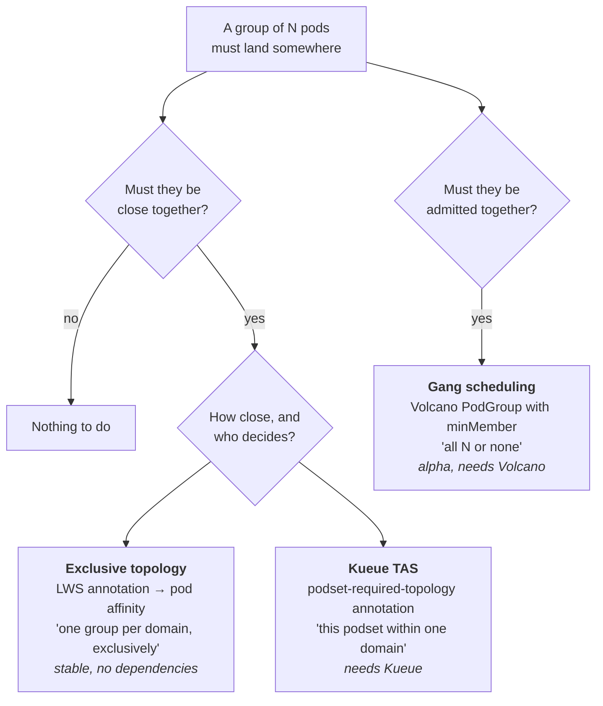
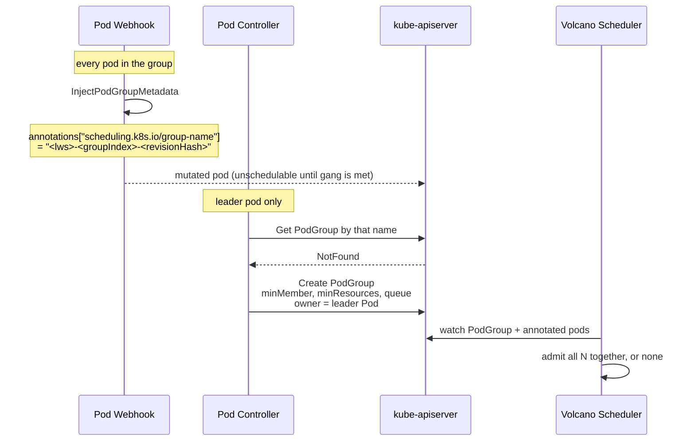

# Module 7: Scheduling, Placement, and Networking

A group is only as good as its placement. Sixteen pods spread across eight racks will run your model and deliver a fraction of the throughput of the same sixteen pods in one NVLink domain — and a group whose leader schedules while its workers do not is worse than a group that never scheduled at all, because it holds accelerators and serves nothing.

This module covers the three mechanisms LWS provides for that problem, in increasing order of ambition: **exclusive topology placement** (LWS's own, always available), **gang scheduling** (delegated to Volcano, alpha), and **topology-aware scheduling** (delegated to Kueue). It also covers **subdomain policy trade-offs at scale**, **`volumeClaimTemplates`**, and **worker resizing** — the two remaining stable KEPs that did not fit elsewhere.

!!! info "Provenance"
    Verified against `kubernetes-sigs/lws` at `32a9c37` (2026-08-06), release v0.9.0. Primary sources: `pkg/webhooks/pod_webhook.go`, `pkg/controllers/pod_controller.go`, `pkg/schedulerprovider/`, `pkg/utils/utils.go`, and KEPs 407, 552, 622.

---

## Part 1: The Placement Problem



These are three different guarantees, frequently conflated:

| Mechanism | Guarantee | Failure mode it prevents |
| :--- | :--- | :--- |
| Exclusive topology | Every pod of the group is in the **same** domain, and **no other group** shares it | Cross-rack tensor parallelism; noisy neighbours in the same NVLink domain |
| Topology-aware scheduling | The group is placed within a domain **at a chosen level of the hierarchy**, preferring tighter levels | Placement that satisfies "same rack" when "same host" was available |
| Gang scheduling | **All or none** of the group is admitted | Leader scheduled, workers Pending, accelerators held hostage |

Exclusive topology without gang scheduling is the combination most people start with, and it is precisely the combination that produces the deadlock from [Module 5](05_pod_controller_and_failure_handling.md), §6: the leader claims a domain, the workers cannot fit in it, and the group is stuck forever.

---

## Part 2: Exclusive Topology Placement

Driven entirely by an annotation on the LWS:

```yaml
metadata:
  annotations:
    leaderworkerset.sigs.k8s.io/exclusive-topology: cloud.google.com/gce-topology-block
```

The value is a **node label key** that defines what "a domain" means: `kubernetes.io/hostname` for per-host, a rack label for per-rack, a cloud provider's block label for a network block.

### 2.1 The injected affinity

`SetExclusiveAffinities(pod, groupUniqueKey, topologyKey, podAffinityKey)` in `pkg/webhooks/pod_webhook.go`:

```go
if exclusiveAffinityApplied(*pod, topologyKey) { return }   // idempotent

pod.Spec.Affinity.PodAffinity.RequiredDuringSchedulingIgnoredDuringExecution = append(..., corev1.PodAffinityTerm{
    LabelSelector: &metav1.LabelSelector{MatchExpressions: []metav1.LabelSelectorRequirement{
        {Key: podAffinityKey, Operator: metav1.LabelSelectorOpIn, Values: []string{groupUniqueKey}},
    }},
    TopologyKey: topologyKey,
})

pod.Spec.Affinity.PodAntiAffinity.RequiredDuringSchedulingIgnoredDuringExecution = append(..., corev1.PodAffinityTerm{
    LabelSelector: &metav1.LabelSelector{MatchExpressions: []metav1.LabelSelectorRequirement{
        {Key: podAffinityKey, Operator: metav1.LabelSelectorOpExists},
        {Key: podAffinityKey, Operator: metav1.LabelSelectorOpNotIn, Values: []string{groupUniqueKey}},
    }},
    TopologyKey: topologyKey,
})
```

Read in plain language:

- **Affinity**: "co-locate me, in this topology domain, with pods that share my `group-key`."
- **Anti-affinity**: "repel any pod that **has** a `group-key` **and** whose `group-key` is not mine."

The `Exists` term in the anti-affinity is the load-bearing detail. Without it, the `NotIn` selector would also match pods that have no `group-key` label at all — every DaemonSet, every unrelated workload — and the group would refuse to schedule anywhere populated. With it, only *other LWS groups* are repelled.

Both terms are `RequiredDuringSchedulingIgnoredDuringExecution`. There is no soft variant, which means exclusive topology is a hard constraint that can leave a group Pending indefinitely rather than degrading gracefully.

Idempotence is via `exclusiveAffinityApplied(pod, topologyKey)`, which requires **both** a PodAffinity term and a PodAntiAffinity term with that exact `TopologyKey` to consider the work done.

### 2.2 Subgroup-level exclusivity

The subgroup variant is byte-identical except that `podAffinityKey` is `leaderworkerset.sigs.k8s.io/subgroup-key` and the topology key comes from `subgroup-exclusive-topology`. Both can apply to the same pod, producing two affinity terms and two anti-affinity terms.

The canonical two-level configuration:

```yaml
metadata:
  annotations:
    leaderworkerset.sigs.k8s.io/exclusive-topology: cloud.google.com/gce-topology-block
    leaderworkerset.sigs.k8s.io/subgroup-exclusive-topology: kubernetes.io/hostname
spec:
  leaderWorkerTemplate:
    size: 16
    subGroupPolicy:
      subGroupSize: 8
```

"The whole 16-pod group lives in one network block, and each 8-pod subgroup lives on one host." That is exactly the topology a 16-way tensor-parallel model wants: NVLink within each host, high-bandwidth fabric between them, and no other group competing for either.

### 2.3 The leader/worker asymmetry

As established in [Module 5](05_pod_controller_and_failure_handling.md), §6, placement is implemented differently on the two sides:

| | Leader | Workers |
| :--- | :--- | :--- |
| Mechanism | Pod affinity + anti-affinity, injected at **admission** | Plain `nodeSelector` on the worker StatefulSet, set **after the leader is scheduled** |
| Sees | The topology *key* | The topology *value* read off the leader's node |

The leader schedules first and claims a domain by value; the workers are then pinned to that literal value. `setNodeSelectorForWorkerPods` returns early if `pod.Spec.NodeName == ""`, because there is no value to read yet.

!!! warning "The asymmetry is the failure mode"
    Because the leader schedules *before* the workers' feasibility is known, the scheduler has no way to reject a domain that cannot hold the whole group. Exclusive topology therefore guarantees co-location **if the group schedules at all**, and offers nothing when it cannot. That gap is the entire argument for gang scheduling.

### 2.4 Not versioned

The `exclusive-topology` annotation is metadata, and metadata is excluded from the revision patch ([Module 4](04_lws_reconciler_internals.md), §5.1). Changing it does **not** cut a revision and does **not** trigger a rollout. Existing groups keep their old placement; only groups created afterwards get the new one.

If you need to re-place an existing fleet, you must force a rollout by some other means — changing the image tag, or deleting groups. This surprises people, and it is worth a sentence in the upstream docs that is not currently there.

---

## Part 3: Gang Scheduling (KEP-407, Alpha)

### 3.1 What shipped versus what the KEP describes

KEP-407 is at `status: provisional`, `stage: alpha`, and the divergence between the proposal and the implementation is large enough that reading the KEP alone will mislead you.

| KEP-407 says | Code actually has |
| :--- | :--- |
| Feature gate `PodGroupPerReplica` | **No feature gate exists.** `grep -rn "PodGroupPerReplica"` matches only `keps/407-gang-scheduling/kep.yaml:35`. `pkg/features` does not exist; nothing imports `utilfeature` |
| `BaseResourceProvider`, `SchedulerProvider`, `ReplicaResourceProvider` interfaces | **Only `SchedulerProvider`** was built |
| PodGroup named `lws.Name-groupIndex` | `GetPodGroupName(lwsName, groupIndex, revision)` → e.g. `lws-1-dd6699c7c` — the **revision hash is appended** |
| — | Enabled by a config field, `gangSchedulingManagement.schedulerProvider` |

The revision hash in the PodGroup name is not a detail. It means a rolling update produces a **new PodGroup per group** rather than mutating the existing one, which is what makes gang scheduling compose correctly with `maxSurge` (surge groups get their own PodGroups) and with rollback.

### 3.2 The interface

```go
type SchedulerProvider interface {
    CreatePodGroupIfNotExists(ctx context.Context, lws *leaderworkerset.LeaderWorkerSet, leaderPod *corev1.Pod) error
    InjectPodGroupMetadata(pod *corev1.Pod) error
}
var SupportedSchedulerProviders = sets.New("volcano")
const PodGroupNameFmt = "%s-%s-%s"
```

Two methods, called from two different places:

- **`InjectPodGroupMetadata`** is called from the **pod mutating webhook**, so *every* pod in the group gets stamped.
- **`CreatePodGroupIfNotExists`** is called from the **pod controller**, on leader pods only, and importantly **before the `Size == 1` short-circuit** — so even a single-pod group gets a PodGroup.

The split exists because different schedulers want different things. Volcano wants an annotation (`scheduling.k8s.io/group-name`) plus a `PodGroup` CRD; the upstream coscheduling plugin wants a label (`scheduling.x-k8s.io/pod-group`); YuniKorn needs no CRD at all and could return `nil` from both. Adding a provider means implementing two methods and adding a string to `SupportedSchedulerProviders`.

### 3.3 The Volcano provider



`CreatePodGroupIfNotExists` builds the PodGroup with:

| Field | Value |
| :--- | :--- |
| Labels | `name`, `group-index`, `template-revision-hash` |
| Annotations | Every LWS annotation with the literal prefix `volcano.sh/` (`inheritVolcanoAnnotations`) |
| `Spec.MinMember` | `*lws.Spec.LeaderWorkerTemplate.Size` — **overridden to `1` when `StartupPolicy == LeaderReady`** |
| `Spec.MinResources` | `utils.CalculatePGMinResources(lws)` — always the **full group's** requests, even in `LeaderReady` mode |
| `Spec.Queue` | `lws.Annotations["scheduling.volcano.sh/queue-name"]` if present |
| Owner | The **leader Pod**, so the PodGroup is GC'd with the group |

The `LeaderReady` handling is the subtle part and worth spelling out. Under `LeaderReady`, workers do not exist until the leader is Ready, so a gang of `size` can never be satisfied — the scheduler would deadlock waiting for pods that will not be created. Setting `minMember: 1` lets the leader schedule alone. But `minResources` stays at the **whole group's** requests, so Volcano still reserves capacity for all the workers up front. Without that, the leader would schedule into a domain that cannot hold its workers, reintroducing exactly the failure gang scheduling exists to prevent.

`utils.CalculatePGMinResources(lws)` computes this as `resourcehelper.PodRequests` on the leader template (falling back to the worker template when `leaderTemplate` is nil), plus `quotav1.Add` of the worker template's requests `size - 1` times.

Note also the queue annotation quirk: `scheduling.volcano.sh/queue-name` does **not** match the `volcano.sh/` inheritance prefix, which is why it needs separate handling. If you add a second scheduler provider, expect a similar wart.

### 3.4 Enabling it

There is **no CLI flag**. Gang scheduling is config-file only:

```yaml
apiVersion: config.lws.x-k8s.io/v1alpha1
kind: Configuration
gangSchedulingManagement:
  schedulerProvider: volcano
```

| Install method | How |
| :--- | :--- |
| Helm | `--set gangSchedulingManagement.schedulerProvider=volcano` |
| Kustomize | Edit the `lws-manager-config` ConfigMap **and** enable the `../components/volcano` component in `config/default/kustomization.yaml` (it is commented out by default) |

The kustomize component matters: `config/components/volcano/manager_role_patch.yaml` adds `scheduling.volcano.sh/podgroups: create,get,list,watch` to `manager-role`. Setting the config field without enabling the component gives you a controller that tries to create PodGroups and gets RBAC-denied.

When `cfg.GangSchedulingManagement == nil`, the provider is `nil` and both the webhook and the pod controller skip provider calls entirely — zero overhead.

### 3.5 Alpha caveats

- **Volcano only.** The interface is designed for more, but `SupportedSchedulerProviders` has one entry. Adding the upstream coscheduling plugin is a well-scoped contribution with a clear interface to implement against.
- **The API may change.** The README labels this "Alpha level, API may change in the future," and the KEP is still `provisional` with `stable: v0.9.0` in its milestone block — a milestone that has passed without the KEP graduating.
- **e2e is explicitly unresolved.** The KEP says "needs to discuss whether we need to implement e2e testing." There is a `test/e2e/e2e_gang_scheduling_test.go`, so some coverage exists; whether it satisfies the graduation criteria is an open question a contributor could usefully answer.
- **The KEP's own risk section** names maintenance cost as more schedulers integrate, and notes that schedulers supporting only `minMember` (without `minResources`) cannot cleanly support all `StartupPolicy` values.

---

## Part 4: Topology-Aware Scheduling with Kueue

Kueue's Topology Aware Scheduling (TAS) is a different tool for an adjacent problem: rather than "one group per domain, exclusively", it expresses "place this podset within one domain at level X of the hierarchy."

LWS integrates by wearing labels and annotations; there is no LWS code involved at all.

```yaml
apiVersion: leaderworkerset.x-k8s.io/v1
kind: LeaderWorkerSet
metadata:
  name: vllm
  labels:
    kueue.x-k8s.io/queue-name: default          # admission via Kueue
spec:
  leaderWorkerTemplate:
    leaderTemplate:
      metadata:
        annotations:
          kueue.x-k8s.io/podset-required-topology: "cloud.google.com/gce-topology-block"
          kueue.x-k8s.io/podset-group-name: "vllm-multi-host"
    workerTemplate:
      metadata:
        annotations:
          kueue.x-k8s.io/podset-required-topology: "cloud.google.com/gce-topology-block"
          kueue.x-k8s.io/podset-group-name: "vllm-multi-host"
```

Two things make this work:

1. **Per-template annotations.** The annotations go on `leaderTemplate.metadata` and `workerTemplate.metadata`, not on the LWS itself. LWS passes pod-template metadata through, so Kueue sees them on the pods.
2. **`podset-group-name`.** Leader pods and worker pods are two distinct podsets from Kueue's perspective; the shared group name is what tells TAS to place them together.

Kueue also brings admission control and Dynamic Workload Scheduler flex-start integration, which for scarce accelerator capacity is often more valuable than the topology placement itself. A group that waits in a queue is much better operationally than a group that is Pending against the scheduler with no visibility.

!!! bug "The upstream TAS example does not work as written"
    `site/content/en/docs/examples/tas.md` declares topology levels as `cloud.google.com/gce-topology-block` and friends, but the LWS annotations in the same page reference **`cloud.provider.com/topology-block`** — a placeholder domain that matches no declared level. Copy-pasting the example gives you an LWS that Kueue cannot place.

    The page also pins `vllm/vllm-openai:v0.8.5`, well behind current vLLM, and its `` contains exactly one tab, which renders oddly. All three are in [Appendix B](appendix_pr_opportunities.md).

### 4.1 Choosing between the three

| Situation | Use |
| :--- | :--- |
| Single-host groups, no contention | Nothing |
| Multi-host group, dedicated cluster | Exclusive topology |
| Multi-host group, shared cluster, capacity contention | Exclusive topology **+ gang scheduling** |
| Multiple teams, quota, scarce accelerators, DWS flex-start | Kueue (+ TAS), possibly with exclusive topology |
| Hierarchical placement preferences (host > rack > block) | Kueue TAS — exclusive topology only expresses one level per annotation |

Exclusive topology and Kueue TAS are not mutually exclusive but do overlap; running both means two independent constraint systems must agree, and when they do not, the symptom is an unschedulable pod with a long and unhelpful scheduler message.

---

## Part 5: Subdomain Policy at Scale

[Module 3](03_group_lifecycle_and_identity.md) covered the mechanics. The operational trade-off deserves its own treatment, because it is a real scaling limit.

| | `Shared` (default) | `UniquePerReplica` |
| :--- | :--- | :--- |
| Service objects | 1 | `replicas` |
| DNS records per lookup | `replicas × size` | `size` |
| Created by | LWS reconciler | Pod reconciler |
| Owner | The LWS | The **leader Pod** |
| Lifetime | As long as the LWS | Recreated on every group recreation |

At 100 groups of 8 pods, a `Shared` headless Service resolves to 800 A records on every `LWS_LEADER_ADDRESS` lookup. Every pod in every group does that lookup at startup, and again on every reconnect. CoreDNS becomes a measurable component of cold-start latency, and in the worst case a source of rendezvous timeouts.

`UniquePerReplica` trades that for 100 extra Service objects — more work for kube-proxy, EndpointSlice controllers, and CoreDNS's own watch load. The break-even is workload-specific; the honest guidance is that `Shared` is fine into the tens of groups and worth revisiting above that.

Because the field is mutable and changes every pod's FQDN, switching it forces a full rollout during which old and new groups have different address shapes. Any external client that hardcodes an FQDN will break. Choose at design time if you can.

---

## Part 6: `volumeClaimTemplates` (KEP-622)

Added in v0.8.0 so that LWS-generated StatefulSets can use real ReadWriteOnce volumes instead of `emptyDir` — which matters when a model is larger than the node's ephemeral storage.

```yaml
spec:
  leaderWorkerTemplate:
    volumeClaimTemplates:
      - metadata:
          name: model-cache
        spec:
          accessModes: ["ReadWriteOnce"]
          storageClassName: premium-rwo
          resources:
            requests:
              storage: 500Gi
    persistentVolumeClaimRetentionPolicy:
      whenDeleted: Delete
      whenScaled: Retain
```

The stated design decision: **leader and worker StatefulSets share the same `volumeClaimTemplates` field.** There are no separate templates for each. If your leader needs a different volume from your workers, this API cannot express it — a real limitation and a plausible future KEP.

If `persistentVolumeClaimRetentionPolicy` is unset it inherits StatefulSet's defaults: `whenDeleted: Retain`, `whenScaled: Retain`. For model caches on expensive storage classes, `whenScaled: Retain` means a scale-down leaves the PVCs behind, still billing.

### 6.1 Two gaps worth knowing

**The forwarding is lossy.** `GetPVCApplyConfiguration` copies only `accessModes`, `storageClassName`, `volumeMode`, and `resources.{requests,limits}`. Silently dropped: `selector`, `dataSource`, `dataSourceRef`, and any labels or annotations on the PVC template. If you are cloning model volumes from a VolumeSnapshot, your `dataSource` disappears without a warning.

**There is no validation at all.** The validating webhook does not touch `volumeClaimTemplates` — not the name/`volumeMount` cross-check the API doc comment promises ("Every claim in this list must have at least one matching (by name) volumeMount in one container in the template"), and not immutability. Grep confirms the only code touching the field is `GetPVCApplyConfiguration` and the two `WithVolumeClaimTemplates` calls.

The immutability gap is the sharper one: StatefulSet's own `volumeClaimTemplates` are immutable, so editing them on an LWS produces an apply that the API server rejects, surfacing as a `FailedUpdate` event rather than a clean admission error. Adding webhook validation here is a contained, well-motivated PR.

The KEP's Non-Goals section is literally `n/a`, and its unit/integration/e2e test-plan subsections are empty placeholders — so there is documentation work here too.

---

## Part 7: Worker Resizing (KEP-552)

Covered in [Module 6](06_rollout_and_revisions.md), §8.2, but it belongs in the KEP inventory: `size` is mutable, changing it triggers a normal rollout via the `size` pod annotation, and **the `ResizePolicy` field the KEP describes does not exist in the codebase**. The Implementation History records the pivot — `2025-08-05: Implementation revised to avoid additions to the API surface` — but the KEP body was never updated.

The explicit non-goal is more interesting than the feature: **no in-place resize**, because "it adds more complexities like dynamically changing the topology envs at runtime." Since `LWS_GROUP_SIZE` and `TPU_WORKER_HOSTNAMES` are injected at admission and read at process start, in-place resize would require both a mechanism to update them and an engine willing to re-read them. Neither exists.

KEP-552 is also the only content KEP with **no `latest-milestone`, no `stage`, and no `milestone` block** in its `kep.yaml`.

---

## Lab: Place a Group Deliberately

!!! warning "Scale"
    Part A runs on `kind` with three or more worker nodes — no accelerators needed, and `kind` makes it easy to fake topology labels. Parts B and C need **real multi-host accelerator capacity** and are marked unverified.

### Part A — Exclusive topology on kind

Create a four-node kind cluster and fake a two-rack topology:

```bash
kubectl label node kind-worker  kind-worker2 topology.example.com/rack=rack-a
kubectl label node kind-worker3 kind-worker4 topology.example.com/rack=rack-b
```

Deploy two LWSes, each `replicas: 1, size: 2`, both annotated:

```yaml
metadata:
  annotations:
    leaderworkerset.sigs.k8s.io/exclusive-topology: topology.example.com/rack
```

Verify:

```bash
kubectl get pods -o custom-columns='NAME:.metadata.name,NODE:.spec.nodeName' \
  -l leaderworkerset.sigs.k8s.io/name
kubectl get pod <leader> -o jsonpath='{.spec.affinity}' | jq
kubectl get sts <leader-name> -o jsonpath='{.spec.template.spec.nodeSelector}'; echo
```

Confirm all three claims from Part 2:

1. Each group is entirely within one rack.
2. The two groups are in **different** racks (the anti-affinity worked).
3. The leader has affinity terms; the worker StatefulSet has a plain `nodeSelector` naming the rack **value**.

Now deploy a third LWS with the same annotation. It should be Pending forever — there is no third rack. Read the scheduler's message and note how unhelpful it is; this is what an exclusive-topology capacity problem looks like in production.

### Part A2 — Prove the `Exists` term matters

Deploy a DaemonSet with no LWS labels. Confirm the LWS groups still schedule alongside it. Then reason through what the anti-affinity would do if the `Exists` requirement were removed from the selector — specifically, which pods would start matching `NotIn`, and why every node in the cluster would become infeasible.

### Part A3 — Two-level exclusivity

Add subgroups:

```yaml
metadata:
  annotations:
    leaderworkerset.sigs.k8s.io/exclusive-topology: topology.example.com/rack
    leaderworkerset.sigs.k8s.io/subgroup-exclusive-topology: kubernetes.io/hostname
spec:
  leaderWorkerTemplate:
    size: 4
    subGroupPolicy:
      subGroupSize: 2
```

Then dump the leader's affinity and count the terms. You should see **two** `podAffinity` terms and **two** `podAntiAffinity` terms, with different `topologyKey`s and different label keys (`group-key` versus `subgroup-key`).

### Part B — Gang scheduling with Volcano (unverified)

```bash
kubectl apply -f https://raw.githubusercontent.com/volcano-sh/volcano/v1.12.1/installer/volcano-development.yaml

# Enable in LWS — BOTH the config field and the RBAC component are required.
helm upgrade lws oci://registry.k8s.io/lws/charts/lws --version=v0.9.0 \
  --namespace lws-system \
  --set gangSchedulingManagement.schedulerProvider=volcano
```

Deploy an LWS whose group cannot fit, and compare against Part A's third LWS:

```bash
kubectl get podgroups
kubectl get podgroup <lws>-0-<revhash> -o yaml | yq '.spec'
```

Verify:

- The PodGroup name ends in the revision hash, matching §3.1.
- `minMember == size`, and `minResources` is the whole group's requests.
- Its owner is the **leader Pod**.
- Every pod carries `scheduling.k8s.io/group-name` with that name.

Then set `startupPolicy: LeaderReady`, recreate, and confirm `minMember` drops to `1` while `minResources` stays at the full group. Explain to yourself why both halves of that are necessary.

Finally, trigger a rollout and watch a **new** PodGroup appear rather than the existing one being mutated. That is the revision hash in the name doing its job.

### Part B2 — The RBAC trap

Set `gangSchedulingManagement.schedulerProvider=volcano` **without** enabling the `../components/volcano` kustomize component (kustomize installs only). Watch the controller logs:

```bash
kubectl -n lws-system logs deploy/lws-controller-manager | grep -i 'podgroup\|forbidden'
```

You should see RBAC denials on `podgroups`. This is a common misconfiguration and worth being able to recognize instantly.

### Part C — Kueue TAS (unverified, needs real topology)

Follow the upstream TAS example, but **fix the bug from §4**: make the `podset-required-topology` annotation reference a topology level you actually declared, not `cloud.provider.com/topology-block`.

```bash
helm install kueue oci://registry.k8s.io/kueue/charts/kueue \
  --version="0.16.1" --create-namespace --namespace=kueue-system
```

Then confirm placement:

```bash
kubectl get pods -o custom-columns='NAME:.metadata.name,NODE:.spec.nodeName'
kubectl get workloads
```

Having reproduced the bug and the fix, you have a complete, tested documentation PR. That is a good first contribution: small, obviously correct, and verified against a live cluster.

### Checkpoint questions

- Exclusive topology guarantees co-location "if the group schedules at all." Construct the precise interleaving of scheduler decisions that produces a permanently-stuck group, and say which of Volcano's two PodGroup fields prevents it.
- Under `LeaderReady`, `minMember` is 1 but `minResources` is the whole group. What breaks if you set `minResources` to just the leader's requests?
- Changing `exclusive-topology` does not trigger a rollout. Given the revision-patch exclusion list from [Module 4](04_lws_reconciler_internals.md), is that a bug or a design decision? Argue both sides — this is exactly the kind of question a KEP would need to answer.

Continue to [Module 8: DisaggregatedSet](08_disaggregatedset.md).
