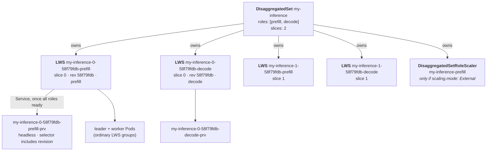
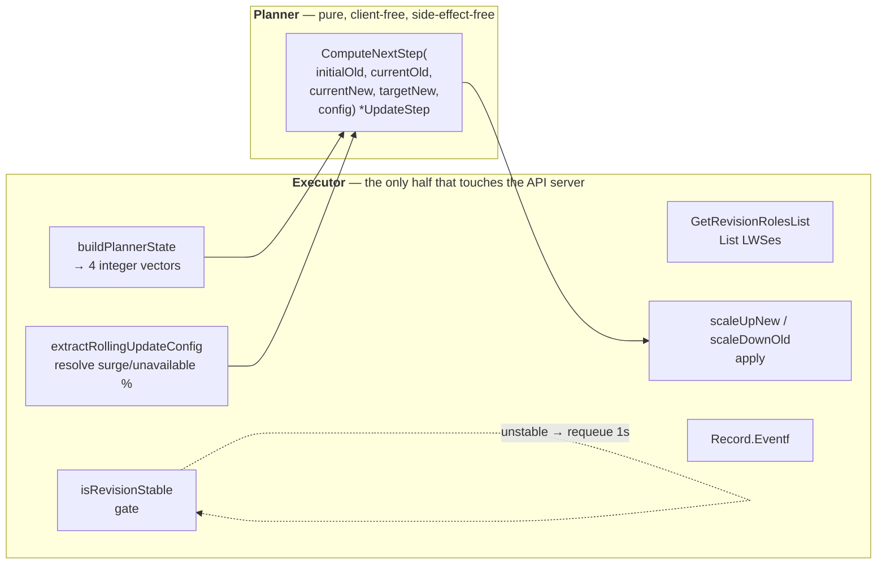

# Module 8: DisaggregatedSet

Prefill and decode are the same model doing two different jobs on two different hardware profiles ([Module 1](01_multihost_inference_problem_space.md), §1.3). Splitting them into separate pools is now standard practice in vLLM and SGLang. Orchestrating that split is a genuinely harder problem than orchestrating one pool, and `DisaggregatedSet` is the API that does it.

The hard part is not running two LeaderWorkerSets. It is **rolling them out together**. Prefill hands a KV cache to decode; the two must agree on layout, quantization, and model revision. Update all the prefill first and you have new-version prefill servers handing caches to old-version decode servers — a correctness bug, not a performance regression. And because the optimal prefill:decode ratio shifts with traffic, the two must also scale *independently* while remaining version-coupled.

This module covers **why the API exists**, **the object model**, **the planner/executor split**, **the N-dimensional rollout algorithm in full**, **slices**, **placement policy**, **per-role autoscaling**, **revision-aware Services**, **validation**, and **the status gap that is currently the best contribution opportunity in the project**.

!!! info "Provenance and maturity"
    Verified against `kubernetes-sigs/lws` at `32a9c37` (2026-08-06). DisaggregatedSet shipped in **v0.9.0** and every part of it is **alpha**. KEPs 766, 846, 848, 849. Because it is the newest and fastest-moving subsystem, it is also where a contributor has the most room — and where the KEP text and the code have already drifted apart in several places, each of which is flagged below.

---

## Part 1: Why a New API

### 1.1 The four failure modes of hand-rolling it

KEP-766's motivation is a list of what breaks when you deploy prefill and decode as two independent LeaderWorkerSets:

1. **Operational complexity** — you must manually ensure all roles update together.
2. **Rolling update coordination** — "There is no built-in mechanism to coordinate rolling updates across roles, risking service disruption if one role is updated without the others."
3. **Service lifecycle** — you must manually ensure Services "only route traffic when all roles are ready."
4. **Configuration drift** — "Without a unified resource, role configurations can drift apart."

The underlying domain fact is that sibling roles are **coupled by version**, which two independent LWSes simply cannot express.

### 1.2 Goals and non-goals

**Goals**: unified management of 2–10 roles; coordinated rolling updates via "an N-dimensional rolling update algorithm that updates all roles in lockstep, respecting per-role surge constraints"; and — the one that shapes the whole implementation — a **stateless controller** that "derives all state from observed resources, enabling safe restarts at any point."

**Non-goals**: multi-cluster federation; backends other than LWS; traffic management during rollouts. Autoscaling was originally a non-goal and was **superseded by KEP-849**.

### 1.3 The rejected alternative that explains everything

Four alternatives were considered. Three are easy — extending LWS with multi-template support (changes LWS semantics too much), Helm/Kustomize (no runtime coordination), and an external label-watching controller with no CRD (bad UX).

The fourth is the load-bearing one, and understanding why it was rejected is the key to reading the entire planner.

> **Alternative 4: use LWS `partition` instead of one LWS per revision.**

Rejected for three reasons:

1. **Revision-aware traffic routing.** "A load balancer must route requests to backends whose counterparts are on the **same revision**." With one LWS and one Service per revision, each pod's revision is explicit via the `disaggregatedset.x-k8s.io/revision` label, so a load balancer can count backends per revision *across all role pools* and split traffic proportionally. With `partition`, pods within one LWS differ only by ordinal, which makes revision-aware routing far harder.
2. **LWS as a read-only resource** — "similar to how Deployment treats ReplicaSet." A coordinated rollout wants to move roles at *different paces per step*; `partition` operates on a single LWS independently.
3. **Operational observability** — you can see `old-prefill: 2, new-prefill: 3` directly rather than inferring it from partition boundaries.

Accepted trade-offs: up to **`2 × roles × slices`** LWS objects during a rollout (pod count is unchanged), and a more complex algorithm encapsulated in the controller.

!!! tip "The one-sentence summary"
    **DisaggregatedSet treats LeaderWorkerSet the way Deployment treats ReplicaSet**: it creates a new immutable child per revision and shifts replicas from old to new. Every design decision in this module follows from that sentence.

---

## Part 2: The Object Model



### 2.1 Naming

```go
func GenerateName(baseName string, slice int, revision, role string) string {
    return fmt.Sprintf("%s-%d-%s-%s", baseName, slice, revision, role)
}
func GenerateLegacyName(baseName, revision, role string) string {
    return fmt.Sprintf("%s-%s-%s", baseName, revision, role)
}
```

| Object | Format | Example |
| :--- | :--- | :--- |
| LWS | `<ds>-<slice>-<revision>-<role>` | `my-inference-0-58f79fdb-prefill` |
| Service | `<lws name>-prv` | `my-inference-0-58f79fdb-prefill-prv` |
| Scaler | `<ds>-<role>` — **no slice, no revision** | `my-inference-prefill` |
| Legacy LWS (pre-slices) | `<ds>-<revision>-<role>` | `my-inference-58f79fdb-prefill` |

**Slice comes before revision** in the name, and that ordering is deliberate: the slice is the durable identity that maps to a placement domain and survives rollouts; the revision is ephemeral. As KEP-846 puts it, "a slice cycles through revisions, not the reverse." All controller logic keys off *labels*, never off parsed names.

The revision hash is **8 hex characters** (`revisionLength = 8`), although the site docs and KEP examples show 10-character strings like `58f79fdb78` — a cosmetic documentation inconsistency.

### 2.2 Labels

```go
map[string]string{
    "app":                                    fmt.Sprintf("%s-%d-%s", baseName, slice, role),
    "disaggregatedset.x-k8s.io/role":         role,
    "disaggregatedset.x-k8s.io/slice":        strconv.Itoa(slice),
    "disaggregatedset.x-k8s.io/name":         baseName,
    "disaggregatedset.x-k8s.io/revision":     revision,
}
```

These go on the LWS `ObjectMeta` **and both pod templates**, merged over user labels with system labels winning.

!!! warning "The `app` label is a trap"
    `app` is slice+role scoped but **revision-agnostic**. It is a convenience label for humans and must **not** be used as a Service selector — during a rollout it matches both revisions, which is exactly the cross-revision routing the design exists to prevent.

### 2.3 What defines a revision

```go
type roleTemplate struct {
    Name     string                                 `json:"name"`
    Template leaderworkersetv1.LeaderWorkerTemplate `json:"template"`
}
hash := sha256.Sum256(jsonData)
return hex.EncodeToString(hash[:])[:8]
```

**Only role name and `LeaderWorkerTemplate`.** Everything else — `slices`, `placementPolicy`, `scaling`, `replicas`, `rolloutStrategy`, `networkConfig`, `startupPolicy`, role `metadata` — is outside the hash.

This is what makes slice scaling and autoscaling free of rollouts. It is also the source of limitation §10.3 below, so keep it in mind.

---

## Part 3: Controller Architecture

### 3.1 The reconcile skeleton

```go
revision := disaggregatedsetutils.ComputeRevision(disaggregatedSet.Spec.Roles)
sliceCount := int(disaggregatedsetutils.GetSlices(disaggregatedSet))
r.cleanupRemovedSlices(ctx, disaggregatedSet, sliceCount)
seedFor, _ := r.seedForRole(ctx, disaggregatedSet)
scalers, _ := r.ScalerManager.Reconcile(ctx, disaggregatedSet, seedFor)
executor := r.createRollingUpdateExecutor()
if sliceCount > 1 { r.recreateLegacySlice0(...) }
for slice := range sliceCount { r.reconcileSlice(...) }
r.updateScalerStatus(ctx, disaggregatedSet, scalers)
```

Two properties worth noting:

- **The revision is computed once for the whole DS**, then the slice loop runs the same logic per slice. Slices can legitimately sit on different revisions mid-rollout.
- **Per-slice errors are collected**, not returned early: `errors.Join(errs...)` means one bad slice does not skip the others, and `earliestRequeue` keeps the soonest non-zero `RequeueAfter`.

`SetupWithManager` is `For(&DisaggregatedSet{}).Owns(&LeaderWorkerSet{}).Owns(&DisaggregatedSetRoleScaler{})`. The `Owns(scaler)` is the KEP-849 write path: an HPA `/scale` write bumps the scaler, which enqueues the parent DS in one controller hop.

### 3.2 The planner/executor split



The planner's entire vocabulary:

```go
type UpdateStep struct {
    Past []int   // desired old-revision replicas, per role index
    New  []int   // desired new-revision replicas, per role index
}
type RoleReplicaState = []int              // a type ALIAS, not a defined type
type RollingUpdateConfig struct { MaxSurge, MaxUnavailable int }

func ComputeNextStep(initialOld, currentOld, currentNew, targetNew RoleReplicaState,
                     config []RollingUpdateConfig) *UpdateStep    // nil == done
```

Every vector is indexed by position in `allRoleNames`. **`UpdateStep` is absolute, not deltas** — re-applying a step is idempotent, which is what makes a stateless controller safe to restart mid-rollout.

**Why the split exists.** The planner is a pure function of four integer vectors plus config, so the entire N-dimensional algorithm can be unit-tested exhaustively without envtest — `planner_test.go` is 38 KB of table tests including `TestComputeAllSteps_ExactSequence`. It also makes KEP-766's stateless-controller goal tractable: there is no in-memory rollout state machine. Every reconcile re-derives `currentOld` and `currentNew` from listed LWS objects and `initialOld` from an annotation, then asks the planner for exactly one step.

If you contribute to the rollout algorithm, **you almost certainly want to change only `planner.go` and add table tests.** That is the cheapest, safest, most reviewable kind of change in this subsystem.

---

## Part 4: The N-Dimensional Rollout

### 4.1 It does not use LWS `partition` at all

This is the most common misconception, so it is worth stating flatly.

- `partition` is **forbidden** by the DS webhook: `field.Forbidden(..., "partition is not supported by DisaggregatedSet; rolling updates are managed across roles by the DisaggregatedSet controller")`.
- The DS controller never writes `Partition` on a child LWS. `grep -rn "Partition" pkg/controllers/disaggregatedset` returns nothing.
- `maxSurge` and `maxUnavailable` from a role's `rolloutStrategy` are read **only to parameterize the DS planner**.

The mechanism is instead: **create a second LWS at the new revision hash, ratchet its `spec.replicas` up while ratcheting the old LWS's `spec.replicas` down, then delete the old LWS when all roles reach 0.** A child LWS's pod template is written once at creation and never patched, so the child's own rolling-update machinery is never exercised.

!!! bug "KEP-766 and the code disagree here"
    KEP-766 says DisaggregatedSet "does not propagate `RolloutStrategy` to the underlying LWS resources." The code **does**: `lws_manager.go` copies the whole spec (`lwsSpec := config.Spec`) and only overrides `Replicas`, so `RolloutStrategy` lands on the child verbatim. It is inert in practice — no template patch ever occurs — but the text and the code should be reconciled.

### 4.2 The ideal trajectory

The planner's package doc states the target:

$$
\text{newAtStep}(i) = \left\lceil \frac{i \cdot \text{target}}{\text{totalSteps}} \right\rceil
\qquad
\text{oldAtStep}(i) = \text{initialOld} - \left\lfloor \frac{i \cdot \text{initialOld}}{\text{totalSteps}} \right\rfloor
$$

Because the controller is stateless it never stores $i$. It **inverts** the formula from observed replica counts, then evaluates at $i+1$.

```go
func batchSize(maxSurge, maxUnavailable int) int {
    if maxSurge > 0 { return maxSurge }
    return max(1, maxUnavailable)
}

func computeTotalSteps(initialOld, target RoleReplicaState, config []RollingUpdateConfig) int {
    totalSteps := 0
    for i := 0; i < len(initialOld); i++ {
        maxReplicas := max(initialOld[i], target[i], 0)
        roleBatchSize := batchSize(config[i].MaxSurge, config[i].MaxUnavailable)
        roleSteps := (maxReplicas + roleBatchSize - 1) / roleBatchSize   // ceil-div
        totalSteps = max(totalSteps, roleSteps)
    }
    return totalSteps
}
```

**`totalSteps` is the max over roles, and that is what enforces lockstep.** The role with the most replicas — or the smallest batch — sets the clock. Smaller roles get a *fractional* trajectory that ceil/floor discretizes, so a 3-replica decode pool moves only every other step of a 6-replica prefill pool. The ratio is preserved by construction.

!!! note "`totalSteps` counts batches, not reconciles"
    KEP-766 stresses this. Its worked example has `totalSteps = 3` but takes **7 reconcile iterations**, because scale-up and scale-down are separate steps and the stability gate inserts waits.

### 4.3 Min for up, max for down

```go
// scale-up
stepIndex := func(current, targetVal int) int {
    if targetVal == 0 { return totalSteps }
    return int(float64(current) * float64(totalSteps) / float64(targetVal))   // floor
}
minStepIdx := totalSteps
for i := range target { minStepIdx = min(minStepIdx, stepIndex(currentNew[i], target[i])) }
nextStepIdx := minStepIdx + 1

computeNew := func(targetVal, currentVal int) int {
    progress := float64(nextStepIdx) * float64(targetVal) / float64(totalSteps)
    computed := min(int(math.Ceil(progress)), targetVal)
    return max(computed, currentVal)      // monotone: never shrink new
}
```

```go
// scale-down
maxStepIdx := 0
for i := range initialOld {
    if initialOld[i] == 0 { continue }
    removed := initialOld[i] - currentOld[i]
    maxStepIdx = max(maxStepIdx, stepIndex(removed, initialOld[i]))
}
computeOld := func(sourceVal, currentVal int) int {
    progress := float64(nextStepIdx) * float64(sourceVal) / float64(totalSteps)
    computed := max(0, sourceVal-int(math.Floor(progress)))
    return min(computed, currentVal)      // monotone: never grow old
}
```

**Min for up, max for down.** The asymmetry is intentional and is KEP-766's Property 2. Taking the *min* on scale-up means the **laggard role sets the step** — no role races ahead. Taking the *max* on scale-down means the old fleet drains no faster than the **most-drained** role justifies. Together they squeeze the total footprint toward the surge budget from both sides.

### 4.4 The decision cascade

```go
func ComputeNextStep(initialOld, currentOld, currentNew, targetNew RoleReplicaState,
                     config []RollingUpdateConfig) *UpdateStep {
    if isComplete(currentOld, currentNew, targetNew) { return nil }                    // (1)
    totalSteps := computeTotalSteps(initialOld, targetNew, config)
    if totalSteps == 0 { return nil }                                                  // (2)
    if step := correctAbnormalState(currentOld, currentNew, initialOld); step != nil { return step }  // (3)
    if isNewAtTarget(currentNew, targetNew) {                                          // (4)
        return &UpdateStep{Past: make([]int, len(initialOld)), New: currentNew}
    }
    nextNew := computeNextNewReplicas(targetNew, currentNew, totalSteps)
    minOld  := computeMinOld(initialOld, currentNew, targetNew, config)
    if step := tryScaleUp(...); step != nil { return step }                            // (5)
    if step := tryProportionalDrain(...); step != nil { return step }                  // (6)
    if step := tryForceDrain(...); step != nil { return step }                         // (7)
    return nil
}
```

**Each of (5), (6), (7) changes either `Past` or `New`, never both.** That is KEP-766's Property 1, "Decoupled Steps," and it is what makes each step independently observable and each failure independently diagnosable.

| Gate | What it does |
| :--- | :--- |
| **(1) `isComplete`** | Every role has `currentOld[i] == 0 && currentNew[i] >= targetNew[i]` |
| **(3) `correctAbnormalState`** | Clamps `currentOld[i]` down to `min(initialOld[i], currentOld[i])`. Handles a stale annotation or manual meddling |
| **(4) `isNewAtTarget`** | Once every role's new fleet is at target, skip the machinery and zero the entire old side in one shot |
| **(5) `tryScaleUp`** | Fires only if some `nextNew[i] > currentNew[i]` **and** `canScaleUp` holds |
| **(6) `tryProportionalDrain`** | The on-trajectory drain, floored per role by `minOld` and filtered through orphan prevention |
| **(7) `tryForceDrain`** | The unblocker, when surge budget blocks the next scale-up |

**`canScaleUp` is the surge invariant**, KEP-766 Property 4:

```go
for i := range currentOld {
    if targetNew[i] == 0 { continue }
    if currentOld[i]+nextNew[i] > targetNew[i]+config[i].MaxSurge { return false }
}
```

Checked **per role, for all roles, before any role scales up**. The surge budget is global in the vector sense: one role over budget blocks the whole step.

**`computeMinOld` is the availability invariant:**

```go
for i := range initialOld {
    if initialOld[i] >= targetNew[i] {
        minOld[i] = max(0, targetNew[i]-config[i].MaxUnavailable-currentNew[i])
    }
}
```

Keep enough old replicas that `old + new >= target - maxUnavailable`. Roles scaling *up* across revisions (`initialOld < targetNew`) get `minOld[i] = 0` — they have nothing to protect.

**`tryForceDrain` is the deadlock breaker.** When surge blocks the next scale-up, drain old down to exactly what the surge budget requires:

```go
maxOld := targetNew[i] + config[i].MaxSurge - nextNew[i]
drainedOld[i] = max(0, min(currentOld[i], maxOld))
if initialOld[i] >= targetNew[i] {
    minOldForRole := max(0, targetNew[i]-config[i].MaxUnavailable-nextNew[i])
    drainedOld[i] = max(drainedOld[i], minOldForRole)
}
```

It computes against `nextNew`, not `currentNew`, so it drains *just enough* to admit the next scale-up. It is deliberately off-trajectory — the KEP says "force-drain bypasses the step-index machinery."

### 4.5 Orphan prevention

This is the safety net that makes the whole thing correct rather than merely convergent.

```go
func applyOrphanPrevention(nextOld, currentNew, initialOld, target RoleReplicaState,
                           config []RollingUpdateConfig) {
    anyDrainsToZero, allDrainToZero := false, true
    for i := range nextOld {
        if initialOld[i] == 0 { continue }
        if nextOld[i] == 0 { anyDrainsToZero = true } else { allDrainToZero = false }
    }
    if !anyDrainsToZero || allDrainToZero { return }
    if canDrainAllToZero(currentNew, initialOld, target, config) {
        for i := range nextOld { nextOld[i] = 0 }        // all-or-nothing: finish the drain
        return
    }
    for i := range nextOld {
        if nextOld[i] == 0 && initialOld[i] > 0 { nextOld[i] = 1 }   // hold one back
    }
}
```

KEP-766's Property 3 is "if any role reaches 0 replicas, all roles are forced to 0," and the implementation makes it two-sided:

- If the **new** fleet can already absorb the load (`canDrainAllToZero`), zero out the entire old revision at once.
- Otherwise **refuse to let any role hit 0**, and pin it at 1.

Without this, a rollout could leave an old revision with 0 prefill and 3 decode — a revision that can serve nothing but still occupies GPUs. Given the cost of an 8-GPU decode group, that is not a theoretical concern.

The executor has a twin of this in `scaleDownOld`: if *any* role of an old revision would reach 0, **all** roles of that revision are zeroed in the same pass, and the extra pods zeroed by the coordination are not charged against the drain budget.

### 4.6 The `initial-replicas` annotation

`disaggregatedset.x-k8s.io/initial-replicas` exists because the planner needs `initialOld` — the old revision's replica count **at rollout start** — as the denominator of the drain interpolation. In a stateless controller the only durable place to keep it is the object itself, and `spec.replicas` mutates as the rollout progresses.

| | Behaviour |
| :--- | :--- |
| **Written** | Exactly once, in `initRollingUpdate`, **before** any new-revision LWS is created. Addressed by the LWS's *actual* name so a legacy slice-0 object is updated rather than missed |
| **Then** | New-revision LWSes are created at **0 replicas** and the reconcile returns `RequeueAfter: 1s` |
| **Read** | `GetTotalInitialReplicasPerRole` sums it across old revisions, falling back to `spec.replicas` (or 1) when absent |
| **Overwrite** | Logs `"WARNING: Overwriting initial-replicas annotation with different value"`; a no-op if unchanged |

!!! bug "Write failures are swallowed"
    `initRollingUpdate` only `log.Error`s a failed annotation patch. A failed write silently degrades that role's drain baseline to `spec.Replicas`, which is the *current* count rather than the *initial* count — producing a subtly wrong drain trajectory with no error surfaced. Propagating this error is a small, well-scoped fix.

### 4.7 The stability gate and teardown

Two distinct gates, both in the executor.

**Per-step**, `isRevisionStable`:

```go
for _, name := range roleNames {
    lws := rev.Roles[name]
    if lws == nil { return false }
    if getLWSReplicas(lws) != lws.Status.ReadyReplicas { return false }
}
```

Called on the **new** revision only. If unstable, the reconcile returns `RequeueAfter: 1s` without touching anything. This is KEP-766's Property 6.

Note the strictness: `Spec.Replicas != Status.ReadyReplicas` blocks even when readiness *exceeds* the target, and it never looks at the old revision's readiness at all.

**Revision teardown** happens separately, in `cleanupDrainedLWS` at the *top* of the next `reconcileSlice`. It groups non-target-revision LWSes by revision and deletes a revision's objects only when **every** role in that group has `spec.replicas == 0`. It also logs `"WARNING: multiple LWS found for same role and revision"` on a key collision — a state the code detects but does not resolve.

### 4.8 Role changes mid-rollout

`detectRoleChanges` diffs spec roles against roles present in old revisions. Removed roles **keep an index** in the planner vectors so their old replicas drain, but `buildPlannerState` leaves their `currentNew`/`targetNew` at 0 and `scaleUpNew` skips them. Since role names are mutable (§9), a rename is handled as remove-plus-add.

---

## Part 5: Slices (KEP-846)

### 5.1 What a slice is

```go
// +kubebuilder:default=1
// +kubebuilder:validation:Minimum=1
// +kubebuilder:validation:Maximum=100
Slices *int32 `json:"slices,omitempty"`
```

"The number of independent copies of the whole role topology. Each slice is a complete set of all roles that rolls out independently."

Per-role `spec.replicas` is **per-slice**, so total groups for a role is `replicas × slices`.

The mental model from KEP-846: "A slice is the durable, outer identity; a revision is ephemeral. Within a slice, normally one revision is live, and two coexist transiently while that slice rolls."

### 5.2 Why the planner is unchanged

`Reconcile` computes the revision once, then loops `for slice := range sliceCount { r.reconcileSlice(...) }`. Everything inside is slice-scoped. **Running the same N-dimensional algorithm once per slice yields per-slice independent rollouts for free** — the planner did not have to change at all.

Slice filtering is **client-side**, because "slice label == 0 OR absent" is not expressible as a label selector:

```go
func SliceLabelMatches(labels map[string]string, slice int) bool {
    if slice < 0 { return true }                 // -1 == all slices
    value, ok := labels[SliceLabelKey]
    if !ok || value == "" { return slice == 0 }  // legacy object → slice 0
    return value == strconv.Itoa(slice)
}
```

### 5.3 Scaling slices does not roll

Because `slices` is outside `ComputeRevision`, changing `slices: 2 → 3` changes no revision. The slice loop simply reaches index 2, finds no LWS, and takes the `reconcileSimple` path, creating slice 2 at the current revision.

Scale-down (`cleanupRemovedSlices`) is a plain delete of every LWS whose `slice` label is `>= desiredSlices`, plus the corresponding Services. KEP-846 justifies the absence of an orchestrated drain: "Slice removal has no cross-slice invariant to protect (slices are independent), so it is a plain scale operation."

### 5.4 Legacy slice-0 migration

Slices were added after the initial DisaggregatedSet release, so there is a compat layer, explicitly tagged for removal:

```go
// TODO(0.11.0): remove legacy slice-0 handling once pre-slices DisaggregatedSets are no
// longer supported. The related legacy-compat code to remove with it: GenerateLegacyName,
// GetForRole's legacy-name fallback, DeleteLegacyService, and the label-less branch in
// SliceLabelMatches.
```

Three behaviours:

1. **Adoption in place.** `GetForRole` tries the slice-aware name and, for `slice == 0` only, falls back to `GenerateLegacyName`. A plain upgrade recreates nothing.
2. **Migration on next rollout** — free. The new revision's slice-0 LWS is created slice-aware, the legacy LWS drains through the normal rolling update, and Services are revision-scoped so they never cross-select.
3. **Migration when `slices` rises above 1** — `recreateLegacySlice0`, called *before* the slice loop. The problem: the legacy Service's selector is `{name, role, revision}` with **no slice key**, so a new slice-1 pod at the same revision is a superset match and gets selected by slice 0's Service. The fix deletes the legacy Service **first**, then the legacy LWS. This restarts slice 0 once — an accepted trade against an in-place migration.

That TODO block is a well-scoped future contribution with the removal set already enumerated for you.

---

## Part 6: Placement Policy (KEP-848)

```go
type PlacementPolicy struct {
    Type     PlacementType `json:"type,omitempty"`     // None | ExclusiveSlice | ExclusiveTopology
    Topology string        `json:"topology,omitempty"` // node-label key → affinity topologyKey
}
```

| Type | Guarantee |
| :--- | :--- |
| `None` (default) | No affinity injected |
| `ExclusiveSlice` | A slice's roles are co-located in one domain, and this DS's slices are spread across domains. **Other DisaggregatedSets may share a domain** |
| `ExclusiveTopology` | `ExclusiveSlice` plus domain exclusivity: a domain holds at most one slice **across all DisaggregatedSets** — a 1:1 domain-to-slice mapping |

Injection is at **LWS creation only**, in `LeaderWorkerSetManager.Create`, into both pod templates. There is no mutating webhook; KEP-848 rejected one because "the DisaggregatedSet controller already constructs and mutates the LeaderWorkerSet pod templates." Existing affinity is deep-copied and terms are **appended**, never replaced.

### 6.1 `ExclusiveSlice` — two terms

**Term 1, podAffinity** — co-locate the slice's roles:

```go
{Key: "disaggregatedset.x-k8s.io/name",  Operator: In, Values: [dsName]},
{Key: "disaggregatedset.x-k8s.io/slice", Operator: In, Values: [strconv.Itoa(slice)]},
```

Self-referential, so the first pod of a slice is unpinned (a required podAffinity with no matching pods is satisfied) and later pods are drawn to it.

**Term 2, podAntiAffinity** — spread this DS's slices:

```go
spreadExprs := []metav1.LabelSelectorRequirement{
    {Key: SetNameLabelKey, Operator: In, Values: []string{dsName}},
}
if slice == 0 {
    spreadExprs = append(spreadExprs,
        metav1.LabelSelectorRequirement{Key: SliceLabelKey, Operator: metav1.LabelSelectorOpExists})
}
spreadExprs = append(spreadExprs,
    metav1.LabelSelectorRequirement{Key: SliceLabelKey, Operator: metav1.LabelSelectorOpNotIn,
                                    Values: []string{sliceStr}})
```

!!! tip "The `slice == 0` special case is the subtlest code in the subsystem"
    Kubernetes label selectors treat `NotIn` as **also matching objects missing the key entirely**. For slices ≠ 0 that is exactly right: a pre-slices, label-less pod is semantically slice 0 — a *different* slice — and should repel.

    But for slice 0 itself, the label-less legacy pod is the *same* slice. Without the extra `Exists` requirement, "a slice-0 pod with placement enabled is repelled by its own legacy predecessor and never schedules during upgrade."

    If you ever touch selector construction here, read the comment at `affinity.go:74-80` first.

### 6.2 `ExclusiveTopology` — a third term

```go
{Key: SetNameLabelKey, Operator: Exists},
{Key: SetNameLabelKey, Operator: NotIn, Values: []string{dsName}},
{Key: SliceLabelKey,   Operator: Exists},
```

The redundant-looking `name Exists` alongside `name NotIn [ds]` is deliberate, for the same reason: `NotIn` alone would also match pods with **no** name label — every unrelated workload in the cluster — turning `ExclusiveTopology` into "exclusive against everything." The `Exists` pairs scope the exclusion to DisaggregatedSet-managed pods.

Since required podAntiAffinity terms are ANDed, terms 2 and 3 together mean the domain is free of *any* other slice, same-DS or not.

### 6.3 Lazy application, and the LWS conflict

`placementPolicy` is outside `ComputeRevision`, and the controller deliberately does **not** patch existing LWSes. KEP-848: "mutating a running LeaderWorkerSet's pod template would itself force an LWS-level rolling update, turning a placement tweak into an implicit, uncoordinated restart of every slice at once."

So new slices get the policy immediately; existing slices pick it up on their next rollout.

The webhook rejects a non-`None` policy combined with LWS's own exclusive-topology annotations, checked in **three** places per role — the role's `metadata.annotations`, the leader template's, and the worker template's — because the LWS pod webhook reads them from the pod. The rationale: LWS exclusivity is *group*-granular ("one leader-worker group per domain"), DS placement is *slice*-granular; both at the same topology level means "the slice never schedules."

!!! warning "Hard-only placement can wedge a slice"
    All terms are `RequiredDuringSchedulingIgnoredDuringExecution`. KEP-848's own Risks section notes that without whole-slice look-ahead, a slice's first pod can land in a domain lacking room for the rest, pinning the remainder Pending forever. There is no soft/`Preferred` variant, and gang scheduling for DisaggregatedSet is deferred. This is the same failure mode as [Module 7](07_scheduling_placement_and_networking.md), §2.3, one level up.

---

## Part 7: Per-Role Autoscaling (KEP-849)

Autoscaling was a KEP-766 non-goal, superseded by KEP-849. The design problem is that a `DisaggregatedSet` has N roles that each need independent scaling, but the `/scale` subresource can only target one field per object. The answer is a **separate CR per role**.

### 7.1 The scaler CR

```go
// +kubebuilder:subresource:scale:specpath=.spec.replicas,statuspath=.status.replicas,selectorpath=.status.selector
// +kubebuilder:resource:shortName=dsrs

type DisaggregatedSetRoleScalerSpec struct {
    // +kubebuilder:default=0
    // +kubebuilder:validation:Minimum=0
    Replicas int32 `json:"replicas"`
}
```

!!! note "The non-pointer with a default is load-bearing"
    The comment in the source spells out why: "kube-apiserver's CRD `/scale` handler extracts `.spec.replicas` at read time and errors (`the spec replicas field does not exist`) when the JSONPath resolves to nothing. HPA reads `/scale` before its first write; a missing field would deadlock the loop."

    KEP-849's draft API had `Replicas *int32` with `omitempty`. The implementation deliberately diverged, and the reason is worth knowing before you "fix" it to match Kubernetes convention.

### 7.2 Lifecycle

`ScalerManager.Reconcile` runs **before** any LWS work, so replica resolution downstream sees a settled scaler map:

1. Build the set of roles with `scaling.mode: External`.
2. List all scalers in the namespace labelled with this DS's name.
3. For each: skip unless controlled by this DS; if its role is no longer External, **delete it** (`ScalerDeleted`); otherwise record it.
4. For each External role with no scaler, create one.

One pass handles both External→Static teardown and Static→External creation. On `IsAlreadyExists`, if the existing object is not controlled by this DS, it emits a **Warning** `ScalerConflict` and returns without adopting — it refuses to take over a hand-created object.

### 7.3 Seeding, and the two deadlocks it avoids

```go
// seedForRole
if !seen[role] { return 1 }      // fresh role
return sums[role]                 // aggregate current LWS replicas across all slices
```

| Case | Seed | Why |
| :--- | :--- | :--- |
| Fresh role, no LWS yet | **1**, not 0 | "HPA parks in `ScalingDisabled` when it reads current=0 from `/scale`, regardless of `minReplicas`, unless the `HPAScaleToZero` feature gate is enabled" |
| Static→External flip on a running role | Current aggregate LWS replica count | So the flip "does not drain to zero" |

Autoscalers that support scale-from-zero (KEDA, or HPA with the gate) can still take the role to 0 after attaching.

### 7.4 Replica resolution and the no-shrink guard

```go
func getTargetReplicas(ds, roleName, scalers, currentNew int) int {
    for _, p := range ds.Spec.Roles {
        if p.Name != roleName { continue }
        if p.Scaling != nil && p.Scaling.Mode == RoleScalingExternal {
            if s := scalers[roleName]; s != nil { return int(s.Spec.Replicas) }
            return currentNew                     // no scaler → hold current
        }
        if p.Spec.Replicas == nil { return 1 }
        return int(*p.Spec.Replicas)
    }
    return 1
}
```

And in `buildPlannerState`:

```go
// No-shrink guard: an External role mid-rollout must not shrink the new-revision
// fleet if HPA writes a smaller value while the old revision is still draining.
if isExternal(ds, roleName) && len(oldRevisions) > 0 && targetNew[i] < currentNew[i] {
    targetNew[i] = currentNew[i]
}
```

`len(oldRevisions) > 0` is the release condition: once the old revision is gone, the target tracks the scaler exactly. The steady-state path has no such guard, correctly — no rollout is in flight.

### 7.5 The leader-only selector, and why

```go
desired.Status.Selector = fmt.Sprintf("%s=%s,%s=%s,%s=0",
    SetNameLabelKey, ds.Name, RoleLabelKey, role, leaderworkersetv1.WorkerIndexLabelKey)
```

Producing:

```
disaggregatedset.x-k8s.io/name=<ds>,disaggregatedset.x-k8s.io/role=<role>,leaderworkerset.sigs.k8s.io/worker-index=0
```

The **unit-consistency argument** is the same one from [Module 2](02_api_surface_anatomy.md), §4, and it is worth being able to reproduce: HPA divides its per-pod metric sum by the count of pods matching `status.selector`, and that divisor must equal `status.replicas`. Since `spec.replicas` (which HPA writes) and `status.replicas` (which HPA reads) are both **LWS groups**, the selector must match exactly **one pod per group** — the leader. Otherwise, with `size: 4`, HPA would divide by `4 × groups` while comparing against `groups`, and the ratio would be wrong by a factor of 4.

The selector is revision-**agnostic**, so HPA observes the whole serving fleet during a rollout.

`status.replicas` is aggregated across **all slices and all revisions** by summing each child LWS's `Status.Replicas` (which is its group count).

### 7.6 The pitfalls the code documents

This list is unusually valuable, because each item is a bug someone already hit:

| | Pitfall | Mitigation |
| :--- | :--- | :--- |
| 1 | `current=0` puts HPA in `ScalingDisabled` regardless of `minReplicas` | Seed 1 |
| 2 | A missing `.spec.replicas` field makes the apiserver `/scale` handler error | Non-pointer + `default=0` |
| 3 | Static→External silently drains the role | Seed from current aggregate |
| 4 | HPA scaling down mid-rollout flip-flops the target | No-shrink guard |
| 5 | Group-count vs pod-count divisor mismatch | Leader-only selector |
| 6 | **CEL defaulting trap** — `LeaderWorkerSetSpec.Replicas` has `+kubebuilder:default=1`, and defaulting runs *before* CEL, so a rule forbidding `replicas > 0` on External roles "would reject every External role" | Emit a **warning** for `> 1`, and scope the all-or-nothing CEL rule to non-External roles |
| 7 | Deleting the scaler does not opt out — the controller recreates it | Flip `scaling.mode` back to `Static` |
| 8 | Mixed-revision metric baseline during a rollout | Documented as a drawback |

Pitfall 6 is the most instructive. It is a genuine Kubernetes API design constraint — CRD structural defaulting runs before CEL validation — and the workaround (warn instead of reject, and scope the CEL rule with `filter`) is a pattern worth remembering for any API PR.

---

## Part 8: Services and Revision-Aware Routing

`ReconcileServices` finds the `RevisionRoles` group matching the target revision and **bails out entirely** unless every role has at least one ready replica:

```go
func revisionReadyOnAllRoles(group RevisionRoles, roleNames []string) bool {
    for _, roleName := range roleNames {
        lws, hasRole := group.Roles[roleName]
        if !hasRole || lws.Status.ReadyReplicas < 1 { return false }
    }
    return true
}
```

That is KEP-766's "Services must not route traffic until all roles are ready," implemented as a precondition on Service *creation*.

```go
selector := map[string]string{
    SetNameLabelKey:  ds.Name,
    RoleLabelKey:     lws.Labels[RoleLabelKey],
    RevisionLabelKey: lws.Labels[RevisionLabelKey],
}
if HasSliceLabel(lws.Labels) { selector[SliceLabelKey] = lws.Labels[SliceLabelKey] }
// Name: lws.Name + "-prv"; ClusterIP: None; owner: the DisaggregatedSet
```

One headless Service per `(slice, revision, role)`. **This is the payoff for Alternative 4.** Because each Service is revision-scoped, a prefill pod at revision `r` resolves *only* decode pods at revision `r` in the same slice. During a rollout both `…-<oldrev>-decode-prv` and `…-<newrev>-decode-prv` exist, and an external load balancer can count backends per revision across role pools and split traffic proportionally.

The Service name derives from the **observed** LWS name, so a legacy slice-0 LWS yields a legacy `-prv` name automatically.

!!! bug "Services are create-only and never repaired"
    `ensureService` calls `Create` and treats `IsAlreadyExists` as success. A Service whose selector has drifted — hand-edited, or left over from an older controller version — is **never reconciled back**. Combined with the controller not watching Services at all (`Owns(&LeaderWorkerSet{})` and `Owns(&scaler)` only), a manually deleted Service is recreated only on the next DS-triggered reconcile.

    Adding `Owns(&corev1.Service{})` plus a spec-diff-and-patch in `ensureService` is a contained, clearly-motivated PR.

Cleanup: `cleanupDrainedServices` builds the set of revisions ready on all roles, force-adds the target revision, and deletes any Service whose revision label is not in the set. `DeleteLegacyService` exists separately because "the legacy Service shares the target revision, so per-revision drained cleanup never removes it."

---

## Part 9: Validation

The webhook is **validating only** — `SetupDisaggregatedSetWebhook` registers `WithValidator` and no `WithDefaulter`, unlike the LWS and pod webhooks. All DisaggregatedSet defaulting is declarative CRD defaulting:

| Field | Default |
| :--- | :--- |
| `spec.slices` | `1` |
| `spec.placementPolicy.type` | `None` (only when the sub-struct is present) |
| `spec.roles[].scaling.mode` | `Static` (only when `scaling` is present) |
| `spec.roles[].spec.replicas` | `1` (inherited from `LeaderWorkerSetSpec`) |
| `DisaggregatedSetRoleScaler.spec.replicas` | `0` |

Because the `scaling` sub-struct is not materialised when omitted, **`Scaling == nil` and `Scaling.Mode == Static` must be treated identically** — every call site does.

### 9.1 What is rejected

| Rule | Reason |
| :--- | :--- |
| `rolloutStrategy.type` other than `RollingUpdate` or `""` | `Recreate` would break the cross-role same-version invariant |
| `rollingUpdateConfiguration.partition != 0` | The DS owns the rollout; a per-LWS partition would be a second, uncoordinated driver |
| `maxSurge == 0 && maxUnavailable == 0` with `replicas > 0` | Mirrors the LWS check. Roles with `replicas == 0` are exempt — "an all-zero DisaggregatedSet is legitimate" |
| `spec.slices > 1` with any External role | Tagged `// Alpha:` — "the scaler design for multi-slice is deferred to a follow-up KEP" (issue #948) |
| Non-`None` `placementPolicy` with empty `topology` | |
| Non-`None` `placementPolicy` + an LWS exclusive-topology annotation | §6.3 |
| `len(dsName + "-" + roleName) > 253` for External roles | The scaler name must be a valid object name. With roles capped at 63, this leaves 189 characters for the DS name |

Plus one **warning**, not an error: an External role with `spec.replicas > 1` gets "`spec.replicas` is ignored; drive replicas via `DisaggregatedSetRoleScaler`."

### 9.2 The all-or-nothing CEL rule

```
self.roles.filter(r, !has(r.scaling) || r.scaling.mode != 'External')
          .all(r, !has(r.spec.replicas) || r.spec.replicas == 0)
||
self.roles.filter(r, !has(r.scaling) || r.scaling.mode != 'External')
          .all(r, has(r.spec.replicas) && r.spec.replicas > 0)
```

You may have a fully-scaled-down DisaggregatedSet or a fully-scaled-up one, but **not a half-and-half one** — which would be a revision that cannot serve. The `filter(...)` prefix is the KEP-849 change exempting External roles, "because their effective replicas live outside the DS spec."

Role uniqueness is enforced by `+listType=map +listMapKey=name` rather than a CEL rule — KEP-766's proposed `filter(s, s.name == r.name).size() == 1` was replaced by the more efficient listMap declaration. Role names are RFC 1123 labels, 2–10 roles, `slices` 1–100.

!!! warning "There is no immutability validation at all"
    `ValidateUpdate` does exactly what `ValidateCreate` does. There are no `ValidateImmutableField` calls and `oldDisagg` is an unused parameter. Contrast with the LWS webhook, which pins `subGroupSize`.

    Notably **role names are mutable**, which the controller handles by treating a rename as remove-plus-add — the old role's LWSes drain, the new role's are created. That is arguably correct behaviour, but it is emergent rather than designed, and nothing in the API tells a user that renaming a role will recreate its entire fleet.

---

## Part 10: The Status Gap

**This is the single best contribution opportunity in the project right now.**

The API declares a complete status:

```go
type RoleStatus struct {
    Name            string `json:"name"`
    Replicas        int32  `json:"replicas,omitempty"`
    ReadyReplicas   int32  `json:"readyReplicas,omitempty"`
    UpdatedReplicas int32  `json:"updatedReplicas,omitempty"`
}
type DisaggregatedSetStatus struct {
    RoleStatuses []RoleStatus       `json:"roleStatuses,omitempty"`
    Conditions   []metav1.Condition `json:"conditions,omitempty"`
}
```

with doc comments naming the intended condition types — `Available`, `Progressing`, `Degraded`. The CRD has `+kubebuilder:subresource:status`. RBAC for `disaggregatedsets/status` with `get;update;patch` is already granted.

**Nothing writes it.** There is no `Status().Update` or `Status().Patch` on a `DisaggregatedSet` anywhere in the controller. `grep -rn "RoleStatuses"` outside the generated deepcopy matches only the type declaration. `Reconcile` ends with `return result, errors.Join(errs...)` — no status pass at all. The only status writeback in the subsystem is `ScalerManager.WriteStatus`, which writes the *scaler's* status.

The consequences are user-visible:

- `kubectl describe disaggregatedset` — which the upstream examples page explicitly tells users to run to "Check the DisaggregatedSet overall status" — shows an empty status. The docs then immediately pivot to "check the status of child LWSes by label," which is the actual working workflow.
- There are **no printcolumns** on `DisaggregatedSet`, so `kubectl get disaggregatedset` shows only NAME and AGE. (`DisaggregatedSetRoleScaler` does have `Desired`/`Current`/`Age`.)

Everything needed to compute it is **already gathered every reconcile**. `LWSManager.List(ctx, ns, name, -1, "")` returns every child, each carrying `Status.Replicas`, `Status.ReadyReplicas`, `Status.UpdatedReplicas`, and the revision label. A `RoleStatus` is a sum grouped by role label, with `UpdatedReplicas` filtered to the target revision. The conditions map naturally:

| Condition | Derivation |
| :--- | :--- |
| `Progressing` | Any slice has `len(oldRevisions) > 0` |
| `Available` | `revisionReadyOnAllRoles` across all slices at the target revision |
| `Degraded` | Accumulated `errs` |

Every readiness decision in the subsystem today reads child LWS status directly — `isRevisionStable`, `revisionReadyOnAllRoles`, `updateScalerStatus`, `cleanupDrainedLWS` — so the aggregation logic is well-precedented.

Also missing against KEP-766's Beta criterion "metrics for observability": **there are no Prometheus metrics for the DisaggregatedSet subsystem at all.** KEP-846 wants per-slice rollout state metrics and KEP-849 wants a `WaitingForScaler` count. That is a second, larger contribution with clear KEP backing.

### 10.1 Other known gaps

Beyond status and metrics, collected from code comments and KEP-versus-code comparison:

| | Gap |
| :--- | :--- |
| **Non-template spec changes are silently dropped** | `ComputeRevision` hashes only role name + `LeaderWorkerTemplate`. Changing a role's `networkConfig`, `startupPolicy`, `rolloutStrategy`, or `metadata` produces the same hash — so no new LWS is created and the existing one is never patched (`reconcileRoleSimple` only calls `Scale`). The edit is dropped until an unrelated template change forces a new revision. **This is the sharpest user-visible bug in the subsystem.** |
| No controller integration tests | `test/integration/` has `webhooks/disaggregatedset_test.go`, but `test/integration/controllers/` contains only `leaderworkerset_test.go`. Coverage is unit tests plus e2e |
| Float arithmetic in the planner | `int(float64(a) * float64(b) / float64(c))` truncation, where integer math would be exactly equivalent and immune to FP edge cases |
| `extractRollingUpdateConfig` asymmetry | When `unavail > 0` it sets both fields; when only `surge > 0` it sets only surge. If both resolve to 0 the role silently reverts to `MaxSurge=1` |
| Redundant listing | `updateScalerStatus` and `seedForRole` each issue a full cross-slice `List` on top of the per-slice lists. Cache-backed, but wasteful at 100 slices |
| Dead code | `NumRequiredRoles` (zero references), `ComputeInitialReplicaState` (tests only), the free `SetInitialReplicas`, `ServiceManager.scheme`, `sortByNewestTimestamp`'s `roleNames` parameter, `ValidateUpdate`'s `oldDisagg` parameter |

Pick from that table by appetite: dead-code removal and the float-to-integer conversion are afternoon PRs; status aggregation is a week and needs a design discussion; the non-template-spec-change bug probably needs an issue first, because the fix has design choices in it.

---

## Lab: Drive a Coordinated Rollout

!!! warning "Scale"
    Part A runs on `kind` with a trivial container — the planner is completely orthogonal to accelerators, and a fast-starting image makes the step sequence observable. Parts B and C need a real cluster with topology labels and metrics; they are marked unverified.

### Part A — Watch the N-dimensional algorithm

Deploy a two-role DisaggregatedSet with deliberately asymmetric replica counts, so the ratio preservation is visible:

```yaml
apiVersion: disaggregatedset.x-k8s.io/v1
kind: DisaggregatedSet
metadata:
  name: pd
spec:
  slices: 1
  roles:
    - name: prefill
      spec:
        replicas: 6
        leaderWorkerTemplate:
          size: 1
          workerTemplate: { spec: { containers: [{ name: c, image: nginxinc/nginx-unprivileged:1.27 }] } }
        rolloutStrategy:
          rollingUpdateConfiguration: { maxSurge: 2, maxUnavailable: 0 }
    - name: decode
      spec:
        replicas: 3
        leaderWorkerTemplate:
          size: 1
          workerTemplate: { spec: { containers: [{ name: c, image: nginxinc/nginx-unprivileged:1.27 }] } }
        rolloutStrategy:
          rollingUpdateConfiguration: { maxSurge: 1, maxUnavailable: 0 }
```

Before triggering anything, compute `totalSteps` by hand from §4.2:

- prefill: `max(6, 6) = 6`, batch = `maxSurge` = 2 → `ceil(6/2)` = **3** steps
- decode: `max(3, 3) = 3`, batch = 1 → `ceil(3/1)` = **3** steps
- `totalSteps = max(3, 3) = 3`

Now watch, in one terminal:

```bash
watch -n1 'kubectl get lws -L disaggregatedset.x-k8s.io/role,disaggregatedset.x-k8s.io/revision,disaggregatedset.x-k8s.io/slice'
```

and trigger a rollout in another by changing the image on **both** roles. Record the `(prefill_old, prefill_new, decode_old, decode_new)` vector at each transition and check three claims:

1. **Ratio preservation** — the ratio of serving prefill to serving decode never departs far from 2:1.
2. **Decoupled steps** — every transition changes either the old side or the new side, never both (§4.4, Property 1).
3. **The surge invariant** — `old + new <= target + maxSurge` holds per role at every point (§4.4, `canScaleUp`).

### Part A2 — Find the `initial-replicas` annotation

At the very start of the rollout:

```bash
kubectl get lws -o custom-columns=\
'NAME:.metadata.name,REPLICAS:.spec.replicas,INITIAL:.metadata.annotations.disaggregatedset\.x-k8s\.io/initial-replicas'
```

The old LWSes should carry `initial-replicas` matching their pre-rollout counts, and the new ones should have been created at **0 replicas**. Reason through §4.6: why can the planner not simply use the old LWS's current `spec.replicas` as the drain denominator?

### Part A3 — Prove orphan prevention

Force the interesting branch. Set `maxUnavailable: 0` on both roles (as above) so `canDrainAllToZero` is hard to satisfy, then start a rollout and kill the new-revision prefill pods repeatedly so the new fleet cannot absorb the load:

```bash
kubectl delete pod -l disaggregatedset.x-k8s.io/role=prefill,disaggregatedset.x-k8s.io/revision=<newrev>
```

The old revision should **never** drop either role to 0 while the other is non-zero. If you can produce a state with `old-prefill: 0, old-decode: 2`, you have found a real bug — write it up.

### Part A4 — Reproduce the non-template-spec-change bug

This is §10.1's first row, and reproducing it gives you a complete issue report:

```bash
kubectl get lws -o jsonpath='{.items[*].metadata.labels.disaggregatedset\.x-k8s\.io/revision}'; echo
# Change something outside LeaderWorkerTemplate:
kubectl patch disaggregatedset pd --type=json \
  -p '[{"op":"add","path":"/spec/roles/0/spec/startupPolicy","value":"LeaderReady"}]'
sleep 10
kubectl get lws -o jsonpath='{.items[*].metadata.labels.disaggregatedset\.x-k8s\.io/revision}'; echo
kubectl get lws <prefill-lws> -o jsonpath='{.spec.startupPolicy}'; echo
```

The revision is unchanged and the child LWS still has the **old** `startupPolicy`. Your edit was accepted by the API server and silently dropped. Now change the image too, and watch both changes land at once.

### Part B — Slices and placement (unverified, needs 2+ topology domains)

```bash
kubectl label node <n1> <n2> topology.example.com/zone=z1
kubectl label node <n3> <n4> topology.example.com/zone=z2
```

Set `slices: 2` with:

```yaml
placementPolicy:
  type: ExclusiveSlice
  topology: topology.example.com/zone
```

Verify:

- Four LWSes, named `pd-0-<rev>-prefill`, `pd-0-<rev>-decode`, `pd-1-<rev>-…`.
- Slice 0's pods are all in one zone, slice 1's in the other.
- `kubectl get pod <slice-0-pod> -o jsonpath='{.spec.affinity}' | jq` shows **two** terms for `ExclusiveSlice`, and the slice-0 anti-affinity carries the extra `slice Exists` requirement from §6.1.

Then switch to `ExclusiveTopology` and confirm a **third** anti-affinity term appears. Note that the existing slices keep their old affinity — §6.3's lazy application — and you must trigger a rollout to propagate it. Confirm that too.

Finally, roll one slice and confirm the other is unaffected: slices roll independently, and they can sit on different revisions.

### Part C — Per-role HPA (unverified, needs metrics-server)

```bash
kubectl patch disaggregatedset pd --type=json \
  -p '[{"op":"add","path":"/spec/roles/0/scaling","value":{"mode":"External"}}]'
kubectl get dsrs
```

Verify against §7:

- A scaler named `pd-prefill` exists, owned by the DisaggregatedSet.
- Its `spec.replicas` was **seeded from the current aggregate**, not 0 (§7.3).
- `kubectl get --raw "/apis/disaggregatedset.x-k8s.io/v1/namespaces/default/disaggregatedsetrolescalers/pd-prefill/scale"` returns a valid Scale object *before* anything writes to it. That is pitfall 2.
- `status.selector` ends in `worker-index=0`.

Now count the pods the selector matches versus `status.replicas`:

```bash
SEL=$(kubectl get dsrs pd-prefill -o jsonpath='{.status.selector}')
kubectl get pods -l "$SEL" --no-headers | wc -l
kubectl get dsrs pd-prefill -o jsonpath='{.status.replicas}'; echo
```

They must be equal. Set `size: 4` on the prefill role and confirm they *stay* equal — that is the entire argument in §7.5, demonstrated.

Then attach an HPA and trigger a rollout while it is actively scaling. Watch the no-shrink guard (§7.4) hold the new-revision fleet steady even if HPA writes a smaller value, and confirm it releases the moment the old revision is gone.

### Checkpoint questions

- `totalSteps` is the max over roles. Construct a two-role configuration where taking the *min* instead would break the capacity ratio, and say by how much.
- Scale-up takes `min(stepIndex)` and scale-down takes `max(stepIndex)`. Swap them and describe the resulting failure — which invariant breaks first, surge or availability?
- The slice-0 anti-affinity has an extra `slice Exists` term. Write out the exact upgrade scenario that fails without it, naming which pod repels which.
- The DisaggregatedSet status is never written. Sketch the `updateStatus` function you would add: what does it list, what does it group by, and where in `Reconcile` does it go?

Continue to [Module 9: Inference Engine Integration](09_inference_engine_integration.md).
