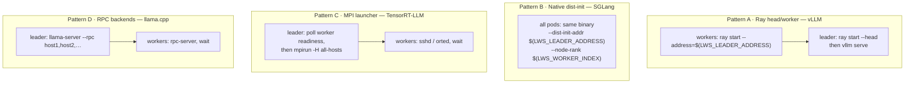
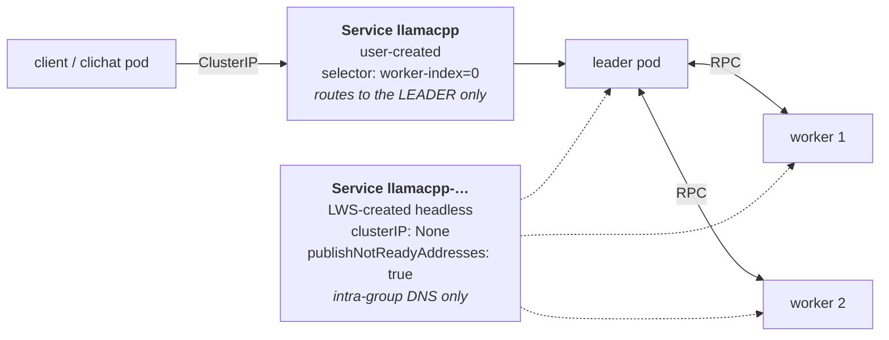
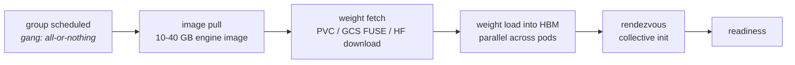

# Module 9: Inference Engine Integration

LWS does not know what an LLM is. It creates pods, gives them names, injects three environment variables, and makes sure they can resolve each other. Everything that makes the group *serve a model* happens inside the container image, in a startup script that reads those variables and translates them into whatever the engine's own distributed runtime wants.

That translation is the entire integration surface, and this module is about doing it correctly. Covered: **the `LWS_*` contract as an ABI**, **the four upstream engine patterns** (vLLM/Ray, SGLang, TensorRT-LLM/MPI, llama.cpp), **probe design for multi-host engines**, **the front-Service pattern**, **cold start and weight loading**, and **how this composes with confidential serving**.

!!! info "Provenance"
    Verified against `kubernetes-sigs/lws` at `32a9c37` (2026-08-06). Engine examples are from `site/content/en/docs/examples/` and `docs/examples/`. Engine-side flags change fast — always check the engine's own current documentation before copying a command from here or from the upstream examples, several of which pin old versions.

---

## Part 1: The `LWS_*` Contract as an ABI

Three variables, injected into **every container and init-container** of **every pod** by the mutating webhook ([Module 3](03_group_lifecycle_and_identity.md), §4.3):

| Variable | Value | Maps to |
| :--- | :--- | :--- |
| `LWS_LEADER_ADDRESS` | `<lws>-<groupIndex>.<subdomain>.<namespace>` | Rendezvous / head-node / master address |
| `LWS_GROUP_SIZE` | `leaderWorkerTemplate.size` | World size, `nnodes`, cluster size |
| `LWS_WORKER_INDEX` | `0` for the leader, `1..size-1` for workers | Rank, `node_rank`, "am I the head?" |

Everything else — pod name, group index, subgroup index — is available only as a label or annotation and must be surfaced with the Downward API if a container needs it.

### 1.1 The three properties that make it an ABI

**It is available before the process starts.** The webhook runs at admission, so the variables are in the pod spec before the kubelet pulls the image. There is no discovery step, no init container polling, no race.

**It is stable across recreations.** Group index comes from the StatefulSet ordinal, so `vllm-1` is always group 1. A recreated group gets the same names and the same addresses.

**It supports variable expansion.** Because `addEnvVarsIfNotExists` **prepends** the three variables, user-defined variables can reference them:

```yaml
env:
  - name: RAY_ADDRESS
    value: "$(LWS_LEADER_ADDRESS):6379"
```

Kubernetes resolves `$(VAR)` only against variables defined **earlier** in the list, so this only works because of the prepend. Every upstream example depends on it — `--ray_address=$(LWS_LEADER_ADDRESS)`, `--ray_cluster_size=$(LWS_GROUP_SIZE)` — and reordering that function would break all of them.

### 1.2 The universal entrypoint shape

Almost every integration reduces to the same branch:

```bash
#!/bin/bash
set -euo pipefail

if [ "${LWS_WORKER_INDEX}" -eq 0 ]; then
    # leader: start the rendezvous / head, wait for peers, then serve
    start_head_node
    wait_for_workers "${LWS_GROUP_SIZE}"
    exec serve_model --world-size "${LWS_GROUP_SIZE}"
else
    # worker: join and block
    exec join_cluster --address "${LWS_LEADER_ADDRESS}" --rank "${LWS_WORKER_INDEX}"
fi
```

Three details separate a working script from one that flaps:

- **The worker's join must retry.** With the default `startupPolicy: LeaderCreated`, workers start immediately and the leader may not be listening yet. Either retry in the script or use `startupPolicy: LeaderReady` and accept the serialized cold start ([Module 3](03_group_lifecycle_and_identity.md), §3).
- **`exec` matters.** Without it, the shell is PID 1, signals go to the shell instead of the engine, and termination becomes a 30-second `SIGKILL` wait on every rollout step. Across a 20-group rollout that is ten minutes of pure waiting.
- **Workers must block forever.** A worker whose process exits is a container restart, and with the default restart policy that recreates the entire group ([Module 5](05_pod_controller_and_failure_handling.md)).

### 1.3 What LWS does *not* give you

| Missing signal | Consequence | Workaround in practice |
| :--- | :--- | :--- |
| "All workers are ready" | The leader cannot know when to start serving | Engine-side rendezvous, or poll the Kubernetes API (the TensorRT-LLM example does exactly this) |
| A per-group ready gate | Individual pods pass their probes before the group can serve | Put the readiness probe only on the leader, and have it reflect *group* health |
| Group-level metrics | HPA sees only leader pods ([Module 2](02_api_surface_anatomy.md), §4) | The leader must aggregate and expose group metrics itself |

The first gap is the most interesting for a contributor, because the TensorRT-LLM example works around it by **granting the pod RBAC to call `kubectl`** — the leader polls the API server to learn when workers are ready. That is a strong signal that an LWS-native mechanism is missing. KEP-135's `LeaderReady` addresses the inverse direction (workers wait for the leader) and does nothing for this one.

---

## Part 2: The Four Engine Patterns



### 2.1 Pattern A — vLLM with Ray

The upstream example deploys two vLLM replicas in two flavours:

| Flavour | Topology | Parallelism |
| :--- | :--- | :--- |
| GPU | 2 pods per replica, 8 GPUs per pod | `pipeline_parallel_size=2`, `tensor_parallel_size=8` |
| TPU | Two TPU v5e-16 slices, 4 hosts each, 4 TPUs per host | `pipeline_parallel_size=2`, `tensor_parallel_size=16` |

Ray uses the **leader pod as the head node** and worker pods as Ray nodes. The leader then runs the vLLM server, exposed through a ClusterIP Service.

Note the parallelism mapping: **TP within a pod, PP across pods.** That is deliberate — TP is the bandwidth-hungry dimension ([Module 1](01_multihost_inference_problem_space.md), §1.2), so it stays inside one host's NVLink domain, and the cross-pod dimension is pipeline parallelism, which needs only point-to-point activation transfers.

Verification, which is a useful habit:

```bash
kubectl logs vllm-0 | grep -i "Loading model weights took"
kubectl port-forward svc/vllm-leader 8080:8080
```

The log line appears once per Ray worker, which is the quickest confirmation that every rank actually joined.

!!! tip "The TPU flavour exercises the TPU env injection"
    On the TPU path, `TPU_WORKER_HOSTNAMES` and `TPU_WORKER_ID` ([Module 3](03_group_lifecycle_and_identity.md), §7) do the work that Ray does on the GPU path. If you are debugging a TPU deployment, check those variables first — the leader-shift logic around `leader-requests-tpus` is the usual culprit.

### 2.2 Pattern B — SGLang, native distributed init

SGLang needs no Ray. Every pod runs the same command with different arguments derived from the LWS variables:

```
--dist-init-addr $(LWS_LEADER_ADDRESS):5000
--nnodes $(LWS_GROUP_SIZE)
--node-rank $(LWS_WORKER_INDEX)
```

This is the cleanest of the four patterns and the one to imitate for a new engine.

The upstream example is 2 replicas × 2 pods × 1 GPU with `--tp 2`, and it carries an explicit warning worth repeating: **SGLang uses tensor parallelism across nodes**, which is far chattier than pipeline parallelism, so a high-bandwidth interconnect is required. Contrast this with vLLM's example, which deliberately keeps TP inside a pod. Same API, opposite parallelism topology, very different network requirements — and a good reason to read [Module 7](07_scheduling_placement_and_networking.md) before choosing an engine.

### 2.3 Pattern C — TensorRT-LLM with MPI

The most involved integration, and the most instructive about what LWS lacks.

- Requires a **custom image** that downloads the model and carries a Python script to initialise MPI and start Triton.
- Uniquely requires **RBAC**: the example applies a Role and RoleBinding "because the script requires access to `kubectl` to determine when the workers are in a ready state."
- 2 pods per replica, 8 GPUs per pod. Serves via `POST /v2/models/ensemble/generate`.

That RBAC requirement is the notable part. MPI's launcher must know every host is up before `mpirun`, and LWS exposes no in-container signal for "the group is assembled." So the leader is given API access and polls pod readiness itself.

Options if you hit this yourself, in increasing order of cleanliness: poll the API server (what the example does, and it means your inference pod has cluster credentials); have workers write a sentinel to a shared volume; or use an engine-native rendezvous that tolerates late joiners. The last is best where the engine supports it.

!!! bug "The TensorRT-LLM page has a copy-paste error"
    Its port-forward command reads `kubectl port-forward svc/vllm-leader 8000:8000` — copied from the vLLM page. The Service in that example is not named `vllm-leader`. The page's `kubectl get pods` output also shows only two pods while the prose describes 8 GPUs per pod across 2 pods. Both are in [Appendix B](appendix_pr_opportunities.md).

### 2.4 Pattern D — llama.cpp, and the front-Service pattern

The llama.cpp example is the only **CPU-only, kind-runnable** one, which makes it the right starting point if you do not have accelerators. The leader loads the model and distributes layers; workers run `rpc-server` and do compute.

Its real value is that it is the clearest illustration on the whole site of **LWS's two-Service model**:



| | LWS-created headless Service | User-created front Service |
| :--- | :--- | :--- |
| Purpose | Intra-group DNS for rendezvous | Ingress for client traffic |
| Type | Headless (`clusterIP: None`) | ClusterIP / LoadBalancer |
| Selector | `leaderworkerset.sigs.k8s.io/name=<lws>` | Must include **`worker-index: "0"`** |
| Created by | LWS | You |

**LWS does not create the front Service.** You must create it, and its selector must include `worker-index: "0"` — otherwise traffic load-balances across workers that have no HTTP server, and you get intermittent connection refusals that look like a flaky backend.

```yaml
apiVersion: v1
kind: Service
metadata:
  name: vllm-leader
spec:
  selector:
    leaderworkerset.sigs.k8s.io/name: vllm
    leaderworkerset.sigs.k8s.io/worker-index: "0"    # ← the load-bearing line
  ports:
    - port: 8080
      targetPort: 8080
```

---

## Part 3: Probe Design

Probes are where multi-host serving most often goes wrong, because Kubernetes' per-pod model does not match the group's actual health.

### 3.1 The rules

| Probe | Leader | Workers |
| :--- | :--- | :--- |
| **Readiness** | Yes — must reflect **group** health, since the front Service routes on it | Usually **none**. A worker has no endpoint, and its readiness is meaningless to a client |
| **Liveness** | Careful — a failed liveness restarts the container, which under the default restart policy destroys the whole group | Same, more so |
| **Startup** | Strongly recommended — model loading can take many minutes | Recommended |

### 3.2 Why liveness probes are dangerous here

A liveness probe failure restarts the container. `ContainerRestarted` sees `RestartCount > 0`, and under `RecreateGroupOnPodRestart` the **entire group** is deleted and recreated ([Module 5](05_pod_controller_and_failure_handling.md), §4.2). A transient hiccup on one worker therefore costs you a full group cold start — for a 405B model, that is minutes of weight loading across every pod.

Guidance: prefer readiness probes on the leader, use generous `failureThreshold` on any liveness probe, and always pair a slow-loading model with a `startupProbe` so the liveness probe does not fire during load.

### 3.3 A workable leader probe

```yaml
startupProbe:                    # generous: covers weight loading
  httpGet: { path: /health, port: 8080 }
  failureThreshold: 120
  periodSeconds: 10              # up to 20 minutes
readinessProbe:                  # tight: the front Service routes on this
  httpGet: { path: /health, port: 8080 }
  periodSeconds: 5
  failureThreshold: 2
livenessProbe:                   # very forgiving: restarting kills the group
  httpGet: { path: /health, port: 8080 }
  periodSeconds: 30
  failureThreshold: 10
```

The startup probe is what makes the other two safe: until it passes, neither the readiness nor the liveness probe runs at all.

Note also that the LWS-created headless Service sets `publishNotReadyAddresses: true` ([Module 3](03_group_lifecycle_and_identity.md), §5), so a not-yet-ready leader is still DNS-resolvable by its workers. That is what allows a strict readiness probe on the leader without deadlocking rendezvous.

---

## Part 4: Cold Start and Weight Loading

Cold start is the dominant operational cost of LWS in production, and it compounds with everything else in these notes.



| Stage | Typical cost | Mitigation |
| :--- | :--- | :--- |
| Image pull | Minutes for a 20–40 GB engine image | Pre-pull via DaemonSet; use image streaming where the platform offers it; keep the model *out* of the image |
| Weight fetch | Dominant for large models | `volumeClaimTemplates` with a pre-populated ReadWriteMany volume ([Module 7](07_scheduling_placement_and_networking.md), §6), or a FUSE mount with a local SSD cache |
| Weight load | Parallel across pods, so it scales with group size rather than model size | `/dev/shm` sized appropriately — the upstream TAS example uses `emptyDir` with `medium: Memory, sizeLimit: 15Gi` |
| Rendezvous | Seconds, unless it is racing | Retry in the worker script; do not reach for `LeaderReady` unless you must |

### 4.1 Where cold start compounds

- **Rolling updates.** Group-by-group rollout means cold start is paid `replicas` times. Twenty groups at five minutes each is a 100-minute rollout, before any `maxUnavailable` parallelism.
- **`RecreateGroupOnPodRestart`.** Any single container restart pays a full group cold start.
- **`startupPolicy: LeaderReady`.** Serializes leader load before worker load, adding the leader's full load time to every group.
- **`maxSurge`.** Reduces *availability* impact but not *duration* — the surge group still cold-starts.

The single highest-leverage optimization is almost always **getting the model out of the image and onto a fast, pre-warmed volume**. The second is a `startupProbe` generous enough that nothing kills the pod mid-load.

---

## Part 5: Composition with Other Systems

### 5.1 Kueue and Dynamic Workload Scheduler

For scarce accelerator capacity, Kueue admission ([Module 7](07_scheduling_placement_and_networking.md), §4) is usually worth more than topology placement. A group that waits in a queue with a clear status is operationally far better than a group that is Pending against the scheduler with no visibility. DWS flex-start integration also lets a group wait for capacity that does not exist yet, rather than failing.

### 5.2 Gateway API Inference Extension

Routing is explicitly out of LWS's scope. The Gateway API Inference Extension provides model-aware and prefix-cache-aware load balancing, and consumes LWS-managed pods as backends. The integration point is the front Service from §2.4.

For DisaggregatedSet, routing must additionally be **revision-aware** — see [Module 8](08_disaggregatedset.md), §8. The per-`(slice, revision, role)` Services exist precisely so a load balancer can count backends per revision across role pools and split traffic proportionally. That counting is the load balancer's job, not LWS's.

### 5.3 llm-d

[llm-d](https://github.com/llm-d/llm-d) (CNCF sandbox) is the reference consumer both APIs are co-designed with: vLLM plus Gateway API Inference Extension, with P/D disaggregation and prefix caching. Several KEPs cite llm-d requirements directly. If you are proposing a DisaggregatedSet feature, "does llm-d need this?" is a question you will be asked.

### 5.4 Confidential serving

If your threat model requires that the cloud operator cannot read the weights or the prompts, LWS is the orchestration layer *inside* a confidential trust boundary rather than a component of it. The composition looks like:

- Confidential GKE nodes or Confidential Containers provide the CPU TEE; NVIDIA CC mode brings the GPU inside the boundary.
- **LWS orchestrates the multi-host group** on those nodes — it is entirely orthogonal to the TEE and needs no changes.
- Weight delivery becomes attested key release: encrypted weights on object storage, with the DEK unwrapped only into an attested pod's memory.
- TLS must terminate **inside** the pod, so the front Service must be L4 passthrough — an L7 load balancer would terminate TLS outside the trust boundary and void the guarantee.

The one LWS-specific consideration is that per-pod attestation multiplies by group size: a 16-pod group is 16 attestations on the cold-start path, and they are on the critical path for weight decryption.

Detailed treatment of TEEs, attestation, and confidential GPUs is out of scope here; see the companion notes on [confidential computing for LLM serving on GKE](https://marinette101.github.io/llm-cc-in-k8s/), whose Module 6 uses LWS as the orchestration layer in exactly this way.

---

## Part 6: Integrating a New Engine

A checklist, in the order the questions actually come up:

1. **How does the engine learn its rank and world size?** Map to `LWS_WORKER_INDEX` and `LWS_GROUP_SIZE`. If it wants a full host list rather than a head address, build it in the entrypoint from `LWS_LEADER_ADDRESS` and the naming scheme — worker `i` is `<lws>-<group>-<i>.<subdomain>`.
2. **Does it need a rendezvous server, or is it peer-to-peer?** Rendezvous → leader hosts it. Peer-to-peer → every pod needs the full host list.
3. **Do workers tolerate the leader being absent at start?** No → either retry in the script or use `startupPolicy: LeaderReady`, and accept the serialized cold start.
4. **What is the parallelism topology?** TP inside a pod and PP across pods (vLLM style) has very different network requirements from TP across pods (SGLang style). This determines whether you need exclusive topology and what `topologyKey` to use.
5. **Does the leader serve HTTP?** Then create a front Service with `worker-index: "0"` in the selector.
6. **What group-level metric will you scale on?** It must be published by the leader ([Module 2](02_api_surface_anatomy.md), §4).
7. **Is the group prefill/decode disaggregated?** Then it is a DisaggregatedSet, not two LWSes ([Module 8](08_disaggregatedset.md)).

Contributing a new example to `site/content/en/docs/examples/` is a genuinely valuable and well-scoped PR. The bar is: it works as written, it pins versions that are current, and it explains which LWS fields it exercises and why.

---

## Lab: Integrate an Engine End to End

!!! warning "Scale"
    Part A is CPU-only and runs on `kind` — start there regardless of what hardware you have, because it isolates the integration mechanics from GPU concerns. Parts B and C need real multi-host accelerator capacity and are marked unverified.

### Part A — llama.cpp on kind

```bash
kind create cluster
# The upstream example installs LWS by running the e2e suite against the existing cluster:
USE_EXISTING_CLUSTER=true KIND_CLUSTER_NAME=kind make test-e2e
./docs/examples/llamacpp/dev/tasks/run-in-kind
```

You should get a five-pod group (`…-0` through `…-0-4`) plus a `clichat` pod. Then dissect the two Services:

```bash
kubectl get svc
kubectl get svc llamacpp -o jsonpath='{.spec.selector}' | jq
kubectl get svc <lws-name> -o jsonpath='{.spec.clusterIP}{"\t"}{.spec.publishNotReadyAddresses}'; echo
kubectl get endpointslices -l kubernetes.io/service-name=llamacpp
```

Confirm §2.4: the user-created `llamacpp` Service selects **only** the leader, while the LWS-created headless Service covers all five pods. Then break it deliberately — remove `worker-index: "0"` from the front Service's selector, and watch requests start failing intermittently as they land on RPC workers with no HTTP server. That failure mode is worth seeing once.

### Part A2 — Prove the ABI

```bash
kubectl exec <leader> -- env | grep LWS_
kubectl exec <worker-2> -- env | grep LWS_
```

Confirm the leader has `LWS_WORKER_INDEX=0` and the worker has `2`, that both share `LWS_GROUP_SIZE=5`, and that `LWS_LEADER_ADDRESS` is identical on both.

Now add a container env var that references one:

```yaml
env:
  - name: PEER_LIST
    value: "$(LWS_LEADER_ADDRESS)"
```

and verify it expanded. Then read `AddLWSVariables` in `pkg/utils/pod/pod_utils.go` and explain why appending instead of prepending would break it.

### Part B — vLLM multi-host (unverified, needs 2 × 8-GPU nodes)

```bash
export HF_TOKEN=<your-hf-token>
curl https://raw.githubusercontent.com/kubernetes-sigs/lws/refs/heads/main/docs/examples/vllm/GPU/lws.yaml \
  -s | envsubst | kubectl apply -f -

kubectl logs vllm-0 | grep -i "Loading model weights took"
kubectl port-forward svc/vllm-leader 8080:8080
```

Then instrument the cold start from §4 by timestamping the transitions:

```bash
kubectl get events --field-selector involvedObject.name=vllm-0 --sort-by=.lastTimestamp
kubectl get pod vllm-0 -o jsonpath='{range .status.conditions[*]}{.type}={.lastTransitionTime}{"\n"}{end}'
```

Attribute the wall-clock time to image pull, weight fetch, weight load, and rendezvous. Whichever dominates is the one worth optimizing; guessing at this is how people spend a week on the wrong stage.

### Part B2 — Measure the group-restart cost

```bash
time kubectl delete pod vllm-0-1     # a worker, not the leader
kubectl get pods -w
```

Measure until every pod is Ready again. That number is what one liveness-probe failure costs you, and it is the empirical argument for §3.2's advice.

### Part C — Write a new engine integration (unverified)

Pick an engine not in the upstream examples and write the integration from the §6 checklist. A useful deliverable is a manifest plus a short page explaining:

- Which of the four patterns it follows and why.
- The exact mapping from `LWS_*` to engine flags.
- Whether workers tolerate a late leader, and therefore which `startupPolicy` you chose.
- The parallelism topology and the resulting network requirement.
- The probe configuration and the reasoning behind each threshold.

If it works as written and pins current versions, that is a publishable upstream PR.

### Checkpoint questions

- The TensorRT-LLM example grants the pod RBAC so the leader can poll worker readiness. Design an LWS-native alternative. What would it look like as an API — a field, a condition, an injected variable? What breaks if the group is mid-recreation while a container reads it?
- A worker's process exits cleanly with status 0. Trace what happens under each of the three restart policies, and say which is correct for a TP shard.
- vLLM's example puts TP inside a pod and PP across pods; SGLang's puts TP across pods. Which needs `exclusive-topology`, at what `topologyKey`, and why?

Continue to [Module 10: Operations and Troubleshooting](10_operations_and_troubleshooting.md).
