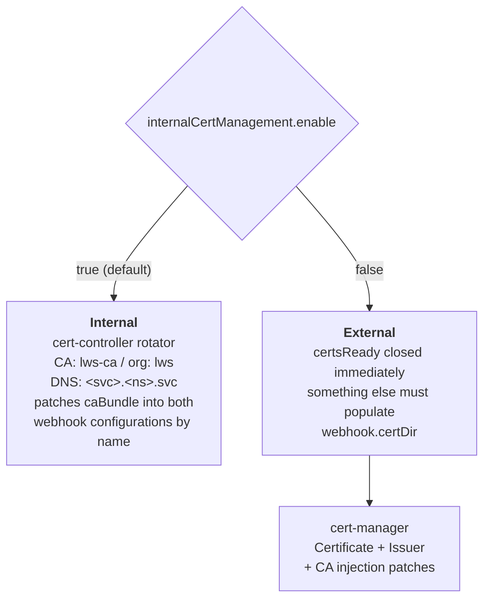
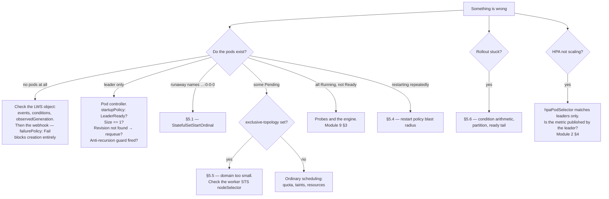

# Module 10: Operations and Troubleshooting

The failure modes that hurt in production are rarely the ones in the API reference. They are a Helm upgrade that deletes every LeaderWorkerSet in the cluster, an LWS name one character too long, a `maxUnavailable` that silently behaves as 1, and a group that restarts every thirty seconds for reasons no single log line explains.

This module is the operational counterpart to the rest of these notes: **installation and the upgrade hazards**, **certificate management**, **metrics**, **the version-compatibility matrix**, **a diagnostic decision tree**, and **the known failure modes with their root causes**.

!!! info "Provenance"
    Verified against `kubernetes-sigs/lws` at `32a9c37` (2026-08-06), release **v0.9.0**. Version strings below are pinned by `make prepare-release-branch`; check the current release before copying them.

---

## Part 1: Installation

### 1.1 Prerequisites

| Requirement | Detail |
| :--- | :--- |
| Kubernetes | **≥ 1.26**. On exactly 1.26 you must manually enable the `StatefulSetStartOrdinal` feature gate |
| `MaxUnavailableStatefulSet` gate | Needed for `maxUnavailable > 1`. **Beta and on by default since Kubernetes 1.35**; must be enabled manually before that. Without it, LWS rolls groups one at a time regardless of your setting |
| Capacity | At least one node with 1 CPU and 1 GiB for the controller-manager Deployment |

The `StatefulSetStartOrdinal` dependency is not optional and not cosmetic — [Module 3](03_group_lifecycle_and_identity.md), §1.3 explains why, and §5.1 below covers what happens without it.

### 1.2 The four install paths

```bash
# 1 — kubectl, the simplest
VERSION=v0.9.0
kubectl apply --server-side -f \
  https://github.com/kubernetes-sigs/lws/releases/download/$VERSION/manifests.yaml
kubectl wait deploy/lws-controller-manager -n lws-system --for=condition=available --timeout=5m

# 2 — Helm from the OCI registry
CHART_VERSION=0.9.0
helm install lws oci://registry.k8s.io/lws/charts/lws \
  --version=$CHART_VERSION --namespace lws-system --create-namespace --wait --timeout 300s

# 3 — latest development build
kubectl apply --server-side -k github.com/kubernetes-sigs/lws/config/default?ref=main

# 4 — from source, with your own image
git clone https://github.com/kubernetes-sigs/lws.git && cd lws
IMAGE_REGISTRY=<registry>/<project> make image-push deploy
```

`--server-side` is not optional for path 1. The CRDs are large enough to exceed the `kubectl.kubernetes.io/last-applied-configuration` annotation limit that client-side apply relies on.

To install into a different namespace, edit `namespace:` in `config/default/kustomization.yaml` — there is no flag for it.

### 1.3 DisaggregatedSet is bundled, but gated differently per install path

Since v0.9.0, DisaggregatedSet ships with LWS. The two install paths differ:

| Path | DS CRDs | DS controller RBAC | DS validating webhook | Editor/viewer/admin ClusterRoles |
| :--- | :---: | :---: | :---: | :---: |
| kubectl / kustomize | ✓ | ✓ | ✓ | ✓ |
| Helm | ✓ | ✓ | needs `--set enableDisaggregatedSet=true` | needs the same flag |

If you install with Helm and skip that flag, DisaggregatedSet objects are accepted **without validation** — the CRD's structural schema and CEL rules still apply, but everything in [Module 8](08_disaggregatedset.md), §9.1 (the `partition` prohibition, the placement-conflict check, the scaler-name length check) is silently absent. Verify:

```bash
kubectl get validatingwebhookconfiguration lws-validating-webhook-configuration \
  -o jsonpath='{range .webhooks[*]}{.name}{"\n"}{end}'
```

You should see `vdisaggregatedset.kb.io` alongside `vleaderworkerset.kb.io`.

---

## Part 2: Upgrades — Where the Real Danger Is

### 2.1 The Helm CRD hazard

!!! danger "Upgrading from chart v0.7.0 or earlier can delete every LeaderWorkerSet in the cluster"
    Charts up to v0.7.0 rendered the CRD from `templates/crds/`, making it part of the Helm release. v0.8.0 moved it to `crds/`. The first `helm upgrade` across that boundary sees the CRD as **removed from the release** and deletes it — **cascading to the deletion of every LeaderWorkerSet object in the cluster** (upstream issue #880).

    One-time mitigation, **before** upgrading:

    ```bash
    kubectl annotate crd leaderworkersets.leaderworkerset.x-k8s.io \
      helm.sh/resource-policy=keep --overwrite
    ```

    This is documented in the installation page and the chart README but **not** in the troubleshooting page — arguably the single most destructive known failure mode, filed under the wrong heading. Adding it there is a high-value documentation PR ([Appendix B](appendix_pr_opportunities.md)).

### 2.2 The general rule: CRDs first

Helm installs `crds/` only on the **first** `helm install`. It never updates or deletes them on `helm upgrade` or `helm uninstall`. So CRD schema changes and newly-added CRDs do **not** reach the cluster through `helm upgrade` alone.

The correct sequence, every time:

```bash
CHART_VERSION=0.9.0
helm pull oci://registry.k8s.io/lws/charts/lws --version=$CHART_VERSION --untar
kubectl apply --server-side --force-conflicts -f lws/crds     # ← CRDs first, always
helm upgrade lws oci://registry.k8s.io/lws/charts/lws \
  --version=$CHART_VERSION --namespace lws-system --wait --timeout 300s
```

Note that `lws/crds` in v0.9.0 contains **three** files. The upstream page's pre-v0.9.0 upgrade snippet applies only `disaggregatedset.x-k8s.io_disaggregatedsets.yaml` and omits `disaggregatedsetrolescalers` — which the chart also ships. Applying the whole directory avoids the problem.

### 2.3 The operator upgrade does not roll your fleet

This is the reassuring half. As covered in [Module 4](04_lws_reconciler_internals.md), §5.3–5.4:

- `SetMatchesRevision` defeats serialization drift, so a client-go version change in the operator does not produce a spurious new revision.
- `NewRevision` adopts a legacy `template-revision-hash` when upgrading from a pre-ControllerRevision version, so the new ControllerRevision is *labelled* with the hash the live pods already carry.

Both exist specifically so that upgrading the controller does not restart every model server in the cluster. Verify after any upgrade:

```bash
kubectl get controllerrevision -l leaderworkerset.sigs.k8s.io/name=<lws>
kubectl get pods -l leaderworkerset.sigs.k8s.io/name=<lws> \
  -o jsonpath='{range .items[*]}{.metadata.name}{"\t"}{.status.startTime}{"\n"}{end}'
```

Unchanged start times means nothing rolled.

### 2.4 The 0.5.0 → 0.6.0+ subgroup annotation change

Users of subgroups upgrading across that boundary get a rolling update of leader pods, because the annotation key changed from `leaderworkerset.gke.io/subgroup-size` to `leaderworkerset.sigs.k8s.io/subgroup-size` (PR #434). Expected, one-time, and documented — but plan for the capacity impact.

---

## Part 3: Certificates

The webhook needs a serving certificate. There are exactly two modes, and they are selected by one config field.



Internal mode is the default and needs no extra components. It uses `github.com/open-policy-agent/cert-controller`'s rotator with CA name `lws-ca`, organization `lws`, DNS name `<webhookServiceName>.<namespace>.svc`, and readiness checking enabled ([Module 4](04_lws_reconciler_internals.md), §1.2).

Switching to cert-manager requires, in both install paths, turning internal management **off**:

| Path | Steps |
| :--- | :--- |
| Kustomize | Set `internalCertManagement.enable: false`; comment out `../internalcert` in `config/default/kustomization.yaml`; uncomment `../certmanager`; uncomment all `CERTMANAGER` sections; `kubectl apply --server-side -k config/default` |
| Helm | Set `internalCertManagement.enable: false` and `enableCertManager: true` |

!!! bug "Three problems with the upstream cert-manager page"
    1. The Helm section says to disable **`internalCertManager`**. The actual field is **`internalCertManagement.enable`** (`api/config/v1alpha1/configuration_types.go`, defaulted to `true`). Following the page literally does nothing.
    2. The opening sentence is ungrammatical: "This page shows how you can a third party certificate authority solution like Cert Manager."
    3. The kustomize steps omit `webhookcainjection_patch.yaml` and the `cainjection_in_leaderworkersets.yaml` CRD patch, both of which `hack/e2e-test.sh` adds when `USE_CERT_MANAGER=true`. The documented manual flow is **less complete than the tested one** — which is a strong hint about how to write the fix: copy what the e2e script does.

    All three are in [Appendix B](appendix_pr_opportunities.md).

The rotator patches `caBundle` into two webhook configurations **by name**: `lws-validating-webhook-configuration` and `lws-mutating-webhook-configuration`. If you rename either in a fork, admission fails closed (`failurePolicy: Fail`) with no obvious cause.

---

## Part 4: Metrics

The metrics endpoint is `:8443`, always with `SecureServing: true` and `filters.WithAuthenticationAndAuthorization`. HTTP/2 is unconditionally disabled via a TLS mutator citing GHSA-qppj-fm5r-hxr3 and GHSA-4374-p667-p6c8 — worth knowing if you are debugging a scraper that insists on h2.

| Path | Steps |
| :--- | :--- |
| Kustomize | Enable prometheus in `config/default/kustomization.yaml` and uncomment the `PROMETHEUS` sections |
| Helm | `enablePrometheus: true` |
| With TLS verification | Additionally `internalCertManagement.enable: false` + cert-manager, and supply `metrics.prometheusNamespace` and `metrics.serviceMonitor.tlsConfig` |

!!! bug "The documented Helm values do not exist in the chart"
    Neither `metrics.prometheusNamespace` nor `metrics.serviceMonitor` appears in `charts/lws/values.yaml` or the chart README's parameter table. They are undeclared defaults — they may work by passing through, but they are unsupported and undocumented in the chart itself.

    The page also says to uncomment sections marked `PROMETHEUS-WITH-CERTS`, but that marker does not exist in `config/default/kustomization.yaml`; the real markers are `[WEBHOOK]`, `[CERTMANAGER]`, `[PROMETHEUS]`, `[METRICS]`, and `[VOLCANO]`. And the assets live in **`config/components/prometheus/`** with a separate `config/prometheus/`, which the page's "enable `prometheus`" instruction does not disambiguate.

    Declaring those values in `values.yaml` and the chart README is a concrete, contained chart-plus-docs PR.

!!! warning "There are no DisaggregatedSet metrics at all"
    What you get is controller-runtime's standard set — reconcile counts, durations, queue depth, error rates, per controller. There are **no LWS-specific and no DisaggregatedSet-specific metrics**. KEP-766, KEP-846, and KEP-849 all list metrics as a Beta graduation criterion, so this is well-motivated, KEP-backed work ([Module 8](08_disaggregatedset.md), §10).

Until then, monitor at the object level:

```bash
kubectl get lws -A -o custom-columns=\
'NS:.metadata.namespace,NAME:.metadata.name,DESIRED:.spec.replicas,READY:.status.readyReplicas,UPTODATE:.status.updatedReplicas'
```

Alert on `readyReplicas < spec.replicas` sustained beyond your cold-start budget, and on `Available=False` sustained beyond your rollout budget.

---

## Part 5: The Known Failure Modes

### 5.1 Infinite StatefulSet creation — pods named `…-0-0-0-0`

| | |
| :--- | :--- |
| **Symptom** | Pods with runaway names; LWS controllers in infinite reconciliation loops, "potentially exhausting cluster resources" |
| **Cause** | A cluster that ignores `.spec.ordinals.start` — below 1.27 without the `StatefulSetStartOrdinal` gate. The worker StatefulSet produces an ordinal-0 pod that looks like a leader and spawns its own worker StatefulSet, recursively |
| **Fix** | Kubernetes ≥ 1.26 with the gate enabled; ≥ 1.27 has it on by default |
| **Mitigation in code** | The anti-recursion guard in `PodReconciler.Reconcile` step 6 ([Module 3](03_group_lifecycle_and_identity.md), §1.3), which emits `FailedCreate` rather than recursing |

Note the upstream troubleshooting page states the cause as "< 1.27" and the fix as "≥ 1.26" — self-contradictory phrasing worth tightening.

### 5.2 LWS name longer than ~51 characters

| | |
| :--- | :--- |
| **Symptom** | `metadata.labels: Invalid value: "<worker-sts-name>-<10-char-hash>": must be no more than 63 characters` |
| **Cause** | The 57-character StatefulSet name limit (kubernetes/kubernetes#64023), compounded by LWS's two-level naming: `<lws>-<groupIndex>-<workerIndex>` plus StatefulSet's own hash suffix |
| **Real limit** | **`51 - int(replicas / 10)`** characters |

That formula is worth internalising: **the name budget shrinks as you scale**, because higher group indices are longer strings. An LWS that works at `replicas: 5` can fail at `replicas: 100`. Nothing validates this at admission — the failure surfaces as a StatefulSet event, far from the LWS you created. Adding a webhook check would be a useful contribution.

### 5.3 `maxUnavailable` silently behaving as 1

| | |
| :--- | :--- |
| **Symptom** | `maxUnavailable: 4` set, but groups update strictly one at a time |
| **Cause** | The `MaxUnavailableStatefulSet` gate is off (pre-1.35 without manual enablement) |
| **Diagnostic** | The value **does** propagate to the StatefulSet regardless, so checking the StatefulSet spec proves nothing. Count actual concurrent group updates instead |

### 5.4 A group restarting every ~30 seconds

Almost always one of three things, in decreasing order of likelihood:

1. **A liveness probe firing during model load.** Add a `startupProbe` ([Module 9](09_inference_engine_integration.md), §3.2).
2. **A worker process exiting cleanly.** Under `RecreateGroupOnPodRestart` any container restart destroys the group. Workers must block forever.
3. **A UID-mismatch loop.** The `workerPodBelongsToLeader` guard ([Module 5](05_pod_controller_and_failure_handling.md), §4.3) exists to prevent this, but if you see it, capture the controller logs — it would be a real bug.

```bash
kubectl get events --field-selector reason=RecreateGroup --sort-by=.lastTimestamp
kubectl get pod <pod> -o jsonpath='{range .status.containerStatuses[*]}{.name}{"\t"}{.restartCount}{"\t"}{.lastState.terminated.reason}{"\n"}{end}'
```

### 5.5 A group Pending forever with exclusive topology

| | |
| :--- | :--- |
| **Symptom** | Leader Running, one or more workers Pending indefinitely |
| **Cause** | The leader claimed a topology domain that cannot fit the whole group ([Module 5](05_pod_controller_and_failure_handling.md), §6) |
| **Fix** | Gang scheduling ([Module 7](07_scheduling_placement_and_networking.md), §3), or a coarser `topologyKey`, or a smaller `size` |
| **Diagnostic** | `kubectl get sts <group> -o jsonpath='{.spec.template.spec.nodeSelector}'` shows the pinned domain value |

An empty value there means `topologyValueFromPod` swallowed a missing Node — see the two defects noted in [Module 5](05_pod_controller_and_failure_handling.md), §6.

### 5.6 A rollout that never completes

Work the condition arithmetic backwards ([Module 4](04_lws_reconciler_internals.md), §6.3). `Available` requires **both** `readyNonBurstWorkerCount == spec.replicas` **and** `partitionedUpdatedAndReadyCount == partitionedCurrentNonBurstCount`. The usual causes:

- `partition` left at a non-zero canary boundary. Check `spec.rolloutStrategy.rollingUpdateConfiguration.partition`.
- A high-index group not becoming ready, so the ready-and-updated tail never grows and the partition cannot descend ([Module 6](06_rollout_and_revisions.md), §4).
- A frozen group below the partition that is unhealthy — it fails the first clause without affecting the second.

### 5.7 Webhook failures after a rename or a cert problem

`failurePolicy: Fail` on all three webhooks means a broken webhook blocks **all** LWS and pod creation matching its object selector. Check:

```bash
kubectl -n lws-system get secret lws-webhook-server-cert
kubectl get validatingwebhookconfiguration lws-validating-webhook-configuration \
  -o jsonpath='{.webhooks[0].clientConfig.caBundle}' | head -c 40; echo
kubectl -n lws-system logs deploy/lws-controller-manager | grep -i 'cert\|rotator'
```

An empty `caBundle` means the rotator has not patched it — usually a renamed webhook configuration or missing RBAC on `*webhookconfigurations`.

---

## Part 6: A Diagnostic Decision Tree



### 6.1 The commands worth memorising

```bash
# The object graph for one LWS, in one shot
LWS=my-lws
kubectl get lws,sts,svc,controllerrevision,pods -l leaderworkerset.sigs.k8s.io/name=$LWS

# Which revision is each group on?
kubectl get pods -l leaderworkerset.sigs.k8s.io/name=$LWS,leaderworkerset.sigs.k8s.io/worker-index=0 \
  -o custom-columns='NAME:.metadata.name,REV:.metadata.labels.leaderworkerset\.sigs\.k8s\.io/template-revision-hash,READY:.status.conditions[?(@.type=="Ready")].status'

# Rollout position
kubectl get sts $LWS -o jsonpath=\
'partition={.spec.updateStrategy.rollingUpdate.partition} replicas={.spec.replicas} annotated={.metadata.annotations.leaderworkerset\.sigs\.k8s\.io/replicas}'; echo

# Conditions
kubectl get lws $LWS -o jsonpath='{range .status.conditions[*]}{.type}={.status} ({.reason}){"\n"}{end}'

# Everything the controller has said about this LWS
kubectl get events --field-selector involvedObject.name=$LWS --sort-by=.lastTimestamp

# Controller logs, filtered to this object
kubectl -n lws-system logs deploy/lws-controller-manager | grep $LWS
```

### 6.2 Reading `managedFields`

Because the leader StatefulSet is written with Server-Side Apply under field manager `lws` and `Force: true` ([Module 4](04_lws_reconciler_internals.md), §4):

```bash
kubectl get sts $LWS -o yaml --show-managed-fields | yq '.metadata.managedFields'
```

Any field owned by `lws` will be reverted on the next reconcile. Any field *not* owned by it will persist. This is the definitive answer to "why did my manual edit disappear," and it takes ten seconds.

---

## Part 7: The Compatibility Matrix

| Component | Version | Source |
| :--- | :--- | :--- |
| LWS | v0.9.0 | Latest release at time of writing |
| Kubernetes | **≥ 1.26** | Hard minimum; 1.26 needs `StatefulSetStartOrdinal` enabled manually |
| Kubernetes for `maxUnavailable > 1` | ≥ 1.35 for default-on, earlier with the gate | `MaxUnavailableStatefulSet` |
| Go | **1.26.0** | `go.mod` |
| `k8s.io/api` | **v0.36.3** | `go.mod`; also pins the code-generator |
| Volcano (gang scheduling) | v1.12.1 | e2e only; the tested version |
| cert-manager | v1.17.0 | e2e only; the tested version |
| Kueue (TAS examples) | 0.16.1 | Upstream TAS example |

!!! note "The API reference docs are generated against Kubernetes 1.28"
    `hack/genref/config.yaml` maps `k8s.io/api...` types to the **v1.28** Kubernetes API reference, while the project builds against `k8s.io/api v0.36.3`. Every cross-link to a core type in `site/content/en/docs/reference/*.v1.md` therefore points at 1.28 documentation. Bumping that config value is a one-line PR.

---

## Lab: Rehearse the Failures

The point of this lab is to see each failure mode once, deliberately, in a cluster you do not mind breaking — so that when you meet it in production you recognise it in seconds rather than hours.

!!! warning "Use a throwaway cluster"
    Part A2 **deliberately destroys LeaderWorkerSet objects**. Do not run it anywhere you care about.

### Part A — Install and upgrade

Install v0.9.0 by Helm, then verify the DisaggregatedSet gating from §1.3:

```bash
helm install lws oci://registry.k8s.io/lws/charts/lws \
  --version=0.9.0 --namespace lws-system --create-namespace --wait
kubectl get validatingwebhookconfiguration lws-validating-webhook-configuration \
  -o jsonpath='{range .webhooks[*]}{.name}{"\n"}{end}'
```

`vdisaggregatedset.kb.io` should be **absent**. Now create a DisaggregatedSet with `partition: 5` on a role — which §9.1 of [Module 8](08_disaggregatedset.md) says must be rejected — and observe that it is **accepted**. Then reinstall with `--set enableDisaggregatedSet=true` and confirm the same object is now rejected.

That is the whole argument for the flag, demonstrated in two commands.

### Part A2 — Reproduce the CRD deletion hazard (destructive)

On a throwaway cluster, install chart v0.7.0, create a LeaderWorkerSet, then upgrade to v0.8.0 **without** the resource-policy annotation. Watch the CRD and every LWS object disappear.

Then repeat with the annotation applied first:

```bash
kubectl annotate crd leaderworkersets.leaderworkerset.x-k8s.io \
  helm.sh/resource-policy=keep --overwrite
```

Having seen it once, you will never skip that step again — and you will have the material for the troubleshooting-page PR from §2.1.

### Part B — The name-length limit

```bash
# 51 characters exactly
kubectl create -f - <<'EOF'
apiVersion: leaderworkerset.x-k8s.io/v1
kind: LeaderWorkerSet
metadata:
  name: aaaaaaaaaabbbbbbbbbbccccccccccddddddddddeeeeeeeeeff
spec:
  replicas: 2
  leaderWorkerTemplate:
    size: 2
    workerTemplate: { spec: { containers: [{ name: c, image: nginxinc/nginx-unprivileged:1.27 }] } }
EOF
```

It should be accepted. Now scale it to 100 replicas and watch high-index groups fail, per the `51 - int(replicas/10)` formula. Find the error:

```bash
kubectl get events --field-selector reason=FailedCreate --sort-by=.lastTimestamp
```

Note how far the error surfaces from the object you created — a StatefulSet event about a label value, with no reference to the LWS. Then sketch the webhook validation you would add: what is the exact bound, and does it need to depend on `replicas`?

### Part C — Certificate failure

```bash
kubectl -n lws-system delete secret lws-webhook-server-cert
kubectl -n lws-system logs deploy/lws-controller-manager -f | grep -i 'cert\|rotator'
```

Watch the rotator regenerate it. Then break it properly by editing the webhook configuration's name, and observe that **all** LWS creation now fails with a webhook error — `failurePolicy: Fail` in action. Restore it.

### Part D — Build a monitoring baseline

Deploy three LWSes in different states: one healthy, one mid-rollout with `partition` set, one with a broken readiness probe. Then write a single command that distinguishes all three:

```bash
kubectl get lws -A -o custom-columns=\
'NAME:.metadata.name,DESIRED:.spec.replicas,READY:.status.readyReplicas,UPTODATE:.status.updatedReplicas,AVAIL:.status.conditions[?(@.type=="Available")].status,UPD:.status.conditions[?(@.type=="UpdateInProgress")].status'
```

Confirm that `status.replicas` exceeds `spec.replicas` during a `maxSurge` rollout, that `Available` and `UpdateInProgress` behave as [Module 4](04_lws_reconciler_internals.md), §6.3 predicts, and that the frozen-canary case sits at `Progressing` indefinitely.

That command, plus an alert on sustained `readyReplicas < spec.replicas`, is a serviceable monitoring baseline until LWS-specific metrics exist.

### Checkpoint questions

- The name limit is `51 - int(replicas/10)`. Derive it from the 57-character StatefulSet name limit and LWS's two-level naming scheme. Where does each character go?
- `maxUnavailable` propagates to the StatefulSet whether or not the gate is enabled. Design a diagnostic that distinguishes "gate off" from "the rollout is legitimately going one group at a time because of the ready tail."
- Helm does not upgrade CRDs. Given that, what is the correct upgrade runbook for a cluster running 200 LeaderWorkerSets across 30 namespaces?

Continue to [Module 11: The Contributor Workflow](11_contributor_workflow.md).
