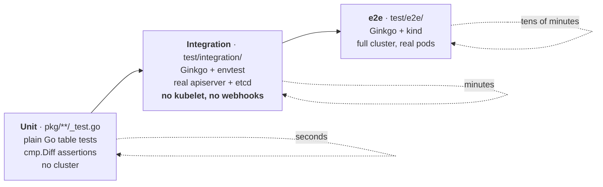

# Module 11: The Contributor Workflow

Everything up to here was about understanding LWS. This module is about changing it: the repo layout, the `make` targets that gate CI, the three test tiers and their conventions, the linters, the codegen chain, the KEP process, the release mechanics, and who has to approve your PR.

It is written for the specific situation of having read the preceding ten modules and wanting to open a first PR. The single most useful fact in it: **`make verify` is the pre-submit gate**, and running it before you push saves a review cycle every time.

!!! info "Provenance"
    Verified against `kubernetes-sigs/lws` at `32a9c37` (2026-08-06). Tool versions are pinned in the `Makefile` and `Makefile-deps.mk`; check them before assuming.

---

## Part 1: Repo Layout

```
api/                   ← API types. Changing anything here triggers the full codegen chain.
  leaderworkerset/v1/    LeaderWorkerSet — the only tree KAL lints
  disaggregatedset/v1/   DisaggregatedSet + DisaggregatedSetRoleScaler
  config/v1alpha1/       Configuration (the controller's own config file format)
cmd/main.go            ← manager wiring, flags, startup ordering
pkg/
  controllers/           leaderworkerset_controller.go, pod_controller.go, metadata.go
  controllers/disaggregatedset/   planner.go, executor.go, *_manager.go
  webhooks/              LWS + pod webhooks; disaggregatedset/ subpackage
  utils/                 revision/, pod/, statefulset/, controller/, accelerators/, disaggregatedset/
  schedulerprovider/     the gang-scheduling interface + volcano provider
  config/, cert/, version/
client-go/             ← GENERATED. Never hand-edit.
config/                ← kustomize: crd/ default/ manager/ rbac/ webhook/ internalcert/
                          certmanager/ components/{prometheus,volcano}
charts/lws/            ← Helm chart; crds/ is generated by `make crds`
keps/                  ← one directory per KEP: README.md + kep.yaml
site/                  ← Hugo + Docsy documentation site
test/                  ← wrappers/ testutils/ integration/ e2e/
hack/                  ← codegen, e2e harness, chart push, TOC, KAL builder config
```

Three rules that follow from the layout:

1. **`client-go/` and every `zz_generated.*.go` are generated.** `make verify` regenerates and diffs them; a hand edit fails CI.
2. **KAL only lints `api/leaderworkerset/*`.** `api/disaggregatedset/` and `api/config/` are unlinted — see [Module 2](02_api_surface_anatomy.md), §8.2.
3. **There are exactly two `OWNERS` files.** No per-package ownership, so every non-site PR needs one of four root approvers.

---

## Part 2: The Make Targets That Matter

!!! warning "GNU sed is mandatory"
    The Makefile hard-errors if `sed --version` is not GNU: *"!!! GNU sed is required. If on OS X, use 'brew install gnu-sed'."* It prefers `gsed` when present. macOS contributors hit this on the first command.

### 2.1 The daily loop

| Target | What it does |
| :--- | :--- |
| `make manifests` | `controller-gen` → CRDs into `config/crd/bases`, RBAC into `config/rbac`, webhook config into `config/webhook` |
| `make generate` | deepcopy + `hack/update-codegen.sh` (clientset, listers, informers, apply configurations) + API reference docs + Helm CRDs |
| `make fmt` / `make vet` | `go fmt` / `go vet` |
| **`make test`** | envtest-backed unit tests over `./api/... ./pkg/... ./cmd/...` with coverage |
| **`make test-integration`** | Ginkgo against `./test/integration/...` with envtest |
| **`make test-e2e`** | `hack/e2e-test.sh` — creates a kind cluster, builds and loads the image, deploys, runs Ginkgo |
| **`make lint`** | `golangci-lint run --timeout 15m0s` |
| **`make lint-api`** | the custom-built kube-api-linter binary |
| **`make verify`** | **the pre-submit gate** — see below |

### 2.2 `make verify` is the gate

```
gomod-verify lint lint-api fmt-verify toc-verify manifests generate prepare-release-branch
  → git --no-pager diff --exit-code config/components api client-go site/ charts/
  → fail if any untracked files appear in those paths
```

It regenerates everything and then requires the working tree to be clean. Two consequences that catch people:

- **Forgetting `make generate` after an API change fails CI**, because the regenerated `client-go/` differs from what you committed.
- **Hand-editing a version string fails CI.** `prepare-release-branch` rewrites version strings in `README.md`, `site/hugo.toml`, `charts/lws/README.md`, `site/content/en/docs/installation/_index.md`, and `charts/lws/Chart.yaml`. If you edited one by hand, the regeneration reverts it and the diff fails.

Run `make verify` before every push. It is slower than CI feedback but much faster than a round trip.

### 2.3 Pinned tool versions

| Tool | Version |
| :--- | :--- |
| Go | **1.26.0** (from `go.mod` — the single source of truth) |
| controller-gen | v0.17.2 |
| kustomize | v5.2.1 (reinstalled if the wrong version is present) |
| golangci-lint | v2.12.2 |
| kube-api-linter | pinned by commit in `hack/.custom-gcl.yaml` |
| envtest Kubernetes | **1.36.0** |
| kind node image | `kindest/node:v1.36.1` |
| helm | v3.19.0 · yq v4.45.1 · hugo v0.152.2 (extended) · genref v0.28.0 |
| Volcano (e2e) | v1.12.1 · cert-manager (e2e) v1.17.0 |
| code-generator | tracks `k8s.io/api` → **v0.36.3** |

Everything installs into `./bin`. The KAL binary is **built, not downloaded** (`make golangci-lint-kal` compiles it from `hack/.custom-gcl.yaml`), so the first `make lint-api` takes a while.

---

## Part 3: The Three Test Tiers



### 3.1 Unit tests — the table idiom

Plain Go, no Ginkgo, `cmp.Diff` for assertions:

```go
func TestGenGroupUniqueKey(t *testing.T) {
    tests := []struct {
        name        string
        podName     string
        namespace   string
        expectedKey string
    }{
        {name: "same namespace, pod name", podName: "test-sample", namespace: "default",
         expectedKey: "95e88034e460983f51a9952fe128729fbc0663b5"},
    }
    for _, tc := range tests {
        t.Run(tc.name, func(t *testing.T) {
            key := genGroupUniqueKey(tc.namespace, tc.podName)
            if diff := cmp.Diff(tc.expectedKey, key); diff != "" {
                t.Errorf("unexpected key %s", diff)
            }
        })
    }
}
```

Note the **golden hash values**. If you change `genGroupUniqueKey`'s input ordering or hashing, these break loudly — by design, because that value is an affinity key and changing it would silently re-place every group.

Testify is a direct dependency but used sparingly; `cmp.Diff` is the house style.

The DisaggregatedSet planner is the best target for unit tests in the whole project: it is a pure function of four integer vectors, and `planner_test.go` is 38 KB of table tests including a full-sequence assertion. A rollout-algorithm change should come with entries there.

### 3.2 Integration tests — envtest, and the trap

`test/integration/` runs a real apiserver and etcd, a real `ctrl.NewManager`, and the actual reconcilers — but **no kubelet and no admission webhooks**.

That second omission is the single most common trap for an API PR:

!!! danger "Integration tests run without the defaulting webhook"
    `wrappers.BuildLeaderWorkerSet` carries the comment *"Manually set this for we didn't enable webhook in controller tests"* and explicitly populates `RolloutStrategy`, `StartupPolicy`, and `NetworkConfig` — the fields the defaulting webhook would otherwise fill.

    **If you add a defaulted API field, you must add it to the wrapper too.** Otherwise an unset pointer nil-panics inside the reconciler, and the failure looks like a controller bug rather than a test-fixture gap.

The suite also has a real bug worth fixing:

```go
BinaryAssetsDirectory: filepath.Join("..", "..", "..", "bin", "k8s",
    fmt.Sprintf("1.28.3-%s-%s", runtime.GOOS, runtime.GOARCH)),
```

Hardcoded **1.28.3**, while the Makefile sets `ENVTEST_K8S_VERSION = 1.36.0`. Running via `make test-integration` is unaffected because `KUBEBUILDER_ASSETS` wins — but the comment says this path exists "if you want to run the tests directly without call the makefile target", and that path is broken. Small, safe PR.

### 3.3 The Ginkgo table convention

```go
var _ = ginkgo.Describe("LeaderWorkerSet controller", func() {
    type update struct {
        lwsUpdateFn       func(*leaderworkerset.LeaderWorkerSet)
        checkLWSState     func(*leaderworkerset.LeaderWorkerSet)
        checkLWSCondition func(context.Context, client.Client, *leaderworkerset.LeaderWorkerSet, time.Duration)
    }
    type testCase struct {
        makeLeaderWorkerSet func(nsName string) *wrappers.LeaderWorkerSetWrapper
        updates             []*update
    }
    ginkgo.DescribeTable("leaderWorkerSet creating or updating",
        func(tc *testCase) {
            ns := &corev1.Namespace{ObjectMeta: metav1.ObjectMeta{GenerateName: "lws-ns-"}}
            // …
        },
        ginkgo.Entry("scale up number of groups", &testCase{ /* … */ }),
        ginkgo.Entry("scale down to 0", &testCase{ /* … */ }),
    )
})
```

Each entry gets a **fresh generated namespace**. The `updates` slice models a sequence of mutations with assertions between them, which is the right shape for testing a rollout.

Note that Ginkgo is imported **qualified** (`ginkgo.Describe`) in test bodies while the suite files use dot-imports. Both styles coexist; match the file you are editing.

### 3.4 The wrapper builder idiom

This is the pattern to imitate whenever you add a field:

```go
type LeaderWorkerSetWrapper struct {
    leaderworkerset.LeaderWorkerSet
}

func (w *LeaderWorkerSetWrapper) Obj() *leaderworkerset.LeaderWorkerSet {
    return &w.LeaderWorkerSet
}

func (w *LeaderWorkerSetWrapper) Replica(count int) *LeaderWorkerSetWrapper {
    w.Spec.Replicas = ptr.To[int32](int32(count))
    return w
}

// Nested optional structs are lazily allocated by the setter — copy this
// convention when your field lives under a new pointer sub-struct.
func (w *LeaderWorkerSetWrapper) SubGroupType(t leaderworkerset.SubGroupPolicyType) *LeaderWorkerSetWrapper {
    if w.Spec.LeaderWorkerTemplate.SubGroupPolicy == nil {
        w.Spec.LeaderWorkerTemplate.SubGroupPolicy = &leaderworkerset.SubGroupPolicy{}
    }
    w.Spec.LeaderWorkerTemplate.SubGroupPolicy.Type = &t
    return w
}
```

Two constructors: `BuildBasicLeaderWorkerSet(name, ns)` for a bare object, and `BuildLeaderWorkerSet(nsName)` for the realistic one most entries use.

Supporting packages:

- **`test/testutils/util.go`** — 40+ cluster-state helpers: `MustCreateLws`, `CreateLeaderPods`, `CreateLeaderPodsWithInjectFn` (the escape hatch for arbitrary pod mutation), `SetLeaderPodsToReady(start, end)`, `SetStatefulsetToUnReady`, `UpdateWorkerTemplateImage`, `ValidatePodExclusivePlacementTerms`, and so on.
- **`test/testutils/validators.go`** — `Expect*` assertions with `Eventually` inside: `ExpectValidLeaderStatefulSet`, `ExpectLeaderWorkerSetAvailable`, `ExpectStatefulsetPartitionEqualTo`, `ExpectRevisions(…, numRevisions)`, `ValidateEvent`.

Before writing a helper, grep these two files. They almost certainly already have it.

### 3.5 e2e

`hack/e2e-test.sh` is the whole harness:

```
trap cleanup EXIT
startup → pull_upgrade_images → kind_load → deploy_cert_manager
        → deploy_gang_scheduler → lws_deploy → run_tests
```

Notable behaviours:

- `lws_deploy` **writes `config/manager/controller_manager_config.yaml` on the fly**, adding `internalCertManagement.enable: false` for the cert-manager variant and `gangSchedulingManagement.schedulerProvider` for the Volcano variant. For Volcano it also appends the `podgroups` RBAC rule if absent.
- The cert-manager variant adds `cainjection_in_leaderworkersets.yaml`, `webhookcainjection_patch.yaml`, and `cert_metrics_manager_patch.yaml` — **more than the upstream cert-manager documentation describes** ([Module 10](10_operations_and_troubleshooting.md), §3).
- `run_tests` selects the gang-scheduling suite with a **literal Ginkgo description string** (`--focus=` in one branch, `--skip=` in the other). Renaming that `Describe` breaks both branches silently.
- `cleanup` collects controller logs, pod lists, Volcano logs, and `kind export logs` into `$ARTIFACTS` — the first place to look when e2e fails in CI.

Variants: `make test-e2e-cert-manager`, `make test-e2e-gang-scheduling-volcano`, `make test-e2e-upgrade` (installs `LWS_UPGRADE_FROM_VERSION`, runs a `before` phase, upgrades, runs an `after` phase).

To iterate quickly against an existing cluster:

```bash
USE_EXISTING_CLUSTER=true KIND_CLUSTER_NAME=kind make test-e2e
```

---

## Part 4: Linting

### 4.1 `.golangci.yaml` is remarkably minimal

```yaml
version: "2"
linters:
  default: none
  enable:
    - unparam
formatters:
  enable:
    - goimports
```

That is the entire configuration. `default: none` disables even golangci-lint's standard set, so the **only** enabled linter is `unparam` — unused function parameters and always-same-value returns — plus the `goimports` formatter. No `errcheck`, no `staticcheck`, no `unused`. `go vet` runs separately as a Makefile prerequisite.

In practice, `make lint` failures are almost always `unparam` or import ordering. And `unparam` explains several of the dead-parameter findings in [Module 8](08_disaggregatedset.md), §10.1 — they survive only because of explicit `//nolint:unparam` comments.

### 4.2 The KAL rules that constrain API PRs

Covered in [Module 2](02_api_surface_anatomy.md), §8.2. The one that catches nearly everyone:

> **`commentstart`** — a field's doc comment must begin with the **serialized** (JSON) field name. `// Replicas is …` on `json:"replicas"` fails; `// replicas is …` passes.

Also enabled: `conditions`, `conflictingmarkers`, `duplicatemarkers`, `jsontags`, `nodurations`, `nofloats`, `nonullable`, `notimestamp`, `statusoptional`, `statussubresource`, `uniquemarkers`, `nophase`. Explicitly disabled pending discussion: `integers`, `maxlength`, `nobools`, `nomaps`, `optionalfields`, `optionalorrequired`, `requiredfields`, `ssatags`.

The disabled list is worth reading before an API PR. The linter will not stop you adding a `bool` or a `map`, but a reviewer may — those are Kubernetes API conventions regardless of tooling.

### 4.3 Codespell blocks PRs

`.github/workflows/codespell.yaml` runs on every push and pull request with `check_filenames: true`. Spelling failures block the PR, and this surprises people. The ignore list is short: `complies, ro, NotIn, notin, implementors, AfterAll, afterall`.

---

## Part 5: What CI Actually Runs

**Only three GitHub Actions workflows exist.** Everything heavier runs in **Prow**, configured out-of-tree in `kubernetes/test-infra` and therefore invisible in this repository.

| Workflow | Trigger | What it does |
| :--- | :--- | :--- |
| `codespell.yaml` | push + PR | Spell check including filenames. Blocks on failure |
| `test_coverage.yaml` | push + PR | `go test -race -covermode=atomic ./pkg/... ./cmd/...` → Coveralls. Note it **excludes `./api/...`**, unlike `make test`, and needs no envtest assets |
| `trivy.yaml` | push to main + PR | `make build`, docker build, then Trivy with **`severity: CRITICAL,HIGH,MEDIUM,LOW,UNKNOWN`** and `exit-code: 1` |

!!! warning "Trivy fails on *any* severity"
    Including `LOW` and `UNKNOWN`. This is why the commit log has a steady stream of dependency bumps whose only purpose is unblocking CI — "Bump golang.org/x/text to fix CVE-…", "chore: unblock CI".

    If your PR fails Trivy on a CVE in a transitive dependency you did not touch, that is normal. Rebase on main first; someone has often already bumped it.

`cloudbuild.yaml` is the postsubmit publisher: `make image-push helm-chart-push` into `us-central1-docker.pkg.dev/k8s-staging-images/lws`.

Dependabot runs weekly on gomod with a `kubernetes` group for `k8s.io/*` and `sigs.k8s.io/*`, and **ignores major/minor for `k8s.io/*`** (patches and security only) — so Kubernetes library bumps are deliberate, human decisions.

---

## Part 6: The KEP Process

Non-trivial features need a KEP. The corpus is in `keps/`, one directory per KEP with `README.md` and `kep.yaml`.

### 6.1 `kep.yaml` schema

```yaml
title: <human-readable>
kep-number: <matches the directory number>
authors: [...]
status: provisional | implementable | implemented | deferred | rejected | withdrawn | replaced
creation-date: YYYY-MM-DD
reviewers: [...]
approvers: [...]
see-also: [...]        # optional
replaces: [...]        # optional
stage: alpha | beta | stable
latest-milestone: "vX.Y.Z"
milestone:
  alpha: "vX.Y.Z"
  beta: "vX.Y.Z"
  stable: "vX.Y.Z"
# PRR:
feature-gates:
  - name: <GateName>
disable-supported: true    # required at alpha
metrics: [...]             # required at beta
```

!!! tip "Read the existing corpus before writing one"
    The 15 KEPs in `keps/` are the best available guide to what a reviewer expects, and they also demonstrate the failure modes. Several have unfilled placeholders in a `status: implementable` document; several describe APIs that were never built (KEP-552's `ResizePolicy`, KEP-407's `PodGroupPerReplica` gate); one has a `kep-number` that does not match its directory.

    Those are all fixable in a documentation PR — and fixing one is a good way to read a KEP closely enough to write your own.

### 6.2 What good looks like

The strongest KEPs in the corpus share a shape:

- **KEP-766** — an "Alternatives" section that genuinely explains why the chosen design is necessary, not just why the others are worse. Its Alternative 4 discussion is why the entire DisaggregatedSet planner exists.
- **KEP-849** — a pitfalls list where every item is a real bug someone hit, with the mitigation and the reasoning ([Module 8](08_disaggregatedset.md), §7.6).
- **KEP-820** — a "Why No `Failed` Before" section giving the historical context for an absence, which is much harder to write than a list of features.

The pattern: explain the constraint, not just the design.

### 6.3 The gap between KEP and code

A recurring theme in these notes, and a real hazard when reading a KEP as documentation:

| KEP | Says | Code has |
| :--- | :--- | :--- |
| 407 | Feature gate `PodGroupPerReplica`; three provider interfaces | No gate; only `SchedulerProvider`; a config field instead |
| 552 | A `ResizePolicy` field | No such field — `size` is simply mutable |
| 766 | `RolloutStrategy` is not propagated to child LWSes | It is propagated (inertly) |
| 820 | `maxGroupRestarts`, a `Failed` condition | Nothing implemented |
| 849 | `Replicas *int32`; selector written once | Non-pointer with a default; rewritten each reconcile |

**Always check the code.** Every one of these divergences is also a documentation PR waiting to be written.

---

## Part 7: Governance and Getting a PR Merged

### 7.1 Who approves

```
/OWNERS
  approvers:  ahg-g, kerthcet, edwinhr716, yankay
  reviewers:  ahg-g, ardaguclu, hasB4K, kerthcet, edwinhr716, yankay
  emeritus_approvers: liurupeng

/site/OWNERS
  approvers: ahg-g, edwinhr716, kerthcet
```

There are **no per-package OWNERS files**. Every non-site PR needs an approval from one of four people. The practical implication: **review bandwidth, not disagreement, is usually the rate limiter.** A small, obviously-correct PR with a clear description merges much faster than a large one, and that is a strong argument for splitting work.

Note `SECURITY_CONTACTS` still lists `liurupeng`, who is `emeritus_approvers` in `OWNERS` — likely stale, and a trivial PR.

### 7.2 The PR template

`.github/PULL_REQUEST_TEMPLATE.md` requires:

- A `/kind` label: `bug`, `cleanup`, `documentation`, or `feature`; optionally `api-change`, `deprecation`, `failing-test`, `flake`, `regression`.
- "What this PR does / why we need it."
- `Fixes #<issue>`.
- A ` ```release-note ` block — write `NONE` if not user-facing.

Issue templates: `BUG_REPORT.md`, `CLEANUP.md`, `ENHANCEMENT.md`, `NEW_RELEASE.md`, `SUPPORT.md`.

### 7.3 Where to talk

There is a genuine inconsistency here:

| Source | Slack | Mailing list |
| :--- | :--- | :--- |
| `CONTRIBUTING.md` and `README.md` | `#sig-apps` | `kubernetes-sig-apps` |
| `site/content/en/docs/contribution guidelines/` | `C071WA7R9LY` | `wg-serving` |

Both cannot be canonical. `#sig-apps` is the safer default since LWS is a SIG-Apps project, but reconciling the two is itself a small PR — and asking which is correct is a reasonable first message.

### 7.4 The most valuable documentation PR in the repo

**`CONTRIBUTING.md` is entirely boilerplate.** It is the unmodified Kubernetes template, down to a leftover HTML comment:

```
<!--- If your repo has certain guidelines for contribution, put them here ahead of the general k8s resources -->
```

It mentions nothing about `make test`, `make lint`, `make verify`, envtest, the wrapper conventions, the KEP process, or GNU sed. Every one of those is something a first-time contributor needs and currently has to discover by failing.

`RELEASE.md` has the same problem and is actively wrong — it still says "The Kubernetes **Template Project** is released on an as-needed basis" and describes a `git tag -s` flow that does not match the real mechanics in `make artifacts`, `make prepare-release-branch`, `cloudbuild.yaml`, and `hack/cherry_pick_pull.sh`.

Writing a real developer-setup section in `CONTRIBUTING.md` is arguably the highest-leverage contributor PR available. It requires no design discussion, helps everyone who comes after, and — usefully — you are exactly the right person to write it right after having learned it all the hard way.

---

## Part 8: Release Mechanics

| Target | What it does |
| :--- | :--- |
| `make artifacts` | Sets the manager image, rebuilds `artifacts/`, `kustomize build config/default -o artifacts/manifests.yaml`, `yq`-patches `charts/lws/values.yaml` to the release repo/tag, `helm package`, renames to `lws-chart-$(GIT_TAG).tgz`, then reverts values.yaml |
| `make prepare-release-branch` | The version-bump automation. `sed`s version strings in `README.md`, `site/hugo.toml`, `charts/lws/README.md`, `site/content/en/docs/installation/_index.md`, and `yq`s `charts/lws/Chart.yaml` |
| `make crds` | Regenerates the three Helm CRD files from `kustomize build config/default` through `yq`, with a `test -s` guard per file |
| `hack/cherry_pick_pull.sh` | Release-branch backports |

Because `make verify` runs `prepare-release-branch` and then diffs, **any hand-edited version string in those five files fails CI**. That is worth repeating because it is a confusing failure: you edited a README, and CI complains about `charts/`.

---

## Lab: Land a First PR

The goal is a merged upstream PR. Everything here is chosen to be small, obviously correct, and verifiable — the properties that get a PR merged quickly.

### Step 1 — Set up and prove the toolchain

```bash
git clone https://github.com/kubernetes-sigs/lws && cd lws
go version                # must be 1.26.x
sed --version | head -1   # must say GNU; on macOS: brew install gnu-sed

make test                 # downloads envtest assets on first run
make lint
make lint-api             # builds the KAL binary; slow the first time
make verify               # the gate — must be clean on a fresh checkout
```

If `make verify` is not clean on an unmodified checkout, stop and investigate. That is a bug in itself and worth reporting.

### Step 2 — Pick a first PR

From [Appendix B](appendix_pr_opportunities.md), the documentation tier. Good candidates, all evidenced in these notes:

1. **`concepts/_index.md` documents `SubGroupType: LeaderOnly`**, which does not exist. The real value is `LeaderExcluded`, with the opposite meaning ([Module 3](03_group_lifecycle_and_identity.md), §6.2). Highest user impact of any doc fix.
2. **The `MaxUnavailableStatefulSet` contradiction** between `rollout-strategy` and `installation` ([Module 6](06_rollout_and_revisions.md), §9).
3. **Four missing keys** in the labels/annotations reference ([Module 2](02_api_surface_anatomy.md), §6.2).
4. **`cert_manager.md` says `internalCertManager`**, the real field is `internalCertManagement.enable` ([Module 10](10_operations_and_troubleshooting.md), §3).
5. **The Helm CRD deletion hazard is missing from the troubleshooting page** ([Module 10](10_operations_and_troubleshooting.md), §2.1).

Pick one. Do not batch them — one focused PR reviews faster than five bundled ones, and mixing unrelated fixes gives a reviewer a reason to ask for a split.

### Step 3 — Write it

```bash
git checkout -b fix-subgroup-type-docs
# edit site/content/en/docs/concepts/_index.md
make verify        # yes, even for a docs change — toc-verify and codespell run here
```

Then verify the claim against the code and put the citation **in the PR description**:

```bash
grep -n "LeaderExcluded\|LeaderOnly" api/leaderworkerset/v1/leaderworkerset_types.go
```

A reviewer who can verify your claim in one command approves in one pass. A reviewer who has to go find the evidence themselves does not.

### Step 4 — Open it

Fill the template completely:

```markdown
/kind documentation

**What this PR does / why we need it**:
The concepts page documents a `SubGroupType: LeaderOnly` value that does not exist
in the API. The actual enum value is `LeaderExcluded`
(api/leaderworkerset/v1/leaderworkerset_types.go:243), and its semantics are the
inverse of what the page describes: the leader is excluded from all subgroups,
rather than having one created exclusively for it.

**Which issue(s) this PR fixes**:
Fixes #<number, if one exists>

```release-note
NONE
```
```

Then, on the PR: confirm codespell passes, respond to review promptly, and expect approval from one of the four root approvers.

### Step 5 — A second PR with code

Once the first is merged, take a small code change with a test. Good candidates from these notes:

| Change | Where | Why it is small |
| :--- | :--- | :--- |
| Fix the hardcoded envtest `1.28.3` | `test/integration/controllers/suite_test.go` | One line; the correct value is already in the Makefile |
| Remove dead code in the DS subsystem | `pkg/utils/disaggregatedset/utils.go` | `NumRequiredRoles` has zero references; grep proves it |
| Fix the nil-deref ordering in the LWS validator | `pkg/webhooks/leaderworkerset_webhook.go` | Move one read below the existing nil check; add a table-test entry |
| Fix the topology error message | `pkg/controllers/pod_controller.go` | Interpolates the value instead of the key |

For each, the workflow is the same: write the fix, add or extend a table test, run `make test` and `make verify`, and cite the evidence in the description.

### Step 6 — Read a KEP closely enough to critique it

Pick KEP-820 and verify its second premise for yourself ([Module 5](05_pod_controller_and_failure_handling.md), §7.3):

```bash
grep -n "PublishNotReadyAddresses" pkg/utils/controller/controller_utils.go
grep -n "PublishNotReadyAddresses" test/testutils/validators.go
```

Then comment on the KEP with what you found. That is a substantive contribution that costs nothing, improves a live proposal, and is a good first interaction with the maintainers — much better than opening with a large PR.

### Checkpoint questions

- `make verify` runs `prepare-release-branch` and then diffs. Why does that mean you can never hand-edit a version string in `README.md`?
- Integration tests run without the defaulting webhook. If you add a defaulted pointer field to `LeaderWorkerSetSpec` and forget the wrapper, where exactly does the panic occur, and why does the stack trace point at the controller rather than the test?
- Trivy fails on `LOW` and `UNKNOWN` severities. Argue both sides of whether that is the right policy for this project.

---

Continue to [Appendix A: Glossary](appendix_glossary.md), [Appendix B: PR Opportunity Backlog](appendix_pr_opportunities.md), and [Appendix C: Reading List](appendix_reading_list.md).
