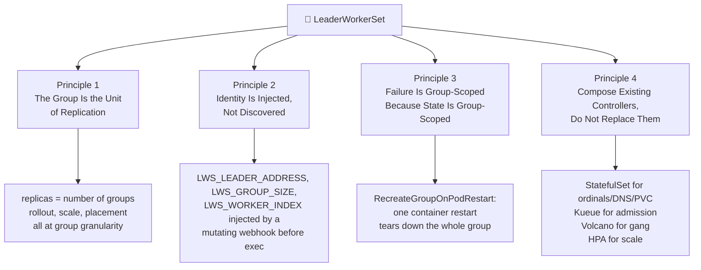
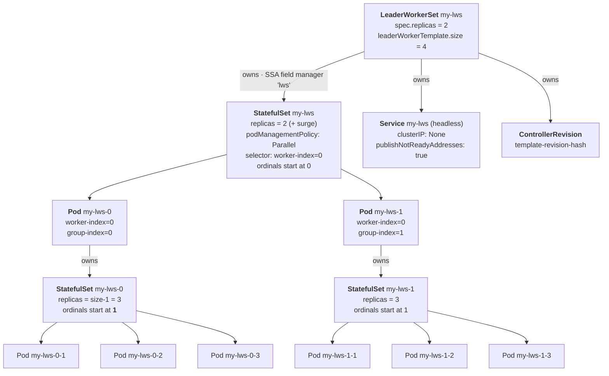

# LeaderWorkerSet: Problem Statement and Curriculum

A single H100 holds 80 GB. A 405B-parameter model in bf16 needs roughly 810 GB of weights before you allocate a single KV cache block. The arithmetic is not subtle: frontier inference does not fit on one accelerator, and increasingly it does not fit on one *host*. The moment your model spans hosts, the unit of work you actually care about stops being a pod and becomes a **set of pods that must be born together, addressed by rank, and killed together**.

Kubernetes has no such primitive. Deployment gives you interchangeable replicas. StatefulSet gives you ordered identity but scales one dimension. Job and JobSet give you run-to-completion semantics that a serving endpoint does not want. Each is a near-miss, and the industry response for two years was a pile of Helm templates gluing a StatefulSet to a headless Service to an init container that polls DNS.

[LeaderWorkerSet](https://github.com/kubernetes-sigs/lws) (LWS) is the SIG-Apps answer: an API where **a group of pods is the unit of replication**, and where rollout, scaling, placement, and failure handling all operate at group granularity. **DisaggregatedSet** (DS), shipped alongside it since v0.9.0, adds a second layer for prefill/decode disaggregated serving, where two or more *differently shaped* groups must be rolled out and scaled in lockstep.

These notes build the subject from the problem statement up to the source, covering **the multi-host inference problem space**, **the full API surface**, **group lifecycle and pod identity**, **the reconciler internals**, **the pod controller and failure handling**, **the rollout algorithm**, **scheduling and placement**, **DisaggregatedSet**, **inference engine integration**, **operations**, and **the contributor workflow**.

!!! info "Provenance"
    Everything here is verified against `kubernetes-sigs/lws` at commit **`32a9c37`** (2026-08-06), release **v0.9.0**. Where the upstream documentation and the upstream code disagree, these notes follow the code and record the discrepancy in [Appendix B](appendix_pr_opportunities.md). File paths like `pkg/controllers/leaderworkerset_controller.go` are relative to that tree.

---

## Part 1: Four Organizing Principles

Four ideas explain nearly every design decision in the codebase. Every module is, in some sense, an elaboration of one of them.

### Principle 1: The Group Is the Unit of Replication

In a Deployment, `replicas: 8` means eight interchangeable pods. In an LWS, `replicas: 8` means **eight independent copies of an entire sharded model server**, each internally consisting of `leaderWorkerTemplate.size` pods. The total pod count is `replicas × size`, but the number of *things you can lose* is 8.

This reframing is what makes every downstream behaviour coherent. Rolling update walks groups, not pods. HPA's scale subresource targets `spec.replicas`, and the `status.hpaPodSelector` deliberately selects **only leader pods** (`worker-index=0`) so that per-pod metric averaging divides by the group count rather than the pod count. Exclusive topology placement pins a group to one topology domain. Gang scheduling admits a group all-or-nothing.

**The consequence for reading the code**: whenever you see arithmetic in `leaderworkerset_controller.go`, ask which unit it is counting. The single most common source of confusion is that `status.replicas` counts leader-STS replicas *including surge replicas created during a rollout*, while the condition logic counts a partition-windowed, non-burst subset. They are different numbers on purpose.

### Principle 2: Identity Is Injected, Not Discovered

An inference engine needs its rank and world size **at process start**. vLLM's Ray bootstrap, SGLang's `--dist-init-addr`, and TensorRT-LLM's `mpirun` all want to know "who am I, how many of us are there, where is rank 0" before the first CUDA context is created. A discovery protocol — poll DNS, wait for peers, elect a leader — is a source of startup races and a thing every user would otherwise re-implement in an init container.

LWS injects the answer. A mutating webhook (`pkg/webhooks/pod_webhook.go`) stamps every pod with `LWS_LEADER_ADDRESS`, `LWS_GROUP_SIZE`, and `LWS_WORKER_INDEX` before the pod is ever scheduled, and the shared headless Service is created with `publishNotReadyAddresses: true` so the leader FQDN resolves before anything is Ready.

**The consequence**: those three environment variables are a stable ABI. Integration with a new inference engine is almost always a matter of mapping them onto the engine's own flags, and that mapping is the whole content of [Module 9](09_inference_engine_integration.md).

### Principle 3: Failure Is Group-Scoped Because State Is Group-Scoped

If a model is tensor-sharded across eight pods and one pod's container restarts, the other seven are holding shard state that the restarted process no longer agrees with. There is no partial-liveness state to recover to. Restarting the one pod produces a group that is *running* and *not serving* — the worst possible outcome, because readiness probes on the surviving pods may still pass.

LWS's default `restartPolicy: RecreateGroupOnPodRestart` therefore tears the whole group down when any pod is recreated or any container in any pod restarts. This is deliberately blunt, and [Module 5](05_pod_controller_and_failure_handling.md) walks the detection mechanism line by line — including `RecreateGroupAfterStart`, which suppresses the behaviour until every pod has left `Pending`, and why that variant exists.

### Principle 4: Compose Existing Controllers, Do Not Replace Them

LWS creates no pods directly. It creates **StatefulSets**, and lets the StatefulSet controller do ordinal assignment, stable DNS, PVC binding, and `podManagementPolicy: Parallel` creation. It does not implement admission control — that is Kueue. It does not implement gang scheduling — it delegates to Volcano via a `SchedulerProvider` interface. It does not implement autoscaling — it exposes `/scale` and lets HPA drive it.

**The consequence for contributors**: a surprising fraction of LWS behaviour is inherited, and several LWS features are gated on upstream Kubernetes feature gates (`StatefulSetStartOrdinal`, `MaxUnavailableStatefulSet`). Before proposing a new mechanism, check whether the composition point already exists — that question comes up in almost every KEP review.

---

## Part 2: The Object Graph

This diagram is the single most useful thing to have in your head before reading any controller code. Almost every subtlety in the codebase — why worker StatefulSets are owned by *pods*, why there are two watch paths, why `status.replicas` is what it is — falls out of this shape.

Three facts in that picture are load-bearing and routinely surprise people:

1. **There is exactly one leader StatefulSet for the whole LWS**, with `replicas` equal to the group count. Leader pods are its members, selected by `leaderworkerset.sigs.k8s.io/worker-index=0`.
2. **Each worker StatefulSet is owned by its leader *Pod***, not by the LWS. Garbage collection of a group is therefore a consequence of deleting the leader pod. This is also why the LWS reconciler needs a second, label-based watch (`enqueueLWSRequests`) — worker StatefulSets are not in its `Owns()` graph.
3. **Worker ordinals start at 1**, via `.spec.ordinals.start` on the worker StatefulSet, so that `workerIndex` is globally consistent: the leader is always index 0 and workers are 1..M. This is the dependency on the upstream `StatefulSetStartOrdinal` feature (GA since Kubernetes 1.31, which is why LWS requires ≥ 1.26 and asks you to enable the gate manually on exactly 1.26).

Layered on top, `DisaggregatedSet` manages **N LeaderWorkerSets** — one per role per slice per revision — and coordinates their rollout. That is [Module 8](08_disaggregatedset.md).

---

## Part 3: Curriculum Structure and Roadmap

| Module | Filename | Key Topics Covered |
| :--- | :--- | :--- |
| **[Module 1: Problem Space](01_multihost_inference_problem_space.md)** | [`01_multihost_inference_problem_space.md`](01_multihost_inference_problem_space.md) | TP/PP/EP sharding and what each demands of the orchestrator; prefill/decode disaggregation; why Deployment, StatefulSet, Job, and JobSet each fall short; LWS design axioms; the division of labour with Kueue, Volcano, JobSet, and llm-d |
| **[Module 2: API Surface](02_api_surface_anatomy.md)** | [`02_api_surface_anatomy.md`](02_api_surface_anatomy.md) | `LeaderWorkerSetSpec`/`Status` field by field; every label, annotation, and environment-variable constant; the scale subresource; the `Configuration` CRD; CRD generation and the KAL API-linter rules that constrain API PRs |
| **[Module 3: Groups and Identity](03_group_lifecycle_and_identity.md)** | [`03_group_lifecycle_and_identity.md`](03_group_lifecycle_and_identity.md) | The two-tier StatefulSet structure; naming and ordinals; subgroups (KEP-115, KEP-257); headless Services and DNS (KEP-173); startup policy (KEP-135); the pod mutating webhook; TPU environment injection |
| **[Module 4: The Reconciler](04_lws_reconciler_internals.md)** | [`04_lws_reconciler_internals.md`](04_lws_reconciler_internals.md) | `cmd/main.go` wiring, flags, and config precedence; the twelve-step `Reconcile`; Server-Side Apply and the `lws` field manager; status and condition computation; ControllerRevision (KEP-238) hashing, naming, and truncation |
| **[Module 5: Failure Handling](05_pod_controller_and_failure_handling.md)** | [`05_pod_controller_and_failure_handling.md`](05_pod_controller_and_failure_handling.md) | The pod controller's watches; leader-pod → worker-StatefulSet creation; the restart policies and container-restart detection; group recreation; exclusive-topology affinity injection; KEP-820 as an open proposal |
| **[Module 6: Rollouts](06_rollout_and_revisions.md)** | [`06_rollout_and_revisions.md`](06_rollout_and_revisions.md) | The rolling-update arithmetic — partition walk-down, `maxSurge` bursting, `maxUnavailable`; user-settable partition (KEP-511); the `MaxUnavailableStatefulSet` gate; revision semantics and rollbacks |
| **[Module 7: Scheduling](07_scheduling_placement_and_networking.md)** | [`07_scheduling_placement_and_networking.md`](07_scheduling_placement_and_networking.md) | Exclusive topology placement in depth; Kueue and Topology Aware Scheduling; gang scheduling (KEP-407) and the Volcano provider; subdomain policy trade-offs; `volumeClaimTemplates` (KEP-622); worker resizing (KEP-552) |
| **[Module 8: DisaggregatedSet](08_disaggregatedset.md)** | [`08_disaggregatedset.md`](08_disaggregatedset.md) | KEP-766 motivation; the planner/executor split; N-dimensional coordinated rollout; slices (KEP-846); placement policy (KEP-848); per-role autoscaling via `DisaggregatedSetRoleScaler` (KEP-849); revision-aware Services |
| **[Module 9: Engine Integration](09_inference_engine_integration.md)** | [`09_inference_engine_integration.md`](09_inference_engine_integration.md) | The `LWS_*` contract as an ABI; vLLM, SGLang, TensorRT-LLM, and llama.cpp patterns; probe design for multi-host engines; weight loading and cold start; the confidential-serving cross-reference |
| **[Module 10: Operations](10_operations_and_troubleshooting.md)** | [`10_operations_and_troubleshooting.md`](10_operations_and_troubleshooting.md) | Install paths and the CRD-first upgrade order; cert-manager versus internal cert management; metrics and Prometheus; HPA in practice; the version-compatibility matrix; a troubleshooting playbook |
| **[Module 11: Contributing](11_contributor_workflow.md)** | [`11_contributor_workflow.md`](11_contributor_workflow.md) | Repo layout; the `make` target map and pinned tool versions; envtest, kind e2e, and upgrade e2e; the `test/wrappers` builder idiom; golangci and the KAL API linter; codegen; the KEP process; the release process; review culture |
| **[Appendix A: Glossary](appendix_glossary.md)** | [`appendix_glossary.md`](appendix_glossary.md) | Every LWS, Kubernetes, and inference term used in these notes, grouped by domain |
| **[Appendix B: PR Backlog](appendix_pr_opportunities.md)** | [`appendix_pr_opportunities.md`](appendix_pr_opportunities.md) | Concrete, evidenced upstream contribution opportunities found while writing these notes, with file paths and difficulty ratings |
| **[Appendix C: Reading List](appendix_reading_list.md)** | [`appendix_reading_list.md`](appendix_reading_list.md) | Annotated primary sources — LWS KEPs, the upstream Kubernetes KEPs LWS depends on, and the inference-engine documentation |

---

## Part 4: How Each Module Is Built

Every module follows the same five-beat structure and closes with a hands-on lab.

1. **Conceptual foundation** — the problem stated before the solution, so the design reads as a consequence rather than a convention.
2. **Architecture and data flow** — Mermaid diagrams for every non-obvious mechanism, and a comparison table wherever two designs compete.
3. **API and code anatomy** — the actual identifiers, field paths, constant strings, and arithmetic, not paraphrases of them. Function names are given so you can `grep` them.
4. **Production pitfalls** — what breaks, what the upstream documentation understates or gets wrong, and what is still alpha.
5. **`## Lab:`** — a runnable exercise. The rollout algorithm does not become intuitive by reading the partition arithmetic; it becomes intuitive the first time you watch `kubectl get lws -w` during a `maxSurge` rollout and see the replica count overshoot.

!!! warning "On labs and scale"
    The labs target **real multi-host GPU capacity** — GKE accelerated node pools, A3/A4 machine families, and genuine multi-node tensor parallelism — because most of the interesting LWS behaviour only manifests when a group spans hosts. A single-node kind cluster will happily run every LWS API path and will teach you nothing about the failure modes that matter: cross-node DNS timing, gang-scheduling deadlock, exclusive-topology capacity starvation, and cold-start weight loading.

    Where a lab's commands have not been executed against a live cluster, they are marked **unverified** and transcribed from upstream documentation or example manifests. Capacity, not cost, is usually the binding constraint: multi-host accelerator types are region-limited and often require reservations or Dynamic Workload Scheduler flex-start. Check availability before planning a session.

    Every lab also has a `kind` fallback noted where one is genuinely informative — chiefly the API-validation and rollout-arithmetic labs, which need no accelerators at all.

Start with [Module 1: The Multi-Host Inference Problem Space](01_multihost_inference_problem_space.md).
