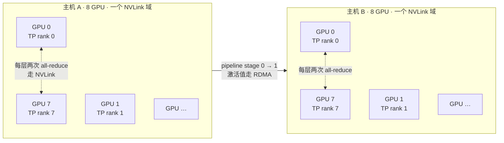
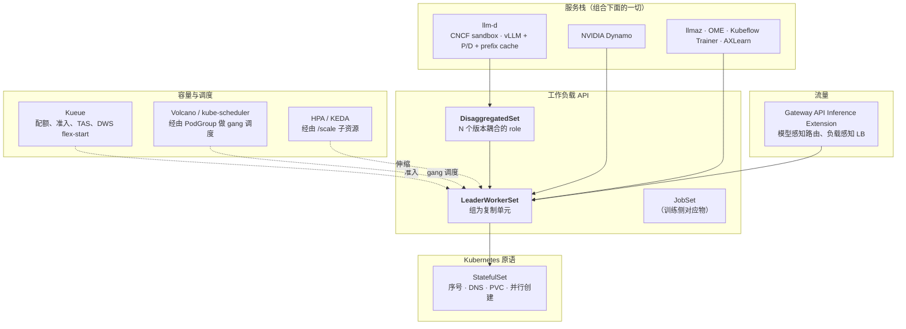

# 模块 1：多机推理的问题域

在读 LWS 源码的第一行之前，值得先把工作负载的形状说清楚。多机推理不是泛泛意义上的「一个分布式系统」——它是一个非常具体的形状，带着一组非常具体的诉求，而 LWS 几乎每一个设计决策都是对其中某一条的直接回应。跳过本模块的读者会觉得控制器代码里满是任意的选择；读过的人会觉得它基本上是必然的。

本模块覆盖**并行度分类学及各维度的诉求**、**prefill/decode 分离**、**把编排需求提炼成清单**、**Deployment、StatefulSet、Job、JobSet 各自在哪一条上失败**、**LWS 的答案**、**生态分工**，以及 **v0.9.0 时的项目现状**。

!!! info "溯源信息"
    对照 `kubernetes-sigs/lws` 的 `32a9c37`（2026-08-06）、v0.9.0 核实。

---

## 第一部分：工作负载的形状

### 1.1 逼出问题的那道算术

稠密 Transformer 在 bf16 下的权重显存约为 $2 \times P$ 字节，$P$ 为参数量。再加上推理侧的开销——激活缓冲、CUDA graph、运行时本身——然后是 KV cache，对批大小 $B$、序列长度 $L$ 而言约为

$$
2 \times L \times B \times n_{\text{layers}} \times n_{\text{kv heads}} \times d_{\text{head}} \times \text{每元素字节数}
$$

对当前的前沿模型，实际结论是：

| 模型量级 | bf16 权重 | 含余量的最小 HBM | 装得下的形态 |
| :--- | ---: | ---: | :--- |
| 8B 稠密 | ~16 GB | ~24 GB | 1 × L4 / A100-40 |
| 70B 稠密 | ~140 GB | ~200 GB | 2–4 × H100-80（单机） |
| 405B 稠密 | ~810 GB | ~1.1 TB | **2 台 8×H100 主机** |
| 671B MoE（DeepSeek 量级） | ~1.3 TB | ~1.8 TB | **4 台 8×H100 主机** |

真正重要的阈值不是「能不能装进一张 GPU」，而是**「能不能装进一个 NVLink 域」**。机内 GPU 之间走 NVLink/NVSwitch，带宽数百 GB/s；跨机则走 RDMA fabric——InfiniBand、RoCE，或云上的等价物如 GPUDirect-TCPX——带宽明显更低、延迟明显更高。跨过这条边界，就是「调度问题」变成「**编排**问题」的那一刻，因为从此 Pod 之间的相对放置直接决定了这个负载是快、是慢，还是根本不能用。

### 1.2 并行度分类学

生产推理里会出现四种并行维度。它们是乘性叠加的，而且每一种对编排器的诉求都不一样。



| 维度 | 切什么 | 通信模式 | 带宽敏感度 | 对编排的诉求 |
| :--- | :--- | :--- | :--- | :--- |
| **TP**（张量） | 每一个权重矩阵，跨 rank 切 | **每个 Transformer 层两次** `all-reduce` | 极高——所以 TP 想待在 NVLink 里 | 所有 TP rank 必须共处一个高带宽域、同时启动，并在进程启动时就知道 world size |
| **PP**（流水） | 层，切成顺序的 stage | stage 边界上的点对点激活值传递 | 中等——每个 micro-batch 每个边界一次 | stage 可以跨机；stage 的顺序和可寻址性很重要 |
| **EP**（专家） | MoE 专家，跨 rank 切 | 每个 MoE 层一次 token dispatch/combine 的 `all-to-all` | 高且**突发**——流量取决于路由 | 与 TP 同样的共置压力，外加对负载不均衡敏感 |
| **DP**（数据） | 什么都不切；互相独立的副本 | 副本之间无通信 | 零 | 这就是横向扩展的维度——也正是 `LeaderWorkerSet.spec.replicas` 在数的东西 |

关键观察是：**TP、PP、EP 都活在一个服务单元的*内部*，而 DP 活在服务单元*之间*。** 一个只理解「Pod 数量」的编排器无法表达这件事。它需要知道这 16 个 Pod 是「两份 8-Pod 的东西」，而不是「十六份什么东西」。

### 1.3 Prefill/Decode 分离

第二个结构性事实是：LLM 推理有两个硬件画像相反的阶段。

| | Prefill | Decode |
| :--- | :--- | :--- |
| 做什么 | 处理整个 prompt，建 KV cache | 一次生成一个 token |
| 可用并行度 | 极大——所有 prompt token 一起算 | 每个序列每步一个 token |
| 瓶颈 | **算力受限**（FLOPs） | **显存带宽受限**（读权重 + KV cache） |
| 理想批次 | 小批次、长序列 | 大批次，摊薄权重读取 |
| 理想硬件 | FLOPs 越高越好 | HBM 带宽和容量越大越好 |
| 延迟 SLO | TTFT（首 token 时间） | ITL / TPOT（token 间延迟） |

把两个阶段跑在同一个进程里就必须折中：continuous batching 会把它们交织起来，一次长 prefill 会卡住批次里的每一个 decode（表现为 ITL 尖刺的「队头阻塞」）。**分离式服务**把它们拆成独立的池，把 KV cache 经由 fabric 从 prefill 传给 decode。vLLM 和 SGLang 都支持这种模式。

由此带来的编排后果非常严重，而这正是 `DisaggregatedSet` 存在的理由：

- prefill 池和 decode 池**形状不同**（TP 度不同、GPU 型号不同、副本数不同）。
- 它们的副本数必须**独立伸缩**——最优 P:D 比取决于「prompt 长度 : 生成长度」的比值，会随流量漂移。
- 它们**在版本上是耦合的**。prefill 服务器把 KV cache 交给 decode 服务器；两者必须在布局、量化、模型版本上完全一致。只滚其中一个是正确性 bug，不是性能问题。
- 流量路由必须**感知 revision**：一个请求的 prefill 和 decode 必须落在**同一 revision** 的后端上。

最后这条是[模块 8](08_disaggregatedset.md) 中影响最深远的设计约束，也是 DisaggregatedSet 为什么给「每个 role 的每个 revision」各建一个 LeaderWorkerSet、而不是复用 LWS 自己的 `partition` 机制的原因。

### 1.4 需求清单

把 1.1–1.3 提炼成「编排器到底必须提供什么」：

| | 需求 | 由什么驱动 |
| :--- | :--- | :--- |
| **R1** | $N$ 个 Pod 组成的组，**作为一个整体**创建、伸缩、更新、删除 | TP/PP/EP 在组内；DP 在组间 |
| **R2** | 每个 Pod 在**进程启动前**就知道自己的 rank 和 world size | 集合通信库在 init 时就要 `WORLD_SIZE`/`RANK` |
| **R3** | 每个 Pod 能在任何 Pod Ready 之前，用稳定名字**寻址到其他每个 Pod** | rendezvous 发生在启动过程中，不是启动之后 |
| **R4** | 组可选地**共置**在指定的拓扑域内 | TP/EP 的带宽敏感度 |
| **R5** | 整个组的容量**要么全拿到要么都不拿** | 半调度的组占着 GPU 却不提供服务 |
| **R6** | 单个 Pod 或容器故障要**重建整个组** | 分片状态没有部分恢复的路径 |
| **R7** | 滚动更新**逐组推进**，surge 与不可用度可配置 | 更新半个组会产生混版本的集合通信 |
| **R8** | 横向伸缩作用于**组的数量**，指标按组聚合 | DP 才是伸缩维度 |
| **R9** | 多个**形状不同、版本耦合**的组能被统一管理和联动滚动 | prefill/decode 分离 |

R1–R8 是 LeaderWorkerSet。R9 是 DisaggregatedSet。

---

## 第二部分：既有 API 差在哪

LWS 出现之前，每一个内置工作负载 API 都被拿来试过。搞清楚每个具体断在哪一环，是理解 LWS 为什么长这样的最快路径。

| API | R1 组为单位 | R2 rank | R3 稳定 DNS | R5 gang | R6 组重启 | R7 组滚动 | R8 组伸缩 |
| :--- | :---: | :---: | :---: | :---: | :---: | :---: | :---: |
| **Deployment** | ✗ | ✗ | ✗ | ✗ | ✗ | ✗ | ✗ |
| **StatefulSet** | ✗ | 部分 | ✓ | ✗ | ✗ | ✗ | ✗ |
| **Job** | ✓（完成语义） | ✓（indexed） | 部分 | 靠插件 | ✗ | 不适用 | 不适用 |
| **JobSet** | ✓ | ✓ | ✓ | ✓ | ✓ | 不适用 | 不适用 |
| **LeaderWorkerSet** | ✓ | ✓ | ✓ | ✓（alpha） | ✓ | ✓ | ✓ |

### 2.1 Deployment

Deployment 的模型是*可互换、匿名、可单独替换*的副本。这三个词对一个分片模型服务器全是错的。Pod 名字带随机后缀，因此没有 rank。没有 per-pod DNS。滚动更新逐个替换 Pod，所以更新中途你会得到一个权重不一致的集合通信组。它不是差一点，它是反着设计的。

### 2.2 StatefulSet

StatefulSet 接近得多，而且事实上正是 LWS 的底座。它给你序号身份（`sts-0`、`sts-1`……）、通过 headless Service 实现的 per-pod 稳定 DNS、用于同时创建的 `podManagementPolicy: Parallel`，以及 PVC 模板。

它断在**维度**上。StatefulSet 只有一个 `replicas` 旋钮。而多机模型需要两个：每组几个 Pod、一共几组。把两者压进一个数字（`replicas = 组数 × 组大小`）会毁掉所有组级操作：

- 滚动更新按序号走 Pod，于是它会把「组 0 的第 7 个 Pod」和「组 1 的第 0 个 Pod」当作两件无关的事来更新——必然产生混版本集合通信。
- 想加一个组，结果只加了一个 Pod。
- HPA 无法表达「再来一份那个 8-Pod 的东西」。
- 故障处理天然就是 per-pod 的。

而且它没有 leader 的概念——没有一个 Pod 可以被路由、可以聚合指标、可以跑引擎的前端。

### 2.3 Job 与 JobSet

Indexed Job 给你 `JOB_COMPLETION_INDEX`，这是货真价实的 rank。[JobSet](https://github.com/kubernetes-sigs/jobset)——LWS 在 SIG-Apps 的姊妹项目——把多个 Job 组合成一个 gang 调度、DNS 可寻址的单元，用于多机**训练**确实非常好。

不匹配之处在于 **run-to-completion 语义**。Job 在 Pod 成功退出时算完成；而服务端点永远不会「成功退出」。具体表现为：没有滚动更新（你只能整体替换 JobSet）、没有给 HPA 用的 scale 子资源、backoff/retry 语义是为批任务失败而不是为热端点调的，以及一个「succeeded 是你永远不想到达的终态」的生命周期。

上游的立场是 JobSet 和 LWS 互补而非竞争：**JobSet 管训练，LWS 管服务。** 两者共享相当多的设计基因——gang 调度、独占放置、per-replica DNS——所以在其中一个上学到的模式可以迁移到另一个。

### 2.4 框架专属 Operator

Ray、MPI Operator、TorchElastic 之类都解决了 rank 分配和 rendezvous，也被广泛使用。代价是它们把一整个框架的控制面塞进了你的服务路径、它们是框架专属的、它们的故障语义是框架的而不是 Kubernetes 的。LWS 的立场是：rank 分配和组生命周期属于**工作负载 API**，框架应该只是容器镜像里的一个细节——所以 LWS 是与基于 Ray 的 vLLM 部署**集成**，而不是取代它（见[模块 9](09_inference_engine_integration.md)）。

---

## 第三部分：LeaderWorkerSet 的答案

### 3.1 最小对象

下面是一个完整的双机张量并行部署，只保留了关键字段。

```yaml
apiVersion: leaderworkerset.x-k8s.io/v1
kind: LeaderWorkerSet
metadata:
  name: vllm
spec:
  replicas: 2                              # R8：两个互相独立的模型服务器
  leaderWorkerTemplate:
    size: 2                                # R1：每个服务器 2 个 Pod（leader + 1 worker）
    restartPolicy: RecreateGroupOnPodRestart  # R6：默认值
    leaderTemplate:
      spec:
        containers:
          - name: vllm-leader
            image: vllm/vllm-openai:latest
            resources: { limits: { nvidia.com/gpu: "8" } }
    workerTemplate:
      spec:
        containers:
          - name: vllm-worker
            image: vllm/vllm-openai:latest
            resources: { limits: { nvidia.com/gpu: "8" } }
  rolloutStrategy:                         # R7
    type: RollingUpdate
    rollingUpdateConfiguration:
      maxUnavailable: 1
      maxSurge: 0
```

共 4 个 Pod，分成 2 组、每组 2 个，每组横跨 2 台各 8 卡的主机——每组 16 路张量并行。API 把组数和组大小表达成两个独立的数字，其余一切都由此推出。

!!! note "组名就是 API"
    注意两级命名：leader Pod 是 `vllm-0`、`vllm-1`；worker 是 `vllm-0-1`、`vllm-1-1`。leader Pod 的名字**就是**组名，在整个控制器里被用作 owner 和身份锚点。[模块 3](03_group_lifecycle_and_identity.md) 会讲透这一点。

### 3.2 需求到机制的映射

这张表就是后续笔记的路线图。

| 需求 | 机制 | 代码位置 | 模块 |
| :--- | :--- | :--- | :--- |
| R1 | leader StatefulSet 每组一个 leader Pod；每个 leader Pod 拥有一个 worker StatefulSet | `pkg/controllers/leaderworkerset_controller.go`、`pkg/controllers/pod_controller.go` | [3](03_group_lifecycle_and_identity.md)、[4](04_lws_reconciler_internals.md) |
| R2 | mutating webhook 注入 `LWS_WORKER_INDEX`、`LWS_GROUP_SIZE` | `pkg/webhooks/pod_webhook.go` | [3](03_group_lifecycle_and_identity.md) |
| R3 | `LWS_LEADER_ADDRESS` + 带 `publishNotReadyAddresses: true` 的 headless Service；`subdomainPolicy` 取 Shared 或 UniquePerReplica | `pkg/utils/controller/controller_utils.go`、KEP-173 | [3](03_group_lifecycle_and_identity.md)、[7](07_scheduling_placement_and_networking.md) |
| R4 | `leaderworkerset.sigs.k8s.io/exclusive-topology` annotation → 注入 Pod 亲和/反亲和 | `pkg/controllers/pod_controller.go` | [5](05_pod_controller_and_failure_handling.md)、[7](07_scheduling_placement_and_networking.md) |
| R5 | `SchedulerProvider` 接口 → Volcano `PodGroup`，由 `PodGroupPerReplica` feature gate 控制 | `pkg/schedulerprovider/`、KEP-407 | [7](07_scheduling_placement_and_networking.md) |
| R6 | `restartPolicy` + Pod 控制器里的容器重启检测 | `pkg/controllers/pod_controller.go` | [5](05_pod_controller_and_failure_handling.md) |
| R7 | 在 leader StatefulSet 上递减 partition，配合 `maxSurge`/`maxUnavailable` | `rollingUpdateParameters()` | [6](06_rollout_and_revisions.md) |
| R8 | `+kubebuilder:subresource:scale` 配 `selectorpath=.status.hpaPodSelector`，选择器只选 leader Pod | `api/leaderworkerset/v1/leaderworkerset_types.go` | [2](02_api_surface_anatomy.md)、[6](06_rollout_and_revisions.md) |
| R9 | `DisaggregatedSet` 管理 N 个 LeaderWorkerSet，每个 (slice, revision, role) 一个 | `pkg/controllers/disaggregatedset/` | [8](08_disaggregatedset.md) |

### 3.3 为什么是两层 StatefulSet

LWS 里最常被质疑的设计决策，就是这个两层结构：整个 LWS 一个 leader StatefulSet，外加每组一个由 leader **Pod** 拥有的 worker StatefulSet。显而易见的替代方案——一个 `replicas × size` 的扁平 StatefulSet——在 §2.2 就已经出局。不那么显然的替代方案——由 LWS 控制器直接创建 worker StatefulSet——值得理解，因为被否掉的这个选项解释了很多代码。

让 **leader Pod** 成为 worker StatefulSet 的 owner，买到了三样东西：

1. **垃圾回收是免费的。** 删掉 leader Pod 会级联到它的 worker StatefulSet，再级联到 worker Pod。缩容、滚动更新、`RecreateGroupOnPodRestart` 时的组拆除，都只是「一次 delete + Kubernetes 自带的 GC」。这里没有 finalizer——事实上 `Reconcile` 一旦看到 `DeletionTimestamp` 就直接返回。
2. **组的生命周期锚定在一个真实对象上。** leader Pod 的存在**就是**这个组的存在，这给了控制器一个天然的地方去挂 label（`group-index`、`group-key`），也给了 scale 子资源选择器一个天然的 key。
3. **滚动更新白捡一个排序原语。** 因为 leader Pod 是某个 StatefulSet 的成员，LWS 可以直接借 StatefulSet 控制器自己的 `partition` 机制来驱动逐组滚动，而不必自己实现有序替换。

代价是真实存在的：worker StatefulSet **不在** LWS 控制器的 `Owns()` 图里，所以控制器需要第二条基于 label 的 watch 才能感知它们的变化。那就是[模块 4](04_lws_reconciler_internals.md) 里的 `enqueueLWSRequests`——忘了它的存在，是「我的 reconcile 怎么没触发」这类困惑的常见来源。

---

## 第四部分：生态分工

LWS 刻意做得很小。知道它**拒绝**做什么，和知道它做什么同样重要——一个给 LWS 加上「它已经明确委托出去的职责」的 PR，是不会被合的。



| 关注点 | 归属 | LWS 的角色 |
| :--- | :--- | :--- |
| 序号、稳定 DNS、PVC 绑定、并行创建 Pod | StatefulSet | 创建并配置 StatefulSet |
| 配额、排队、准入、拓扑感知调度、DWS flex-start | Kueue | 带上 `kueue.x-k8s.io/queue-name` label；其余被动 |
| Gang 调度 | Volcano（经 `SchedulerProvider`） | 每组建一个 `PodGroup`，给 Pod 打上标签 |
| 横向自动伸缩 | HPA / KEDA | 暴露 `/scale`；发布只含 leader 的 Pod 选择器 |
| 模型感知的请求路由、prefix-cache 感知的负载均衡 | Gateway API Inference Extension | 无——路由不在范围内 |
| 模型下载、量化、引擎参数 | 容器镜像 | 无 |
| prefill/decode 的 role 协调 | **DisaggregatedSet** | 同一项目，上一层 |

读 issue 和 PR 时，有两条共同设计关系值得知道。**[llm-d](https://github.com/llm-d/llm-d)**（CNCF sandbox）是两个 API 共同设计时的参考消费方，好几个 KEP 直接引用了 llm-d 的需求。**JobSet** 是姊妹 API；当某个机制只在其中一边存在时，review 里就会冒出「这个是不是该共用」，而诚实的回答通常是「早晚要，靠一个还不存在的公共库」。

---

## 第五部分：v0.9.0 时的项目现状

### 5.1 特性成熟度

| 特性 | KEP | 成熟度 | 备注 |
| :--- | :--- | :--- | :--- |
| 核心组 API（leader + worker，双模板） | — | Stable | `leaderworkerset.x-k8s.io/v1` |
| 带 `maxUnavailable`/`maxSurge` 的滚动更新 | — | Stable | `maxUnavailable > 1` 需要上游 `MaxUnavailableStatefulSet` gate |
| 基于 ControllerRevision 的滚动更新 | KEP-238 | Stable | 支撑回滚与 revision 感知的 status |
| 独占拓扑放置 | — | Stable | annotation 驱动 |
| 重启策略 / 组级故障处理 | — | Stable | `Default` 取值已废弃，改用 `None` |
| Startup policy（`LeaderReady`） | KEP-135 | Stable | |
| 子组 | KEP-115、KEP-257 | Stable | `LeaderWorker` 与 `LeaderExcluded` 两种策略类型 |
| 每组一个 headless Service | KEP-173 | Stable | `subdomainPolicy: UniquePerReplica` |
| 用户可设的 `partition` | KEP-511 | Stable | 灰度与 xPyD 滚动 |
| `volumeClaimTemplates` | KEP-622 | Stable | 注意[模块 7](07_scheduling_placement_and_networking.md) 提到的字段透传缺口 |
| `size` 可调整 | KEP-552 | Stable | |
| Gang 调度 | KEP-407 | **Alpha** | 仅 Volcano；`PodGroupPerReplica` feature gate；API 可能变 |
| `RecreateGroupAfterStart` | — | **Experimental** | 由 annotation 开启，不是 spec 字段 |
| DisaggregatedSet | KEP-766 | **Alpha** | v0.9.0 随发 |
| DisaggregatedSet slices | KEP-846 | **Alpha** | |
| DisaggregatedSet 放置策略 | KEP-848 | **Alpha** | |
| DisaggregatedSet per-role HPA | KEP-849 | **Alpha** | `DisaggregatedSetRoleScaler` |
| Fail-fast restart budget | KEP-820 | **仅提案** | `status: provisional`，`pkg/` 中无实现 |

alpha 那一列就是贡献机会所在。见[附录 B](appendix_pr_opportunities.md)。

### 5.2 采用情况

上游列出的公开采用方：**AWS**（EKS 多机 TensorRT-LLM + Triton，以及一套启用 EFA 的 EKS Blueprints 多机 vLLM 模式）、**DaoCloud**（跨节点大模型的默认方式）、**Google Cloud**（GKE 多机生成式 AI 服务；DeepSeek-R1 671B 与 Llama 3.1 405B 指南）、**NVIDIA**（多机 NIM 的推荐部署方式）、**Red Hat**（OpenShift 上经 OperatorHub 提供的 Leader Worker Set Operator）。

列出的集成方：AXLearn、Kubeflow Trainer、llm-d、llmaz、NVIDIA Dynamo、OME、SGLang、vLLM。

这份名单对贡献者的实用价值在于：它告诉你**谁会感受到你的改动**。一个对 `leaderWorkerTemplate` 的 API 改动会碰到上面每一个；一个对 DisaggregatedSet planner 的改动基本只碰到 llm-d——这也是 DS 的 alpha 改动能明显更快通过 review 的原因。

### 5.3 治理

LWS 位于 `kubernetes-sigs` 下的 **SIG-Apps**。讨论在 Kubernetes Slack 的 `#sig-apps` 和 `kubernetes-sig-apps` 邮件列表。根 `OWNERS` 层的 approver 是一小撮人——`ahg-g`、`Edwinhr716`、`kerthcet` 在 `OWNERS`、`site/OWNERS` 和各 KEP 的 approver 名单里反复出现——所以 PR 的限速环节通常是 review 带宽而不是意见分歧。非平凡特性需要 KEP；[模块 11](11_contributor_workflow.md) 会走一遍这个流程。

---

## 实验：建立基线

目标是搭出一套可用的双机张量并行部署，后续每个模块都会回到它上面。之后的一切都假设你已经有了它。

!!! warning "规模与验证状态"
    本实验需要**两个各带 8 张 GPU 的节点**，且处于同一个高带宽域内，以及一个大到确实需要两台机器的模型。用单卡凑数能跑通 API 路径，但关于 R3、R4、R5 你什么都学不到。下面的命令转录自上游示例和 GKE 文档，凡未在活集群上执行的均标注 **unverified**。

### 步骤 1 — 准备多机加速器容量（unverified）

```bash
# GKE：一个 2 节点的 A3 High 池。placement policy 让两个节点落在
# 同一个高带宽域内，这是跨机 TP 可行的前提。
gcloud container node-pools create a3-pool \
  --cluster=lws-lab --region=us-central1 \
  --machine-type=a3-highgpu-8g \
  --accelerator=type=nvidia-h100-80gb,count=8,gpu-driver-version=latest \
  --num-nodes=2 \
  --placement-type=COMPACT \
  --enable-gvnic
```

这类机型的容量受地域限制。如果 `COMPACT` 放置无法满足，要么申请预留，要么用 Dynamic Workload Scheduler flex-start——注意 flex-start 会把调度这件事变得足够不同，以至于在[模块 7](07_scheduling_placement_and_networking.md) 里需要单独讨论。

### 步骤 2 — 安装 LWS

```bash
VERSION=v0.9.0
kubectl apply --server-side -f \
  https://github.com/kubernetes-sigs/lws/releases/download/$VERSION/manifests.yaml

kubectl -n lws-system rollout status deploy/lws-controller-manager
kubectl api-resources | grep -E 'leaderworkerset|disaggregatedset'
```

你应该看到 `leaderworkersets`（短名 `lws`），以及自 v0.9.0 起的 `disaggregatedsets` 和 `disaggregatedsetrolescalers`。

### 步骤 3 — 部署基线并读懂对象图

以上游的 vLLM 示例为起点，然后**从活集群上**而不是从 YAML 上回答下面这些问题：

```bash
kubectl get lws,sts,svc,pods -o wide
kubectl get controllerrevision
```

逐条确认第三部分 3.3 的论断：

1. 有**一个**与 LWS 同名的 StatefulSet，其 `replicas` 等于 `spec.replicas`。
2. **每组额外一个** StatefulSet，以其 leader Pod 命名。
3. `kubectl get sts <组名> -o jsonpath='{.spec.ordinals.start}'` 返回 `1`。
4. `kubectl get sts <组名> -o jsonpath='{.metadata.ownerReferences[0].kind}'` 返回 `Pod`，而不是 `LeaderWorkerSet`。
5. `kubectl get svc <lws 名> -o jsonpath='{.spec.publishNotReadyAddresses}'` 返回 `true`。

### 步骤 4 — 亲手证伪 StatefulSet 方案

别把 §2.2 当结论接受，自己证一遍。把 LWS 扩一个组，看看变了什么：

```bash
kubectl scale lws/vllm --replicas=3
kubectl get pods -w
```

然后数一数：出现了几个 Pod，它们相互之间的出现顺序是什么？再想想一个 `replicas: 6` 的 StatefulSet 在 `kubectl scale --replicas=7` 时会做什么。「多一个组」和「多一个 Pod」之间的差别，就是这个 API 的全部理由。

### 步骤 5 — 建立故障基线

```bash
# 杀掉组 0 里的一个 worker，观察爆炸半径。
kubectl delete pod vllm-0-1
kubectl get pods -w
```

记录哪些 Pod 被重建了。这就是 R6 和默认的 `RecreateGroupOnPodRestart` 策略在起作用；[模块 5](05_pod_controller_and_failure_handling.md) 里你会换一个 `restartPolicy` 重做同样的实验。

### 检查点问题

- 为什么 **leader** StatefulSet 不设 `.spec.ordinals.start`，而每个 worker StatefulSet 都设？
- 如果你直接删掉组 1 的 leader Pod，是谁清理掉它的 worker StatefulSet——LWS 控制器，还是 Kubernetes 垃圾回收？
- 你的模型需要 16 路 TP，但一个 NVLink 域只装得下 8 张卡。这对 `size` 意味着什么？对 R4 又意味着什么？

继续阅读[模块 2：API 表面全解剖](02_api_surface_anatomy.md)。
