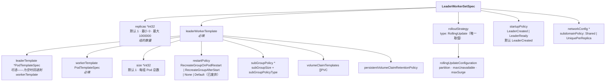
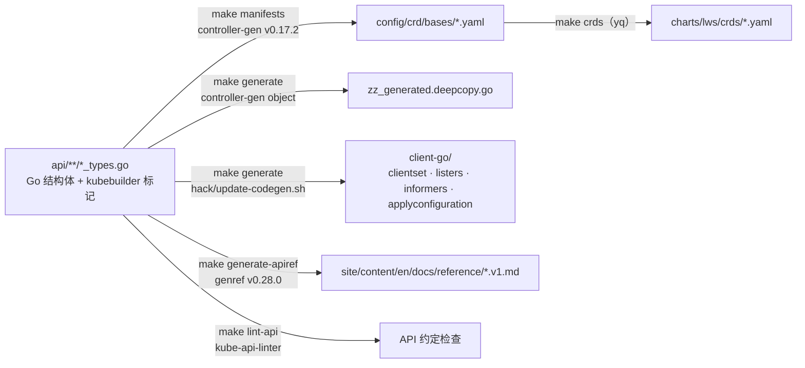

# 模块 2：API 表面全解剖

API 是一份契约，而在 Kubernetes 里它同时由三处强制执行：CRD 的 OpenAPI schema（结构校验）、准入 webhook（默认值与语义校验）、以及控制器（其余一切）。一个字段的真实行为是三者的交集，只读 Go 结构体，至少有一半会被误导。

本模块把这层次摊开，走一遍完整的 LWS API 表面：**三个 API group**、**`LeaderWorkerSetSpec` 逐字段**、**status 与 conditions**、**scale 子资源**、**完整的默认值与校验规则**、**元数据契约**（全部 label、annotation、环境变量）、**配置控制器自身的 `Configuration` CRD**，以及**要让 API PR 通过所必须满足的代码生成与 API linter 机制**。

!!! info "溯源信息"
    对照 `kubernetes-sigs/lws` 的 `32a9c37`（2026-08-06）、v0.9.0 核实。类型定义在 `api/leaderworkerset/v1/leaderworkerset_types.go`；webhook 规则在 `pkg/webhooks/leaderworkerset_webhook.go`。

---

## 第一部分：三个 API Group

LWS 提供三个不同的 API group，把它们搞混是新手常犯的错——尤其因为 **label** 用的域名（`sigs.k8s.io`）和 **API group**（`x-k8s.io`）不一样。

| Group | 版本 | Kind | 用途 | 源码 |
| :--- | :--- | :--- | :--- | :--- |
| `leaderworkerset.x-k8s.io` | `v1` | `LeaderWorkerSet` | 核心工作负载 API | `api/leaderworkerset/v1/` |
| `disaggregatedset.x-k8s.io` | `v1` | `DisaggregatedSet`、`DisaggregatedSetRoleScaler` | 多 role 分离式服务 | `api/disaggregatedset/v1/` |
| `config.lws.x-k8s.io` | `v1alpha1` | `Configuration` | 控制器管理器的配置文件格式，**不是**集群资源 | `api/config/v1alpha1/` |

三份 CRD manifest 生成到 `config/crd/bases/`，并镜像到 `charts/lws/crds/`：

```
leaderworkerset.x-k8s.io_leaderworkersets.yaml
disaggregatedset.x-k8s.io_disaggregatedsets.yaml
disaggregatedset.x-k8s.io_disaggregatedsetrolescalers.yaml
```

!!! warning "Label 域名与 API group 不一致"
    所有 LWS 的 label 和 annotation 都在 **`leaderworkerset.sigs.k8s.io/`** 下，而 API group 是 **`leaderworkerset.x-k8s.io`**。DisaggregatedSet 自身是一致的（两边都是 `disaggregatedset.x-k8s.io/`）。这个不对称是历史原因造成的，而且是承重的——写错域名的 selector 和 `kubectl` 过滤条件会静默地匹配不到任何东西。

`LeaderWorkerSet` 注册了短名 **`lws`** 和四个打印列：

```go
//+kubebuilder:resource:shortName={lws}
//+kubebuilder:printcolumn:name="Ready",type="integer",JSONPath=".status.readyReplicas"
//+kubebuilder:printcolumn:name="Desired",type="integer",JSONPath=".spec.replicas"
//+kubebuilder:printcolumn:name="Up-to-date",type="integer",JSONPath=".status.updatedReplicas"
//+kubebuilder:printcolumn:name="Age",type="date",JSONPath=".metadata.creationTimestamp"
```

所以 `kubectl get lws` 一眼就能看到滚动状态：`Desired` 是你要的，`Up-to-date` 是滚动走到哪了，`Ready` 是真正在提供服务的量。在 `maxSurge` 滚动期间，这三个数字谁都不必等于谁。

---

## 第二部分：`LeaderWorkerSetSpec` 逐字段



### 2.1 `replicas`——组的数量

```go
// +kubebuilder:default=1
// +kubebuilder:validation:Minimum=0
// +kubebuilder:validation:Maximum=1000000
Replicas *int32 `json:"replicas,omitempty"`
```

这是 **leader-worker 组的数量**，不是 Pod 数量。Pod 总数是 `replicas × size`。它是 scale 子资源的目标；webhook 额外强制 `int64(replicas) * int64(size) <= math.MaxInt32`，避免乘积溢出下游用的 int32。

`replicas: 0` 是合法的，也是「先停掉但不删」的惯用写法。注意它与滚动校验的互动：当 `replicas == 0` 时，「maxUnavailable 和 maxSurge 不能同时为 0」这条规则会被**跳过**。

### 2.2 `leaderWorkerTemplate.size`——组的大小

```go
// +kubebuilder:default=1
Size *int32 `json:"size,omitempty"`
```

每组的 Pod **总数**，含 leader。`size: 1` 表示只有 leader、没有 worker——而控制器仍然会为该组创建一个 **0 副本的 worker StatefulSet**，这会让读 `kubectl get sts` 的人吃一惊。webhook 强制 `size >= 1`。

`size` 是**可变的**（KEP-552，「可调整的 worker」）。改它会触发滚动更新，因为它改变了 Pod 模板上的 `leaderworkerset.sigs.k8s.io/size` annotation，从而改变了 revision hash。

### 2.3 `leaderTemplate` 与 `workerTemplate`——双模板

`workerTemplate` 必填；`leaderTemplate` 可选，为空时**回退为 `workerTemplate` 的深拷贝**。这是「模板相同」的便捷路径：同构的组只需要写一份模板。

双模板设计之所以存在，是因为在大多数真实部署里 leader 确实不一样。它跑 OpenAPI server，它是 Ray head 或 `mpirun` 的 launcher，它暴露 Service 路由所依据的 readiness probe，而且它请求的资源往往略有不同。当你**确实**两个都写时，它们是两份独立的 `PodTemplateSpec`——没有合并、没有 strategic patch、没有继承。

!!! note "两个模板都进 revision hash"
    既然两个模板都属于 `leaderWorkerTemplate`，改其中任何一个都会触发所有组的滚动更新。没有「只更新 worker 模板」这条路。

### 2.4 `restartPolicy`——组的故障语义

```go
// +kubebuilder:default=RecreateGroupOnPodRestart
// +kubebuilder:validation:Enum={Default,RecreateGroupOnPodRestart,RecreateGroupAfterStart,None}
```

| 取值 | 行为 | 状态 |
| :--- | :--- | :--- |
| `RecreateGroupOnPodRestart` | 任一 Pod 被重建，或任一容器/init 容器重启 → **整组重建**。 | 默认 |
| `RecreateGroupAfterStart` | 同上，但仅在**组内每个 Pod 都已离开 `Pending`** 之后才生效。抑制初次调度期间的抖动。 | Stable |
| `None` | StatefulSet 语义——只重启故障的那个 Pod。 | Stable |
| `Default` | 与 `None` 完全相同。 | **已废弃**；defaulting webhook 会静默改写为 `None`。 |

`Default` → `None` 的改写发生在 mutating webhook 里，所以持久化后的对象永远不会留着 `Default`。如果你在某份 manifest 里见到它，那要么来自改写之前的版本，要么来自绕过准入的客户端。检测机制见[模块 5](05_pod_controller_and_failure_handling.md)。

### 2.5 `subGroupPolicy`——组内再分区

```go
type SubGroupPolicy struct {
    // +kubebuilder:validation:Enum={LeaderWorker,LeaderExcluded}
    // +kubebuilder:default=LeaderWorker
    Type         *SubGroupPolicyType `json:"subGroupPolicyType,omitempty"`
    SubGroupSize *int32              `json:"subGroupSize,omitempty"`
}
```

子组（KEP-115、KEP-257）把一个组切成等大的单元，每个单元可以拥有各自的独占拓扑域——最典型的用法是在跨机组里「每台主机一个子组」。

| 类型 | 语义 |
| :--- | :--- |
| `LeaderWorker`（默认） | leader 参与某个子组。若 `(size-1) % subGroupSize == 0`，leader 是「多出来的那个」，并入第一个子组，于是第一个子组有 `subGroupSize + 1` 个成员。若 `size % subGroupSize == 0`，各子组恰好 `subGroupSize` 个，leader 占据第一个子组的第一个位置。 |
| `LeaderExcluded` | leader **不属于任何**子组。要求 `(size-1) % subGroupSize == 0`。 |

!!! danger "上游 concepts 页面把这个写错了"
    `site/content/en/docs/concepts/_index.md` 描述了一个叫 **`LeaderOnly`** 的取值，并说它表示「为 leader 单独创建一个 SubGroup」。这个名字和这个语义在代码里都不存在——取值是 `LeaderExcluded`，含义正好相反。修这一页是目前价值最高的文档 PR；见[附录 B](appendix_pr_opportunities.md)。

`subGroupSize` 一旦设定就**不可变**，而且不能在已有 LWS 上新增或移除。webhook 对这三种变更都做了显式拦截。

### 2.6 `rolloutStrategy`

```go
type RollingUpdateConfiguration struct {
    // +kubebuilder:default=0
    Partition *int32 `json:"partition,omitempty"`
    // +kubebuilder:validation:XIntOrString
    // +kubebuilder:default=1
    MaxUnavailable intstr.IntOrString `json:"maxUnavailable,omitempty"`
    // +kubebuilder:validation:XIntOrString
    // +kubebuilder:default=0
    MaxSurge intstr.IntOrString `json:"maxSurge,omitempty"`
}
```

`type` 只接受 `RollingUpdate`；没有 `Recreate`。三个旋钮都是组级的：

- **`partition`**（KEP-511）——索引 `< partition` 的组**不会**被更新。把它设成灰度边界即可冻结滚动。默认 0。注意文档化的互动：同时设了 `partition` 和 `maxSurge` 时，突发副本会一直保留到滚动完成**并且** partition 重置为 0。
- **`maxUnavailable`**——更新期间最多允许几个组不可用。百分比**向下**取整。`maxUnavailable > 1` 需要上游 `MaxUnavailableStatefulSet` feature gate，因为它是靠把值透传给 leader StatefulSet 实现的。
- **`maxSurge`**——最多允许超出 `replicas` 几个组。百分比**向上**取整。代价是整整一个组的加速器；对一个 8 卡组来说这不是小数目。

消费这些值的算术在[模块 6](06_rollout_and_revisions.md)，而且确实不直观。

### 2.7 `startupPolicy`

```go
// +kubebuilder:default=LeaderCreated
// +kubebuilder:validation:Enum={LeaderCreated,LeaderReady}
```

`LeaderCreated` 在 leader Pod 对象一存在就创建 worker StatefulSet。`LeaderReady`（KEP-135）等到 leader Pod **Ready** 之后才创建。当 worker 无法在 leader 开始监听之前启动时用 `LeaderReady`——经典场景是引擎的 worker 要连到 leader 托管的 rendezvous 端点，连不上就会崩溃重启。

`LeaderReady` 的代价是串行启动：leader 完整加载完模型之后，worker 才开始自己的加载。对大模型来说这可能给每个组的冷启动加上好几分钟，而且它与 gang 调度相冲——后者希望所有 Pod 同时处于 pending。

### 2.8 `networkConfig.subdomainPolicy`

```go
// +kubebuilder:validation:Enum={Shared,UniquePerReplica}
```

| 策略 | 创建的 Service | leader FQDN | worker FQDN |
| :--- | :--- | :--- | :--- |
| `Shared`（默认） | 一个，以 LWS 命名 | `my-lws-0.my-lws` | `my-lws-0-1.my-lws` |
| `UniquePerReplica` | **每组一个**，以 leader Pod 命名 | `my-lws-0.my-lws-0` | `my-lws-0-1.my-lws-0` |

`UniquePerReplica`（KEP-173）之所以存在，是因为单个共享 headless Service 会为每个组的每个 Pod 都产生 DNS 记录——100 个组 × 8 个 Pod，就是每次查询返回 800 条记录，CoreDNS 延迟会变成启动阶段的问题。每组一个 Service 把每次查询的范围收窄到一个组。

webhook 禁止「设了 `networkConfig` 但 `subdomainPolicy` 为空」，而字段本身是可变的——这意味着切换它会重写每个 Pod 的 DNS 名，强制一次全量滚动。

### 2.9 `volumeClaimTemplates` 与保留策略

```go
VolumeClaimTemplates []corev1.PersistentVolumeClaim `json:"volumeClaimTemplates,omitempty"`
PersistentVolumeClaimRetentionPolicy *appsv1.StatefulSetPersistentVolumeClaimRetentionPolicy
```

由 KEP-622 加入，会同时透传给 leader 和 worker StatefulSet。**透传是有损的**，而且这是个真实的坑：`pkg/utils/controller/controller_utils.go` 里的 `GetPVCApplyConfiguration` 只复制 `accessModes`、`storageClassName`、`volumeMode` 和 `resources.{requests,limits}`。selector、`dataSource`、`dataSourceRef` 以及 PVC 上的 label/annotation 都被**静默丢弃**。

同样值得注意：validating webhook 对 `volumeClaimTemplates` **完全不做校验**——既没有 API 注释里承诺的「名称与 `volumeMount` 交叉检查」，也没有不可变性检查。两个缺口都记录在[附录 B](appendix_pr_opportunities.md)。

---

## 第三部分：Status 与 Conditions

```go
type LeaderWorkerSetStatus struct {
    Conditions         []metav1.Condition `json:"conditions,omitempty"`
    ReadyReplicas      int32              `json:"readyReplicas,omitempty"`
    UpdatedReplicas    int32              `json:"updatedReplicas,omitempty"`
    Replicas           int32              `json:"replicas,omitempty"`
    HPAPodSelector     string             `json:"hpaPodSelector,omitempty"`
    ObservedGeneration int64              `json:"observedGeneration,omitempty"`
}
```

| 字段 | 统计什么 | 坑 |
| :--- | :--- | :--- |
| `replicas` | leader StatefulSet 的 `status.replicas` | **包含 surge 副本。** `maxSurge` 滚动期间会超过 `spec.replicas`。 |
| `readyReplicas` | leader Pod 处于 Running+Ready **且** worker StatefulSet 就绪的组数 | 同样计入 burst 副本 |
| `updatedReplicas` | leader Pod **和** worker StatefulSet 都带当前 revision hash 的组数 | 同样计入 burst 副本 |
| `hpaPodSelector` | 序列化后的 selector 字符串 | **只在第一次 status 更新时计算一次**，之后再不重算 |
| `observedGeneration` | 上次 reconcile 时的 `metadata.generation` | 标准的过期检查 |

三种 condition 之间是互相约束的，而不是独立的：

| Condition | Reason | 含义 |
| :--- | :--- | :--- |
| `Available` | `AllGroupsReady` | 至少达到最小可用组数，且在提供服务 |
| `Progressing` | `GroupsProgressing` | 组正在创建或伸缩 |
| `UpdateInProgress` | `GroupsUpdating` | 模板变更正在滚动 |

只要 `Progressing` 或 `UpdateInProgress` 变为 `True`，`Available` 就会被强制置为 `False`。而 `Progressing` 与 `UpdateInProgress` **不是**互斥的，经常同时为真。condition 的算术用的是「经 partition 窗口过滤、剔除 burst」的计数器——和上面三个 status 字段是不同的数——详见[模块 4](04_lws_reconciler_internals.md) 的 status 一节。

---

## 第四部分：Scale 子资源

```go
//+kubebuilder:subresource:status
//+kubebuilder:subresource:scale:specpath=.spec.replicas,statuspath=.status.replicas,selectorpath=.status.hpaPodSelector
```

这就是 `kubectl scale lws/my-lws --replicas=5` 和 HPA 能工作的原因。有意思的是 `selectorpath`。`status.hpaPodSelector` 解析为：

```
leaderworkerset.sigs.k8s.io/name=<lws 名>,leaderworkerset.sigs.k8s.io/worker-index=0
```

**只选 leader Pod。** 这是刻意的，也值得记牢，因为它改变了你的 HPA 指标的含义。

HPA 计算 `desiredReplicas = ceil(currentReplicas × currentMetric / targetMetric)`，其中 per-pod 指标的 `currentMetric` 是所选 Pod 上的求和除以*所选 Pod 的数量*。如果 selector 匹配了全部 `replicas × size` 个 Pod，分母就是 Pod 数而 `spec.replicas` 是组数，比值会差整整一个 `size` 倍。只选 leader 让等式两边都停留在「组」这个单位上。

**实际后果**：你用来伸缩的指标必须**由 leader Pod 发布，并且代表整个组**。从 worker 上抓的 per-pod GPU 利用率对这个 HPA 是不可见的。惯用做法是让 leader 聚合组级指标——队列深度、在跑请求数、KV cache 利用率——并自行暴露。API 的注释里写的正是这件事。

---

## 第五部分：默认值与校验

两者都在 `pkg/webhooks/leaderworkerset_webhook.go`，路径分别是 `/mutate-leaderworkerset-x-k8s-io-v1-leaderworkerset` 和 `/validate-leaderworkerset-x-k8s-io-v1-leaderworkerset`，均为 `failurePolicy: Fail`、`sideEffects: None`。

### 5.1 默认值

| 条件 | 填入的默认值 |
| :--- | :--- |
| `restartPolicy` 为空 | `RecreateGroupOnPodRestart` |
| `restartPolicy == "Default"` | 改写为 `"None"` |
| `rolloutStrategy.type` 为空 | `RollingUpdate` |
| `rollingUpdateConfiguration` 为 nil | `{maxUnavailable: 1, maxSurge: 0, partition: 0}` |
| `networkConfig` 为 nil，或 `subdomainPolicy` 为 nil | `subdomainPolicy: Shared` |

### 5.2 create 与 update 上的校验

| 规则 | 原因 |
| :--- | :--- |
| 名字必须是 **DNS-1035**（`NameIsDNS1035Label`） | 名字会变成 Service 名，比 DNS-1123 更严——必须以字母开头 |
| `0 <= replicas <= 1000000` | schema 层已有，webhook 里再来一遍 |
| `size >= 1` | 一个组至少得有 leader |
| `int64(replicas) * int64(size) <= MaxInt32` | 下游算术是 int32 |
| `maxUnavailable`、`maxSurge`：非负、合法百分比、`<= 100%` | `ValidatePositiveIntOrPercent` + `IsNotMoreThan100Percent` |
| `partition >= 0` | |
| **`maxUnavailable == 0 && maxSurge == 0 && replicas != 0` → 报错** | 两个预算都为 0 的滚动永远推进不了。注意值是**先换算**的，所以 5 副本的 `10%` 向下取整成 0，就会踩到这条 |
| 有 `subgroup-exclusive-topology` annotation 但没有 `subGroupSize` → 报错 | 这个 annotation 没有可分区的对象 |
| `subGroupSize >= 1` | |
| `size % subGroupSize == 0` **或** `(size-1) % subGroupSize == 0` | 子组必须等大 |
| `subGroupSize <= size` | |
| `LeaderExcluded` 要求 `(size-1) % subGroupSize == 0` | leader 被排除，只有余下部分参与分区 |

### 5.3 update 上的不可变性

| 变更 | 结果 |
| :--- | :--- |
| `subGroupSize` 改变 | 拒绝（`ValidateImmutableField`） |
| `subGroupPolicy` 从 nil → 有值 | 拒绝：「cannot enable subGroupSize after the lws is already created」 |
| `subGroupPolicy` 从有值 → nil | 拒绝：「cannot remove subGroupSize after enabled」 |
| 设了 `networkConfig` 但 `subdomainPolicy` 为 nil | 拒绝：「cannot set subdomainPolicy as null」 |

!!! bug "校验器里潜伏的空指针解引用"
    `generalValidate` 在下面两行的 `!= nil` 判断**之前**就读了 `lws.Spec.RolloutStrategy.RollingUpdateConfiguration.MaxUnavailable`。实践中 defaulter 总会填好这个结构体，所以这条路径不可达——但如果 mutating webhook 不可用或被绕过，创建出来的对象会让 validating webhook panic，而不是被拒绝。这是一个小而边界清晰的正确性 PR。

---

## 第六部分：元数据契约

label、annotation、环境变量和 spec 字段一样是 API 的一部分，因为用户会在它们上面做 selector、通过 Downward API 挂载、在 entrypoint 脚本里读取。所有常量都在 `api/leaderworkerset/v1/leaderworkerset_types.go` 第 26–99 行。

### 6.1 Label

| Key | 打在哪 | 值 |
| :--- | :--- | :--- |
| `leaderworkerset.sigs.k8s.io/name` | Pod、StatefulSet、Service | LWS 名字 |
| `leaderworkerset.sigs.k8s.io/template-revision-hash` | Pod、StatefulSet | 当前 revision key |
| `leaderworkerset.sigs.k8s.io/group-index` | Pod、worker StatefulSet | 组序号，`0..replicas-1` |
| `leaderworkerset.sigs.k8s.io/group-key` | Pod、worker StatefulSet | 组内所有 Pod 共享的稳定哈希 |
| `leaderworkerset.sigs.k8s.io/worker-index` | Pod | leader 为 `0`，worker 为 `1..size-1` |
| `leaderworkerset.sigs.k8s.io/subgroup-index` | Pod | 仅在设了 `subGroupSize` 时 |
| `leaderworkerset.sigs.k8s.io/subgroup-key` | Pod | 子组内共享的稳定哈希 |

DisaggregatedSet 在 LWS、Service、Pod 上额外加 `disaggregatedset.x-k8s.io/{name,role,slice,revision}`。

`group-index` 和 `group-key` 的区别很重要。`group-index` 是人可读的，跨组重建保持不变；`group-key` 是哈希，组重建时会变——这正是它可以安全地当作亲和性 key、而不会误匹配上一代同名组的原因。

### 6.2 Annotation

| Key | 打在哪 | 用途 |
| :--- | :--- | :--- |
| `leaderworkerset.sigs.k8s.io/size` | Pod | 组大小；Pod webhook **要求**它存在，缺了就报错 |
| `leaderworkerset.sigs.k8s.io/replicas` | leader StatefulSet | 镜像 `spec.replicas` |
| `leaderworkerset.sigs.k8s.io/leader-name` | worker Pod | leader Pod 的名字 |
| `leaderworkerset.sigs.k8s.io/exclusive-topology` | LWS、Pod | 定义独占域的节点 label key |
| `leaderworkerset.sigs.k8s.io/subgroup-exclusive-topology` | LWS、Pod | 同上，作用域为子组 |
| `leaderworkerset.sigs.k8s.io/subgroup-size` | Pod | 镜像 `subGroupPolicy.subGroupSize` |
| `leaderworkerset.sigs.k8s.io/subgroup-policy-type` | leader 与 worker Pod | 镜像 `subGroupPolicy.subGroupPolicyType` |
| `leaderworkerset.sigs.k8s.io/subdomainPolicy` | leader Pod | 仅在 `UniquePerReplica` 时出现 |
| `leaderworkerset.sigs.k8s.io/leader-requests-tpus` | Pod | leader 请求 TPU 时设置 |
| `leaderworkerset.sigs.k8s.io/experimental-recreate-group-after-start` | LWS | `RecreateGroupAfterStart` 行为的实验性开关 |

!!! note "上游参考表少了四个 key"
    `site/content/en/docs/reference/labels-annotations-and-environment-variables.md` 漏了 `subgroup-policy-type`、`experimental-recreate-group-after-start`、`TPU_PROCESS_ADDRESSES` 和 `TPU_PROCESS_PORT`。补这四行是一个边界清晰、来源明确的第一个 PR——常量全都在上面引用的两个文件里。

### 6.3 环境变量

| 变量 | 注入到 | 值 |
| :--- | :--- | :--- |
| `LWS_LEADER_ADDRESS` | 每个 Pod 的每个容器 | leader 的 FQDN，格式取决于 `subdomainPolicy` |
| `LWS_GROUP_SIZE` | 每个容器 | `leaderWorkerTemplate.size` |
| `LWS_WORKER_INDEX` | 每个容器 | leader 为 `0`，worker 为 `1..size-1` |
| `TPU_WORKER_ID` | TPU Pod | 子组内的 worker id |
| `TPU_WORKER_HOSTNAMES` | TPU Pod | 逗号分隔的 peer 主机名 |
| `TPU_NAME` | TPU Pod | |
| `TPU_PROCESS_ADDRESSES`、`TPU_PROCESS_PORT` | TPU Pod | 同样注入；上游未文档化 |

只以 label/annotation 形式存在的信息，可以用 Downward API 暴露给容器——上游参考页结尾给的正是这条建议，对 `group-index` 和 `subgroup-index` 来说这也是正确答案。

---

## 第七部分：`Configuration` CRD

`config.lws.x-k8s.io/v1alpha1` 的 `Configuration` 是一种**配置文件格式**，不是集群资源。控制器通过 `--config` 读取它，`pkg/config/config.go` 用 `serializer.EnableStrict` 解析——**未知字段会被拒绝**，所以拼错字段名会导致启动失败而不是被忽略。

| 段 | 字段 | 默认值 |
| :--- | :--- | :--- |
| `webhook` | `port`、`host`、`certDir` | `9443`、—、`/tmp/k8s-webhook-server/serving-certs` |
| `leaderElection` | 标准 `LeaderElectionConfiguration` | ID `b8b2488c.x-k8s.io`，锁 `leases`，15s/10s/2s |
| `metrics` | `bindAddress` | `:8443` |
| `health` | `healthProbeBindAddress`、`readinessEndpointName`、`livenessEndpointName` | `:8081`、`/readyz`、`/healthz` |
| `tls` | `minVersion`、`cipherSuites` | Go 默认 |
| `internalCertManagement` | `enable`、`webhookServiceName`、`webhookSecretName` | `true`、`lws-webhook-service`、`lws-webhook-server-cert` |
| `gangSchedulingManagement` | `schedulerProvider` | 未设（gang 调度关闭） |
| `clientConnection` | `qps`、`burst` | `500`、`500` |

校验（`pkg/config/validation.go`、`pkg/config/tls.go`）：

- 存在 `gangSchedulingManagement` 时 `schedulerProvider` 必须非空，且必须属于 `SupportedSchedulerProviders = {"volcano"}`。
- `webhookServiceName` 必须是 DNS-1035 label；`webhookSecretName` 必须是 DNS-1123 subdomain。
- `minVersion: VersionTLS13` 与任何 `cipherSuites` 同时出现会被拒绝（Go 里 TLS 1.3 的套件不可配置）。`VersionTLS10` 和 `VersionTLS11` 直接拒绝。

大多数配置项仍有对应的命令行参数，但**全部标记为 deprecated**，推荐用 `--config`。优先级是「显式设置的 flag 胜出」，实现方式是用 `flag.Visit` 填一张 `flagsSet` 表——这样未设置的 flag 不会拿它的零值默认去覆盖配置文件的值。如果你要加旋钮，这个模式值得照抄。

!!! note "这里没有 feature gate 机制"
    在仓库里 grep `FeatureGate` 只会命中 KEP 模板。行为开关就是 `Configuration` CRD 加上一个 `experimental-` annotation。KEP-407 里的 `feature-gates: [PodGroupPerReplica]` 描述的是 *KEP 流程*层面的 gate，在代码里由「`gangSchedulingManagement.schedulerProvider` 是否存在」来满足。引入真正的 `component-base` feature gate 会是一块相当有分量、多半也受欢迎的基础设施——但先开 issue 讨论，因为那是架构决策而不是清理工作。

---

## 第八部分：生成与检查 API

只要你动了 `api/` 下的东西，三条工具链必须都点头，CI 才会过。



### 8.1 代码生成链

`hack/update-codegen.sh` 对 `api/` 跑 `kube::codegen::gen_client`，带 `--with-watch --with-applyconfig`，输出到 `client-go/`，包名 `sigs.k8s.io/lws/client-go`。code-generator 的版本固定为 `k8s.io/api` 解析出的版本（当前 **v0.36.3**），注释写着「Use same code-generator version as k8s.io/api」。

对贡献者的后果很直白：**`make verify` 会重新生成一切，然后对 `config/components api client-go site/ charts/` 做 `git diff --exit-code`**。手改任何生成文件，或改了 API 忘了重新生成，都会挂 CI。推之前先跑 `make verify`。

### 8.2 Kube API Linter

`make lint-api` 跑的是一个**自行编译**的 golangci-lint 二进制，带 `sigs.k8s.io/kube-api-linter` 插件，由 `.golangci-kal.yml` 配置。二进制由 `make golangci-lint-kal` 从 `hack/.custom-gcl.yaml` 编译得来——不是下载的，所以第一次跑会比较久。

已启用的检查，以及各自会在 API PR 里拦下什么：

| Linter | 拦什么 |
| :--- | :--- |
| `commentstart` | 字段文档注释没有以**序列化后**（JSON）的字段名开头。`json:"replicas"` 上写 `// Replicas is …` 会挂；写 `// replicas is …` 才过。这是最常见的失败项。 |
| `conditions` | `Conditions` 字段的 json tag 和标记不正确 |
| `conflictingmarkers` | 一个字段同时有默认值和 `+required`（配置中唯一的冲突集） |
| `duplicatemarkers` | 类型或字段上完全重复的标记 |
| `jsontags` | 任何没有 json tag 的字段 |
| `nodurations` | API 类型里的 `metav1.Duration` / `time.Duration` |
| `nofloats` | API 类型里的浮点类型 |
| `nonullable` | `nullable` 标记 |
| `notimestamp` | 名字以 `…Timestamp` 结尾的字段 |
| `statusoptional` | `status` 下第一层非 optional 的子字段 |
| `statussubresource` | 有 `status` 字段却没有 status 子资源的根对象 |
| `uniquemarkers` | 只应出现一次的标记出现了多次 |
| `nophase` | `Phase` 字段——请改用 conditions |

明确被禁用的（注释写着「pending conversation on how and when to enable them」）：`integers`、`maxlength`、`nobools`、`nomaps`、`optionalfields`、`optionalorrequired`、`requiredfields`、`ssatags`、`forbiddenmarkers`。你加一个 `bool` 或 `map`，linter 不会拦你——但 reviewer 很可能会，因为不管工具今天管不管，那都是 Kubernetes 的 API 约定。

!!! tip "KAL 不检查 DisaggregatedSet"
    排除规则写的是 `path-except: "api/leaderworkerset/*"`，所以 **`api/disaggregatedset/` 和 `api/config/` 完全不受检**。而 DisaggregatedSet 恰恰是最新、变动最频繁的 API，把这条路径模式扩上去、再把暴露出来的问题修掉，是一个具体且可控的贡献。预计会有一堆 `commentstart` 违规。

---

## 实验：探测 API 契约

本实验不需要加速器；一个装好 LWS 的 `kind` 集群就够，而且这是建立「准入到底强制了什么」这一准确心智模型的最快路径。

### 步骤 1 — 从集群而不是源码读 API

```bash
kubectl explain lws.spec --recursive | head -60
kubectl get crd leaderworkersets.leaderworkerset.x-k8s.io \
  -o jsonpath='{.spec.versions[0].schema.openAPIV3Schema.properties.spec.properties.replicas}' | jq
```

确认 schema 层的默认值和边界与 §2.1 一致。这个练习的意义在于：客户端看到的权威是 CRD，Go 结构体只是它的来源。

### 步骤 2 — 亲眼看默认值生效

提交一份你能写出的最小合法 LWS：

```yaml
apiVersion: leaderworkerset.x-k8s.io/v1
kind: LeaderWorkerSet
metadata:
  name: minimal
spec:
  leaderWorkerTemplate:
    workerTemplate:
      spec:
        containers:
          - name: c
            image: nginxinc/nginx-unprivileged:1.27
```

然后把你提交的和实际存下来的做个 diff：

```bash
kubectl get lws minimal -o yaml | yq '.spec'
```

§5.1 里的每个字段都应该出现了。特别注意 `restartPolicy`、`rolloutStrategy`、`networkConfig.subdomainPolicy` 现在都有值了，而 `leaderTemplate` **没有**被合成出来——回退发生在控制器里，不在 webhook 里。

### 步骤 3 — 逐条证伪校验规则

把 §5.2 过一遍，每条都试着违反。最有教育意义的几条：

```bash
# DNS-1035：名字必须以字母开头。
kubectl create -f - <<'EOF'
apiVersion: leaderworkerset.x-k8s.io/v1
kind: LeaderWorkerSet
metadata: { name: 9invalid }
spec:
  leaderWorkerTemplate:
    workerTemplate: { spec: { containers: [{ name: c, image: nginx }] } }
EOF

# 取整陷阱：5 副本的 10% 向下取整为 0，而 maxSurge 是 0。
# 预期被拒绝，仔细读报错信息。
kubectl patch lws minimal --type=merge -p '{"spec":{"replicas":5,
  "rolloutStrategy":{"rollingUpdateConfiguration":{"maxUnavailable":"10%","maxSurge":0}}}}'

# 子组整除性：size 7、subGroupSize 3 → 7%3=1，6%3=0 → LeaderWorker 通过。
# 再试 LeaderExcluded 配 size 8、subGroupSize 3 → 7%3 != 0 → 拒绝。
```

每一次拒绝，都去 `pkg/webhooks/leaderworkerset_webhook.go` 里找到对应的那一行。目标是在敲命令之前就能预测出报错信息。

### 步骤 4 — 验证 HPA selector 的论断

```bash
kubectl patch lws minimal --type=merge -p '{"spec":{"replicas":2,"leaderWorkerTemplate":{"size":3}}}'
kubectl get lws minimal -o jsonpath='{.status.hpaPodSelector}'; echo
kubectl get pods -l "$(kubectl get lws minimal -o jsonpath='{.status.hpaPodSelector}')"
```

你应该看到 **2** 个 Pod，不是 6 个。然后推演一下：如果 selector 里少了 `worker-index=0`，HPA 的比值算术会变成什么样？答案对照 §4。

再验证「只算一次」这个论断：什么都不改，观察 `hpaPodSelector` 在多次伸缩后始终不变。然后自问：如果 LWS 的名字能改（其实不能）会发生什么——正是这类问题会让 reviewer 对一个 API PR 放心。

### 步骤 5 — 故意把 linter 弄挂

克隆上游仓库，做一个故意不合规的 API 改动：

```bash
git clone https://github.com/kubernetes-sigs/lws && cd lws
# 在 api/leaderworkerset/v1/leaderworkerset_types.go 的 LeaderWorkerSetSpec 里加：
#     // MyField is a test.
#     MyField *int32 `json:"myField,omitempty"`
make lint-api
```

预期报 `commentstart` 违规，因为注释写的是 `MyField` 而 json tag 是 `myField`。修掉、重跑，然后跑完整的门禁：

```bash
make verify
```

看着它重新生成 CRD、deepcopy 函数、client-go 树和 API 参考文档，然后做 diff。这正是 CI 做的事；在推之前先知道失败模式，能省下一轮 review。

继续阅读[模块 3：组的生命周期与 Pod 身份](03_group_lifecycle_and_identity.md)。
