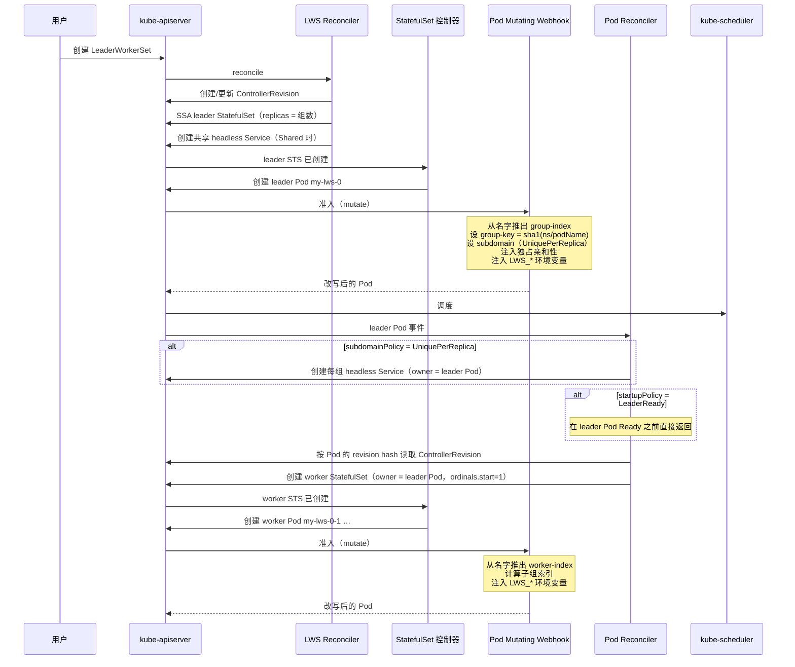
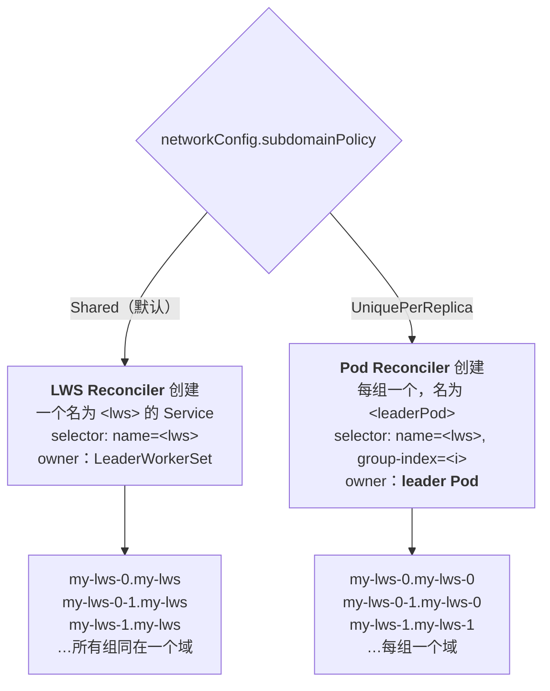
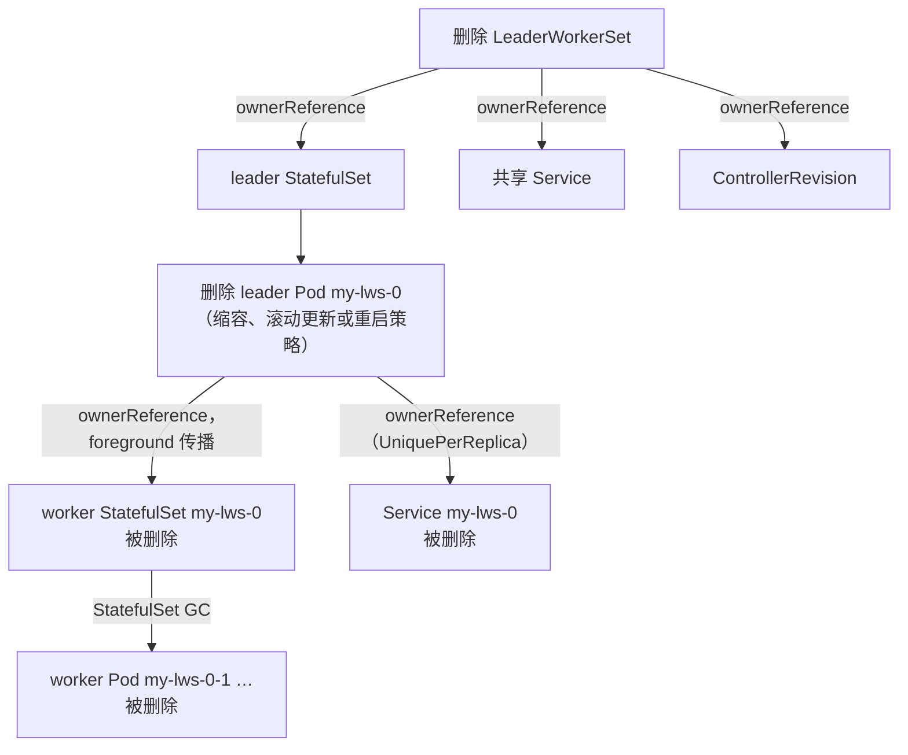

# 模块 3：组的生命周期与 Pod 身份

一组互相寻址不到的 Pod 不叫一个组，那叫巧合。本模块讲的是 LWS 如何把 `replicas: 2, size: 4` 变成八个 Pod，让每一个都在开始服务之前就确切知道：我是谁、其他人是谁、怎么联系上他们。

这套机制分散在四个组件里，每个只做一小部分，只有看清交接点才能理解整体。本模块覆盖**命名与序号方案**、**一个组的诞生过程**、**startup policy**、**Pod mutating webhook 的身份注入**、**DNS 与 headless Service**、**子组**、**TPU 身份**，以及**组的拆除**。

!!! info "溯源信息"
    对照 `kubernetes-sigs/lws` 的 `32a9c37`（2026-08-06）、v0.9.0 核实。主要来源：`pkg/webhooks/pod_webhook.go`、`pkg/controllers/pod_controller.go`、`pkg/utils/pod/pod_utils.go`、`pkg/utils/statefulset/statefulset_utils.go`、`pkg/utils/accelerators/tpu.go`。

---

## 第一部分：名字就是数据结构

LWS 自己几乎不保存组状态。控制器里没有任何「组索引 → Pod 集合」的映射。取而代之的是：**Pod 名字编码了组成员关系**，控制器需要时再把它解析回来。

### 1.1 命名方案

以 `replicas: 2, size: 4` 的 `my-lws` 为例：

| 对象 | 名字 | 由来 |
| :--- | :--- | :--- |
| leader StatefulSet | `my-lws` | LWS 名字 |
| 组 0 的 leader Pod | `my-lws-0` | STS 序号 0 |
| 组 1 的 leader Pod | `my-lws-1` | STS 序号 1 |
| 组 0 的 worker StatefulSet | `my-lws-0` | **leader Pod 的名字** |
| 组 0 的 worker Pod | `my-lws-0-1`、`my-lws-0-2`、`my-lws-0-3` | worker STS 序号 1..3 |
| 组 1 的 worker Pod | `my-lws-1-1`、`my-lws-1-2`、`my-lws-1-3` | |

leader Pod 的名字同时是：组的身份、worker StatefulSet 的名字、worker Pod 的名字前缀，以及（在 `UniquePerReplica` 下）每组 Service 的名字。正是这一重多用，决定了 LWS 名字必须是 DNS-1035 label——这个约束会一路传递下去。

### 1.2 把名字解析回去

`pkg/utils/statefulset/statefulset_utils.go` 提供了逆操作：

```go
// statefulPodRegex 匹配 Pod 名，捕获 parent 和序号。
var statefulPodRegex = regexp.MustCompile("(.*)-([0-9]+)$")

func GetParentNameAndOrdinal(name string) (string, int) // 不匹配时返回 ("", -1)
```

这一个函数干的活出人意料地多。作用在 leader Pod `my-lws-1` 上，得到 `("my-lws", 1)`——LWS 名字和**组索引**。作用在 worker Pod `my-lws-1-2` 上，得到 `("my-lws-1", 2)`——**leader Pod 名**和 **worker 索引**。同一个正则，两种含义，全靠调用方知道自己在看 leader 还是 worker 来消歧。

凡是 worker 需要找到自己的 leader，用的都是这一招：把结尾的 `-<n>` 剥掉。

### 1.3 worker 序号为什么从 1 开始

```go
// constructWorkerStatefulSetApplyConfiguration，pkg/controllers/pod_controller.go
WithOrdinals(appsapplyv1.StatefulSetOrdinals().WithStart(1)).
```

如果 worker 序号从 0 开始，worker Pod 会叫 `my-lws-1-0 … my-lws-1-2`，`workerIndex` 就和 `LWS_WORKER_INDEX` 对不上了：leader 是索引 0，所以第一个 worker 必须是索引 1。让 worker StatefulSet 的序号从 1 起，全局索引空间才是连续且一致的。

这是对上游 `StatefulSetStartOrdinal` 特性的硬依赖，也是 LWS 把 Kubernetes **≥ 1.26** 写成下限、并要求恰好 1.26 时手动开 gate 的原因。在一个忽略该字段的集群上，worker StatefulSet 会产出一个序号 0、名叫 `my-lws-1-0` 的 Pod——它*看起来*像一个嵌套 LWS 的 leader Pod，并会无限递归地继续创建 StatefulSet。

Pod 控制器专门防了这一手：

```go
// Reconcile 的第 6 步——防递归守卫，kubernetes-sigs/lws#391
if pod.Annotations[leaderworkerset.LeaderPodNameAnnotationKey] != "" {
    // 一个「看起来像 leader」却带着 leader-name annotation 的 Pod，
    // 实际上是某个忽略了 ordinals.start 的集群上的 worker
    log.Error(...); r.Record.Eventf(..., FailedCreate, ...)
    return ctrl.Result{}, nil
}
```

如果你看到抱怨这件事的 `FailedCreate` 事件，诊断永远是同一个：集群太老，或者 feature gate 没开。

---

## 第二部分：一个组的诞生

创建一个组要八个组件参与。顺序很重要，而且有好几步是有条件的。



有三点很容易漏掉，但极其重要：

1. **worker StatefulSet 是按 leader Pod 引用的 ControllerRevision 构建的，不是按活的 LWS spec。** `pkg/controllers/pod_controller.go` 调用 `revisionutils.GetRevision(ctx, r.Client, &lws, revisionutils.GetRevisionKey(&pod))`，找不到 revision 时一秒后重排队。这正是滚动更新中途组内保持自洽的原因：即便 LWS spec 已经往前走了，老 revision 的 leader 得到的仍是老 revision 的 worker。

2. **worker StatefulSet 是「只创建」的。** 第 16 步先 `Get`，只有 `NotFound` 才创建。它从不被 patch、从不 server-side apply、从不更新。模板变更产生的是一个*新的 leader Pod*，它拥有一个*新的 worker StatefulSet*。`setNodeSelectorForWorkerPods` 里有一段注释描述了当前代码并未实现的更新行为——别被它误导。

3. **有两处逻辑挂在 `pod.DeletionTimestamp` 上。** leader Pod 正在终止时 Pod reconciler 会提前返回（第 8 步），这就是它不会在一个正被拆除的组下面重建 worker StatefulSet 的原因。没有这道守卫，all-or-nothing 重启会和自己竞态。

---

## 第三部分：Startup Policy

```go
if lws.Spec.StartupPolicy == leaderworkerset.LeaderReadyStartupPolicy && !podutils.IsPodReady(&pod) {
    return ctrl.Result{}, nil
}
```

这就是 KEP-135 的全部实现。`LeaderCreated`（默认）跳过这个检查，所以 leader Pod *对象*一存在，worker StatefulSet 就被创建了——在它被调度之前，更别提运行。

| | `LeaderCreated`（默认） | `LeaderReady` |
| :--- | :--- | :--- |
| worker STS 何时创建 | leader Pod 对象存在时 | leader Pod `Ready` 时 |
| 启动形态 | 完全并行 | leader 先，worker 后 |
| 冷启动 | leader 与 worker 并发加载权重 | 串行：先 leader 加载，再 worker 加载 |
| 适用于 | 带重试 rendezvous 的引擎（Ray、带重试的 torch.distributed） | worker 连不上 leader 端点就硬失败的引擎 |
| 与什么相冲 | — | **Gang 调度**——gang 希望所有 Pod 同时 pending，但 leader Ready 之前 worker 根本不存在 |

对大模型来说 `LeaderReady` 的代价是实打实的。如果 leader 加载权重要四分钟，每个组的冷启动就多四分钟，而这会与逐组滚动复合：20 个组 × 多 4 分钟，就是一个多小时的额外滚动时间。能改引擎的重试行为就优先改引擎。

---

## 第四部分：身份注入

`pkg/webhooks/pod_webhook.go` 是一个 Pod 获得「关于自己的一切」的地方。webhook 注册在 `/mutate--v1-pod`，只对 `create` 生效——而且关键在于，manifest 补丁 `config/webhook/mutating-patch.yaml` 加了对象选择器：

```yaml
objectSelector:
  matchExpressions:
    - key: leaderworkerset.sigs.k8s.io/name
      operator: Exists
```

没有它，集群里每一个 Pod 都会被路由到 LWS 的 webhook。如果你在装了 LWS 之后排查全集群范围的 Pod 准入变慢，先确认这个选择器还在。

!!! note "Pod validating webhook 是空实现"
    `/validate--v1-pod` 注册了，但 `validate()` 在提前返回后直接 `return (nil, nil)`。它是个占位。删掉它，或者给它安排点用途，都是站得住脚的 PR。

### 4.1 leader 分支

`labels["leaderworkerset.sigs.k8s.io/worker-index"] == "0"` 的 Pod 就是 leader。对 leader：

| 步骤 | 动作 |
| :--- | :--- |
| 1 | 若无 `group-index`，推导之：`_, ordinal := GetParentNameAndOrdinal(pod.Name)` |
| 2 | 若 `subdomainPolicy` annotation 是 `UniquePerReplica`，设 **`pod.Spec.Subdomain = pod.Name`**。（`Shared` 下 subdomain 来自 StatefulSet 的 `serviceName`。） |
| 3 | 若无 `group-key`，设为 `Sha1Hash(fmt.Sprintf("%s/%s", namespace, podName))`——一个 40 字符十六进制摘要 |
| 4 | 若存在 `exclusive-topology` annotation，调用 `SetExclusiveAffinities(pod, groupKey, topologyKey, GroupUniqueHashLabelKey)` |
| 5 | 子组处理（§6） |

有意思的是 `group-key`。为什么要哈希命名空间和 Pod 名，而不直接拿 Pod 名当亲和性 key？因为这个值必须**在组被重建时改变**。两个 key 相同的 Pod 是在声明「我们属于一起」；如果 key 跨重建保持稳定，一个刚创建的组可能会误把亲和性满足在前任正在终止的 Pod 上，从而落到错误的拓扑域。哈希名字和命名空间给出的值，在一个组的生命周期*内*稳定，而在不同命名空间的 LWS 之间互不相同。

### 4.2 worker 分支

| 步骤 | 动作 |
| :--- | :--- |
| 1 | `_, workerIndex := GetParentNameAndOrdinal(pod.Name)`；设 `worker-index` label |
| 2 | 计算子组索引与 `subgroup-key`（§6） |

注意 worker 的 `group-index` label **不是**在这里推导的——它来自 worker StatefulSet 的 Pod 模板，而那是 Pod 控制器构建 StatefulSet 时填进去的。

### 4.3 环境变量注入

`podutils.AddLWSVariables(pod)` 向**每个容器和每个 init 容器**注入三个变量：

| 变量 | 值 |
| :--- | :--- |
| `LWS_LEADER_ADDRESS` | `fmt.Sprintf("%s-%s.%s.%s", lwsName, groupIndex, pod.Spec.Subdomain, namespace)` |
| `LWS_GROUP_SIZE` | `leaderworkerset.sigs.k8s.io/size` annotation 的值 |
| `LWS_WORKER_INDEX` | `leaderworkerset.sigs.k8s.io/worker-index` label 的值 |

对 `my-lws`、组 3、命名空间 `default`：

- `Shared`：`my-lws-3.my-lws.default`
- `UniquePerReplica`：`my-lws-3.my-lws-3.default`

注意这**不是完全限定名**——没有 `.svc.cluster.local`。它靠 Pod 的 DNS search 路径解析，集群内没问题，但你要是想在集群外用它就会中招。

!!! tip "注入顺序是承重的"
    `addEnvVarsIfNotExists` 把三个 LWS 变量**前置**，然后再追加用户自己的，而不是反过来。这是刻意的（kubernetes-sigs/lws#152）：Kubernetes 只会拿**更早**定义的变量去解析 `$(VAR)` 引用。前置它们，才使得用户可以写

    ```yaml
    env:
      - name: RAY_ADDRESS
        value: "$(LWS_LEADER_ADDRESS):6379"
    ```

    并且真的能展开。哪天你重排了这个函数，所有这么写的 manifest 都会坏掉。

    用户自定义的同名变量会被丢弃、以注入值为准——因为注入的名字先被塞进了去重表。

---

## 第五部分：DNS 与 Headless Service

有两个不同的组件会创建 Service，谁来创建取决于策略。



两者都由 `controllerutils.CreateHeadlessServiceIfNotExists` 创建，带：

```go
ClusterIP: "None"
PublishNotReadyAddresses: true
```

`publishNotReadyAddresses: true` 是承重设置。rendezvous 发生在启动*过程中*：worker 会在任何东西 Ready 之前解析 `LWS_LEADER_ADDRESS`。没有这个开关，DNS 记录要等 leader 通过 readiness probe 才存在，于是每个引擎的启动都会死锁——leader 不 Ready 是因为 worker 没连上，worker 连不上是因为 leader 没有 DNS 记录。

!!! note "这让 KEP-820 的前提失效了"
    KEP-820 提议加一个 init 阶段的 DNS 开关，理由是「`publishNotReadyAddresses: false` 时 peer FQDN 在 init 阶段可能解析不了」。而 LWS 自己的 headless Service 无条件把它设成 `true`，`test/testutils/validators.go` 里还有断言。见[附录 B](appendix_pr_opportunities.md)。

所有权的差异对垃圾回收有影响。共享 Service 由 LWS 拥有，与 LWS 同寿。每组 Service 由 **leader Pod** 拥有，因此随组一起被删——这完全正确，但也意味着每次组重建、每一步滚动更新，它都会被重建一次。

### 5.1 什么时候用 `UniquePerReplica`

共享 headless Service 会为整个 LWS 的每个 Pod 各产生一条 DNS A 记录。100 个组 × 8 个 Pod，每次 `LWS_LEADER_ADDRESS` 查询就返回 800 条记录，CoreDNS 会成为冷启动延迟中可测量的一部分。`UniquePerReplica`（KEP-173）把每次查询的范围收窄到一个组。

代价：每组多一个 Service 对象（100 个组就是多 100 个对象要 kube-proxy 和 CoreDNS 跟踪），而且这个字段可变——切换它会重写每个 Pod 的 DNS 名并强制全量滚动，期间新老组的 FQDN 形状还不一样。

---

## 第六部分：子组

子组（KEP-115，由 KEP-257 扩展）存在的唯一理由是：一个组可能大于一个拓扑域。一个横跨两台 8 卡主机的 16-Pod 组，想要的是把*每一半*钉在一台主机上，而不是把整体钉在一个并不存在的东西上。

### 6.1 索引算术

```go
func getSubGroupIndex(podCount, subGroupSize, workerIndex int) string {
    if (podCount-1)%subGroupSize == 0 && podCount%subGroupSize != 0 {
        // leader 是多出来的那个，归入第一个子组。
        return fmt.Sprint((workerIndex - 1) / subGroupSize)
    }
    return fmt.Sprint(workerIndex / subGroupSize)
}
```

两种情形，由整除性选择：

| 情形 | 条件 | `size=9, subGroupSize=4` / `size=8, subGroupSize=4` 的布局 |
| :--- | :--- | :--- |
| **leader 是多出来的** | `(size-1) % sgs == 0` 且 `size % sgs != 0` | `size=9, sgs=4`：子组 0 = {0（leader）, 1, 2, 3, 4}，子组 1 = {5, 6, 7, 8}。leader 并入子组 0，使其有 5 个成员。 |
| **整除** | `size % sgs == 0` | `size=8, sgs=4`：子组 0 = {0（leader）, 1, 2, 3}，子组 1 = {4, 5, 6, 7}。leader 占据子组 0 的第一个位置。 |

webhook 强制两个条件必须满足其一（`size % sgs == 0 || (size-1) % sgs == 0`），所以不会出现第三种情况。

### 6.2 两种策略类型

| `subGroupPolicyType` | leader 的位置 | 额外约束 |
| :--- | :--- | :--- |
| `LeaderWorker`（默认） | leader 在子组 0 | — |
| `LeaderExcluded` | leader **不在任何**子组 | 要求 `(size-1) % sgs == 0` |

`LeaderExcluded`（KEP-257）针对的是常见的推理拓扑：leader 是个不持有分片的协调者。它跑 OpenAPI server 并向 worker 分发；把它塞进某个 worker 子组，就会在一个真正需要放分片的拓扑域里占掉一个位置。

Pod webhook 的 leader 分支对此有显式检查：

```go
// 只有策略不是 LeaderExcluded 时，才把 leader 分到子组 0
if 存在 subGroupSize && subgroup-index 为空 && subgroup-policy-type != "LeaderExcluded" {
    labels[SubGroupIndexLabelKey] = "0"
    labels[SubGroupUniqueHashLabelKey] = genGroupUniqueKey(pod.Name, "0")
}
```

!!! danger "上游 concepts 页面描述了一个不存在的取值"
    `site/content/en/docs/concepts/_index.md` 写了 `SubGroupType: LeaderOnly`，并说它会*专门为* leader 创建一个子组。真实取值是 `LeaderExcluded`，含义是 leader *不在任何*子组——正好相反。照着那一页写的人会得到一份被 webhook 拒绝的 manifest；就算他们猜对了名字，拿到的行为也和预期相反。这是目前最有价值的文档修复；见[附录 B](appendix_pr_opportunities.md)。

### 6.3 子组 key 与亲和性

`subgroup-key` 是 `Sha1Hash("<leaderPodName>/<subGroupIndex>")`——注意这个 helper 是通用的（`genGroupUniqueKey(a, b) = sha1(a + "/" + b)`），所以在子组这个调用点上参数名读起来有点怪。这个 key 的用法和 `group-key` 完全一样，只是拓扑 key 换成了 `subgroup-exclusive-topology`。

一个 Pod 可以**同时**带两套：组级亲和性把组钉在一个机架上，子组级亲和性把每一半钉在一台主机上。结果是两条 Pod 亲和性项加两条反亲和性项，全部为 `RequiredDuringSchedulingIgnoredDuringExecution`。亲和性本身的机制在[模块 7](07_scheduling_placement_and_networking.md)。

---

## 第七部分：TPU 身份

`pkg/utils/accelerators/tpu.go`（包名 `accelerator`）之所以存在，是因为 JAX 和 TPU 运行时想要一套不同于 `LWS_WORKER_INDEX` 的身份词汇。只要有任一容器或 init 容器在 limits（先查）或 requests 里带非零 `google.com/tpu`，这个 Pod 就算「请求 TPU」。

| 常量 | 值 |
| :--- | :--- |
| `TpuResourceName` | `google.com/tpu` |
| `TpuProcessDefaultPort` | `8476` |
| 注入的环境变量 | `TPU_WORKER_ID`、`TPU_WORKER_HOSTNAMES`、`TPU_NAME`、`TPU_PROCESS_ADDRESSES`、`TPU_PROCESS_PORT` |

### 7.1 leader 偏移问题

核心微妙点在于：**leader 可能是也可能不是 TPU worker。** 如果 leader 是个不带 TPU 的纯协调者，那么 `my-lws-0-1` 应该是 TPU worker *0*，而不是 1。如果 leader 确实持有 TPU，它就是 TPU worker 0，`my-lws-0-1` 是 TPU worker 1。

控制器的解法是让 leader 告诉 worker。构建 worker StatefulSet 时会调用 `AddTPUAnnotations(leaderPod, annotations)`，只在 leader 自己请求 TPU 时给 worker Pod 模板打上：

```
leaderworkerset.sigs.k8s.io/leader-requests-tpus: "true"
```

worker webhook 随后做偏移：

```go
leaderPodName, podWorkerIndex := GetParentNameAndOrdinal(pod.Name)
if pod.Annotations[LeaderRequestsTPUsAnnotationKey] != "true" {
    podWorkerIndex--   // leader 不是 TPU worker，ID 整体下移一位
}
```

### 7.2 多容器 TPU Pod

扁平路径是感知多容器的。若一个 Pod 里有 `n` 个请求 TPU 的容器：

- 每个容器的端口取用户设的 `TPU_PROCESS_PORT`，否则是 `8476 + i`。
- `TPU_WORKER_ID = podWorkerIndex * numContainers + i`。
- `TPU_WORKER_HOSTNAMES` 和 `TPU_PROCESS_ADDRESSES` 会按容器顺序，把每个 peer 主机名重复 `n` 次列出。

### 7.3 子组路径

`addTPUVariablesSubGroup` **只支持单容器**——它取 `containers[0]`。它计算的是子组相对的 worker ID 和一个主机名窗口：

```go
tpuWorkerId := workerIndex % subGroupSize
if workerIndex != 0 && pod.Annotations[LeaderRequestsTPUsAnnotationKey] != "true" {
    tpuWorkerId   = (workerIndex - 1) % subGroupSize
    subGroupIndex = (workerIndex - 1) / subGroupSize
}
start := subGroupSize*subGroupIndex + 1
end   := subGroupSize * (subGroupIndex + 1)
```

窗口随后按 leader 是否占位而移动：子组 0 且 leader 持有 TPU 时，`end -= 1` 并把 leader 主机名前置；后续子组且 leader 持有 TPU 时，`start` 和 `end` 都下移一位。

有两个后果值得知道：

- 启用子组后，`TPU_WORKER_ID` 是**子组相对**的（`0..subGroupSize-1`），不是组相对的。假设全局 rank 的 JAX 程序会算错。
- `TPU_NAME` 仍然是 **leader Pod 名**，不是每个子组各自的身份。这是否正确取决于运行时的期望，依赖它之前值得对照当前的 JAX/TPU 文档确认一下。

两条 TPU 路径都是幂等的——如果第一个 TPU 容器上已有 `TPU_WORKER_HOSTNAMES` 或 `TPU_WORKER_ID`，就直接跳过。

---

## 第八部分：组的拆除

拆除几乎完全是 Kubernetes 的垃圾回收，这也是 LWS 里全程没有 finalizer 的原因。



让这套机制成立的几个零件：

- LWS 上的 `Reconcile` 在 `DeletionTimestamp != nil` 时立刻返回——没什么要清理的，所有权已经处理了。
- 组重启路径删除 leader 时带 `PropagationPolicy: Foreground`，所以 worker StatefulSet 会在 leader Pod 对象消失之前彻底消失。没有 foreground 传播的话，leader 可能在旧 worker StatefulSet 还在时就被它的 StatefulSet 重建出来。
- Pod reconciler 的 `pod.DeletionTimestamp != nil` 提前返回，避免它在 leader 终止的窗口期重建 worker StatefulSet。

有一道守卫值得细讲，在 `workerPodBelongsToLeader` 里。当一个 worker Pod 触发组重启时，控制器必须确认这个 worker 真的属于*当前*的 leader，而不是上一代。它会沿着所有权链走，并检查 **UID** 而不只是名字：

> pod → controller ref → 若是 `StatefulSet`，`Get` 它，要求 `workerSts.UID == owner.UID`，再要求这个 StatefulSet 自己的 controller 是一个 `Pod`，且名字**和 UID** 都与 leader 相符。

名字在组重建之间会被复用，UID 不会。没有 UID 检查，上一代 worker StatefulSet 的后台删除就可能触发刚重建出来的 leader 被删——一个非常难查的无限重启循环。

---

## 实验：端到端追踪一个身份

目标是在真实 Pod 上看到第四到第六部分的每一个字段，并逐个故意打破这些机制。

!!! warning "规模"
    本实验的第 1–4 步在 `kind` 上就能跑。第 5 步（带独占拓扑的子组）需要至少**两个多卡节点**才有意义，因为它的全部意义就是把子组钉到不同主机上。需要加速器容量的命令标注为 unverified。

### 步骤 1 — 读一个 leader Pod 的完整身份

部署一个 `replicas: 2, size: 4` 的 LWS，然后 dump 一个 leader Pod：

```bash
kubectl get pod my-lws-1 -o jsonpath='{.metadata.labels}' | jq
kubectl get pod my-lws-1 -o jsonpath='{.metadata.annotations}' | jq
kubectl get pod my-lws-1 -o jsonpath='{.spec.subdomain}'; echo
kubectl get pod my-lws-1 -o jsonpath='{.spec.containers[0].env}' | jq
```

对照 §4.1 和 §4.3 验证：

- `worker-index` 是 `0`，`group-index` 是 `1`。
- `group-key` 是 40 字符十六进制串。算一下 `echo -n "default/my-lws-1" | sha1sum`，确认一致。
- `LWS_LEADER_ADDRESS` 是 `my-lws-1.my-lws.default`，且**排在 env 列表的最前面**。

### 步骤 2 — 确认环境变量顺序的保证

加一个引用注入变量的容器环境变量：

```yaml
env:
  - name: RENDEZVOUS
    value: "$(LWS_LEADER_ADDRESS):29500"
```

然后确认它真的展开了：

```bash
kubectl exec my-lws-1 -- printenv RENDEZVOUS
```

现在设想 `addEnvVarsIfNotExists` 改成追加而不是前置，`printenv` 会显示什么？（Kubernetes 会把无法解析的 `$(VAR)` 原样留着。）这就是前置为什么是承重的。

### 步骤 3 — 验证 DNS 在 Ready 之前就能解析

给 leader 设一个永远不通过的 readiness probe（`exec: ["false"]`），然后从 worker 上：

```bash
kubectl exec my-lws-1-1 -- nslookup my-lws-1.my-lws.default
```

即便 leader 不 Ready，它也应该能解析。现在把 Service 改成 `publishNotReadyAddresses: false` 再试一次——查询失败，你就复现了这个开关要防的死锁。（记得改回去；控制器不会在这个字段上跟你抢，所以得你自己撤销。）

### 步骤 4 — 两种 subdomain 策略都跑一遍

同一个 LWS 部署两次，各用一种 `subdomainPolicy`，然后对比：

```bash
kubectl get svc -l leaderworkerset.sigs.k8s.io/name=my-lws
kubectl get pod my-lws-1 -o jsonpath='{.spec.subdomain}'; echo
kubectl exec my-lws-1-1 -- printenv LWS_LEADER_ADDRESS
```

在 `UniquePerReplica` 下，查一下每组 Service 的 owner：

```bash
kubectl get svc my-lws-1 -o jsonpath='{.metadata.ownerReferences}' | jq
```

它应该是 **leader Pod**，不是 LWS。删掉 leader Pod，确认 Service 跟着消失。

### 步骤 5 — 子组算术（unverified，需要 2 个以上节点）

用 `size: 9, subGroupSize: 4` 部署，然后枚举分配结果：

```bash
kubectl get pods -l leaderworkerset.sigs.k8s.io/name=my-lws \
  -o custom-columns='NAME:.metadata.name,W:.metadata.labels.leaderworkerset\.sigs\.k8s\.io/worker-index,SG:.metadata.labels.leaderworkerset\.sigs\.k8s\.io/subgroup-index'
```

跑之前先用 `getSubGroupIndex` 预测输出。`size=9, sgs=4` 时：`(9-1)%4 == 0` 且 `9%4 != 0`，所以走「leader 是多出来的」分支，worker 用 `(workerIndex-1)/4`。预期子组 0 = worker 索引 0–4，子组 1 = 5–8。

然后试 `subGroupPolicyType: LeaderExcluded` 配 `size: 9, subGroupSize: 4`——`(9-1)%4 == 0`，会被接受，而 leader 应该**没有** `subgroup-index` label。再试 `LeaderExcluded` 配 `size: 10, subGroupSize: 4`，确认 webhook 拒绝，并引用 `validateUpdateSubGroupPolicy` 里的原话。

### 步骤 6 — 复现防递归守卫（思想实验）

你几乎不可能跑得起一个老到会忽略 `ordinals.start` 的 Kubernetes 集群。改为阅读 `PodReconciler.Reconcile` 的第 6 步，并回答：

- 一个忽略 `ordinals.start` 的集群，会给组 1 的第一个 worker 起什么名字？
- 为什么单看 `worker-index` label，这个名字会让它与 leader 无法区分？
- 是哪个 annotation 打破了平局，它又是在哪里被设上的？

如果这三问你都能不看答案说出来，说明你已经吃透了命名方案。

继续阅读[模块 4：LeaderWorkerSet 控制器内核](04_lws_reconciler_internals.md)。
