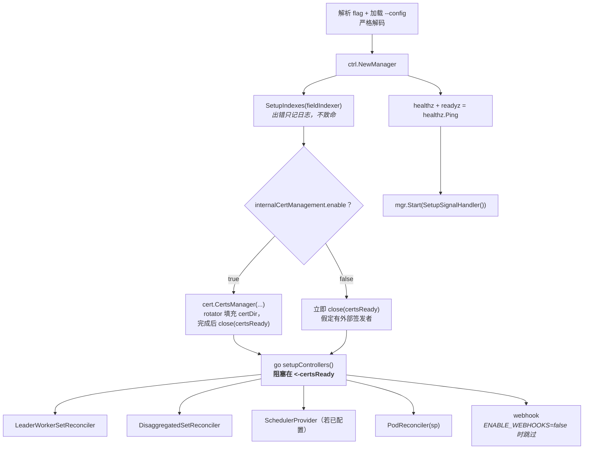
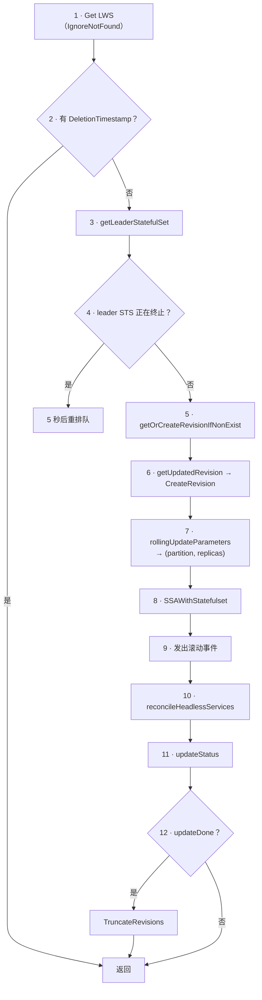

# 模块 4：LeaderWorkerSet 控制器内核

到这一模块，抽象结束，代码开始。`pkg/controllers/leaderworkerset_controller.go` 约 970 行，只做五件事：维护 ControllerRevision 历史、计算滚动参数、server-side apply 一个 StatefulSet、协调一个 headless Service、计算 status。LWS 的其余一切都是这五件事的下游。

本模块覆盖**manager 如何装配**、**十二步 reconcile**、**leader StatefulSet 如何构建**、**Server-Side Apply 与 field manager**、**完整的 ControllerRevision**，以及 **status 与 condition 的算术**——后者比看上去微妙，也是大部分「`kubectl get lws` 为什么显示这个数」问题的来源。

滚动算术本身留到[模块 6](06_rollout_and_revisions.md)；这里把 `rollingUpdateParameters()` 当成一个「返回 partition 和副本数」的函数就行。

!!! info "溯源信息"
    对照 `kubernetes-sigs/lws` 的 `32a9c37`（2026-08-06）、v0.9.0 核实。主要来源：`cmd/main.go`、`pkg/controllers/leaderworkerset_controller.go`、`pkg/utils/revision/revision_utils.go`、`pkg/controllers/metadata.go`、`pkg/cert/cert.go`。

---

## 第一部分：Manager 装配

### 1.1 注册了什么

`cmd/main.go` 无条件注册五个 scheme——client-go 的、`leaderworkerset/v1`、`disaggregatedset/v1`、`config` API，以及 **`scheduling.volcano.sh/v1beta1`**。即使 gang 调度关闭，Volcano 的类型也在 scheme 里；这意味着这个二进制无论如何都依赖 Volcano 的 API 模块，值得知道。

启动顺序是刻意安排的：



`<-certsReady` 这道阻塞是关键：在服务证书就绪之前，任何控制器和 webhook 都不会注册。这就防止了 API server 把准入请求路由到一个还完不成 TLS 握手的 webhook 上。

### 1.2 证书管理

「cert-manager 模式」在代码里并不是一个模式。它就是 `internalCertManagement.enable: false`——立即关闭 channel，并假定有外部的东西去填 `webhook.certDir`。

内置模式用的是 `github.com/open-policy-agent/cert-controller` 的 rotator：

| 设置 | 值 |
| :--- | :--- |
| CA 名 / 组织 | `lws-ca` / `lws` |
| DNS 名 | `<webhookServiceName>.<namespace>.svc` |
| 被打补丁的配置 | `lws-validating-webhook-configuration`、`lws-mutating-webhook-configuration` |
| 就绪检查 | 启用 |

rotator 按名字把 `caBundle` 打进这两个 webhook 配置。如果你在 fork 里重命名了某个 webhook 配置，这套机制会静默失效——rotator 找不到对象，而准入是 fail-closed（`failurePolicy: Fail`）。

### 1.3 Watch 与第二条 watch 路径

```go
func (r *LeaderWorkerSetReconciler) SetupWithManager(mgr ctrl.Manager) error {
    return ctrl.NewControllerManagedBy(mgr).
        For(&leaderworkerset.LeaderWorkerSet{}).
        Owns(&appsv1.StatefulSet{}).
        Owns(&corev1.Service{}).
        Watches(&appsv1.StatefulSet{}, handler.EnqueueRequestsFromMapFunc(enqueueLWSRequests)).
        Complete(r)
}
```

第四行是最容易绊人的。`Owns(&appsv1.StatefulSet{})` 只对「controller 引用指向 LeaderWorkerSet」的 StatefulSet 触发——也就是只有 **leader** StatefulSet。worker StatefulSet 由 leader **Pod** 拥有（见[模块 3](03_group_lifecycle_and_identity.md)），所以对 `Owns` 是不可见的。

`enqueueLWSRequests` 补上了这个缺口：把任何带 `leaderworkerset.sigs.k8s.io/name` label 的对象映射成同命名空间下对该 LWS 的 reconcile 请求。没有它，worker StatefulSet 变就绪时不会更新 `status.readyReplicas`，得等其他事件碰巧触发一次 reconcile。

!!! note "一个值得读的近期修复"
    提交 `743f15f`——「fix: ignore unrelated StatefulSets in LeaderWorkerSet watch mapper (#957)」——加固了这个 mapper。想看看这个项目里「边界清晰的控制器 bug 修复」长什么样，这是一份很好的短篇材料。

### 1.4 那个形同虚设的 field index

`SetupIndexes` 只注册了一个 index：

```go
indexer.IndexField(ctx, &appsv1.StatefulSet{}, lwsOwnerKey /* ".metadata.controller" */,
    func(rawObj client.Object) []string {
        owner := metav1.GetControllerOf(rawObj.(*appsv1.StatefulSet))
        if owner == nil { return nil }
        if owner.APIVersion != apiGVStr || owner.Kind != "LeaderWorkerSet" { return nil }
        return []string{owner.Name}
    })
```

**核心控制面里，`lwsOwnerKey` 从未出现在任何 `client.MatchingFields` 查询中。** 所有查找走的都是 label selector。这个 index 在 informer 缓存里占内存，却什么也没换来。把它接上、或者把它删掉，都是一个小而自足的贡献——见[附录 B](appendix_pr_opportunities.md)。

另外注意 `SetupIndexes` 的错误只记日志，**不会** `os.Exit`。index 注册失败会让 manager 在半初始化状态下继续跑，对一个启动期失败来说这多半是错误的选择。

---

## 第二部分：Reconcile 循环

`Reconcile` 是固定顺序的十二步。按顺序读一遍，是理解这个控制器最快的路径。



其中三步值得单独说。

**第 2 步——没有 finalizer。** `if lws.DeletionTimestamp != nil { return }`。完全没有清理逻辑；owner reference 和 Kubernetes 垃圾回收搞定一切。如果你想在 PR 里加 finalizer，请先准备好论证「为什么 GC 不够」。

**第 4 步——排空退避。** 如果 leader StatefulSet 自己正在终止，reconciler 返回 `ctrl.Result{RequeueAfter: 5 * time.Second}`，而不是试图重建它。对一个删除中的 StatefulSet 做 apply 会产生令人困惑的中间状态；退避更简单也更正确。

**第 5 步——升级时的 revision 收养。** `getOrCreateRevisionIfNonExist` 同时处理两种情况：全新、没有任何 revision 的 LWS；以及由*ControllerRevision 之前*的控制器版本创建、其 leader StatefulSet 上已经带着按旧方案算出的 `template-revision-hash` 的 LWS。第二种情况下新控制器必须收养已有 hash 而不是重算一个，否则集群里每个 LWS 都会在 operator 升级时滚一遍。机制见 §5.4。

### 2.1 事件词汇表

读事件流常常比读日志快。reconciler 会发出：

| Reason | Action | 何时 |
| :--- | :--- | :--- |
| `CreatingRevision` | Create | 切了一个新的 ControllerRevision |
| `GroupsProgressing` | Create | 首次创建 leader StatefulSet |
| `GroupsUpdating` | Update | partition 移动了：`"Updating replica %d"` 或 `"Updating replicas %d to %d (inclusive)"` |
| `FailedCreate` / `FailedUpdate` | Create / Update | SSA patch 失败 |

`GroupsUpdating` 的消息区分了单组步进（`oldPartition-1 == partition`）和多组步进，这是快速判断 `maxUnavailable > 1` 有没有真正生效的办法。

---

## 第三部分：构建 leader StatefulSet

`constructLeaderStatefulSetApplyConfiguration(lws, partition, replicas, revisionKey)` 构建的是一个 **apply configuration**，不是 StatefulSet 对象。模板取 `leaderWorkerTemplate.leaderTemplate`（非 nil 时），否则取 `workerTemplate` 的深拷贝，再经 `runtime.DefaultUnstructuredConverter` 往返转换成 `PodTemplateSpecApplyConfiguration`。

### 3.1 往 Pod 模板上盖什么章

| 种类 | Key | 值 |
| :--- | :--- | :--- |
| Label | `leaderworkerset.sigs.k8s.io/worker-index` | `"0"` |
| Label | `leaderworkerset.sigs.k8s.io/name` | `lws.Name` |
| Label | `leaderworkerset.sigs.k8s.io/template-revision-hash` | `revisionKey` |
| Annotation | `leaderworkerset.sigs.k8s.io/size` | `strconv.Itoa(int(*Size))` |
| Annotation | `leaderworkerset.sigs.k8s.io/exclusive-topology` | 若 LWS 上非空则复制 |
| Annotation | `subgroup-policy-type`、`subgroup-size`、`subgroup-exclusive-topology` | `SubGroupPolicy != nil` 时 |
| Annotation | `leaderworkerset.sigs.k8s.io/subdomainPolicy` | 仅 `UniquePerReplica` 时 |

`worker-index: "0"` 这个 label 既让 leader StatefulSet 的 selector 生效，也是 Pod webhook 判断走 leader 分支的依据。

### 3.2 元数据合并

`pkg/controllers/metadata.go` 只有八行，但它的优先级规则很重要，值得引用：

```go
merged := make(map[string]string)
maps.Copy(merged, userMetadata)
maps.Copy(merged, controllerMetadata)   // 控制器的 key 胜出
// 两者都空时返回 nil
```

STS 的 label 是 `lws.Labels` 加上 `{name, template-revision-hash}`；STS 的 annotation 是 `lws.Annotations` 加上 `{replicas}`。因为控制器的 key 后拷贝，用户在自己的 LWS 上设 `leaderworkerset.sigs.k8s.io/name` 也污染不了控制器自己的 label。空时返回 `nil` 避免把空 map 写进 apply configuration，否则 SSA 会去认领一个空字段的所有权。

### 3.3 StatefulSet spec

```go
appsapplyv1.StatefulSet(lws.Name, lws.Namespace).WithSpec(appsapplyv1.StatefulSetSpec().
    WithServiceName(lws.Name).
    WithReplicas(replicas).
    WithPodManagementPolicy(appsv1.ParallelPodManagement).
    WithTemplate(&podTemplateApplyConfiguration).
    WithUpdateStrategy(appsapplyv1.StatefulSetUpdateStrategy().
        WithType(appsv1.StatefulSetUpdateStrategyType(lws.Spec.RolloutStrategy.Type)).
        WithRollingUpdate(appsapplyv1.RollingUpdateStatefulSetStrategy().
            WithMaxUnavailable(stsMaxUnavailable).WithPartition(partition))).
    WithSelector(metaapplyv1.LabelSelector().WithMatchLabels(map[string]string{
        leaderworkerset.SetNameLabelKey:     lws.Name,
        leaderworkerset.WorkerIndexLabelKey: "0"})))
```

有四点要注意：

1. **`replicas` 是经滚动调整后的值**，不是 `*lws.Spec.Replicas`。`maxSurge` 滚动期间它是 `spec.replicas + surge`。这就是 `status.replicas`——直接从 StatefulSet 上读的——会超过 `spec.replicas` 的原因。
2. **`podManagementPolicy: Parallel`。** leader Pod 是同时创建的，不按序号顺序。对应[模块 1](01_multihost_inference_problem_space.md) 的需求 R1。
3. **leader StatefulSet 刻意不设 `.spec.ordinals`。** 它从 0 开始。只有 *worker* StatefulSet 设 `WithStart(1)`。
4. **嵌套的 `maxUnavailable` 不是用户写的那个 `maxUnavailable`：**

```go
stsMaxUnavailableInt := int32(lwsMaxUnavailable + lwsMaxSurge)  // maxSurge 已被钳到 <= replicas
if stsMaxUnavailableInt < 1 { stsMaxUnavailableInt = 1 }
```

交给 StatefulSet 的值是 LWS 的 `maxUnavailable` 与 `maxSurge` 之*和*，下限为 1。组的顺序由 LWS 自己通过 partition 驱动；StatefulSet 自身的 `maxUnavailable` 只需要宽松到不成为约束即可。`< 1` 的钳制防的是 `replicas: 0` 的情况，以及 webhook 本该拒绝的 `maxUnavailable=0 && maxSurge=0` 组合。百分比在 `maxUnavailable` 上**向下**取整，在 `maxSurge` 上**向上**取整。

### 3.4 PVC 透传

`controllerutils.GetPVCApplyConfiguration(lws)` 把 `volumeClaimTemplates` 转成 apply configuration，只透传：

- `accessModes`
- `storageClassName`
- `volumeMode`
- `resources.{requests,limits}`

**被静默丢弃的**：`selector`、`dataSource`、`dataSourceRef`，以及 PVC 模板上的任何 label 和 annotation。`persistentVolumeClaimRetentionPolicy` 原样透传。如果你在从快照克隆卷，你的 `dataSource` 就是在这里消失的。

---

## 第四部分：Server-Side Apply

```go
obj, _ := runtime.DefaultUnstructuredConverter.ToUnstructured(leaderStatefulSetApplyConfig)
patch := &unstructured.Unstructured{Object: obj}
err = r.Patch(ctx, patch, client.Apply, &client.PatchOptions{
    FieldManager: "lws",
    Force:        ptr.To[bool](true),
})
```

由此得出三条性质：

- **field manager 是 `"lws"`。** 控制器设的每个字段都在 `metadata.managedFields` 里归属这个 manager。`kubectl get sts my-lws -o yaml --show-managed-fields` 能确切看到控制器拥有哪些字段、把哪些留给了你。
- **`Force: true`。** 冲突一律按控制器的意思解决。你 `kubectl edit` 改了 leader StatefulSet 的副本数，下一次 reconcile 会不声不响地改回去。这是对的——LWS 才是真相来源——但也意味着「手改 StatefulSet」不是一种受支持的调试手段。
- **声明式移除。** 因为这是 apply 而不是 patch，控制器*不再*设置的字段会从对象上被移除。这也是 `mergeMetadata` 空时返回 `nil` 这件事之所以重要的原因。

`setControllerReferenceWithStatefulSet`（虽然在这里用，却定义在 `pod_controller.go`）把 owner reference 注入 apply configuration，带 `BlockOwnerDeletion(true)` 和 `Controller(true)`。

代码里有一处 `//nolint` 和 TODO，说 `client.Apply()` 是这种 patch 类型的现代替代。迁移它是个说得过去的小 PR，但先确认 `go.mod` 里的 controller-runtime 版本是否支持新 API。

---

## 第五部分：ControllerRevision

KEP-238 引入 ControllerRevision，是为了让滚动更新有一个稳定的「旧模板」概念，也为了让一个组的 worker 即便在 LWS spec 已经往前走之后，仍能用与其 leader 相同的模板构建。`pkg/utils/revision/revision_utils.go` 改编自上游的 `pkg/controller/history`。

### 5.1 哈希什么——以及不哈希什么

```go
clone := lws.DeepCopy()
if clone.Spec.NetworkConfig == nil {          // 升级兼容
    subdomainPolicy := leaderworkerset.SubdomainShared
    clone.Spec.NetworkConfig = &leaderworkerset.NetworkConfig{SubdomainPolicy: &subdomainPolicy}
}
specCopy["networkConfig"] = networkConfig
specCopy["leaderWorkerTemplate"] = template
networkConfig["$patch"] = "replace"
template["$patch"] = "replace"
objCopy["spec"] = specCopy
return json.Marshal(objCopy)
```

| 计入 revision | 不计入 |
| :--- | :--- |
| `spec.leaderWorkerTemplate`（两个模板、`size`、`restartPolicy`、`subGroupPolicy`、`volumeClaimTemplates`） | `spec.replicas` |
| `spec.networkConfig` | `spec.rolloutStrategy`——包括 `partition`、`maxSurge`、`maxUnavailable` |
| | `spec.startupPolicy` |
| | **所有元数据**——label 和 annotation，所以改 `exclusive-topology` **不会**切新 revision |
| | `status` |

这份排除清单回答了一个很常见的问题：**伸缩和调整滚动旋钮永远不会创建 revision，也永远不会触发滚动更新。** 把 `replicas` 从 2 改成 5，是在当前 revision 上加三个组。改 `maxSurge` 影响的是*下一次*滚动的行为，当下什么也不做。

它也意味着 `exclusive-topology` annotation 是不受版本管理的。改它只影响之后创建的 Pod，没有滚动去传播它——在你排查「为什么一半的组放置方式不一样」之前，值得先知道这个尖角。

`"$patch": "replace"` 标记保证恢复 revision 时是**替换**那些子树而不是 strategic merge 进去。没有它，从模板里删掉一个容器的操作是无法通过回滚撤销的。

### 5.2 哈希与命名

```go
hf := fnv.New32()
if len(revision.Data.Raw) > 0 { hf.Write(revision.Data.Raw) }
if revision.Data.Object != nil { deepHashObject(hf, revision.Data.Object) }
return rand.SafeEncodeString(fmt.Sprint(hf.Sum32()))
```

对序列化后的补丁做 FNV-32，再用 `rand.SafeEncodeString` 映射到一个不会意外拼出冒犯性子串的字母表。名字是 `fmt.Sprintf("%s-%s-%v", prefix, hash, revisionNumber)`，prefix 被截到 220 字节以保证总名字不超过 253 字节。结尾的 revision 序号防的是「同样的 `prefix-hash` 在历史上再次出现」时的冲突——比如你回滚到一个用过的模板。

!!! note "`hashRevision` 里潜伏的 bug"
    `deepHashObject` 在写入前调用了 `hasher.Reset()`，所以如果 `Data.Raw` 和 `Data.Object` 同时有值，`Raw` 的字节会被静默丢弃。实践中只有 `Raw` 会被设置，因此这条路径不可达——但这正是那种「哪天有人加了个 `Object` 的生产者就会变成真 bug」的东西。

### 5.3 变更检测与相等性缓存

`getUpdatedRevision` 从活的 spec 切一个候选 revision 出来比对：

```go
return bytes.Equal(lhs.Data.Raw, rhs.Data.Raw) &&
       apiequality.Semantic.DeepEqual(lhs.Data.Object, rhs.Data.Object)
```

字节不同时它**不会**立刻宣布有更新。它会先调用 `SetMatchesRevision(lws, currentRevision, revision, r.revisionEqualityCache)`：把*现有* revision 重新 apply 到 LWS 上，用*当前*序列化器重新导出补丁，再比一次。

这是为了对付**序列化漂移**。升级 operator 可能改变 client-go 序列化 Pod 模板的方式——最经典的例子是 `"creationTimestamp": null` 的出现或消失——产生字节不同但语义相同的补丁。没有这道检查，集群里每个 LWS 都会在每次 operator 升级时滚一遍。代码里引用了 `kubernetes/kubernetes#135017`。

结果被记忆化到一个 10000 条目的 LRU 里，key 是：

```go
type revisionEqualityCacheKey struct {
    lwsUID                  types.UID
    lwsGeneration           int64
    revisionResourceVersion string
}
```

只缓存**正向**结果，所以真正的模板变更绝不会被陈旧缓存条目掩盖。

### 5.4 operator 升级时的 revision 收养

`NewRevision` 里有个很容易读漏的微妙点：

> `cr.Name` 总是用新算出的 hash，但 `cr.Labels[RevisionKey]` 在传入的 `revisionKey` 非空时用**传入的那个**。

这就是升级路径。由 ControllerRevision 之前的 operator 创建的 LWS，其 leader StatefulSet 上已经盖了一个按旧方案算出的 `template-revision-hash`。`getOrCreateRevisionIfNonExist` 把这个遗留 hash 传进来，于是新的 ControllerRevision 被*打上*活 Pod 已经带着的那个 hash。结果就是：升级 operator 不会把整个集群滚一遍。

### 5.5 查找、恢复与截断

| 函数 | 行为 |
| :--- | :--- |
| `GetRevisionKey(obj)` | 读 `labels["leaderworkerset.sigs.k8s.io/template-revision-hash"]`；label 为 nil 时返回 `""`。对 Pod、StatefulSet、ControllerRevision 一视同仁 |
| `GetRevision(ctx, c, lws, key)` | 按 `{name, template-revision-hash}` 列举；`""` 返回 `(nil, nil)`；多于一个匹配时记错误日志并返回最高 revision |
| `ListRevisions` | 包含 controller ref 为 nil **或**匹配父 UID 的对象——孤儿会被收养 |
| `ApplyRevision(lws, rev)` | 把 revision `strategicpatch.StrategicMergePatch` 到编码后的 LWS 上；Pod 控制器就是这样按 Pod 的 revision 构建 worker StatefulSet 的 |
| `TruncateRevisions(ctx, c, lws, key)` | 删掉所有 key 与当前不同的 revision |

!!! warning "没有 `revisionHistoryLimit`"
    LWS 只保留**一个** revision。`TruncateRevisions` 只在 `updateDone` 为真时运行——partition 为 0 且每个期望副本都已更新并就绪——但一旦运行，它会把其余全删掉。

    实际后果：**`kubectl rollout undo` 没有可回退的东西。** 滚动一旦完成，前一个模板就从集群里消失了。回滚意味着你自己把旧 manifest 重新 apply 一遍。加一个 `revisionHistoryLimit` 字段会是一个真正有用的 API 贡献，而且 Deployment 和 StatefulSet 都有先例——但那是 API 变更，因此需要 KEP。

---

## 第六部分：Status 与 Conditions

`updateStatus(ctx, lws, revisionKey)` 是大部分用户困惑的源头，因为它**同时维护两套计数体系**。

### 6.1 三个 status 字段

```go
lws.Status.Replicas = int(sts.Status.Replicas)          // 来自对 leader STS 的一次新 Get
lws.Status.ObservedGeneration = lws.Generation
if lws.Status.HPAPodSelector == "" {                     // 只算一次
    lws.Status.HPAPodSelector = /* name=<lws>,worker-index=0 */
}
```

`status.replicas` 直接从 leader StatefulSet 上读，所以它**包含 surge 副本**。`HPAPodSelector` 的那道判断意味着它在第一次 status 更新时计算、之后再不重算——便宜，而且只因为 LWS 名字不可变才安全。

### 6.2 Condition 的计数器

`updateConditions` 按 `{name, worker-index: "0"}` 列出 leader Pod，并对每一个 `Get` 同名的 worker StatefulSet。当 `noWorkerSts := *Size == 1` 时这个 `Get` 整个跳过。

维护了六个计数器：

| 计数器 | 判定条件 |
| :--- | :--- |
| `readyCount` | `(noWorkerSts \|\| StatefulsetReady(sts)) && PodRunningAndReady(pod)` → `status.readyReplicas` |
| `updatedCount` | `(noWorkerSts \|\| GetRevisionKey(sts) == revisionKey) && GetRevisionKey(pod) == revisionKey` → `status.updatedReplicas` |
| `partitionedCurrentNonBurstCount` | 满足 `lwsPartition <= index < *spec.Replicas` 的组 |
| `partitionedUpdatedNonBurstCount` | 同一窗口，且已更新 |
| `partitionedUpdatedAndReadyCount` | 同一窗口，且已更新**并**就绪 |
| `readyNonBurstWorkerCount` | 同一窗口，且已就绪 |

前两个喂给 status 字段，**计入 burst 副本**。后四个被窗口限制在 `[partition, spec.replicas)`，因此**排除** burst 副本。这就是那个差异：`status.readyReplicas` 报出来的数，condition 逻辑并不认。

### 6.3 Condition 的选择

```go
if partitionedUpdatedNonBurstCount < partitionedCurrentNonBurstCount {
    conditions = {UpdateInProgress, Progressing}
} else if readyNonBurstWorkerCount == int(*lws.Spec.Replicas) &&
          partitionedUpdatedAndReadyCount == partitionedCurrentNonBurstCount {
    conditions = {Available}
} else {
    conditions = {Progressing}
}
updateDone := (lwsPartition == 0) && partitionedUpdatedAndReadyCount == int(*lws.Spec.Replicas)
```

| Condition | Reason | 消息 |
| :--- | :--- | :--- |
| `Available` | `AllGroupsReady` | "All replicas are ready" |
| `UpdateInProgress` | `GroupsUpdating` | "Rolling Upgrade is in progress" |
| `Progressing` | `GroupsProgressing` | "Replicas are progressing" |

`setCondition` 通过一张 `exclusiveConditionTypes` 表强制互斥：只要 `Progressing` 或 `UpdateInProgress` 变为 `True`，`Available` 就被翻成 `False`。注意 `Progressing` 与 `UpdateInProgress` **不**互斥，滚动期间会同时存在。`setConditions` 还会给每条存下来的 condition 盖上 `observedGeneration`。

`updateDone` 是第 12 步 revision 截断的触发条件。注意它要求 `lwsPartition == 0`——所以如果你把 `partition` 停在某个非零的灰度边界，旧 revision 永远不会被回收。这是有意为之而且很有用：暂停的灰度保留了它的回滚目标。

!!! tip "排查 `Available` 一直不为真"
    倒着推这个判定式。`Available` 需要*同时*满足 `readyNonBurstWorkerCount == spec.replicas` **和** `partitionedUpdatedAndReadyCount == partitionedCurrentNonBurstCount`。前者说的是整个 LWS，后者说的是 partition 窗口。非零 `partition` 收窄了后者但不收窄前者——所以一个窗口内已成功更新、但*被冻结*的那些组不健康的灰度，会永远停在 `Progressing`。这是正确答案，但不是显然的答案。

---

## 实验：给 Reconciler 装上探针

本实验完全在 `kind` 上跑。目标是直接看到第四到第六部分的每个机制，并复现两个最令人困惑的行为。

### 步骤 1 — 读 field manager

```bash
kubectl get sts my-lws -o yaml --show-managed-fields | yq '.metadata.managedFields'
```

找出 `manager: lws` 的那一条，列举它拥有的字段。然后挑一个它**不**拥有的，手动设一下：

```bash
kubectl patch sts my-lws --type=merge -p '{"spec":{"minReadySeconds":30}}'
kubectl get sts my-lws -o jsonpath='{.spec.minReadySeconds}'; echo
```

它会保留下来，因为 `lws` 从不认领这个字段。再挑一个它拥有的：

```bash
kubectl scale sts my-lws --replicas=99
sleep 5 && kubectl get sts my-lws -o jsonpath='{.spec.replicas}'; echo
```

`Force: true` 会直接改回去。两个结果都来自第四部分的 SSA 语义。

### 步骤 2 — 证明伸缩不会切 revision

```bash
kubectl get controllerrevision -l leaderworkerset.sigs.k8s.io/name=my-lws
REV_BEFORE=$(kubectl get controllerrevision -l leaderworkerset.sigs.k8s.io/name=my-lws -o name)

kubectl scale lws/my-lws --replicas=4
kubectl patch lws my-lws --type=merge \
  -p '{"spec":{"rolloutStrategy":{"rollingUpdateConfiguration":{"maxSurge":1}}}}'
kubectl annotate lws my-lws leaderworkerset.sigs.k8s.io/exclusive-topology=kubernetes.io/hostname --overwrite

kubectl get controllerrevision -l leaderworkerset.sigs.k8s.io/name=my-lws -o name
```

三次修改之后，revision 列表应当**没有变化**，也不应有 Pod 重启。对照 §5.1 的排除清单逐条确认。然后改一下容器镜像，看新 revision 出现。

### 步骤 3 — 观察两套计数体系分岔

设 `maxSurge: 1` 并触发一次滚动，然后轮询：

```bash
while true; do
  kubectl get lws my-lws -o jsonpath=\
'{.spec.replicas}{"\t"}{.status.replicas}{"\t"}{.status.readyReplicas}{"\t"}{.status.updatedReplicas}{"\n"}'
  sleep 2
done
```

滚动中途你应该看到 `status.replicas` 超过 `spec.replicas`。同时盯着 condition：

```bash
kubectl get lws my-lws -o jsonpath='{range .status.conditions[*]}{.type}={.status} {end}'; echo
```

确认 `Progressing` 和 `UpdateInProgress` 同时为 `True`，而 `Available` 为 `False`。把每个观察对应到 §6.2 和 §6.3 的具体某一行。

### 步骤 4 — 用 `partition` 让一个 revision 滞留

```bash
kubectl patch lws my-lws --type=merge \
  -p '{"spec":{"rolloutStrategy":{"rollingUpdateConfiguration":{"partition":2}}}}'
# 然后改镜像
kubectl patch lws my-lws --type=json \
  -p '[{"op":"replace","path":"/spec/leaderWorkerTemplate/workerTemplate/spec/containers/0/image","value":"nginxinc/nginx-unprivileged:1.28"}]'

kubectl get controllerrevision -l leaderworkerset.sigs.k8s.io/name=my-lws
```

现在应该有**两个** revision，并且会一直保持，因为 `updateDone` 要求 `partition == 0`。把 `partition` 设回 0，等滚动完成，看着 `TruncateRevisions` 删掉旧的那个。然后确认 §5.5 的论断：现在从集群内部已经没有办法回滚了。

### 步骤 5 — 触发序列化漂移路径（阅读练习）

没有两个 operator 版本，这个不太好复现。改为阅读 `pkg/utils/revision/revision_utils.go` 里的 `SetMatchesRevision` 并回答：

- 到底比较的是什么？为什么只比 `Data.Raw` 的字节不够？
- 为什么 LRU 里只缓存*正向*结果？如果负向结果也缓存，会坏在哪？
- 缓存 key 里包含 `lwsGeneration` 和 `revisionResourceVersion`。如果只包含 LWS UID，你会得到什么错误行为？

继续阅读[模块 5：Pod 控制器与故障处理](05_pod_controller_and_failure_handling.md)。
