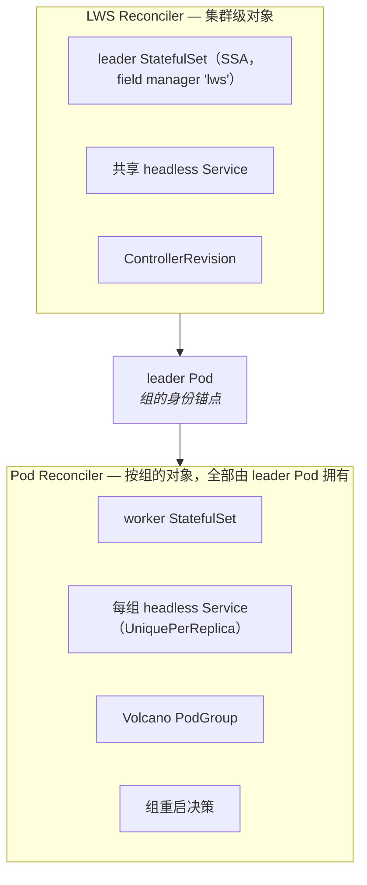
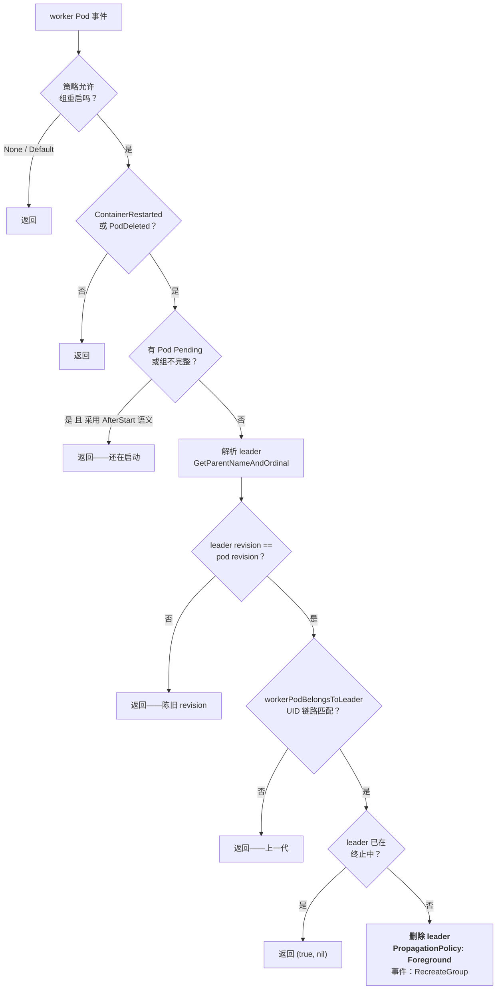

# 模块 5：Pod 控制器与故障处理

两个控制器，而它们之间的分工不是随意的。LWS reconciler（[模块 4](04_lws_reconciler_internals.md)）只拥有三样东西：leader StatefulSet、共享 headless Service、以及 ControllerRevision。**所有按组存在的东西都由 leader Pod 拥有**，而创建它们的正是 Pod 控制器。

Pod 控制器还掌管着 LWS 里后果最重的运行时行为：决定什么时候要因为一个 Pod 出问题而干掉另外七个健康的。这个决定周围的守卫比项目里任何其他代码路径都多，而每一道守卫都源自一个具体的 bug。

本模块覆盖**双控制器分工**、**十六步 Pod reconcile**、**worker StatefulSet 的构建**、**重启策略与重启的检测方式**、**防重启循环的各道守卫**、**节点故障**、**worker 侧的拓扑钉扎**，以及 **KEP-820**——那个尚未实现的 fail-fast 重启预算提案。

!!! info "溯源信息"
    对照 `kubernetes-sigs/lws` 的 `32a9c37`（2026-08-06）、v0.9.0 核实。主要来源：`pkg/controllers/pod_controller.go`、`pkg/utils/pod/pod_utils.go`、`keps/820-distributed-preflight-check/README.md`。

---

## 第一部分：双控制器分工



「所有按组存在的东西都由 leader Pod 拥有」带来的后果是：**拆一个组只需要一次 foreground delete**。没有 finalizer、没有清理循环、没有孤儿协调。删掉 leader Pod，worker StatefulSet、它的 Pod、每组 Service 和 PodGroup 全都跟着走。

第二个后果是一处很容易漏掉的写语义差异：

| 对象 | 写入方式 |
| :--- | :--- |
| leader StatefulSet | **Server-Side Apply**，field manager `lws`，`Force: true`——持续协调 |
| worker StatefulSet | **不存在才创建**——创建后从不更新 |
| headless Service | **不存在才创建** |
| Volcano PodGroup | **不存在才创建** |

只有 leader StatefulSet 是被持续协调的。其余一切都是创建一次、组重建时整体替换。这就是为什么模板变更产生的是「新 leader Pod 拥有新 worker StatefulSet」，而不是原地更新。

### 1.1 Watch 与事件过滤器

```go
ctrl.NewControllerManagedBy(mgr).
    For(&corev1.Pod{}).
    Owns(&appsv1.StatefulSet{}).
    WithEventFilter(predicate.NewPredicateFuncs(/* 带 LWS name label 的 Pod 或 StatefulSet */))
```

这个全局事件过滤器对集群健康是承重的。没有它，这个控制器会把集群里每一个 Pod 事件都排进队列。如果你在 PR 里给这个控制器加了 watch，务必确认过滤器还覆盖你的对象类型。

---

## 第二部分：Pod Reconcile 逐步拆解

十六步，其中大约一半是提前返回。**这些提前返回本身就是逻辑。**

| # | 步骤 | 说明 |
| :--- | :--- | :--- |
| 1 | `Get` pod（`IgnoreNotFound`） | |
| 2 | 要求有 `name` 和 `worker-index` label | 否则硬报错：`"leaderworkerset.sigs.k8s.io/name label is unexpected missing"` |
| 3 | `Get` LWS（`IgnoreNotFound`） | LWS 已删说明 Pod 反正会被 GC |
| 4 | **`handleRestartPolicy`** | 若它删掉了 leader，就此打住 |
| 5 | **不是 leader Pod 就返回** | worker 的协调*只*为第 4 步存在 |
| 6 | **防递归守卫** | 看起来像 leader 但带 `leader-name` annotation → 记日志、发 `FailedCreate`、返回 |
| 7 | `UniquePerReplica` 时创建每组 Service | owner 是 leader Pod |
| 8 | **`pod.DeletionTimestamp != nil` 就返回** | 防止在正被拆除的组下面重建 worker STS |
| 9 | 配了 scheduler provider 时 `CreatePodGroupIfNotExists` | |
| 10 | **`*Size == 1` 就返回** | 根本没有 worker StatefulSet |
| 11 | **StartupPolicy 闸门** | `LeaderReady && !IsPodReady(pod)` → 返回 |
| 12 | 按 **Pod 的** revision key 做 `GetRevision` | 为 `nil` → 1 秒后重排队 |
| 13 | `constructWorkerStatefulSetApplyConfiguration` | |
| 14 | 独占拓扑：设置 worker 的 `nodeSelector` | `pod.Spec.NodeName == ""` 时提前返回 |
| 15 | `setControllerReferenceWithStatefulSet(&pod, sts, scheme)` | owner 是 **leader Pod** |
| 16 | `Get` STS；**仅 `NotFound` 时创建** | `client.IgnoreAlreadyExists` |

其中三步值得细读。

**第 5 步解释了 worker Pod 为什么会被协调。** 一个 worker Pod 产生 reconcile 请求，`handleRestartPolicy` 跑一遍，然后函数就返回了。worker 的其他方面在这里完全不管——worker Pod 由 worker StatefulSet 管。

**第 12 步读的是 Pod 的 revision，不是 LWS spec。** `revisionutils.GetRevision(ctx, r.Client, &lws, revisionutils.GetRevisionKey(&pod))`。这就是滚动中途组内保持自洽的原因：即便 `lws.Spec` 已经往前走，老 revision 的 leader 也拿到老 revision 的 worker。如果 revision 还没出现，控制器会 1 秒后重排队，而不是回退到活的 spec——回退会静默造出一个混 revision 的组。

**第 16 步是只创建。** `setNodeSelectorForWorkerPods` 里有段注释声称「后续的 apply 逻辑会自动把它更新成与 leader Pod 匹配」。**当前代码并不做这件事。** 别依赖它，并且可以把这段注释当成一个值得修的文档 bug。

---

## 第三部分：构建 worker StatefulSet

`constructWorkerStatefulSetApplyConfiguration(leaderPod, lws, currentRevision)`：

```go
currentLws, _ := revisionutils.ApplyRevision(&lws, currentRevision)
template := currentLws.Spec.LeaderWorkerTemplate.WorkerTemplate
```

| 方面 | 值 |
| :--- | :--- |
| 名字 | `leaderPod.Name` |
| Owner | leader **Pod**，`Controller: true`，`BlockOwnerDeletion: true` |
| 副本数 | `*lws.Spec.LeaderWorkerTemplate.Size - 1`——来自**活的** spec |
| Pod 模板 | 来自 **revision 还原出的** `currentLws` |
| `podManagementPolicy` | `Parallel` |
| `ordinals.start` | **`1`** |
| `serviceName` | `leaderPod.Name`，策略为 `Shared` 时是 `lws.Name` |
| Selector label | `{group-index, name, group-key}`——刻意**不含** revision hash |
| Pod label | selector label 加上取自 **leader Pod** 的 `template-revision-hash` |
| Pod annotation | `size`、`leader-name`、`exclusive-topology`，以及子组三件套；然后 `AddTPUAnnotations` |

有两个细节值得记牢：

**selector 里没有 revision hash。** StatefulSet 的 selector 不可变，所以放一个按 revision 变的 label 会让对象跨 revision 无法 patch。既然新 revision 反正会产生一个全新的 worker StatefulSet，稳定的 selector 不花任何代价。

**副本数来自活 spec，模板来自 revision。** 这是刻意的不对称。`size` 的变更（KEP-552）会立即被采纳，而模板变更走 revision 机制。这也意味着盖在 worker Pod 上的 `size` annotation 反映的是活值——而 `LWS_GROUP_SIZE` 和 TPU 算术消费的正是它。

---

## 第四部分：重启策略与组重建

这是本模块的核心。`handleRestartPolicy(ctx, pod, lws) (leaderDeleted bool, err error)`：

```go
policy := lws.Spec.LeaderWorkerTemplate.RestartPolicy
if policy != RecreateGroupOnPodRestart && policy != RecreateGroupAfterStart {
    return false, nil                      // None / Default：永不组重启
}
if !podutils.ContainerRestarted(pod) && !podutils.PodDeleted(pod) {
    return false, nil                      // 什么都没发生
}
pendingPods, err := r.pendingPodsInGroup(ctx, pod, int(*lws.Spec.LeaderWorkerTemplate.Size))
_, hasRecreateGroupAfterStartAnnotation := lws.Annotations[RecreateGroupAfterStartAnnotationKey]
if pendingPods && (policy == RecreateGroupAfterStart || hasRecreateGroupAfterStartAnnotation) {
    return false, nil                      // 组还在启动中，别抖
}
// …解析 leader，跑两道守卫，然后删掉它
```

### 4.1 四种策略

| 策略 | 行为 |
| :--- | :--- |
| `RecreateGroupOnPodRestart`（默认） | 任何 Pod 删除或任何容器重启，立刻重建整组 |
| `RecreateGroupAfterStart` | 同上，但在**组内任一 Pod 处于 Pending 或组不完整**时被抑制 |
| `None` | 在第一行短路——永不组重启 |
| `Default` | 被 defaulting webhook 改写为 `None` |

`RecreateGroupAfterStart` 是为一种具体且非常常见的失败而生的：一个 40 GB 的模型镜像正在拉取，某个 Pod 先拉完了，它的容器因为找不到 peer 而崩溃重启，于是整组被销毁——把其他每个 Pod 已完成的镜像拉取全部丢弃，它们又得重新拉。结果是一个永远收敛不了的组。用「没有 Pod 处于 Pending」作为闸门，就能让首轮上线先完成，再启用激进的重启语义。

!!! warning "那个实验性 annotation 不看自己的值"
    ```go
    _, hasRecreateGroupAfterStartAnnotation := lws.Annotations[RecreateGroupAfterStartAnnotationKey]
    ```
    这是一次**存在性检查**。annotation 的值从来没被读过。上游文档写的是 `: true`，测试 wrapper `wrappers.RestartGroupAfterStartAnnotation()` 设的是 `"enable"`，两者都能生效——`"false"`、`"disabled"`、空字符串也一样能生效。任何想通过设 `false` 来*关掉*这个特性的人都会被坑。

    鉴于 `RecreateGroupAfterStart` 在 v0.9 已经是一等的枚举值，最干净的修法多半是显式地废弃这个 annotation，而不是开始解析它的值。无论走哪条路，它都该进[附录 B](appendix_pr_opportunities.md)。

### 4.2 怎么检测「重启」

```go
func ContainerRestarted(pod corev1.Pod) bool {
    if pod.Status.Phase == corev1.PodRunning || pod.Status.Phase == corev1.PodPending {
        for j := range pod.Status.InitContainerStatuses {
            if pod.Status.InitContainerStatuses[j].RestartCount > 0 { return true }
        }
        for j := range pod.Status.ContainerStatuses {
            if pod.Status.ContainerStatuses[j].RestartCount > 0 { return true }
        }
    }
    return false
}
```

因为这是 `RestartCount > 0` 而不是边沿触发的比较，得出三条性质：

- 它是**在单调递增计数器上的电平触发**。任何容器只要重启过一次，这个 Pod 就永久处于「已重启」状态，直到它被替换掉。这没问题，因为响应就是删掉整组、从而替换掉这个 Pod——但这意味着条件是黏住的，一个不知怎么活过了删除的组会在每次 reconcile 时反复触发。
- **init 容器的重启也算。** 这正是 KEP-820 瞄准的场景：一个 init 容器里的预检（比如 NCCL 带宽测试）失败并重启，就会无预算、无休止地重建整个组。
- **只在 Running 或 Pending 时判定。** 处于 `Succeeded` 或 `Failed` 的 Pod 不会因重启计数触发；不过 `PodDeleted`（`DeletionTimestamp != nil`）独立覆盖了删除这条路。

### 4.3 解析 leader

如果触发的 Pod 是 worker，leader 的名字由 `GetParentNameAndOrdinal(pod.Name)` 得出——剥掉结尾的 `-<n>`。然后在删任何东西之前，要跑**两道守卫**。

**守卫 1——陈旧 revision 检查：**

```go
if revisionutils.GetRevisionKey(&leader) != revisionutils.GetRevisionKey(&pod) {
    return false, nil
}
```

滚动更新期间处于旧 revision 的 worker 反正马上要被替换。删它的 leader 是白做功，还会干扰有序滚动。

**守卫 2——`workerPodBelongsToLeader`，UID 链路走查：**

> pod → controller ref → 若引用是 `StatefulSet`，`Get` 它并要求 `workerSts.UID == owner.UID`；再要求这个 StatefulSet 自己的 controller 是一个 `Pod`，且**名字和 UID** 都与 leader 相符。

名字在组重建之间会被复用，UID 不会。没有 UID 比较，*上一代* worker StatefulSet 的后台删除就可能触发一次 reconcile，把刚重建出来的 leader 删掉——一个无界的重启循环，表现为「我的组每三十秒重启一次而我看不出为什么」。



### 4.4 那次删除

```go
r.Delete(ctx, &leader, &client.DeleteOptions{
    PropagationPolicy: &metav1.DeletePropagationForeground,
})
// 事件：reason "RecreateGroup"，action Delete
// "Worker pod %s failed, deleted leader pod %s to recreate group %s"
```

foreground 传播是必需的，不是装饰。leader Pod 所属的 StatefulSet 会在对象一消失就把它重建出来。用 background 传播的话，新 leader 可能在*旧* worker StatefulSet 还在时就出现——而 worker StatefulSet 是「不存在才创建」且以 leader Pod 命名的，于是新 leader 会收养旧组的 worker。foreground 保证 worker StatefulSet 先被彻底删掉。

### 4.5 `pendingPodsInGroup`

```go
// 按 {name, group-index} 列举
return groupSize != len(podList.Items) || 有任一 Pod 处于 Pending
```

注意它对**两种**情况都返回 true：「有 Pod 处于 Pending」和「组里 Pod 数量不对」。第二种覆盖的是 worker StatefulSet 还没创建完所有 Pod 的那段窗口——而那恰恰是你最不希望触发激进重启的时候。

---

## 第五部分：节点故障

LWS 没有实现节点故障处理。它是继承来的，行为完全由重启策略决定。

| 策略 | 节点挂掉时发生什么 |
| :--- | :--- |
| `RecreateGroupOnPodRestart`（默认） | 节点控制器驱逐 Pod；Pod 删除触发 `PodDeleted`；整组在健康节点上重建 |
| `RecreateGroupAfterStart` | 同上，除非组里还有 Pending 的 Pod |
| `None` | 只有死节点上的 Pod 被重新调度，其余继续跑——通常会留下一个坏掉的集合通信组 |

对分片模型来说，默认值几乎总是你想要的。`None` 只有在组内 Pod 真正互相独立时才站得住脚，而对 LWS 的目标场景来说那很罕见。

注意 Pod 控制器持有对 `nodes` 的 `get;list;watch;update;patch` RBAC。`get` 被 `topologyValueFromPod`（§6）使用。而 `update` 和 `patch` 在核心控制面里没有任何代码路径用到——这是一处过宽的授权，收紧它是个合理的 PR。

---

## 第六部分：worker 侧的拓扑钉扎

独占放置的实现是不对称的，而这个不对称正是有意思的地方。

| | leader Pod | worker Pod |
| :--- | :--- | :--- |
| 机制 | 由 **mutating webhook** 注入的 Pod 亲和性 + 反亲和性 | 由 **Pod 控制器**在 worker StatefulSet 的 Pod 模板上设的普通 `nodeSelector` |
| 位置 | `pod_webhook.go` 里的 `SetExclusiveAffinities` | `pod_controller.go` 里的 `setNodeSelectorForWorkerPods` |
| 时机 | 准入时，调度之前 | leader 被调度之后 |

```go
topologyValue, err := r.topologyValueFromPod(ctx, pod, topologyKey)  // 读 node.Labels[topologyKey]
sts.Spec.Template.Spec.WithNodeSelector(map[string]string{topologyKey: topologyValue})
```

leader *先*被调度，它的亲和性项占住一个拓扑域，然后 worker 按值被钉到那个具体的域上。这就是第 14 步在 `pod.Spec.NodeName == ""` 时提前返回的原因——leader 没落地之前读不到拓扑值。

代价是：整个组的放置由 leader 恰好拿到哪个节点决定，而 worker 之后必须能装进那个域，否则就永远 Pending。在碎片化的集群上这是真实的失效模式，也是 gang 调度（[模块 7](07_scheduling_placement_and_networking.md)）对独占拓扑负载重要的原因。

!!! bug "`topologyValueFromPod` 里的两个小缺陷"
    1. Node 不存在会被 `client.IgnoreNotFound` 吞掉，返回 `("", nil)`——于是设出一个**空的 node selector 值**，什么都匹配不上。结果是一个无法调度、又没有清晰报错的 worker StatefulSet。
    2. 节点缺少该 label 时的报错信息插值的是空的 `topology` *值*而不是拓扑 *key*：`"node does not have topology label: %s"`。这条信息完全没告诉你缺的是哪个 label。

    两个都是边界清晰、可测试的修复。

---

## 第七部分：KEP-820——提案是什么，以及什么还不存在

KEP-820「Fail-Fast Restart Budget and Init-Phase DNS for LeaderWorkerSet」是与本模块相关、目前最值得关注的待议提案。有必要把它的状态说准确。

!!! danger "KEP-820 尚未实现"
    `status: provisional`，grep 可证：

    - `maxGroupRestarts` **只**出现在 `keps/820-distributed-preflight-check/README.md` 里。`api/`、`pkg/`、`config/`、`charts/` 中零命中。
    - `group-restart-count` / `GroupRestartCount`——任何 `.go` 文件中都无匹配。
    - `LeaderWorkerSetFailed`——无匹配。**`Failed` condition 类型并不存在。**

    如果你打算在这里做事，你是在实现一份提案，不是在扩展一个已有实现。

### 7.1 它指出的问题

§4.2 已经确认 init 容器的重启也计入 `ContainerRestarted`。一个分布式预检——init 容器里的 NCCL all-reduce 带宽测试，这其实是很好的实践——遇到坏网卡而失败，就会无预算、无终态地永远重建这个组。这个组永远不会变成 `Failed`，因为 LWS 根本没有 `Failed` condition；它会无限期地停在 `Progressing`，同时烧掉加速器工时。

### 7.2 提案的 API

```go
type LeaderWorkerTemplate struct {
    // +optional
    // +kubebuilder:validation:Minimum=0
    MaxGroupRestarts *int32 `json:"maxGroupRestarts,omitempty"`
}
const LeaderWorkerSetFailed LeaderWorkerSetConditionType = "Failed"
const GroupRestartCountAnnotationKey = "leaderworkerset.sigs.k8s.io/group-restart-count"
```

有几个设计决策值得理解，因为它们正是 reviewer 会追问的地方：

- 计数器持久化为一个 **annotation**，从而在控制器重启后仍然存在。KEP 承认「递增」和「删除」不是原子的，并接受一个尽力而为的界。
- 预算是**组级**的，所以*任何*进入 `RecreateGroupOnPodRestart` 的路径都会消耗它——不只是 init 容器失败。
- validating webhook 会在 `restartPolicy` 不是 `RecreateGroupOnPodRestart` 时拒绝 `maxGroupRestarts`。
- `maxGroupRestarts: 0` 让第一次失败即为终态。
- 失败的副本被排除在 ready/available 统计之外，其 Pod 会被**保留**以便调试。

KEP 里那节「Why No `Failed` Before」对新贡献者来说是难得的好背景：LWS 是按「持续 reconcile」模型设计的，它的三个 condition 描述的是可用性、进展和滚动，而不是终态失败。`Failed` 之前之所以含义模糊，恰恰是因为没有一个可以据以定义它的重试预算。

### 7.3 已经过时的后半部分

KEP-820 的*另一个*特性提议把 `networkConfig.publishNotReadyAddresses` 做成一个 opt-in 的 `bool`，`+kubebuilder:default=false`，理由是「`publishNotReadyAddresses: false` 时 peer FQDN 在 init 阶段可能解析不了」。

**这个前提对 LWS 自己的 Service 并不成立。** `pkg/utils/controller/controller_utils.go` 在 `CreateHeadlessServiceIfNotExists` 里硬编码了 `PublishNotReadyAddresses: true`，`test/testutils/validators.go` 还有断言。一个默认为 `false` 的开关是**回归风险**，不是特性。

这是整个 KEP 语料中最可直接落成 PR 的一条观察：在 KEP-820 下留一条评论指出这两行，就能实质性地改进这份提案，成本为零，而且是与维护者建立联系的好开端。

---

## 实验：故意搞坏一个组

目标是把 §4.3 流程图的每个分支都走一遍，并刻意复现那些守卫所要防的失效模式。

!!! warning "规模"
    第 1–4 步在 `kind` 上用一个简单容器就能跑。第 5 步（拓扑钉扎）需要**至少两个节点**，第 6 步需要一个能 cordon 和 drain 的多节点集群。全程**不需要加速器**——本模块的机制与 GPU 正交。

### 步骤 1 — 摸清每种策略的爆炸半径

部署三个除 `restartPolicy` 外完全相同的 LWS，各为 `replicas: 2, size: 4`，跑一个你能从内部杀掉的容器：

```yaml
command: ["/bin/sh", "-c", "trap 'exit 1' TERM; sleep infinity"]
```

对每一个，杀掉某个 worker 的主进程，记录哪些 Pod 被重建：

```bash
kubectl exec my-lws-0-2 -- kill 1
kubectl get pods -w
```

| 策略 | 预期重建的 Pod |
| :--- | :--- |
| `RecreateGroupOnPodRestart` | 组 0 的全部 4 个；组 1 不受影响 |
| `None` | 只有 `my-lws-0-2` |
| `RecreateGroupAfterStart` | 组 0 的全部 4 个（当前没有 Pending） |

确认 LWS 上的 `RecreateGroup` 事件：

```bash
kubectl get events --field-selector reason=RecreateGroup
```

### 步骤 2 — 让 `RecreateGroupAfterStart` 真正显出差异

只有在有 Pod 处于 Pending 时，两种策略才会分岔。强制造出这个状态：在 worker 模板上设一个没有节点能满足的资源请求，让一个 worker 一直 Pending，然后去搞崩另一个 worker。

```bash
kubectl patch lws my-lws --type=json -p '[{"op":"add",
  "path":"/spec/leaderWorkerTemplate/workerTemplate/spec/containers/0/resources",
  "value":{"requests":{"cpu":"1000"}}}]'
```

`RecreateGroupOnPodRestart` 下这个组会不停抖动。`RecreateGroupAfterStart` 下不会，因为 `pendingPodsInGroup` 返回 true。这就是把 §4.1 的镜像拉取场景确定性地复现了出来。

### 步骤 3 — 证明 annotation 不看自己的值

在一个 `restartPolicy: RecreateGroupOnPodRestart` 的 LWS 上：

```bash
kubectl annotate lws my-lws \
  leaderworkerset.sigs.k8s.io/experimental-recreate-group-after-start=false --overwrite
```

然后重做步骤 2。行为应该切换成 `AfterStart` 语义，**尽管值是 `false`**，因为 `pod_controller.go` 第 220 行是存在性检查。复现出来之后，你就有了[附录 B](appendix_pr_opportunities.md) 那一条的证据——这正是那种能写成一个好的小型上游 issue 的发现。

### 步骤 4 — 看守卫触发

打开控制器的详细日志，在滚动更新的同时搞崩一个尚未更新的组里的 worker：

```bash
kubectl -n lws-system logs deploy/lws-controller-manager -f | grep -i 'revision\|belongs\|recreate'
```

你要找的是守卫 1（`GetRevisionKey(&leader) != GetRevisionKey(&pod)`）拒绝去重建一个滚动更新马上就要替换掉的组。推演一下没有这道守卫会怎样：组被删掉、以*旧* revision 重建，然后立刻又被滚一遍——工作量翻倍。

### 步骤 5 — 拓扑钉扎及其失效模式（2 个以上节点）

```bash
kubectl annotate lws my-lws \
  leaderworkerset.sigs.k8s.io/exclusive-topology=kubernetes.io/hostname --overwrite
```

重建这个 LWS（记住[模块 4](04_lws_reconciler_internals.md) 说过 annotation 被排除在 revision 之外，所以这一步本身*不会*触发滚动）。然后：

```bash
kubectl get sts my-lws-0 -o jsonpath='{.spec.template.spec.nodeSelector}'; echo
kubectl get pod my-lws-0 -o jsonpath='{.spec.affinity}' | jq
```

确认 §6 的不对称性：leader 有亲和性项，worker StatefulSet 有一个写着 leader 实际节点名的普通 `nodeSelector`。

现在把失效模式造出来。`size: 4` 加 `exclusive-topology: kubernetes.io/hostname`，四个 Pod 必须都装进一个节点。把 CPU 请求设成只装得下三个，然后观察：leader 调度成功，worker 被钉到它那个节点，有一个 worker 永远 Pending。这个组永远收敛不了，而且没有任何东西报出清晰的错误。这就是 gang 调度的论据。

### 步骤 6 — 节点故障

```bash
kubectl cordon <承载组 0 的节点>
kubectl drain <节点> --ignore-daemonsets --delete-emptydir-data
kubectl get pods -w
```

确认 §5：默认策略下*整个*组会迁移；`None` 下只有被驱逐的 Pod 迁移——把这个变体留着跑，检查幸存 Pod 的集合通信是否还能用。对真实推理引擎来说不能，这就是默认值的经验论据。

### 检查点问题

- `handleRestartPolicy` 为什么跑在「这是不是 leader Pod」检查**之前**而不是之后？
- 那次删除用的是 foreground 传播。请构造出 background 传播会允许的确切事件序列，并指出哪个对象最终被错误的 owner 收养。
- `ContainerRestarted` 是在 `RestartCount > 0` 上电平触发的。要在它之上实现 KEP-820 的预算，需要改变什么？

继续阅读[模块 6：滚动更新、版本与伸缩](06_rollout_and_revisions.md)。
