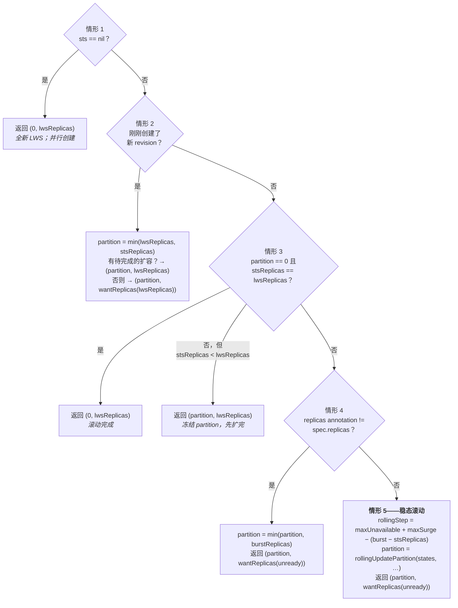

# 模块 6：滚动更新、版本与伸缩

更新一个 Deployment 很容易，因为它的副本可互换。更新一个 LWS 不容易，因为每个副本都是一个必须原子替换的多 Pod 集合体，而且拿掉一个组就意味着一次性把 `size` 张加速卡撤出服务。在「每组 8 卡」的部署上，一个粗心的 `maxUnavailable` 就是「平滑滚动」和「容量事故」之间的区别。

`rollingUpdateParameters()` 是一百来行算术，把整个问题归约成两个数字——一个 **partition** 和一个**副本数**——然后交给 StatefulSet 控制器。本模块逐行推导这两个数，再把上游那个示例完整地在真实代码上走一遍，证明推导是对的。

覆盖内容：**「已更新」是什么意思**、**基础算术**、**五种情形**、**partition 递减**、**surge 回收**、**完整的推演**、**作为用户灰度旋钮的 `partition`**、**伸缩**，以及 **`MaxUnavailableStatefulSet` 依赖**。

!!! info "溯源信息"
    对照 `kubernetes-sigs/lws` 的 `32a9c37`（2026-08-06）、v0.9.0 核实。主要来源：`pkg/controllers/leaderworkerset_controller.go`，以及 KEP-511、KEP-552。

---

## 第一部分：「已更新」是什么意思

后面的一切都依赖一对按组的布尔值。`getReplicaStates(ctx, lws, stsReplicas, revisionKey) []replicaState` 构建一个按组索引、长度固定的切片：

```go
type replicaState struct {
    ready   bool
    updated bool
}
```

构建过程比看上去更讲究：

1. leader Pod 按 `{name, worker-index: "0"}` 列举，用 `utils.SortByIndex` 依 `group-index` label 放进一个长度为 `stsReplicas` 的切片。越界或无法解析的索引会被**丢弃**，留下零值条目——读作 `{ready: false, updated: false}`。
2. worker StatefulSet 按 `{name}` 列举，同样方式排序。
3. 对索引 `idx`，期望名字是 `fmt.Sprintf("%s-%d", lws.Name, idx)`。**如果该槽位上的 Pod 名字对不上**——或者 `Size > 1` 时 StatefulSet 名字对不上——该槽位就是 `{false, false}`。这就是「尚未创建」和「正在重建」如何在不引入额外状态的情况下被表达出来。
4. 否则：

```go
leaderUpdated := revisionutils.GetRevisionKey(&sortedPods[idx]) == revisionKey
leaderReady   := podutils.PodRunningAndReady(&sortedPods[idx])
if *lws.Spec.LeaderWorkerTemplate.Size > 1 {
    updated = leaderUpdated && revisionutils.GetRevisionKey(&sortedSts[idx]) == revisionKey
    ready   = leaderReady   && statefulsetutils.StatefulsetReady(sortedSts[idx])
}
```

一个组只有在其 leader Pod **和** worker StatefulSet *都*带当前 revision key 时才算**已更新**；只有在 leader Pod 处于 Running-and-Ready **且**下式成立时才算**就绪**：

```go
func StatefulsetReady(sts appsv1.StatefulSet) bool {
    return *sts.Spec.Replicas == sts.Status.AvailableReplicas &&
           sts.Status.CurrentRevision == sts.Status.UpdateRevision
}
```

注意 `revisionKey`——`leaderworkerset.sigs.k8s.io/template-revision-hash` 的值——是「已更新」的**唯一**定义。整条滚动路径里没有任何模板比较。这个 label 会自动传播：LWS 控制器把它放到 leader StatefulSet 的 Pod 模板上，StatefulSet 控制器把它复制到新的 leader Pod，Pod 控制器再用 *leader Pod 的* key 盖到 worker StatefulSet 及其 Pod 模板上。

---

## 第二部分：基础算术

```go
maxSurge, _       = intstr.GetScaledValueFromIntOrPercent(&...MaxSurge,       int(lwsReplicas), true)   // 向上取整
maxUnavailable, _ = intstr.GetScaledValueFromIntOrPercent(&...MaxUnavailable, int(lwsReplicas), false)  // 向下取整
if maxSurge > int(lwsReplicas) { maxSurge = int(lwsReplicas) }
burstReplicas := lwsReplicas + int32(maxSurge)
```

| 量 | 规则 |
| :--- | :--- |
| `maxSurge` | 百分比**向上**取整，然后钳到 `lwsReplicas` |
| `maxUnavailable` | 百分比**向下**取整——正是这个取整让 5 副本的 `10%` 变成 0，从而踩到 webhook |
| `burstReplicas` | `lwsReplicas + maxSurge`——leader StatefulSet 副本数的上限 |

还有一个作用于**每一条**返回路径的延迟钳制：

```go
defer func() {
    stsPartition = max(stsPartition, *lws.Spec.RolloutStrategy.RollingUpdateConfiguration.Partition)
}()
```

这就是 KEP-511 那个用户可见的 `partition` 在充当**下限**。不管算法算出什么，partition 都不会低于用户设定的值。这一行就是整个灰度机制。

---

## 第三部分：五种情形

`rollingUpdateParameters` 按顺序判断五种情形，命中第一个就返回。



**情形 1** 是全新 LWS。partition 为 0，因为 Pod 是并行创建的——没有什么需要拦住。

**情形 2** 在「刚切了新 ControllerRevision」的那次 reconcile 触发。`partition := min(lwsReplicas, stsReplicas)` 把 partition 设到**所有现有组之上**，于是什么都不更新；先把 burst 副本创建出来。如果 `stsReplicas < lwsReplicas`——模板变更时还有待完成的扩容——它返回 `lwsReplicas`，让扩容直接用*新*模板完成，这比先造出旧 revision 的组再立刻替换要便宜。

**情形 3** 检测滚动已完成：`partition == 0 && stsReplicas == lwsReplicas`。它也处理滚动中途的纯扩容：冻结 partition，让副本数长上去。

**情形 4** 是 `leaderworkerset.sigs.k8s.io/replicas` annotation 存在的意义所在。它在每次 apply 时被盖到 leader StatefulSet 上，因此是一份持久化的「上次 apply 时的 `spec.replicas` 值」。如果它与当前 `spec.replicas` 不符，说明有人在滚动中途伸缩了 LWS。对策是 `partition = min(partition, burstReplicas)`——把 partition 钳进新范围——然后继续。annotation 缺失或格式错误会**硬报错返回**，如果你曾手改过 leader StatefulSet，这点值得知道。

**情形 5** 是稳态，也就是第四部分。

---

## 第四部分：Partition 递减

```go
rollingStep := maxUnavailable
// 必须始终尊重 maxUnavailable，
// 否则在回收 burst 副本时就会违反它。
rollingStep += maxSurge - (int(burstReplicas) - int(stsReplicas))
partition = rollingUpdatePartition(states, stsReplicas, int32(rollingStep), partition)
```

因为 `burstReplicas - stsReplicas` 是**尚未物化**的 surge 容量，这个表达式可以化简为：

$$
\text{rollingStep} = \text{maxUnavailable} + \text{已创建出来的 surge}
$$

这才是真正的洞见。surge 副本是额外的服务容量，所以每一个真实存在的 surge 副本，都允许你在不违反可用性预算的前提下多拿掉一个组。满 burst 时步长是 `maxUnavailable + maxSurge`；surge Pod 还没出现时，步长就只是 `maxUnavailable`。

然后是函数本身，项目里最密的一段代码：

```go
func rollingUpdatePartition(states []replicaState, stsReplicas, rollingStep, currentPartition int32) int32 {
    continuousReadyReplicas := calculateContinuousReadyReplicas(states)
    var rollingStepPartition = utils.NonZeroValue(stsReplicas - continuousReadyReplicas - rollingStep)

    var unavailable int32
    for idx := 0; idx < int(rollingStepPartition); idx++ {
        if !states[idx].ready { unavailable++ }
    }
    var partition = rollingStepPartition + unavailable

    for idx := min(partition, stsReplicas-1); idx >= rollingStepPartition; idx-- {
        if !states[idx].ready || states[idx].updated { partition = idx } else { break }
    }
    return min(partition, currentPartition)
}
```

五步动作，各司其职：

| | 动作 | 目的 |
| :--- | :--- | :--- |
| **a** | `calculateContinuousReadyReplicas` **从尾部往下**数 `ready && updated` 的组，遇到第一个不满足的就停 | 确定高索引那一端已经完成了多少 |
| **b** | `rollingStepPartition = stsReplicas − continuousReady − rollingStep` | 把 partition 推到「已完成尾部」再往下一整步的位置 |
| **c** | 数出 `rollingStepPartition` **以下**未就绪的组数，加回去 | 已经不健康的组*已经花掉了*可用性预算，不能重复花 |
| **d** | 从 `partition` **向下**走，只要该组已更新**或**已不就绪就继续，但不低于 `rollingStepPartition` | 更新一个「已更新」或「已经挂了」的组是免费的——顺手拿下 |
| **e** | `min(partition, currentPartition)` | **单调性不变式：partition 只会向下移动** |

动作 (c) 是最容易被忽略的。没有它，一个有两个低索引组已崩溃、`maxUnavailable: 2` 的 LWS，会为了滚动再拿掉两个组，导致容量短缺四个组。

动作 (e) 加上第二部分那个延迟的 `max(..., spec.partition)`，构成完整的不变式：

> partition 在一次滚动内**单调不增**，且**永不越过用户设定的灰度下限**。

最后是驱动副本数的未就绪计数：

```go
func calculateLWSUnreadyReplicas(states []replicaState, lwsReplicas int32) int32 {
    var unreadyCount int32
    for idx := int32(0); idx < lwsReplicas; idx++ {
        if idx >= int32(len(states)) || !states[idx].ready || !states[idx].updated { unreadyCount++ }
    }
    return unreadyCount
}
```

它只扫 `[0, lwsReplicas)`——**超出期望数量的 surge 副本永远不算未就绪**，这正是 surge 回收能够终止的原因。

---

## 第五部分：Surge 回收

```go
func calculateRollingUpdateReplicas(lwsReplicas, maxSurge, maxUnavailable, unreadyReplicas int32) int32 {
    burstReplicas := lwsReplicas + maxSurge
    if unreadyReplicas <= maxSurge {
        requiredSurgeReplicas := utils.NonZeroValue(unreadyReplicas - maxUnavailable)
        return lwsReplicas + requiredSurgeReplicas
    }
    return burstReplicas
}
```

两种状态：

- **还有很多组未就绪**（`unready > maxSurge`）：维持满 burst。每一个额外副本你都需要。
- **只剩少量组未就绪**（`unready <= maxSurge`）：只保留 `max(0, unready − maxUnavailable)` 个 surge 副本。剩下的未就绪组已经装得进 `maxUnavailable` 预算，surge 容量不再需要。

因此 surge 是**渐进**回收的，不是最后一次性收掉——而且因为回收由未就绪计数驱动，如果滚动中途有组变得不健康，它还会缩了又涨。

包装函数 `wantReplicas()` 在缩容时发出 `GroupsProgressing`/`Delete` 事件：一个是 `"deleting surge replica %s-%d"`，多个是 `"deleting surge replicas from %s-%d to %s-%d"`。这些事件是判断回收正在发生的最清晰信号。

---

## 第六部分：完整推演

上游文档给了一张九阶段的表，参数是 `replicas: 4, maxUnavailable: 2, maxSurge: 2`。这里把它重列一遍，并在每一步补上从代码推导出的算术——那正是上游页面省略掉的部分。

常量：`lwsReplicas = 4`、`maxSurge = 2`、`maxUnavailable = 2`、`burstReplicas = 6`。

| | Partition | Replicas | R0 | R1 | R2 | R3 | R4 | R5 |
| :--- | :---: | :---: | :---: | :---: | :---: | :---: | :---: | :---: |
| **阶段 1** | 0 | 4 | ✅ | ✅ | ✅ | ✅ | | |
| **阶段 2** | 4 | 6 | ❎ | ❎ | ❎ | ❎ | ⏳ | ⏳ |
| **阶段 3** | 2 | 6 | ❎ | ❎ | ⏳ | ⏳ | ⏳ | ⏳ |
| **阶段 4** | 2 | 6 | ❎ | ❎ | ⏳ | ⏳ | ✅ | ⏳ |
| **阶段 5** | 0 | 6 | ⏳ | ⏳ | ⏳ | ⏳ | ✅ | ✅ |
| **阶段 6** | 0 | 6 | ⏳ | ⏳ | ✅ | ✅ | ✅ | ✅ |
| **阶段 7** | 0 | 4 | ⏳ | ⏳ | ✅ | ✅ | | |
| **阶段 8** | 0 | 4 | ⏳ | ✅ | ✅ | ✅ | | |
| **阶段 9** | 0 | 4 | ✅ | ✅ | ✅ | ✅ | | |

✅ 已更新且就绪 · ❎ 未更新（但就绪） · ⏳ 更新中（未就绪）

**阶段 1 → 2。** 模板变了，`leaderWorkerSetUpdated` 为真 → **情形 2**。`partition = min(4, 4) = 4`。`stsReplicas >= lwsReplicas`，所以副本数是 `wantReplicas(4)`：未就绪 `4 > maxSurge 2` → 满 burst → **6**。partition 高于所有现有组，因此什么都没被拆；两个 surge 组 R4、R5 以新 revision 被创建出来。

**阶段 2 → 3。** 情形 5。`stsReplicas = 6`，surge 全部物化：`rollingStep = 2 + 2 − (6−6) = 4`。R5 未就绪，故 `continuousReadyReplicas = 0`。于是 `rollingStepPartition = 6 − 0 − 4 = 2`。R0、R1 就绪，所以 `unavailable = 0`、`partition = 2`。动作 (d) 检查 R2：就绪且*未*更新 → break。**partition = 2。** R2、R3 开始更新。

**阶段 3 → 4。** R4 变成 ready+updated；R5 仍未就绪，所以 `continuousReadyReplicas` 还是 0，`rollingStepPartition` 还是 2。动作 (d) 这次发现 R2 未就绪 → `partition = 2`，然后 `idx--` 落到 `rollingStepPartition` 以下，循环结束。**partition 保持 2**——正是上游那句注解「由于最后一个副本未就绪，Partition 不会变化」。

**阶段 4 → 5。** R5 变成 ready+updated。从尾部数：R5 ✅、R4 ✅、R3 未就绪 → 停，`continuousReadyReplicas = 2`。于是 `rollingStepPartition = 6 − 2 − 4 = 0`，空区间上的 `unavailable` 为 0，动作 (d) 在 R0（就绪、未更新）处立刻 break。**partition = 0。** R0、R1 开始更新。

**阶段 5 → 6。** R2、R3 完成。partition 不变，已经是 0。

**阶段 6 → 7。** 现在轮到副本数动。`calculateLWSUnreadyReplicas` 只扫 `[0, 4)`：R0、R1 未就绪 → `unready = 2`。因为 `2 <= maxSurge 2`，`requiredSurgeReplicas = max(0, 2 − 2) = 0` → 副本数 **4**。两个 surge 副本被删除，发出 `deleting surge replicas from my-lws-4 to my-lws-5`。

注意刚刚发生了什么：被删掉的两个组是**已更新**的那两个，而 R0、R1 还在更新中。这没问题——按定义索引 4 和 5 就在 `[0, lwsReplicas)` 之外，而 R0/R1 的槽位会由新 revision 填上。

**阶段 7 → 9。** R1 完成（`unready = 1`，仍 `<= maxSurge`，`max(0, 1−2) = 0` → 副本数保持 4），然后是 R0。当 `unready = 0` 且 `partition == 0`、`stsReplicas == lwsReplicas` 时，情形 3 触发，`updateDone` 为真，`TruncateRevisions` 删掉旧的 ControllerRevision。

!!! tip "推理捷径"
    如果只记一件事，就记动作 (a)：**partition 锚定在「已更新且就绪」的尾部。** 其余全是修正项。一次卡住的滚动，几乎总意味着尾部没有增长——某个高索引的组迟迟不就绪——于是 partition 无法下降。

---

## 第七部分：作为用户旋钮的 `partition`

KEP-511 把 `rollingUpdateConfiguration.partition` 暴露出来，让用户能把滚动停在选定的边界上。`[0, partition)` 的组被冻结；`[partition, replicas)` 的组更新。

### 7.1 灰度

```yaml
spec:
  replicas: 10
  rolloutStrategy:
    rollingUpdateConfiguration:
      partition: 8      # 只有第 8、9 组采用新模板
```

改模板、等待、评估，然后把 `partition` 调低以扩大范围：8 → 5 → 0。

### 7.2 xPyD 比例保持

KEP 的动机场景是用两个 LWS 做 prefill/decode 分离。滚动期间你希望 prefill:decode 的版本比例保持住——先把 prefill 全滚完再滚 decode，意味着新版 prefill 服务器把 KV cache 交给旧版 decode 服务器。让两个 LWS 的 partition 齐步走，就能在每个时刻保持比例。

这正是 `DisaggregatedSet` 要正经解决的问题（[模块 8](08_disaggregatedset.md)）；手工调 partition 是它出现之前大家的做法，而如果你的 role 不在 DisaggregatedSet 里，现在仍然只能这么做。

### 7.3 与 condition、截断的互动

KEP-511 除了加字段还改了两件事，两件都容易踩：

- `UpdateInProgress` 和 `Available` 是在**索引 ≥ `partition`** 的组上计算的，不是所有组。一个被冻结且不健康的组不会让*滚动*看起来卡住。
- `updateConditions` 返回的是 `allUpdateDone`——在**所有**副本上计算——而不是加窗后的值，而它才是 `TruncateRevisions` 的闸门。没有这一改，分区滚动会把那些被留住的组仍在运行的 revision 给回收掉。

实际含义：**只要 `partition > 0`，两个 revision 都会保留。** 那就是你的回滚路径，而它会在你设 `partition: 0` 且滚动完成的那一刻消失。

!!! warning "回滚只能靠手工重新 apply"
    如[模块 4](04_lws_reconciler_internals.md) 所述，LWS 在滚动完成后只保留一个 revision，且没有 `revisionHistoryLimit`。`kubectl rollout undo` 对 LWS 不起作用。把上一份 manifest 留在版本控制里，因为集群不会替你留。

---

## 第八部分：伸缩

有三件事常被统称为「伸缩」，但行为各不相同。

| 改动 | 切 revision？ | 触发滚动？ | 效果 |
| :--- | :---: | :---: | :--- |
| `spec.replicas` | 否 | 否 | 在当前 revision 上增删组 |
| `leaderWorkerTemplate.size` | **是** | **是** | 每个组按新的 Pod 数重建 |
| `rolloutStrategy.*` | 否 | 否 | 改变*下一次*滚动的行为 |

### 8.1 通过 `replicas` 横向伸缩

`spec.replicas` 被排除在 revision 补丁之外（[模块 4](04_lws_reconciler_internals.md) §5.1），所以伸缩从不滚动任何东西。新组以当前 revision 创建；被移除的组从 leader 开始删，级联清理。

HPA 通过 scale 子资源驱动它，用的是[模块 2](02_api_surface_anatomy.md) §4 里那个只选 leader 的 selector。指标必须**由 leader 发布且代表整个组**。

滚动**期间**伸缩由情形 4 处理，靠的是 leader StatefulSet 上的 `replicas` annotation。它能工作，但会让滚动算术更难推理；条件允许的话，先让滚动跑完。

### 8.2 通过 `size` 纵向伸缩（KEP-552）

`size` 可变。改它会改 Pod 模板上的 `leaderworkerset.sigs.k8s.io/size` annotation，进而改 revision hash，从而触发一次正常的逐组滚动。每个组都按新的 Pod 数重建。

!!! note "KEP-552 描述了一个从未被实现的 API"
    这份 KEP 提议了一个取值为 `None` 和 `Recreate` 的 `ResizePolicy` 字段。**`grep -rn "ResizePolicy" api/ pkg/` 什么也搜不到。** Implementation History 里记着 `2025-08-05: Implementation revised to avoid additions to the API surface`——最终落地的只是「`size` 可变，size annotation 自然触发滚动」。KEP 正文从未同步更新，所以它至今仍在描述一个不存在的字段。

    把 KEP 更新成实际落地的样子，是一个确实有用的文档 PR，而且很容易：证据就是一次 grep。这份 KEP 还写了一条明确的非目标——**不做原地 resize**——因为「它会带来更多复杂性，比如在运行时动态改变拓扑相关的环境变量」。

那条非目标才是重点。`LWS_GROUP_SIZE` 和 `TPU_WORKER_HOSTNAMES` 是准入时注入、进程启动时读取的；没有任何机制能在运行中的容器里更新它们，就算有，也没有哪个推理引擎会正确响应。因此组的 resize *必然*是重建。

---

## 第九部分：`MaxUnavailableStatefulSet` 依赖

`maxUnavailable > 1` 的实现方式是把值透传给 leader StatefulSet 的 `rollingUpdate.maxUnavailable`，那是一个上游 Kubernetes 特性。

该字段在 **Kubernetes 1.35 升为 beta 并默认启用**。更早的版本必须在 API server 和 controller manager 上显式打开该 gate；不打开的话 StatefulSet 控制器会忽略这个字段、一次只滚一个 Pod——于是你的 `maxUnavailable: 4` 会静默地表现为 1。

!!! danger "上游文档在这一点上自相矛盾"
    - `site/content/en/docs/concepts/rollout-strategy/_index.md`：「`MaxUnavailable` 已在 Kubernetes 1.35 升为 Beta，意味着它默认启用。」
    - `site/content/en/docs/installation/_index.md`：「你必须启用 `MaxUnavailableStatefulSet` feature gate，它**自 Kubernetes v1.24 起仍处于 alpha**。」

    两页都随 v0.9.0 一起发布。把它们统一起来是个小而高价值的文档 PR——见[附录 B](appendix_pr_opportunities.md)。`rollout-strategy` 那页是对的；`installation` 那页在 gate 毕业时没被更新。

    同一个 `installation` 页面还完全没提 `rollingUpdateConfiguration.partition` 是个用户可设的字段，把它当成了纯粹的控制器内部变量。

诊断方法很直接：如果你设了 `maxUnavailable: 4` 却观察到组严格一个一个更新，先查 gate，再去读上面那些算术。

---

## 实验：让算术可见

本实验全部在 `kind` 上用一个简单容器跑。滚动算法与加速器完全正交，而用一个启动快的镜像能让状态迁移可观察，而不是干等十分钟。

### 步骤 1 — 复现九阶段推演

部署 `replicas: 4, size: 2, maxUnavailable: 2, maxSurge: 2`，容器大约 20 秒才 Ready（`readinessProbe` 配 `initialDelaySeconds: 20` 很合适——长到能看清各阶段，短到不会让你睡着）。

一个终端里：

```bash
watch -n1 'kubectl get lws my-lws -o jsonpath="P=$(kubectl get sts my-lws -o jsonpath={.spec.updateStrategy.rollingUpdate.partition}) R=$(kubectl get sts my-lws -o jsonpath={.spec.replicas})"; echo; kubectl get pods -l leaderworkerset.sigs.k8s.io/worker-index=0 -o custom-columns="NAME:.metadata.name,REV:.metadata.labels.leaderworkerset\.sigs\.k8s\.io/template-revision-hash,READY:.status.conditions[?(@.type==\"Ready\")].status"'
```

另一个终端里触发滚动：

```bash
kubectl patch lws my-lws --type=json -p '[{"op":"replace",
  "path":"/spec/leaderWorkerTemplate/workerTemplate/spec/containers/0/image",
  "value":"nginxinc/nginx-unprivileged:1.28"}]'
```

记录每次迁移时的 `(partition, replicas)`，与第六部分的表对照。观察不一致的地方，推出是五种情形里的哪一个触发了、为什么——最常见的偏差是你的 Pod 就绪得比 reconcile 采样还快，把几个阶段压成了一个。

### 步骤 2 — 明确观察 surge 回收

```bash
kubectl get events --field-selector reason=GroupsProgressing -w | grep -i surge
```

你应该在阶段 7 看到 `deleting surge replicas from my-lws-4 to my-lws-5`。对照第五部分确认它为什么恰好发生在那一刻而不是更早：触发条件是 `unready <= maxSurge`。

### 步骤 3 — 验证动作 (c)：不可用度记账

在开始滚动之前，故意搞坏两个低索引的组：

```bash
kubectl patch lws my-lws --type=json -p '[{"op":"replace",
  "path":"/spec/leaderWorkerTemplate/workerTemplate/spec/containers/0/readinessProbe/exec/command",
  "value":["false"]}]'   # 或者单独把组 0 和组 1 搞坏
```

然后以 `maxUnavailable: 2, maxSurge: 0` 触发一次模板滚动，观察同时被拆掉的组有几个。没有动作 (c) 的话，会在已经坏掉的两个之上再拆两个；有了它，partition 被 `unavailable` 计数顶回去，滚动拆得更少。

先手算出预期的 partition，再去看结果。

### 步骤 4 — 演练灰度下限

```bash
kubectl patch lws my-lws --type=merge \
  -p '{"spec":{"rolloutStrategy":{"rollingUpdateConfiguration":{"partition":3}}}}'
# 改镜像
kubectl get pods -l leaderworkerset.sigs.k8s.io/worker-index=0 \
  -o custom-columns='NAME:.metadata.name,REV:.metadata.labels.leaderworkerset\.sigs\.k8s\.io/template-revision-hash'
```

应该只有组 3 带着新的 revision key。然后验证 §7.3 的截断互动：

```bash
kubectl get controllerrevision -l leaderworkerset.sigs.k8s.io/name=my-lws
```

两个 revision，会一直存在。把 `partition` 一路降到 0，看着滚动完成后第二个消失。

### 步骤 5 — 滚动中途伸缩，找到情形 4

启动一次滚动，在它进行中：

```bash
kubectl scale lws/my-lws --replicas=6
kubectl get sts my-lws -o jsonpath='{.metadata.annotations.leaderworkerset\.sigs\.k8s\.io/replicas}'; echo
```

观察这个 annotation 在下一次 apply 时从 `4` 变成 `6`。在那次 apply 落地之前，annotation 与 `spec.replicas` 不一致，情形 4 会钳制 partition。读一读情形 4 的分支，确认如果没有这个 annotation 会出什么问题——具体来说，为什么控制器不能直接拿 StatefulSet 当前的副本数去比。

### 步骤 6 — 验证 `MaxUnavailableStatefulSet` gate

```bash
kubectl version --short
kubectl get sts my-lws -o jsonpath='{.spec.updateStrategy.rollingUpdate.maxUnavailable}'; echo
```

在 LWS 上设 `maxUnavailable: 3`，确认值传到了 StatefulSet 上——不管 gate 开没开，它都会传到。然后触发滚动，数一数实际同时下线了几个组。如果是一个，说明 gate 没开，你就复现了那两页自相矛盾的上游文档所制造的困惑。

### 检查点问题

- 为什么动作 (e) 用 `min` 而延迟钳制用 `max`？各自保护什么不变式？互换会坏在哪？
- 阶段 7 里算法删掉了两个*已更新*的 surge 副本，而还剩两个*未更新*的组。为什么这不是容量倒退？
- `calculateLWSUnreadyReplicas` 扫的是 `[0, lwsReplicas)` 而不是 `[0, len(states))`。请构造出「如果它扫整个切片」会得到的那个不终止的滚动。

继续阅读[模块 7：调度、放置与网络](07_scheduling_placement_and_networking.md)。
