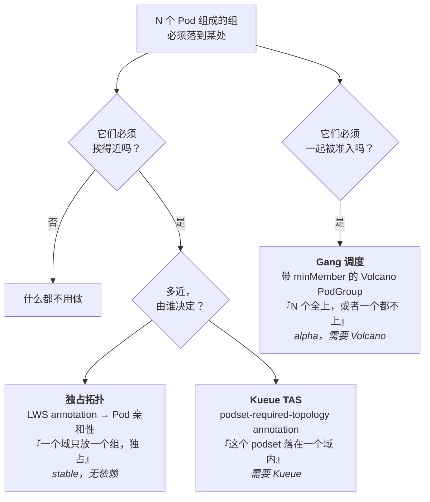
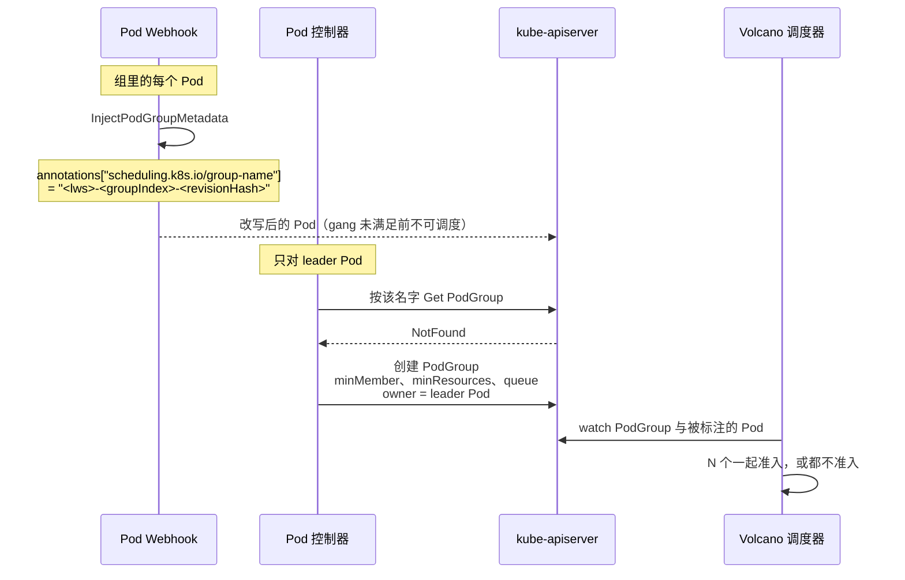

# 模块 7：调度、放置与网络

一个组的好坏取决于它被放在哪。十六个 Pod 摊在八个机架上，模型照样能跑，但吞吐只有同样十六个 Pod 待在一个 NVLink 域里的一小部分——而一个 leader 调度上了、worker 没调度上的组，比根本没调度上的组还糟，因为它占着加速器却不提供任何服务。

本模块讲 LWS 为这个问题提供的三种机制，按野心从小到大：**独占拓扑放置**（LWS 自带，随时可用）、**gang 调度**（委托给 Volcano，alpha）、**拓扑感知调度**（委托给 Kueue）。此外还有**大规模下的 subdomain 策略取舍**、**`volumeClaimTemplates`**，以及 **worker 扩缩**——剩下两个没地方安放的稳定 KEP。

!!! info "溯源信息"
    对照 `kubernetes-sigs/lws` 的 `32a9c37`（2026-08-06）、v0.9.0 核实。主要来源：`pkg/webhooks/pod_webhook.go`、`pkg/controllers/pod_controller.go`、`pkg/schedulerprovider/`、`pkg/utils/utils.go`，以及 KEP 407、552、622。

---

## 第一部分：放置问题



这是三种不同的保证，却经常被混为一谈：

| 机制 | 保证什么 | 防止哪种失效 |
| :--- | :--- | :--- |
| 独占拓扑 | 组内每个 Pod 都在**同一个**域，且**没有别的组**共享它 | 跨机架张量并行；同一 NVLink 域里的吵闹邻居 |
| 拓扑感知调度 | 组被放在层级中**指定层级**的某个域内，倾向更紧的层级 | 明明能「同主机」却只满足了「同机架」 |
| Gang 调度 | 组**要么全部准入，要么都不准入** | leader 调度上了、worker Pending，加速器被扣为人质 |

「有独占拓扑但没有 gang 调度」是大多数人的起点，而这恰恰是[模块 5](05_pod_controller_and_failure_handling.md) §6 那个死锁的组合：leader 占住一个域，worker 装不进去，这个组就永远卡住。

---

## 第二部分：独占拓扑放置

完全由 LWS 上的一个 annotation 驱动：

```yaml
metadata:
  annotations:
    leaderworkerset.sigs.k8s.io/exclusive-topology: cloud.google.com/gce-topology-block
```

它的值是一个**节点 label key**，用来定义「一个域」是什么：`kubernetes.io/hostname` 表示按主机，某个机架 label 表示按机架，云厂商的 block label 表示按网络块。

### 2.1 注入的亲和性

`pkg/webhooks/pod_webhook.go` 里的 `SetExclusiveAffinities(pod, groupUniqueKey, topologyKey, podAffinityKey)`：

```go
if exclusiveAffinityApplied(*pod, topologyKey) { return }   // 幂等

pod.Spec.Affinity.PodAffinity.RequiredDuringSchedulingIgnoredDuringExecution = append(..., corev1.PodAffinityTerm{
    LabelSelector: &metav1.LabelSelector{MatchExpressions: []metav1.LabelSelectorRequirement{
        {Key: podAffinityKey, Operator: metav1.LabelSelectorOpIn, Values: []string{groupUniqueKey}},
    }},
    TopologyKey: topologyKey,
})

pod.Spec.Affinity.PodAntiAffinity.RequiredDuringSchedulingIgnoredDuringExecution = append(..., corev1.PodAffinityTerm{
    LabelSelector: &metav1.LabelSelector{MatchExpressions: []metav1.LabelSelectorRequirement{
        {Key: podAffinityKey, Operator: metav1.LabelSelectorOpExists},
        {Key: podAffinityKey, Operator: metav1.LabelSelectorOpNotIn, Values: []string{groupUniqueKey}},
    }},
    TopologyKey: topologyKey,
})
```

用大白话读：

- **亲和性**：「把我和那些与我共享 `group-key` 的 Pod 放在同一个拓扑域里。」
- **反亲和性**：「排斥任何**带** `group-key` **且** `group-key` 不是我的 Pod。」

反亲和性里的 `Exists` 项是承重细节。没有它，`NotIn` 选择器还会匹配上那些根本没有 `group-key` label 的 Pod——每个 DaemonSet、每个无关负载——于是这个组会拒绝调度到任何有东西的地方。有了它，被排斥的只有*其他 LWS 组*。

两项都是 `RequiredDuringSchedulingIgnoredDuringExecution`。没有软性变体，也就是说独占拓扑是一条硬约束：它宁可让组无限期 Pending，也不会优雅降级。

幂等性靠 `exclusiveAffinityApplied(pod, topologyKey)`，它要求**同时**存在 `TopologyKey` 完全一致的一条 PodAffinity 项和一条 PodAntiAffinity 项，才认为已经处理过。

### 2.2 子组级独占

子组变体与上面逐字节相同，只是 `podAffinityKey` 换成 `leaderworkerset.sigs.k8s.io/subgroup-key`，拓扑 key 来自 `subgroup-exclusive-topology`。两者可以同时作用于一个 Pod，产生两条亲和性项和两条反亲和性项。

经典的两级配置：

```yaml
metadata:
  annotations:
    leaderworkerset.sigs.k8s.io/exclusive-topology: cloud.google.com/gce-topology-block
    leaderworkerset.sigs.k8s.io/subgroup-exclusive-topology: kubernetes.io/hostname
spec:
  leaderWorkerTemplate:
    size: 16
    subGroupPolicy:
      subGroupSize: 8
```

「整个 16-Pod 组住在一个网络块里，每个 8-Pod 子组住在一台主机上。」这正是一个 16 路张量并行模型想要的拓扑：机内走 NVLink，机间走高带宽 fabric，而且没有别的组来抢。

### 2.3 leader/worker 的不对称

如[模块 5](05_pod_controller_and_failure_handling.md) §6 所述，放置在两侧的实现方式不同：

| | leader | worker |
| :--- | :--- | :--- |
| 机制 | **准入时**注入的 Pod 亲和性 + 反亲和性 | worker StatefulSet 上的普通 `nodeSelector`，**leader 调度之后**才设 |
| 看到的是 | 拓扑 *key* | 从 leader 所在节点读到的拓扑 *value* |

leader 先调度、按值占住一个域；worker 随后被钉到那个字面值上。`setNodeSelectorForWorkerPods` 在 `pod.Spec.NodeName == ""` 时提前返回，因为那时还没有值可读。

!!! warning "不对称就是失效模式"
    由于 leader 在 worker 的可行性已知*之前*就调度了，调度器根本没有办法拒绝一个装不下整个组的域。因此独占拓扑保证的是「**只要这个组能调度上**就一定共置」，而当它调度不上时它什么也不提供。这个缺口就是 gang 调度的全部论据。

### 2.4 不受版本管理

`exclusive-topology` 是 annotation，而元数据被排除在 revision 补丁之外（[模块 4](04_lws_reconciler_internals.md) §5.1）。改它**不会**切 revision，也**不会**触发滚动。已有的组保持原来的放置；只有之后创建的组才用新的。

如果你要给已有的集群重新排布，就得用别的手段强制滚动——改镜像 tag，或者删组。这会让人意外，而上游文档目前恰恰缺这一句话。

---

## 第三部分：Gang 调度（KEP-407，Alpha）

### 3.1 落地的东西 vs KEP 描述的东西

KEP-407 处于 `status: provisional`、`stage: alpha`，而提案与实现之间的差距大到只读 KEP 会把你带偏。

| KEP-407 说的 | 代码里实际有的 |
| :--- | :--- |
| feature gate `PodGroupPerReplica` | **不存在任何 feature gate。** `grep -rn "PodGroupPerReplica"` 只命中 `keps/407-gang-scheduling/kep.yaml:35`。`pkg/features` 不存在；没有任何地方 import `utilfeature` |
| `BaseResourceProvider`、`SchedulerProvider`、`ReplicaResourceProvider` 三个接口 | **只有 `SchedulerProvider`** 被实现 |
| PodGroup 命名为 `lws.Name-groupIndex` | `GetPodGroupName(lwsName, groupIndex, revision)` → 例如 `lws-1-dd6699c7c`——**追加了 revision hash** |
| — | 由配置字段 `gangSchedulingManagement.schedulerProvider` 启用 |

PodGroup 名字里的 revision hash 不是细枝末节。它意味着滚动更新会为每个组产生一个**新的 PodGroup**，而不是修改现有那个——这正是 gang 调度能与 `maxSurge`（surge 组有自己的 PodGroup）和回滚正确组合的原因。

### 3.2 接口

```go
type SchedulerProvider interface {
    CreatePodGroupIfNotExists(ctx context.Context, lws *leaderworkerset.LeaderWorkerSet, leaderPod *corev1.Pod) error
    InjectPodGroupMetadata(pod *corev1.Pod) error
}
var SupportedSchedulerProviders = sets.New("volcano")
const PodGroupNameFmt = "%s-%s-%s"
```

两个方法，从两个不同的地方调用：

- **`InjectPodGroupMetadata`** 从 **Pod mutating webhook** 调用，因此组里*每一个* Pod 都会被盖章。
- **`CreatePodGroupIfNotExists`** 从 **Pod 控制器**调用，只对 leader Pod，而且重要的是它在 **`Size == 1` 短路之前**——所以哪怕是单 Pod 的组也会有 PodGroup。

之所以拆开，是因为不同调度器想要的东西不一样。Volcano 要一个 annotation（`scheduling.k8s.io/group-name`）加一个 `PodGroup` CRD；上游 coscheduling 插件要一个 label（`scheduling.x-k8s.io/pod-group`）；YuniKorn 根本不需要 CRD，两个方法都可以返回 `nil`。加一个 provider，就是实现两个方法、再往 `SupportedSchedulerProviders` 里加一个字符串。

### 3.3 Volcano provider



`CreatePodGroupIfNotExists` 构建的 PodGroup：

| 字段 | 值 |
| :--- | :--- |
| Labels | `name`、`group-index`、`template-revision-hash` |
| Annotations | LWS 上所有以字面前缀 `volcano.sh/` 开头的 annotation（`inheritVolcanoAnnotations`） |
| `Spec.MinMember` | `*lws.Spec.LeaderWorkerTemplate.Size`——**`StartupPolicy == LeaderReady` 时被覆盖为 `1`** |
| `Spec.MinResources` | `utils.CalculatePGMinResources(lws)`——始终是**整个组**的 requests，即便在 `LeaderReady` 模式下 |
| `Spec.Queue` | 存在时取 `lws.Annotations["scheduling.volcano.sh/queue-name"]` |
| Owner | **leader Pod**，因此 PodGroup 随组一起被 GC |

`LeaderReady` 的处理是微妙之处，值得说透。`LeaderReady` 下 worker 在 leader Ready 之前根本不存在，所以一个 `size` 大小的 gang 永远无法满足——调度器会死等那些不会被创建的 Pod。把 `minMember` 设成 1 让 leader 能单独调度。但 `minResources` 仍然是**整个组**的 requests，于是 Volcano 依然会预留所有 worker 的容量。没有这一点，leader 就会调度进一个装不下自己 worker 的域，把 gang 调度本要防止的失效重新引回来。

`utils.CalculatePGMinResources(lws)` 的算法是：对 leader 模板（`leaderTemplate` 为 nil 时回退到 worker 模板）跑 `resourcehelper.PodRequests`，再把 worker 模板的 requests 用 `quotav1.Add` 累加 `size - 1` 次。

另外注意 queue annotation 的怪癖：`scheduling.volcano.sh/queue-name` **不**匹配 `volcano.sh/` 这个继承前缀，所以需要单独处理。如果你要加第二个调度器 provider，预计会遇到类似的疙瘩。

### 3.4 怎么启用

**没有命令行参数。** gang 调度只能通过配置文件开启：

```yaml
apiVersion: config.lws.x-k8s.io/v1alpha1
kind: Configuration
gangSchedulingManagement:
  schedulerProvider: volcano
```

| 安装方式 | 做法 |
| :--- | :--- |
| Helm | `--set gangSchedulingManagement.schedulerProvider=volcano` |
| Kustomize | 改 `lws-manager-config` ConfigMap，**并且**在 `config/default/kustomization.yaml` 里启用 `../components/volcano` 组件（默认是注释掉的） |

那个 kustomize 组件很重要：`config/components/volcano/manager_role_patch.yaml` 给 `manager-role` 加上 `scheduling.volcano.sh/podgroups: create,get,list,watch`。只设配置字段而不启用组件，你会得到一个尝试创建 PodGroup 然后被 RBAC 拒绝的控制器。

当 `cfg.GangSchedulingManagement == nil` 时 provider 为 `nil`，webhook 和 Pod 控制器都会完全跳过 provider 调用——零开销。

### 3.5 Alpha 注意事项

- **只支持 Volcano。** 接口是为多个调度器设计的，但 `SupportedSchedulerProviders` 只有一项。接入上游 coscheduling 插件是一个边界清晰的贡献，而且有明确的接口可依。
- **API 可能会变。** README 标注为「Alpha level，API 未来可能变化」，而 KEP 仍是 `provisional`，其 milestone 块里写着 `stable: v0.9.0`——那个里程碑已经过去，KEP 却还没毕业。
- **e2e 明确悬而未决。** KEP 里写着「needs to discuss whether we need to implement e2e testing」。仓库里有一个 `test/e2e/e2e_gang_scheduling_test.go`，所以确实有一些覆盖；它是否满足毕业标准，是一个贡献者可以有效回答的开放问题。
- **KEP 自己的风险章节**提到「随着更多调度器接入而增加的维护成本」，并指出只支持 `minMember`（而不支持 `minResources`）的调度器无法干净地支持所有 `StartupPolicy` 取值。

---

## 第四部分：用 Kueue 做拓扑感知调度

Kueue 的 Topology Aware Scheduling（TAS）解决的是一个相邻但不同的问题：它表达的不是「一个域独占放一个组」，而是「把这个 podset 放在层级第 X 层的某个域内」。

LWS 的集成方式就是戴上 label 和 annotation；完全不涉及任何 LWS 代码。

```yaml
apiVersion: leaderworkerset.x-k8s.io/v1
kind: LeaderWorkerSet
metadata:
  name: vllm
  labels:
    kueue.x-k8s.io/queue-name: default          # 经 Kueue 准入
spec:
  leaderWorkerTemplate:
    leaderTemplate:
      metadata:
        annotations:
          kueue.x-k8s.io/podset-required-topology: "cloud.google.com/gce-topology-block"
          kueue.x-k8s.io/podset-group-name: "vllm-multi-host"
    workerTemplate:
      metadata:
        annotations:
          kueue.x-k8s.io/podset-required-topology: "cloud.google.com/gce-topology-block"
          kueue.x-k8s.io/podset-group-name: "vllm-multi-host"
```

有两点使它成立：

1. **按模板放 annotation。** 这些 annotation 放在 `leaderTemplate.metadata` 和 `workerTemplate.metadata` 上，不是放在 LWS 本身上。LWS 会透传 Pod 模板的元数据，于是 Kueue 能在 Pod 上看到它们。
2. **`podset-group-name`。** 从 Kueue 的视角看，leader Pod 和 worker Pod 是两个不同的 podset；共享的 group name 才是告诉 TAS「把它们放到一起」的东西。

Kueue 还带来准入控制和 Dynamic Workload Scheduler flex-start 集成，对稀缺加速器容量来说，这往往比拓扑放置本身更有价值。一个在队列里等待的组，运维上远好过一个对着调度器 Pending、还看不出所以然的组。

!!! bug "上游的 TAS 示例照抄跑不通"
    `site/content/en/docs/examples/tas.md` 把拓扑层级声明为 `cloud.google.com/gce-topology-block` 等，但同一页的 LWS annotation 引用的是 **`cloud.provider.com/topology-block`**——一个匹配不到任何已声明层级的占位域名。照抄这个示例，你会得到一个 Kueue 放不下去的 LWS。

    这一页还把镜像固定在 `vllm/vllm-openai:v0.8.5`，明显落后于当前 vLLM；它的 `` 只有一个 tab，渲染起来很别扭。三点都记在[附录 B](appendix_pr_opportunities.md)。

### 4.1 三者怎么选

| 场景 | 用什么 |
| :--- | :--- |
| 单机组，无竞争 | 什么都不用 |
| 多机组，专属集群 | 独占拓扑 |
| 多机组，共享集群，容量有竞争 | 独占拓扑 **+ gang 调度** |
| 多团队、有配额、加速器稀缺、需要 DWS flex-start | Kueue（+ TAS），可再叠加独占拓扑 |
| 有层级化的放置偏好（主机 > 机架 > 网络块） | Kueue TAS——独占拓扑一个 annotation 只能表达一层 |

独占拓扑和 Kueue TAS 并不互斥但确实重叠；两个一起用，意味着两套独立的约束系统必须达成一致，而当它们不一致时，症状是一个不可调度的 Pod 加上一段又长又没用的调度器消息。

---

## 第五部分：大规模下的 Subdomain 策略

[模块 3](03_group_lifecycle_and_identity.md) 讲了机制。运维上的取舍值得单独说，因为那是一个真实的规模上限。

| | `Shared`（默认） | `UniquePerReplica` |
| :--- | :--- | :--- |
| Service 对象数 | 1 | `replicas` 个 |
| 每次查询的 DNS 记录数 | `replicas × size` | `size` |
| 由谁创建 | LWS reconciler | Pod reconciler |
| Owner | LWS | **leader Pod** |
| 生存期 | 与 LWS 同寿 | 每次组重建都重建 |

100 个组 × 8 个 Pod 时，`Shared` 的 headless Service 会让每次 `LWS_LEADER_ADDRESS` 查询解析出 800 条 A 记录。每个组的每个 Pod 在启动时都会做这次查询，重连时还会再做。CoreDNS 会成为冷启动延迟中可测量的一部分，最坏情况下还是 rendezvous 超时的来源。

`UniquePerReplica` 用 100 个额外的 Service 对象换掉这一点——对 kube-proxy、EndpointSlice 控制器和 CoreDNS 自身的 watch 负载都是更多的活。平衡点因负载而异；诚实的建议是：几十个组以内 `Shared` 没问题，超过这个量级就值得重新评估。

由于这个字段可变且会改变每个 Pod 的 FQDN，切换它会强制一次全量滚动，期间新老组的地址形状不同。任何硬编码了 FQDN 的外部客户端都会坏掉。能在设计阶段定就在设计阶段定。

---

## 第六部分：`volumeClaimTemplates`（KEP-622）

v0.8.0 加入，目的是让 LWS 生成的 StatefulSet 能用真正的 ReadWriteOnce 卷，而不是 `emptyDir`——当模型比节点的临时存储还大时这就很要紧了。

```yaml
spec:
  leaderWorkerTemplate:
    volumeClaimTemplates:
      - metadata:
          name: model-cache
        spec:
          accessModes: ["ReadWriteOnce"]
          storageClassName: premium-rwo
          resources:
            requests:
              storage: 500Gi
    persistentVolumeClaimRetentionPolicy:
      whenDeleted: Delete
      whenScaled: Retain
```

明确写下的设计决策：**leader 和 worker StatefulSet 共用同一个 `volumeClaimTemplates` 字段。** 没有为各自准备独立的模板。如果你的 leader 需要与 worker 不同的卷，这个 API 表达不了——这是一个真实的限制，也是一个说得通的未来 KEP。

`persistentVolumeClaimRetentionPolicy` 不设时会继承 StatefulSet 的默认值：`whenDeleted: Retain`、`whenScaled: Retain`。对放在昂贵存储类上的模型缓存来说，`whenScaled: Retain` 意味着缩容之后 PVC 还留着，还在计费。

### 6.1 两个值得知道的缺口

**透传是有损的。** `GetPVCApplyConfiguration` 只复制 `accessModes`、`storageClassName`、`volumeMode` 和 `resources.{requests,limits}`。被静默丢弃的有：`selector`、`dataSource`、`dataSourceRef`，以及 PVC 模板上的任何 label 和 annotation。如果你在从 VolumeSnapshot 克隆模型卷，你的 `dataSource` 会无声无息地消失。

**完全没有校验。** validating webhook 根本不碰 `volumeClaimTemplates`——既没有 API 注释里承诺的「名称与 `volumeMount` 交叉检查」（「Every claim in this list must have at least one matching (by name) volumeMount in one container in the template」），也没有不可变性检查。grep 可证，唯一碰这个字段的代码就是 `GetPVCApplyConfiguration` 和两处 `WithVolumeClaimTemplates` 调用。

不可变性这个缺口更尖锐：StatefulSet 自己的 `volumeClaimTemplates` 是不可变的，所以在 LWS 上改它会产生一个被 API server 拒绝的 apply，表现为 `FailedUpdate` 事件，而不是一条干净的准入错误。在这里补上 webhook 校验，是一个边界清晰、动机充分的 PR。

这份 KEP 的 Non-Goals 章节字面写着 `n/a`，单测/集成/e2e 测试计划小节全是空占位符——所以这里也有文档工作可做。

---

## 第七部分：Worker 扩缩（KEP-552）

[模块 6](06_rollout_and_revisions.md) §8.2 已经讲过，但它属于 KEP 清单的一部分：`size` 可变，改它会通过 `size` Pod annotation 触发一次正常滚动，而 **KEP 里描述的 `ResizePolicy` 字段在代码库里并不存在**。Implementation History 记录了这次转向——`2025-08-05: Implementation revised to avoid additions to the API surface`——但 KEP 正文从未更新。

那条明确的非目标比特性本身更有意思：**不做原地 resize**，因为「它会带来更多复杂性，比如在运行时动态改变拓扑相关的环境变量」。既然 `LWS_GROUP_SIZE` 和 `TPU_WORKER_HOSTNAMES` 是准入时注入、进程启动时读取的，原地 resize 就既需要一套更新它们的机制，也需要一个愿意重新读它们的引擎。两者都不存在。

KEP-552 也是唯一一份 `kep.yaml` 里**既无 `latest-milestone`、也无 `stage`、还没有 `milestone` 块**的内容型 KEP。

---

## 实验：有意识地放置一个组

!!! warning "规模"
    A 部分在有三个及以上 worker 节点的 `kind` 上就能跑——不需要加速器，而且 `kind` 上很容易伪造拓扑 label。B 和 C 部分需要**真实的多机加速器容量**，标注为 unverified。

### A 部分 — kind 上的独占拓扑

建一个四节点 kind 集群，伪造一个两机架拓扑：

```bash
kubectl label node kind-worker  kind-worker2 topology.example.com/rack=rack-a
kubectl label node kind-worker3 kind-worker4 topology.example.com/rack=rack-b
```

部署两个 `replicas: 1, size: 2` 的 LWS，都带上：

```yaml
metadata:
  annotations:
    leaderworkerset.sigs.k8s.io/exclusive-topology: topology.example.com/rack
```

验证：

```bash
kubectl get pods -o custom-columns='NAME:.metadata.name,NODE:.spec.nodeName' \
  -l leaderworkerset.sigs.k8s.io/name
kubectl get pod <leader> -o jsonpath='{.spec.affinity}' | jq
kubectl get sts <leader 名> -o jsonpath='{.spec.template.spec.nodeSelector}'; echo
```

确认第二部分的三条论断：

1. 每个组完整地待在一个机架内。
2. 两个组在**不同**机架（反亲和性生效了）。
3. leader 有亲和性项；worker StatefulSet 有一个写着机架**值**的普通 `nodeSelector`。

现在部署第三个带同样 annotation 的 LWS。它应该永远 Pending——没有第三个机架了。读一读调度器给的消息，注意它有多没用；这就是生产上「独占拓扑容量不足」长的样子。

### A2 部分 — 证明 `Exists` 项的必要性

部署一个不带任何 LWS label 的 DaemonSet。确认 LWS 的组仍然能和它共存调度。然后推演：如果从选择器里去掉 `Exists` 要求，反亲和性会做什么——具体说，哪些 Pod 会开始匹配 `NotIn`，以及为什么集群里每个节点都会变得不可行。

### A3 部分 — 两级独占

加上子组：

```yaml
metadata:
  annotations:
    leaderworkerset.sigs.k8s.io/exclusive-topology: topology.example.com/rack
    leaderworkerset.sigs.k8s.io/subgroup-exclusive-topology: kubernetes.io/hostname
spec:
  leaderWorkerTemplate:
    size: 4
    subGroupPolicy:
      subGroupSize: 2
```

然后 dump leader 的 affinity 并数一数项数。你应该看到**两条** `podAffinity` 项和**两条** `podAntiAffinity` 项，`topologyKey` 不同，label key 也不同（`group-key` 对 `subgroup-key`）。

### B 部分 — 用 Volcano 做 gang 调度（unverified）

```bash
kubectl apply -f https://raw.githubusercontent.com/volcano-sh/volcano/v1.12.1/installer/volcano-development.yaml

# 在 LWS 里启用——配置字段和 RBAC 组件两者都需要。
helm upgrade lws oci://registry.k8s.io/lws/charts/lws --version=v0.9.0 \
  --namespace lws-system \
  --set gangSchedulingManagement.schedulerProvider=volcano
```

部署一个装不下的 LWS，与 A 部分的第三个 LWS 做对比：

```bash
kubectl get podgroups
kubectl get podgroup <lws>-0-<revhash> -o yaml | yq '.spec'
```

验证：

- PodGroup 名字以 revision hash 结尾，与 §3.1 一致。
- `minMember == size`，`minResources` 是整个组的 requests。
- 它的 owner 是 **leader Pod**。
- 每个 Pod 都带着写有该名字的 `scheduling.k8s.io/group-name`。

然后设 `startupPolicy: LeaderReady`、重建，确认 `minMember` 降到 `1` 而 `minResources` 仍是整组。给自己解释清楚为什么这两半都是必要的。

最后触发一次滚动，看着一个**新的** PodGroup 出现，而不是现有那个被改。那就是名字里的 revision hash 在起作用。

### B2 部分 — RBAC 陷阱

设 `gangSchedulingManagement.schedulerProvider=volcano` 但**不**启用 `../components/volcano` kustomize 组件（仅 kustomize 安装）。看控制器日志：

```bash
kubectl -n lws-system logs deploy/lws-controller-manager | grep -i 'podgroup\|forbidden'
```

你应该看到对 `podgroups` 的 RBAC 拒绝。这是常见的配置错误，值得练到一眼认出。

### C 部分 — Kueue TAS（unverified，需要真实拓扑）

照着上游 TAS 示例做，但**把 §4 里那个 bug 修掉**：让 `podset-required-topology` annotation 引用你真正声明过的拓扑层级，而不是 `cloud.provider.com/topology-block`。

```bash
helm install kueue oci://registry.k8s.io/kueue/charts/kueue \
  --version="0.16.1" --create-namespace --namespace=kueue-system
```

然后确认放置结果：

```bash
kubectl get pods -o custom-columns='NAME:.metadata.name,NODE:.spec.nodeName'
kubectl get workloads
```

复现了 bug 又验证了修法，你就有了一个完整、经过测试的文档 PR。这是很好的第一个贡献：小、显然正确、且在活集群上验证过。

### 检查点问题

- 独占拓扑保证的是「只要这个组能调度上就一定共置」。请构造出会导致一个永久卡死的组的那个精确调度决策交错序列，并指出 Volcano 的两个 PodGroup 字段中哪一个能防住它。
- `LeaderReady` 下 `minMember` 是 1 而 `minResources` 是整个组。如果把 `minResources` 只设成 leader 的 requests，会坏在哪？
- 改 `exclusive-topology` 不触发滚动。基于[模块 4](04_lws_reconciler_internals.md) 的 revision 排除清单，这算 bug 还是设计决策？请把两边都论证一遍——这正是一份 KEP 需要回答的那类问题。

继续阅读[模块 8：DisaggregatedSet](08_disaggregatedset.md)。
