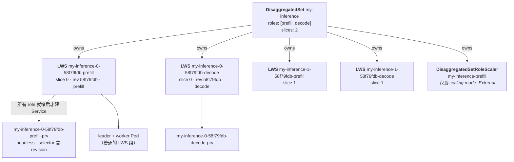
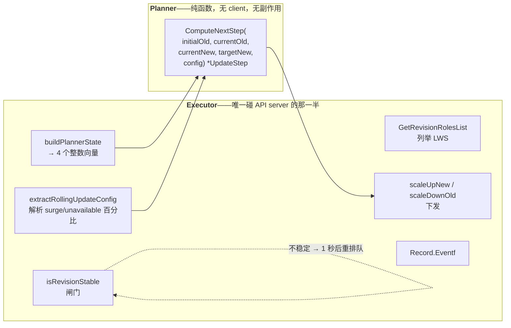

# 模块 8：DisaggregatedSet

Prefill 和 decode 是同一个模型在两种不同硬件画像上干两件不同的活（[模块 1](01_multihost_inference_problem_space.md) §1.3）。把它们拆成独立的池，现在已是 vLLM 和 SGLang 的标准做法。而编排这个拆分，确实比编排一个池难得多，`DisaggregatedSet` 就是干这件事的 API。

难点不在于跑两个 LeaderWorkerSet，而在于**把它们一起滚动更新**。prefill 把 KV cache 交给 decode，两者必须在布局、量化、模型版本上一致。先把 prefill 全滚完，你就得到了「新版 prefill 服务器把 cache 交给旧版 decode 服务器」——这是正确性 bug，不是性能退化。而且由于最优的 prefill:decode 比例随流量漂移，两者还必须在保持版本耦合的同时**独立伸缩**。

本模块覆盖**这个 API 为什么存在**、**对象模型**、**planner/executor 拆分**、**完整的 N 维滚动算法**、**slices**、**放置策略**、**per-role 自动伸缩**、**revision 感知的 Service**、**校验**，以及**目前项目里最好的贡献机会——status 缺口**。

!!! info "溯源与成熟度"
    对照 `kubernetes-sigs/lws` 的 `32a9c37`（2026-08-06）核实。DisaggregatedSet 随 **v0.9.0** 发布，其每一部分都是 **alpha**。涉及 KEP 766、846、848、849。因为它是最新、变动最快的子系统，所以也是贡献者空间最大的地方——同时 KEP 文本与代码已经在若干处出现分歧，下文逐条标出。

---

## 第一部分：为什么要一个新 API

### 1.1 手工拼装的四种失效

KEP-766 的动机就是一份「把 prefill 和 decode 当两个独立 LeaderWorkerSet 部署会坏在哪」的清单：

1. **运维复杂度**——你必须人工保证所有 role 一起更新。
2. **滚动更新协调**——「没有内建机制在 role 之间协调滚动更新，只更新其中一个 role 会带来服务中断风险。」
3. **Service 生命周期**——你必须人工保证 Service「只在所有 role 都就绪后才路由流量」。
4. **配置漂移**——「没有统一资源，各 role 的配置会逐渐分岔。」

底层的领域事实是：兄弟 role 之间**按版本耦合**，而两个独立的 LWS 根本表达不了这件事。

### 1.2 目标与非目标

**目标**：统一管理 2–10 个 role；通过「一个让所有 role 齐步更新、同时尊重各 role surge 约束的 N 维滚动更新算法」实现协调滚动；以及——那个塑造了整个实现的目标——**无状态控制器**，「从观测到的资源推导出全部状态，从而可以在任意时刻安全重启」。

**非目标**：多集群联邦；LWS 之外的后端；滚动期间的流量管理。自动伸缩原本也是非目标，后被 **KEP-849 取代**。

### 1.3 被否掉的那个替代方案解释了一切

一共考虑了四个替代方案。三个很好理解——扩展 LWS 支持多模板（对 LWS 语义改动太大）、Helm/Kustomize（没有运行时协调）、不带 CRD 的外部 label 监听控制器（体验差）。

第四个才是承重的，而理解它为什么被否，是读懂整个 planner 的钥匙。

> **替代方案 4：用 LWS 的 `partition`，而不是每个 revision 一个 LWS。**

三条否决理由：

1. **revision 感知的流量路由。** 「负载均衡器必须把请求路由到那些其对端处于**同一 revision** 的后端上。」每个 revision 一个 LWS 加一个 Service 时，每个 Pod 的 revision 通过 `disaggregatedset.x-k8s.io/revision` label 显式可见，于是 LB 可以*跨所有 role 池*按 revision 统计后端数量并按比例分流。用 `partition` 的话，同一个 LWS 内的 Pod 只靠序号区分，revision 感知路由会难得多。
2. **把 LWS 当只读资源**——「就像 Deployment 对待 ReplicaSet 那样」。协调滚动希望每一步里*不同 role 走不同的速度*；而 `partition` 是在单个 LWS 上独立起作用的。
3. **运维可观测性**——你可以直接看到 `old-prefill: 2, new-prefill: 3`，而不必从 partition 边界去推。

接受的代价：滚动期间最多 **`2 × role 数 × slice 数`** 个 LWS 对象（Pod 数量不变），以及一个被封装在控制器里的更复杂算法。

!!! tip "一句话总结"
    **DisaggregatedSet 对待 LeaderWorkerSet，就像 Deployment 对待 ReplicaSet**：每个 revision 创建一个不可变的子对象，然后把副本从旧的挪到新的。本模块的每一个设计决策都是从这句话推出来的。

---

## 第二部分：对象模型



### 2.1 命名

```go
func GenerateName(baseName string, slice int, revision, role string) string {
    return fmt.Sprintf("%s-%d-%s-%s", baseName, slice, revision, role)
}
func GenerateLegacyName(baseName, revision, role string) string {
    return fmt.Sprintf("%s-%s-%s", baseName, revision, role)
}
```

| 对象 | 格式 | 示例 |
| :--- | :--- | :--- |
| LWS | `<ds>-<slice>-<revision>-<role>` | `my-inference-0-58f79fdb-prefill` |
| Service | `<lws 名>-prv` | `my-inference-0-58f79fdb-prefill-prv` |
| Scaler | `<ds>-<role>`——**无 slice、无 revision** | `my-inference-prefill` |
| 遗留 LWS（slices 之前） | `<ds>-<revision>-<role>` | `my-inference-58f79fdb-prefill` |

名字里 **slice 在 revision 之前**，这个顺序是刻意的：slice 是映射到放置域、能跨滚动存活的持久身份；revision 是短暂的。用 KEP-846 的话说，「一个 slice 会轮换多个 revision，而不是反过来」。所有控制器逻辑都基于 *label*，从不解析名字。

revision hash 是 **8 个十六进制字符**（`revisionLength = 8`），尽管站点文档和 KEP 示例里写的是 `58f79fdb78` 这样的 10 字符串——一处外观上的文档不一致。

### 2.2 Label

```go
map[string]string{
    "app":                                    fmt.Sprintf("%s-%d-%s", baseName, slice, role),
    "disaggregatedset.x-k8s.io/role":         role,
    "disaggregatedset.x-k8s.io/slice":        strconv.Itoa(slice),
    "disaggregatedset.x-k8s.io/name":         baseName,
    "disaggregatedset.x-k8s.io/revision":     revision,
}
```

这些既打在 LWS 的 `ObjectMeta` 上，**也打在两个 Pod 模板上**，与用户 label 合并时系统 label 胜出。

!!! warning "`app` label 是个陷阱"
    `app` 的作用域是 slice+role，但**与 revision 无关**。它只是给人看的便利 label，**绝不能**用作 Service selector——滚动期间它会同时匹配两个 revision，而那正是整个设计要防止的跨 revision 路由。

### 2.3 什么决定了 revision

```go
type roleTemplate struct {
    Name     string                                 `json:"name"`
    Template leaderworkersetv1.LeaderWorkerTemplate `json:"template"`
}
hash := sha256.Sum256(jsonData)
return hex.EncodeToString(hash[:])[:8]
```

**只有 role 名字和 `LeaderWorkerTemplate`。** 其余一切——`slices`、`placementPolicy`、`scaling`、`replicas`、`rolloutStrategy`、`networkConfig`、`startupPolicy`、role 的 `metadata`——都在哈希之外。

这正是 slice 伸缩和自动伸缩不会引发滚动的原因。它同时也是下文 §10.1 那个限制的来源，请记住这一点。

---

## 第三部分：控制器架构

### 3.1 Reconcile 骨架

```go
revision := disaggregatedsetutils.ComputeRevision(disaggregatedSet.Spec.Roles)
sliceCount := int(disaggregatedsetutils.GetSlices(disaggregatedSet))
r.cleanupRemovedSlices(ctx, disaggregatedSet, sliceCount)
seedFor, _ := r.seedForRole(ctx, disaggregatedSet)
scalers, _ := r.ScalerManager.Reconcile(ctx, disaggregatedSet, seedFor)
executor := r.createRollingUpdateExecutor()
if sliceCount > 1 { r.recreateLegacySlice0(...) }
for slice := range sliceCount { r.reconcileSlice(...) }
r.updateScalerStatus(ctx, disaggregatedSet, scalers)
```

两点值得注意：

- **revision 对整个 DS 只算一次**，然后 slice 循环对每个 slice 跑同样的逻辑。滚动中途各 slice 处于不同 revision 是完全合法的。
- **各 slice 的错误被收集**而不是提前返回：`errors.Join(errs...)` 意味着一个坏 slice 不会跳过其他 slice，`earliestRequeue` 保留最近的那个非零 `RequeueAfter`。

`SetupWithManager` 是 `For(&DisaggregatedSet{}).Owns(&LeaderWorkerSet{}).Owns(&DisaggregatedSetRoleScaler{})`。其中 `Owns(scaler)` 是 KEP-849 的写路径：HPA 对 `/scale` 的写会碰到 scaler，从而一跳就把父 DS 排进队列。

### 3.2 planner/executor 拆分



planner 的全部词汇：

```go
type UpdateStep struct {
    Past []int   // 各 role 索引上，期望的旧 revision 副本数
    New  []int   // 各 role 索引上，期望的新 revision 副本数
}
type RoleReplicaState = []int              // 类型别名，不是新定义的类型
type RollingUpdateConfig struct { MaxSurge, MaxUnavailable int }

func ComputeNextStep(initialOld, currentOld, currentNew, targetNew RoleReplicaState,
                     config []RollingUpdateConfig) *UpdateStep    // nil == 完成
```

每个向量都按 `allRoleNames` 中的位置索引。**`UpdateStep` 是绝对值而非增量**——重复施加同一步是幂等的，这正是无状态控制器可以在滚动中途安全重启的原因。

**这个拆分为什么存在。** planner 是四个整数向量加配置的纯函数，因此整个 N 维算法可以不依赖 envtest 做穷举单测——`planner_test.go` 是 38 KB 的表驱动测试，含 `TestComputeAllSteps_ExactSequence`。它也让 KEP-766 的无状态控制器目标变得可行：不存在内存中的滚动状态机。每次 reconcile 都从列举到的 LWS 对象重新推导 `currentOld` 和 `currentNew`，从 annotation 拿 `initialOld`，然后向 planner 要恰好一步。

如果你要给滚动算法做贡献，**你几乎肯定只需要改 `planner.go` 并加表驱动测试**。那是这个子系统里最便宜、最安全、最好 review 的改动类型。

---

## 第四部分：N 维滚动

### 4.1 它根本不用 LWS 的 `partition`

这是最常见的误解，所以值得直说。

- `partition` 被 DS webhook **禁止**：`field.Forbidden(..., "partition is not supported by DisaggregatedSet; rolling updates are managed across roles by the DisaggregatedSet controller")`。
- DS 控制器从不在子 LWS 上写 `Partition`。`grep -rn "Partition" pkg/controllers/disaggregatedset` 什么也搜不到。
- role 的 `rolloutStrategy` 里的 `maxSurge` 和 `maxUnavailable` **只用来给 DS planner 传参**。

真正的机制是：**在新 revision hash 上创建第二个 LWS，一边把它的 `spec.replicas` 往上棘轮、一边把旧 LWS 的 `spec.replicas` 往下棘轮，等所有 role 都归零后删掉旧 LWS。** 一个子 LWS 的 Pod 模板在创建时写一次、之后从不 patch，所以子 LWS 自己的滚动机制从未被触发。

!!! bug "KEP-766 与代码在这里不一致"
    KEP-766 说 DisaggregatedSet「不会把 `RolloutStrategy` 传播到底层 LWS 资源」。而代码**会**：`lws_manager.go` 复制了整个 spec（`lwsSpec := config.Spec`），只覆盖 `Replicas`，因此 `RolloutStrategy` 原样落到了子对象上。实践中它是惰性的——从不发生模板 patch——但文本和代码应当统一。

### 4.2 理想轨迹

planner 的包注释写明了目标：

$$
\text{newAtStep}(i) = \left\lceil \frac{i \cdot \text{target}}{\text{totalSteps}} \right\rceil
\qquad
\text{oldAtStep}(i) = \text{initialOld} - \left\lfloor \frac{i \cdot \text{initialOld}}{\text{totalSteps}} \right\rfloor
$$

由于控制器无状态，它从不保存 $i$。它从观测到的副本数**反解**这个公式，然后在 $i+1$ 处求值。

```go
func batchSize(maxSurge, maxUnavailable int) int {
    if maxSurge > 0 { return maxSurge }
    return max(1, maxUnavailable)
}

func computeTotalSteps(initialOld, target RoleReplicaState, config []RollingUpdateConfig) int {
    totalSteps := 0
    for i := 0; i < len(initialOld); i++ {
        maxReplicas := max(initialOld[i], target[i], 0)
        roleBatchSize := batchSize(config[i].MaxSurge, config[i].MaxUnavailable)
        roleSteps := (maxReplicas + roleBatchSize - 1) / roleBatchSize   // 向上整除
        totalSteps = max(totalSteps, roleSteps)
    }
    return totalSteps
}
```

**`totalSteps` 取各 role 的最大值，这正是齐步走的强制点。** 副本最多——或批次最小——的那个 role 定节拍。较小的 role 得到一条*分数*轨迹，由 ceil/floor 离散化，于是 3 副本的 decode 池每隔一步才动一次、而 6 副本的 prefill 池每步都动。比例是构造性地被保持的。

!!! note "`totalSteps` 数的是批次，不是 reconcile"
    KEP-766 特别强调这点。它的示例里 `totalSteps = 3`，却走了 **7 次 reconcile**，因为扩容和缩容是分开的步骤，而稳定性闸门还会插入等待。

### 4.3 扩容取 min，缩容取 max

```go
// 扩容
stepIndex := func(current, targetVal int) int {
    if targetVal == 0 { return totalSteps }
    return int(float64(current) * float64(totalSteps) / float64(targetVal))   // 向下取整
}
minStepIdx := totalSteps
for i := range target { minStepIdx = min(minStepIdx, stepIndex(currentNew[i], target[i])) }
nextStepIdx := minStepIdx + 1

computeNew := func(targetVal, currentVal int) int {
    progress := float64(nextStepIdx) * float64(targetVal) / float64(totalSteps)
    computed := min(int(math.Ceil(progress)), targetVal)
    return max(computed, currentVal)      // 单调：新侧永不缩
}
```

```go
// 缩容
maxStepIdx := 0
for i := range initialOld {
    if initialOld[i] == 0 { continue }
    removed := initialOld[i] - currentOld[i]
    maxStepIdx = max(maxStepIdx, stepIndex(removed, initialOld[i]))
}
computeOld := func(sourceVal, currentVal int) int {
    progress := float64(nextStepIdx) * float64(sourceVal) / float64(totalSteps)
    computed := max(0, sourceVal-int(math.Floor(progress)))
    return min(computed, currentVal)      // 单调：旧侧永不涨
}
```

**扩容取 min，缩容取 max。** 这个不对称是刻意的，即 KEP-766 的 Property 2。扩容取 *min*，意味着**落后的 role 定步长**——没有 role 能抢跑。缩容取 *max*，意味着旧集群的排空速度不超过**排空最多**的那个 role 所能证成的程度。两者合起来，从两侧把总占用量往 surge 预算上挤。

### 4.4 决策级联

```go
func ComputeNextStep(initialOld, currentOld, currentNew, targetNew RoleReplicaState,
                     config []RollingUpdateConfig) *UpdateStep {
    if isComplete(currentOld, currentNew, targetNew) { return nil }                    // (1)
    totalSteps := computeTotalSteps(initialOld, targetNew, config)
    if totalSteps == 0 { return nil }                                                  // (2)
    if step := correctAbnormalState(currentOld, currentNew, initialOld); step != nil { return step }  // (3)
    if isNewAtTarget(currentNew, targetNew) {                                          // (4)
        return &UpdateStep{Past: make([]int, len(initialOld)), New: currentNew}
    }
    nextNew := computeNextNewReplicas(targetNew, currentNew, totalSteps)
    minOld  := computeMinOld(initialOld, currentNew, targetNew, config)
    if step := tryScaleUp(...); step != nil { return step }                            // (5)
    if step := tryProportionalDrain(...); step != nil { return step }                  // (6)
    if step := tryForceDrain(...); step != nil { return step }                         // (7)
    return nil
}
```

**(5)、(6)、(7) 每一个都只改 `Past` 或只改 `New`，绝不同时改。** 这是 KEP-766 的 Property 1「Decoupled Steps」，也是每一步都可独立观测、每一次失败都可独立诊断的原因。

| 关卡 | 做什么 |
| :--- | :--- |
| **(1) `isComplete`** | 每个 role 都满足 `currentOld[i] == 0 && currentNew[i] >= targetNew[i]` |
| **(3) `correctAbnormalState`** | 把 `currentOld[i]` 钳到 `min(initialOld[i], currentOld[i])`。处理陈旧 annotation 或人工乱动 |
| **(4) `isNewAtTarget`** | 一旦每个 role 的新集群都到位，跳过步进机制，一把把整个旧侧归零 |
| **(5) `tryScaleUp`** | 仅当存在 `nextNew[i] > currentNew[i]` **且** `canScaleUp` 成立时触发 |
| **(6) `tryProportionalDrain`** | 沿轨迹排空，逐 role 以 `minOld` 兜底，再过一遍 orphan prevention |
| **(7) `tryForceDrain`** | 当 surge 预算卡住下一次扩容时的解锁器 |

**`canScaleUp` 就是 surge 不变式**，即 KEP-766 的 Property 4：

```go
for i := range currentOld {
    if targetNew[i] == 0 { continue }
    if currentOld[i]+nextNew[i] > targetNew[i]+config[i].MaxSurge { return false }
}
```

**逐 role 检查、对所有 role 检查、在任何 role 扩容之前检查。** surge 预算在向量意义上是全局的：一个 role 超预算就卡住整步。

**`computeMinOld` 是可用性不变式：**

```go
for i := range initialOld {
    if initialOld[i] >= targetNew[i] {
        minOld[i] = max(0, targetNew[i]-config[i].MaxUnavailable-currentNew[i])
    }
}
```

保留足够的旧副本使 `old + new >= target - maxUnavailable`。跨 revision 在*扩容*的 role（`initialOld < targetNew`）得到 `minOld[i] = 0`——它们没什么要保护的。

**`tryForceDrain` 是死锁打破器。** 当 surge 卡住下一次扩容时，把旧的排空到 surge 预算恰好要求的程度：

```go
maxOld := targetNew[i] + config[i].MaxSurge - nextNew[i]
drainedOld[i] = max(0, min(currentOld[i], maxOld))
if initialOld[i] >= targetNew[i] {
    minOldForRole := max(0, targetNew[i]-config[i].MaxUnavailable-nextNew[i])
    drainedOld[i] = max(drainedOld[i], minOldForRole)
}
```

它是对着 `nextNew` 而不是 `currentNew` 计算的，所以只排空*刚好够*容纳下一次扩容的量。它是刻意偏离轨迹的——KEP 说「force-drain 绕过了 step-index 机制」。

### 4.5 Orphan prevention

这是让整套机制从「收敛」变成「正确」的安全网。

```go
func applyOrphanPrevention(nextOld, currentNew, initialOld, target RoleReplicaState,
                           config []RollingUpdateConfig) {
    anyDrainsToZero, allDrainToZero := false, true
    for i := range nextOld {
        if initialOld[i] == 0 { continue }
        if nextOld[i] == 0 { anyDrainsToZero = true } else { allDrainToZero = false }
    }
    if !anyDrainsToZero || allDrainToZero { return }
    if canDrainAllToZero(currentNew, initialOld, target, config) {
        for i := range nextOld { nextOld[i] = 0 }        // 要么全排空，把这次排完
        return
    }
    for i := range nextOld {
        if nextOld[i] == 0 && initialOld[i] > 0 { nextOld[i] = 1 }   // 留一个
    }
}
```

KEP-766 的 Property 3 是「如果任一 role 归零，所有 role 都被强制归零」，而实现把它做成了双向的：

- 如果**新**集群已经能吃下负载（`canDrainAllToZero`），一次性把整个旧 revision 归零。
- 否则**不允许任何 role 归零**，把它钉在 1。

没有这一手，一次滚动可能留下一个「0 个 prefill、3 个 decode」的旧 revision——一个什么都服务不了、却仍占着 GPU 的 revision。考虑到一个 8 卡 decode 组的成本，这可不是理论上的顾虑。

executor 在 `scaleDownOld` 里有它的孪生逻辑：如果一个旧 revision 的*任一* role 会归零，那**所有** role 在同一趟里一起归零，而被这次协同额外归零的 Pod 不计入排空预算。

### 4.6 `initial-replicas` annotation

`disaggregatedset.x-k8s.io/initial-replicas` 之所以存在，是因为 planner 需要 `initialOld`——**滚动开始时**旧 revision 的副本数——作为排空插值的分母。而在无状态控制器里，唯一能持久保存它的地方就是对象自身，偏偏 `spec.replicas` 会随滚动推进而变化。

| | 行为 |
| :--- | :--- |
| **写入** | 恰好一次，在 `initRollingUpdate` 里，**早于**任何新 revision LWS 的创建。按 LWS 的*实际*名字寻址，这样遗留的 slice-0 对象也会被更新而不是被漏掉 |
| **随后** | 新 revision 的 LWS 以 **0 副本**创建，reconcile 返回 `RequeueAfter: 1s` |
| **读取** | `GetTotalInitialReplicasPerRole` 跨旧 revision 求和，缺失时回退到 `spec.replicas`（或 1） |
| **覆盖** | 记录 `"WARNING: Overwriting initial-replicas annotation with different value"`；值不变时是空操作 |

!!! bug "写失败被吞掉了"
    `initRollingUpdate` 对失败的 annotation patch 只做 `log.Error`。写失败会静默地把该 role 的排空基线降级为 `spec.Replicas`，而那是*当前*数量而不是*初始*数量——产生一条微妙错误的排空轨迹，且没有任何错误浮出水面。把这个错误传播出去是一个小而边界清晰的修复。

### 4.7 稳定性闸门与拆除

两道不同的闸门，都在 executor 里。

**每步一次**的 `isRevisionStable`：

```go
for _, name := range roleNames {
    lws := rev.Roles[name]
    if lws == nil { return false }
    if getLWSReplicas(lws) != lws.Status.ReadyReplicas { return false }
}
```

只对**新** revision 调用。不稳定时 reconcile 返回 `RequeueAfter: 1s`，什么都不动。这是 KEP-766 的 Property 6。

注意它的严格：即便就绪数*超过*目标，`Spec.Replicas != Status.ReadyReplicas` 也会阻塞；而且它完全不看旧 revision 的就绪情况。

**revision 拆除**是独立的，发生在下一次 `reconcileSlice` *开头*的 `cleanupDrainedLWS` 里。它把非目标 revision 的 LWS 按 revision 分组，只有当该组里**每个** role 的 `spec.replicas == 0` 时才删除这个 revision 的对象。key 冲突时它还会记录 `"WARNING: multiple LWS found for same role and revision"`——一个代码能检测但不去解决的状态。

### 4.8 滚动中途增删 role

`detectRoleChanges` 把 spec 里的 role 和旧 revision 中存在的 role 做差。被移除的 role **保留一个索引**在 planner 向量里，好让它们的旧副本排空；但 `buildPlannerState` 把它们的 `currentNew`/`targetNew` 留在 0，`scaleUpNew` 也会跳过它们。由于 role 名字可变（§9），改名会被当成「删除 + 新增」处理。

---

## 第五部分：Slices（KEP-846）

### 5.1 slice 是什么

```go
// +kubebuilder:default=1
// +kubebuilder:validation:Minimum=1
// +kubebuilder:validation:Maximum=100
Slices *int32 `json:"slices,omitempty"`
```

「整个 role 拓扑的独立副本数量。每个 slice 是一整套 role，独立滚动。」

每个 role 的 `spec.replicas` 是**按 slice 计**的，所以一个 role 的总组数是 `replicas × slices`。

KEP-846 给的心智模型：「slice 是持久的外层身份；revision 是短暂的。一个 slice 内通常只有一个 revision 在线，在它滚动时两个 revision 短暂共存。」

### 5.2 planner 为什么不用改

`Reconcile` 只算一次 revision，然后 `for slice := range sliceCount { r.reconcileSlice(...) }`。里面的一切都是 slice 作用域的。**把同一个 N 维算法对每个 slice 跑一遍，就白得了 per-slice 的独立滚动**——planner 一行都不用改。

slice 过滤是**客户端**做的，因为「slice label == 0 或不存在」无法用 label selector 表达：

```go
func SliceLabelMatches(labels map[string]string, slice int) bool {
    if slice < 0 { return true }                 // -1 == 所有 slice
    value, ok := labels[SliceLabelKey]
    if !ok || value == "" { return slice == 0 }  // 遗留对象 → slice 0
    return value == strconv.Itoa(slice)
}
```

### 5.3 伸缩 slice 不会滚动

因为 `slices` 在 `ComputeRevision` 之外，把 `slices: 2 → 3` 不改变任何 revision。slice 循环走到索引 2，发现没有 LWS，于是走 `reconcileSimple` 路径，在当前 revision 上创建 slice 2。

缩容（`cleanupRemovedSlices`）就是把 `slice` label `>= desiredSlices` 的每个 LWS 和对应 Service 直接删掉。KEP-846 为「没有编排式排空」给出的理由：「slice 移除没有跨 slice 不变式需要保护（各 slice 相互独立），所以它就是一次普通的伸缩操作。」

### 5.4 遗留 slice-0 迁移

slices 是在 DisaggregatedSet 首发之后才加的，所以有一层兼容代码，并明确标记了待移除：

```go
// TODO(0.11.0): remove legacy slice-0 handling once pre-slices DisaggregatedSets are no
// longer supported. The related legacy-compat code to remove with it: GenerateLegacyName,
// GetForRole's legacy-name fallback, DeleteLegacyService, and the label-less branch in
// SliceLabelMatches.
```

三种行为：

1. **原地收养。** `GetForRole` 先试 slice-aware 名字，仅当 `slice == 0` 时回退到 `GenerateLegacyName`。单纯升级不会重建任何东西。
2. **下次滚动时迁移**——免费。新 revision 的 slice-0 LWS 以 slice-aware 方式创建，遗留 LWS 通过正常滚动排空，而 Service 是按 revision 划分的，所以永不会交叉选中。
3. **`slices` 升到 1 以上时迁移**——`recreateLegacySlice0`，在 slice 循环*之前*调用。它解决的问题是：遗留 Service 的 selector 是 `{name, role, revision}`，**没有 slice key**，于是同 revision 的一个新 slice-1 Pod 会是超集匹配，被 slice 0 的 Service 选中。修法是**先**删遗留 Service，**再**删遗留 LWS。这会让 slice 0 重启一次——相对于原地迁移，这是被接受的代价。

那段 TODO 是一个边界清晰的未来贡献，待移除清单都已经替你列好了。

---

## 第六部分：放置策略（KEP-848）

```go
type PlacementPolicy struct {
    Type     PlacementType `json:"type,omitempty"`     // None | ExclusiveSlice | ExclusiveTopology
    Topology string        `json:"topology,omitempty"` // 节点 label key → 亲和性 topologyKey
}
```

| 类型 | 保证 |
| :--- | :--- |
| `None`（默认） | 不注入亲和性 |
| `ExclusiveSlice` | 一个 slice 的各 role 共置于一个域，且本 DS 的各 slice 分散到不同域。**其他 DisaggregatedSet 可以共享同一个域** |
| `ExclusiveTopology` | 在 `ExclusiveSlice` 之上加域独占：**跨所有 DisaggregatedSet**，一个域最多放一个 slice——1:1 的域-slice 映射 |

注入只发生在 **LWS 创建时**，在 `LeaderWorkerSetManager.Create` 里，注入到两个 Pod 模板。没有 mutating webhook；KEP-848 否掉了它，理由是「DisaggregatedSet 控制器本来就在构建和改写 LeaderWorkerSet 的 Pod 模板」。已有的亲和性会被深拷贝，新项是**追加**而不是替换。

### 6.1 `ExclusiveSlice`——两项

**第 1 项，podAffinity**——把 slice 的各 role 共置：

```go
{Key: "disaggregatedset.x-k8s.io/name",  Operator: In, Values: [dsName]},
{Key: "disaggregatedset.x-k8s.io/slice", Operator: In, Values: [strconv.Itoa(slice)]},
```

自指的，所以一个 slice 的第一个 Pod 不受钉扎（没有匹配 Pod 的 required podAffinity 视为满足），后续 Pod 被吸引过来。

**第 2 项，podAntiAffinity**——把本 DS 的各 slice 打散：

```go
spreadExprs := []metav1.LabelSelectorRequirement{
    {Key: SetNameLabelKey, Operator: In, Values: []string{dsName}},
}
if slice == 0 {
    spreadExprs = append(spreadExprs,
        metav1.LabelSelectorRequirement{Key: SliceLabelKey, Operator: metav1.LabelSelectorOpExists})
}
spreadExprs = append(spreadExprs,
    metav1.LabelSelectorRequirement{Key: SliceLabelKey, Operator: metav1.LabelSelectorOpNotIn,
                                    Values: []string{sliceStr}})
```

!!! tip "`slice == 0` 这个特例是整个子系统里最微妙的代码"
    Kubernetes 的 label selector 会把 `NotIn` 理解成**也匹配完全没有该 key 的对象**。对 slice ≠ 0 而言这完全正确：一个 slices 之前的、没有 label 的 Pod 语义上属于 slice 0——是*另一个* slice——理应互斥。

    但对 slice 0 自己来说，那个没有 label 的遗留 Pod 就是*同一个* slice。没有额外的 `Exists` 要求，「一个开启了放置策略的 slice-0 Pod 会被它自己的遗留前身排斥，从而在升级期间永远调度不上」。

    如果你要动这里的 selector 构造，先读 `affinity.go:74-80` 的注释。

### 6.2 `ExclusiveTopology`——第三项

```go
{Key: SetNameLabelKey, Operator: Exists},
{Key: SetNameLabelKey, Operator: NotIn, Values: []string{dsName}},
{Key: SliceLabelKey,   Operator: Exists},
```

看似冗余的 `name Exists` 与 `name NotIn [ds]` 并列是刻意的，理由同上：单独的 `NotIn` 也会匹配**没有** name label 的 Pod——集群里每一个无关负载——把 `ExclusiveTopology` 变成「对一切都独占」。这两组 `Exists` 把排斥范围收窄到 DisaggregatedSet 管理的 Pod。

由于 required podAntiAffinity 各项之间是与关系，第 2 项和第 3 项合起来意味着这个域里没有*任何*其他 slice，不管是不是同一个 DS。

### 6.3 惰性生效，以及与 LWS 的冲突

`placementPolicy` 在 `ComputeRevision` 之外，而且控制器刻意**不** patch 已有的 LWS。KEP-848：「改写一个运行中的 LeaderWorkerSet 的 Pod 模板，本身就会强制一次 LWS 级的滚动更新，把一次放置微调变成对所有 slice 同时进行的、隐式且不协调的重启。」

所以新建的 slice 立即拿到策略；已有 slice 在下次滚动时才采用。

webhook 会拒绝「非 `None` 策略」与「LWS 自己的独占拓扑 annotation」同时出现，并且**每个 role 检查三处**——role 的 `metadata.annotations`、leader 模板的、worker 模板的——因为 LWS 的 Pod webhook 是从 Pod 上读它们的。理由是：LWS 的独占是*组*粒度（「一个域一个 leader-worker 组」），DS 的放置是 *slice* 粒度；在同一拓扑层级同时用，结果就是「这个 slice 永远调度不上」。

!!! warning "只有硬约束，可能把一个 slice 卡死"
    所有项都是 `RequiredDuringSchedulingIgnoredDuringExecution`。KEP-848 自己的 Risks 章节指出：没有整 slice 的前瞻，一个 slice 的第一个 Pod 可能落到一个装不下其余 Pod 的域里，把剩下的永远钉在 Pending。没有软性/`Preferred` 变体，DisaggregatedSet 的 gang 调度也被推迟了。这和[模块 7](07_scheduling_placement_and_networking.md) §2.3 是同一种失效模式，只是高了一层。

---

## 第七部分：Per-Role 自动伸缩（KEP-849）

自动伸缩原本是 KEP-766 的非目标，被 KEP-849 取代。设计难点在于：一个 `DisaggregatedSet` 有 N 个 role，各自需要独立伸缩，而 `/scale` 子资源在一个对象上只能指向一个字段。答案是**每个 role 一个独立 CR**。

### 7.1 Scaler CR

```go
// +kubebuilder:subresource:scale:specpath=.spec.replicas,statuspath=.status.replicas,selectorpath=.status.selector
// +kubebuilder:resource:shortName=dsrs

type DisaggregatedSetRoleScalerSpec struct {
    // +kubebuilder:default=0
    // +kubebuilder:validation:Minimum=0
    Replicas int32 `json:"replicas"`
}
```

!!! note "「非指针 + 默认值」是承重的"
    源码注释把原因写清楚了：「kube-apiserver 的 CRD `/scale` handler 在读取时提取 `.spec.replicas`，当 JSONPath 解析不到任何东西时会报错（`the spec replicas field does not exist`）。HPA 在第一次写之前就会读 `/scale`；字段缺失会让这个循环死锁。」

    KEP-849 草案里的 API 是 `Replicas *int32` 带 `omitempty`。实现刻意偏离了它，而在你按 Kubernetes 惯例去「修正」它之前，值得知道这个理由。

### 7.2 生命周期

`ScalerManager.Reconcile` 在任何 LWS 工作**之前**运行，这样下游的副本解析看到的是一个已经稳定的 scaler map：

1. 构造 `scaling.mode: External` 的 role 集合。
2. 列出命名空间内所有带本 DS 名字 label 的 scaler。
3. 逐个处理：不受本 DS 控制的跳过；其 role 不再是 External 的**删掉**（`ScalerDeleted`）；否则记录下来。
4. 对每个没有 scaler 的 External role，创建一个。

一趟就同时处理了 External→Static 的拆除和 Static→External 的创建。遇到 `IsAlreadyExists` 时，如果已有对象不受本 DS 控制，它会发一个 **Warning** 级的 `ScalerConflict` 并返回，不做收养——它拒绝接管一个手工创建的对象。

### 7.3 播种，以及它避开的两个死锁

```go
// seedForRole
if !seen[role] { return 1 }      // 全新 role
return sums[role]                 // 跨所有 slice 的当前 LWS 副本聚合
```

| 情况 | 播种值 | 为什么 |
| :--- | :--- | :--- |
| 全新 role，还没有 LWS | **1**，不是 0 | 「当 HPA 从 `/scale` 读到 current=0 时会停在 `ScalingDisabled`，与 `minReplicas` 无关，除非启用了 `HPAScaleToZero` feature gate」 |
| 运行中的 role 从 Static 翻成 External | 该 role 当前的聚合 LWS 副本数 | 使这次翻转「不会排空到零」 |

支持 scale-from-zero 的自动伸缩器（KEDA，或开了 gate 的 HPA）在挂上之后仍然可以把 role 降到 0。

### 7.4 副本解析与 no-shrink 守卫

```go
func getTargetReplicas(ds, roleName, scalers, currentNew int) int {
    for _, p := range ds.Spec.Roles {
        if p.Name != roleName { continue }
        if p.Scaling != nil && p.Scaling.Mode == RoleScalingExternal {
            if s := scalers[roleName]; s != nil { return int(s.Spec.Replicas) }
            return currentNew                     // 没有 scaler → 维持现状
        }
        if p.Spec.Replicas == nil { return 1 }
        return int(*p.Spec.Replicas)
    }
    return 1
}
```

以及 `buildPlannerState` 里：

```go
// no-shrink 守卫：滚动中途，如果 HPA 在旧 revision 还在排空时写了一个更小的值，
// External role 不得缩小新 revision 集群。
if isExternal(ds, roleName) && len(oldRevisions) > 0 && targetNew[i] < currentNew[i] {
    targetNew[i] = currentNew[i]
}
```

`len(oldRevisions) > 0` 是释放条件：旧 revision 一消失，目标就精确跟随 scaler。稳态路径没有这道守卫，这是对的——没有滚动在进行。

### 7.5 只选 leader 的 selector，以及为什么

```go
desired.Status.Selector = fmt.Sprintf("%s=%s,%s=%s,%s=0",
    SetNameLabelKey, ds.Name, RoleLabelKey, role, leaderworkersetv1.WorkerIndexLabelKey)
```

产生：

```
disaggregatedset.x-k8s.io/name=<ds>,disaggregatedset.x-k8s.io/role=<role>,leaderworkerset.sigs.k8s.io/worker-index=0
```

**单位一致性论证**和[模块 2](02_api_surface_anatomy.md) §4 是同一个，值得能自己复述出来：HPA 把 per-pod 指标的和除以匹配 `status.selector` 的 Pod 数，而这个除数必须等于 `status.replicas`。由于 `spec.replicas`（HPA 写）和 `status.replicas`（HPA 读）都是 **LWS 组**，selector 就必须精确匹配**每组一个 Pod**——也就是 leader。否则在 `size: 4` 时，HPA 会除以 `4 × 组数`、却拿它和`组数`比，比值会差 4 倍。

selector 是 revision **无关**的，所以 HPA 在滚动期间观察到的是整个在服务的集群。

`status.replicas` 通过累加每个子 LWS 的 `Status.Replicas`（即其组数），**跨所有 slice 和所有 revision**聚合得到。

### 7.6 代码里记录下来的那些坑

这份清单格外有价值，因为每一条都是别人已经踩过的坑：

| | 坑 | 缓解 |
| :--- | :--- | :--- |
| 1 | `current=0` 让 HPA 停在 `ScalingDisabled`，与 `minReplicas` 无关 | 播种为 1 |
| 2 | `.spec.replicas` 字段缺失会让 apiserver 的 `/scale` handler 报错 | 非指针 + `default=0` |
| 3 | Static→External 会静默排空该 role | 从当前聚合值播种 |
| 4 | 滚动中途 HPA 缩容会让目标反复横跳 | no-shrink 守卫 |
| 5 | 组数与 Pod 数的除数不匹配 | 只选 leader 的 selector |
| 6 | **CEL 默认值陷阱**——`LeaderWorkerSetSpec.Replicas` 带 `+kubebuilder:default=1`，而默认值填充跑在 CEL *之前*，所以一条「禁止 External role 的 `replicas > 0`」的规则「会拒绝掉每一个 External role」 | 对 `> 1` 发**警告**而不是拒绝，并用 `filter` 把 all-or-nothing 的 CEL 规则限定到非 External role |
| 7 | 删掉 scaler 并不能退出——控制器会重建它 | 把 `scaling.mode` 翻回 `Static` |
| 8 | 滚动期间指标基线跨 revision 混合 | 作为已知缺点记录在案 |

第 6 条最有教益。它是一条真实的 Kubernetes API 设计约束——CRD 结构化默认值填充跑在 CEL 校验之前——而它的绕法（发警告而不是拒绝、用 `filter` 收窄 CEL 规则）是任何 API PR 都值得记住的模式。

---

## 第八部分：Service 与 revision 感知路由

`ReconcileServices` 找到与目标 revision 匹配的 `RevisionRoles` 分组，并且在每个 role 都至少有一个就绪副本之前**直接返回**：

```go
func revisionReadyOnAllRoles(group RevisionRoles, roleNames []string) bool {
    for _, roleName := range roleNames {
        lws, hasRole := group.Roles[roleName]
        if !hasRole || lws.Status.ReadyReplicas < 1 { return false }
    }
    return true
}
```

这就是 KEP-766 那条「Service 在所有 role 就绪之前不得路由流量」，实现为 Service *创建*的前置条件。

```go
selector := map[string]string{
    SetNameLabelKey:  ds.Name,
    RoleLabelKey:     lws.Labels[RoleLabelKey],
    RevisionLabelKey: lws.Labels[RevisionLabelKey],
}
if HasSliceLabel(lws.Labels) { selector[SliceLabelKey] = lws.Labels[SliceLabelKey] }
// 名字：lws.Name + "-prv"；ClusterIP: None；owner：DisaggregatedSet
```

每个 `(slice, revision, role)` 一个 headless Service。**这就是替代方案 4 的回报。** 因为每个 Service 都是按 revision 划分的，revision `r` 的 prefill Pod 只会解析到同一 slice 内 revision `r` 的 decode Pod。滚动期间 `…-<oldrev>-decode-prv` 和 `…-<newrev>-decode-prv` 同时存在，外部负载均衡器可以跨 role 池按 revision 统计后端并按比例分流。

Service 名字取自**观测到的** LWS 名字，所以遗留的 slice-0 LWS 会自动产生遗留形态的 `-prv` 名字。

!!! bug "Service 只创建、从不修复"
    `ensureService` 调用 `Create` 并把 `IsAlreadyExists` 当成功。selector 漂移的 Service——被手改过的，或者旧版控制器遗留的——**永远不会被协调回来**。再加上控制器根本不 watch Service（只有 `Owns(&LeaderWorkerSet{})` 和 `Owns(&scaler)`），一个被手工删掉的 Service 只有等下一次由 DS 触发的 reconcile 才会重建。

    加上 `Owns(&corev1.Service{})` 并在 `ensureService` 里做 spec diff-and-patch，是一个边界清晰、动机明确的 PR。

清理：`cleanupDrainedServices` 构造出「所有 role 都就绪的 revision」集合，强制加入目标 revision，然后删掉所有 revision label 不在集合里的 Service。`DeleteLegacyService` 单独存在，因为「遗留 Service 与目标 revision 相同，所以按 revision 的排空清理永远删不掉它」。

---

## 第九部分：校验

这个 webhook **只做校验**——`SetupDisaggregatedSetWebhook` 只注册了 `WithValidator`，没有 `WithDefaulter`，与 LWS 和 Pod 的 webhook 不同。DisaggregatedSet 的所有默认值都是声明式的 CRD 默认值：

| 字段 | 默认值 |
| :--- | :--- |
| `spec.slices` | `1` |
| `spec.placementPolicy.type` | `None`（仅当该子结构存在时） |
| `spec.roles[].scaling.mode` | `Static`（仅当 `scaling` 存在时） |
| `spec.roles[].spec.replicas` | `1`（继承自 `LeaderWorkerSetSpec`） |
| `DisaggregatedSetRoleScaler.spec.replicas` | `0` |

由于省略时 `scaling` 子结构不会被物化，**`Scaling == nil` 和 `Scaling.Mode == Static` 必须被同等对待**——每个调用点都是这么做的。

### 9.1 会被拒绝的东西

| 规则 | 原因 |
| :--- | :--- |
| `rolloutStrategy.type` 不是 `RollingUpdate` 也不是 `""` | `Recreate` 会破坏跨 role 同版本不变式 |
| `rollingUpdateConfiguration.partition != 0` | 滚动由 DS 掌管；per-LWS 的 partition 会是第二个不协调的驱动者 |
| `maxSurge == 0 && maxUnavailable == 0` 且 `replicas > 0` | 与 LWS 的检查一致。`replicas == 0` 的 role 豁免——「一个全零的 DisaggregatedSet 是合法的」 |
| `spec.slices > 1` 且存在 External role | 标注了 `// Alpha:`——「多 slice 的 scaler 设计推迟到后续 KEP」（issue #948） |
| 非 `None` 的 `placementPolicy` 但 `topology` 为空 | |
| 非 `None` 的 `placementPolicy` + LWS 独占拓扑 annotation | §6.3 |
| External role 的 `len(dsName + "-" + roleName) > 253` | scaler 名字必须是合法对象名。role 上限 63 字符，因此给 DS 名留下 189 字符 |

外加一条**警告**而非错误：`spec.replicas > 1` 的 External role 会收到「`spec.replicas` 被忽略；请通过 `DisaggregatedSetRoleScaler` 驱动副本数」。

### 9.2 all-or-nothing 的 CEL 规则

```
self.roles.filter(r, !has(r.scaling) || r.scaling.mode != 'External')
          .all(r, !has(r.spec.replicas) || r.spec.replicas == 0)
||
self.roles.filter(r, !has(r.scaling) || r.scaling.mode != 'External')
          .all(r, has(r.spec.replicas) && r.spec.replicas > 0)
```

你可以有一个全部缩到零的 DisaggregatedSet，也可以有一个全部拉起来的，但**不能有一半一半的**——那会是一个服务不了的 revision。`filter(...)` 前缀是 KEP-849 的改动，用来豁免 External role，「因为它们的有效副本数活在 DS spec 之外」。

role 唯一性由 `+listType=map +listMapKey=name` 强制，而不是 CEL 规则——KEP-766 提议的 `filter(s, s.name == r.name).size() == 1` 被更高效的 listMap 声明取代。role 名字是 RFC 1123 label，role 数 2–10，`slices` 1–100。

!!! warning "完全没有不可变性校验"
    `ValidateUpdate` 做的事和 `ValidateCreate` 一模一样。没有任何 `ValidateImmutableField` 调用，`oldDisagg` 是个未使用的参数。对比 LWS 的 webhook，它是会钉住 `subGroupSize` 的。

    尤其是 **role 名字可变**，控制器把它当成「删除 + 新增」来处理——旧 role 的 LWS 排空，新 role 的被创建。这个行为大概说得过去，但它是涌现出来的而不是设计出来的，而且 API 里没有任何东西告诉用户「改一个 role 的名字会重建它的整个集群」。

---

## 第十部分：Status 缺口

**这是目前项目里最好的贡献机会。**

API 声明了一套完整的 status：

```go
type RoleStatus struct {
    Name            string `json:"name"`
    Replicas        int32  `json:"replicas,omitempty"`
    ReadyReplicas   int32  `json:"readyReplicas,omitempty"`
    UpdatedReplicas int32  `json:"updatedReplicas,omitempty"`
}
type DisaggregatedSetStatus struct {
    RoleStatuses []RoleStatus       `json:"roleStatuses,omitempty"`
    Conditions   []metav1.Condition `json:"conditions,omitempty"`
}
```

文档注释里点名了预期的 condition 类型——`Available`、`Progressing`、`Degraded`。CRD 上有 `+kubebuilder:subresource:status`。对 `disaggregatedsets/status` 的 `get;update;patch` RBAC 也已经授予。

**但没有任何代码写它。** 控制器里任何地方都没有对 `DisaggregatedSet` 的 `Status().Update` 或 `Status().Patch`。在生成的 deepcopy 之外 `grep -rn "RoleStatuses"` 只能命中类型声明。`Reconcile` 以 `return result, errors.Join(errs...)` 结束——完全没有 status 环节。整个子系统里唯一的 status 写回是 `ScalerManager.WriteStatus`，写的是 *scaler* 的 status。

后果是用户可见的：

- `kubectl describe disaggregatedset`——上游示例页明确让用户跑它来「查看 DisaggregatedSet 的整体状态」——显示的是空 status。文档紧接着就转向「按 label 查看子 LWS 的状态」，那才是实际能用的工作流。
- `DisaggregatedSet` 上**没有 printcolumn**，所以 `kubectl get disaggregatedset` 只显示 NAME 和 AGE。（`DisaggregatedSetRoleScaler` 倒是有 `Desired`/`Current`/`Age`。）

而计算它所需的一切**每次 reconcile 都已经取到了**。`LWSManager.List(ctx, ns, name, -1, "")` 返回每一个子对象，各自带着 `Status.Replicas`、`Status.ReadyReplicas`、`Status.UpdatedReplicas` 和 revision label。`RoleStatus` 就是按 role label 分组求和，`UpdatedReplicas` 再按目标 revision 过滤。condition 也有自然的映射：

| Condition | 推导方式 |
| :--- | :--- |
| `Progressing` | 任一 slice 满足 `len(oldRevisions) > 0` |
| `Available` | 所有 slice 在目标 revision 上都满足 `revisionReadyOnAllRoles` |
| `Degraded` | 累积的 `errs` |

子系统里今天每一处就绪判断读的都是子 LWS 的 status——`isRevisionStable`、`revisionReadyOnAllRoles`、`updateScalerStatus`、`cleanupDrainedLWS`——所以聚合逻辑有充分的先例可循。

另外，对照 KEP-766 的 Beta 标准「metrics for observability」也是缺的：**DisaggregatedSet 子系统完全没有 Prometheus 指标。** KEP-846 想要 per-slice 的滚动状态指标，KEP-849 想要 `WaitingForScaler` 计数。这是第二个、也更大的贡献，且有明确的 KEP 背书。

### 10.1 其他已知缺口

除了 status 和指标，以下来自代码注释和 KEP-与-代码的对比：

| | 缺口 |
| :--- | :--- |
| **非模板 spec 变更被静默丢弃** | `ComputeRevision` 只哈希 role 名 + `LeaderWorkerTemplate`。改一个 role 的 `networkConfig`、`startupPolicy`、`rolloutStrategy` 或 `metadata`，得到的是同一个哈希——于是不会创建新 LWS，已有的也永不被 patch（`reconcileRoleSimple` 只调 `Scale`）。这个改动会一直被丢弃，直到某次无关的模板变更逼出一个新 revision。**这是子系统里对用户最尖锐的可见 bug。** |
| 没有控制器集成测试 | `test/integration/` 里有 `webhooks/disaggregatedset_test.go`，但 `test/integration/controllers/` 只有 `leaderworkerset_test.go`。覆盖靠单测加 e2e |
| planner 里的浮点算术 | `int(float64(a) * float64(b) / float64(c))` 截断，而整数运算完全等价且不受任何浮点边界影响 |
| `extractRollingUpdateConfig` 不对称 | `unavail > 0` 时两个字段都设；只有 `surge > 0` 时只设 surge。两者都解析为 0 时，该 role 会静默退回 `MaxSurge=1` |
| 冗余列举 | `updateScalerStatus` 和 `seedForRole` 各自在 per-slice 列举之上再发一次跨 slice 的 `List`。虽然走缓存，但 100 个 slice 时很浪费 |
| 死代码 | `NumRequiredRoles`（零引用）、`ComputeInitialReplicaState`（只有测试用）、自由函数 `SetInitialReplicas`、`ServiceManager.scheme`、`sortByNewestTimestamp` 的 `roleNames` 参数、`ValidateUpdate` 的 `oldDisagg` 参数 |

按胃口从这张表里挑：删死代码和浮点转整数是一下午的 PR；status 聚合要一周，还需要一次设计讨论；非模板 spec 变更那个 bug 大概要先开 issue，因为修法里含有设计选择。

---

## 实验：驱动一次协调滚动

!!! warning "规模"
    A 部分在 `kind` 上用一个简单容器就能跑——planner 与加速器完全正交，启动快的镜像能让步进序列可观察。B 和 C 部分需要带拓扑 label 和指标的真实集群，标注为 unverified。

### A 部分 — 观察 N 维算法

部署一个副本数刻意不对称的双 role DisaggregatedSet，好让比例保持看得见：

```yaml
apiVersion: disaggregatedset.x-k8s.io/v1
kind: DisaggregatedSet
metadata:
  name: pd
spec:
  slices: 1
  roles:
    - name: prefill
      spec:
        replicas: 6
        leaderWorkerTemplate:
          size: 1
          workerTemplate: { spec: { containers: [{ name: c, image: nginxinc/nginx-unprivileged:1.27 }] } }
        rolloutStrategy:
          rollingUpdateConfiguration: { maxSurge: 2, maxUnavailable: 0 }
    - name: decode
      spec:
        replicas: 3
        leaderWorkerTemplate:
          size: 1
          workerTemplate: { spec: { containers: [{ name: c, image: nginxinc/nginx-unprivileged:1.27 }] } }
        rolloutStrategy:
          rollingUpdateConfiguration: { maxSurge: 1, maxUnavailable: 0 }
```

在触发任何东西之前，按 §4.2 手算 `totalSteps`：

- prefill：`max(6, 6) = 6`，批次 = `maxSurge` = 2 → `ceil(6/2)` = **3** 步
- decode：`max(3, 3) = 3`，批次 = 1 → `ceil(3/1)` = **3** 步
- `totalSteps = max(3, 3) = 3`

一个终端里观察：

```bash
watch -n1 'kubectl get lws -L disaggregatedset.x-k8s.io/role,disaggregatedset.x-k8s.io/revision,disaggregatedset.x-k8s.io/slice'
```

另一个终端里同时改**两个** role 的镜像来触发滚动。记录每次迁移时的 `(prefill_old, prefill_new, decode_old, decode_new)` 向量，检查三条论断：

1. **比例保持**——在服务的 prefill 与 decode 之比始终不会偏离 2:1 太远。
2. **步骤解耦**——每次迁移只改旧侧或只改新侧，绝不同时（§4.4 Property 1）。
3. **surge 不变式**——每个 role 在任何时刻都满足 `old + new <= target + maxSurge`（§4.4 的 `canScaleUp`）。

### A2 部分 — 找到 `initial-replicas` annotation

在滚动刚开始时：

```bash
kubectl get lws -o custom-columns=\
'NAME:.metadata.name,REPLICAS:.spec.replicas,INITIAL:.metadata.annotations.disaggregatedset\.x-k8s\.io/initial-replicas'
```

旧 LWS 应该带着与滚动前数量一致的 `initial-replicas`，新的应该是以 **0 副本**创建的。对照 §4.6 推演：为什么 planner 不能直接拿旧 LWS 当前的 `spec.replicas` 当排空分母？

### A3 部分 — 证明 orphan prevention

强制走到那个有意思的分支。像上面那样把两个 role 的 `maxUnavailable` 都设为 0，让 `canDrainAllToZero` 难以满足，然后开始滚动并反复杀掉新 revision 的 prefill Pod，使新集群吃不下负载：

```bash
kubectl delete pod -l disaggregatedset.x-k8s.io/role=prefill,disaggregatedset.x-k8s.io/revision=<newrev>
```

旧 revision **绝不应该**在一个 role 非零时把另一个 role 降到 0。如果你能造出 `old-prefill: 0, old-decode: 2` 这样的状态，那你就找到了一个真 bug——写下来报上去。

### A4 部分 — 复现非模板 spec 变更的 bug

这是 §10.1 的第一行，复现出来你就有了一份完整的 issue：

```bash
kubectl get lws -o jsonpath='{.items[*].metadata.labels.disaggregatedset\.x-k8s\.io/revision}'; echo
# 改一个 LeaderWorkerTemplate 之外的东西：
kubectl patch disaggregatedset pd --type=json \
  -p '[{"op":"add","path":"/spec/roles/0/spec/startupPolicy","value":"LeaderReady"}]'
sleep 10
kubectl get lws -o jsonpath='{.items[*].metadata.labels.disaggregatedset\.x-k8s\.io/revision}'; echo
kubectl get lws <prefill-lws> -o jsonpath='{.spec.startupPolicy}'; echo
```

revision 没变，子 LWS 上仍然是**旧的** `startupPolicy`。你的修改被 API server 接受了，然后被静默丢弃。现在把镜像也改一下，看两个改动一起落地。

### B 部分 — Slices 与放置（unverified，需要 2 个以上拓扑域）

```bash
kubectl label node <n1> <n2> topology.example.com/zone=z1
kubectl label node <n3> <n4> topology.example.com/zone=z2
```

设 `slices: 2` 并加上：

```yaml
placementPolicy:
  type: ExclusiveSlice
  topology: topology.example.com/zone
```

验证：

- 四个 LWS，名为 `pd-0-<rev>-prefill`、`pd-0-<rev>-decode`、`pd-1-<rev>-…`。
- slice 0 的 Pod 全在一个 zone，slice 1 的全在另一个。
- `kubectl get pod <slice-0-pod> -o jsonpath='{.spec.affinity}' | jq` 对 `ExclusiveSlice` 显示**两项**，且 slice 0 的反亲和性带着 §6.1 那条额外的 `slice Exists` 要求。

然后切到 `ExclusiveTopology`，确认多出**第三条**反亲和性项。注意已有的 slice 保留着旧的亲和性——§6.3 的惰性生效——你必须触发一次滚动才能传播它。也把这一点确认掉。

最后，滚动其中一个 slice，确认另一个不受影响：slice 独立滚动，也可以处于不同 revision。

### C 部分 — Per-role HPA（unverified，需要 metrics-server）

```bash
kubectl patch disaggregatedset pd --type=json \
  -p '[{"op":"add","path":"/spec/roles/0/scaling","value":{"mode":"External"}}]'
kubectl get dsrs
```

对照 §7 验证：

- 存在一个名为 `pd-prefill`、由 DisaggregatedSet 拥有的 scaler。
- 它的 `spec.replicas` 是**从当前聚合值播种**的，不是 0（§7.3）。
- 在任何东西写它*之前*，`kubectl get --raw "/apis/disaggregatedset.x-k8s.io/v1/namespaces/default/disaggregatedsetrolescalers/pd-prefill/scale"` 就能返回一个合法的 Scale 对象。这就是第 2 个坑。
- `status.selector` 以 `worker-index=0` 结尾。

现在数一数 selector 匹配到的 Pod 数与 `status.replicas`：

```bash
SEL=$(kubectl get dsrs pd-prefill -o jsonpath='{.status.selector}')
kubectl get pods -l "$SEL" --no-headers | wc -l
kubectl get dsrs pd-prefill -o jsonpath='{.status.replicas}'; echo
```

两者必须相等。把 prefill role 的 `size` 设为 4，确认它们*依然*相等——§7.5 的全部论证，被演示了出来。

然后挂上 HPA，在它正在伸缩时触发一次滚动。观察 no-shrink 守卫（§7.4）即便 HPA 写了更小的值也把新 revision 集群稳住，并确认它在旧 revision 消失的那一刻释放。

### 检查点问题

- `totalSteps` 取各 role 的最大值。请构造一个双 role 配置，使得改取*最小值*会破坏容量比例，并算出偏差有多大。
- 扩容取 `min(stepIndex)`、缩容取 `max(stepIndex)`。把它们互换，描述由此产生的失效——先坏的是 surge 不变式还是可用性不变式？
- slice-0 的反亲和性多了一条 `slice Exists`。写出没有它就会失败的那个升级场景，指明是哪个 Pod 排斥了哪个 Pod。
- DisaggregatedSet 的 status 从不被写。勾勒一下你会加的 `updateStatus` 函数：它列举什么、按什么分组、放在 `Reconcile` 的哪个位置？

继续阅读[模块 9：推理引擎集成](09_inference_engine_integration.md)。
