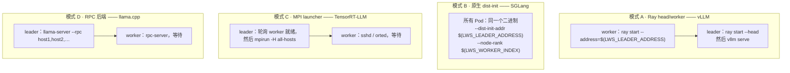
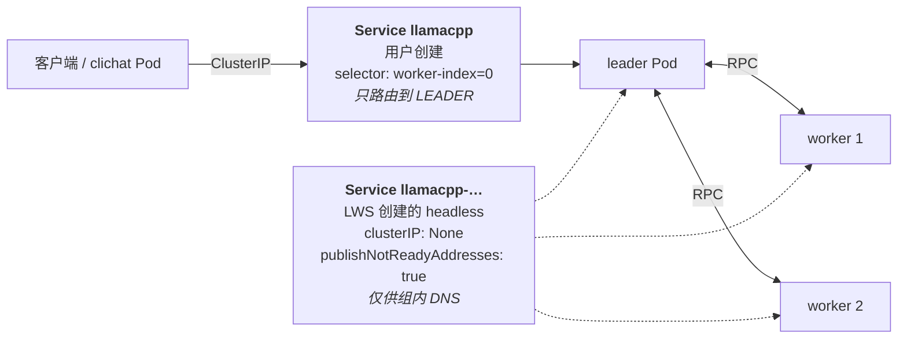
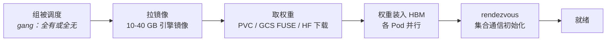

# 模块 9：推理引擎集成

LWS 不知道 LLM 是什么。它创建 Pod、给它们命名、注入三个环境变量、保证它们能互相解析。所有让这一组 Pod *真正服务一个模型*的事情，都发生在容器镜像内部——在一段读取这些变量、并把它们翻译成引擎自己那套分布式运行时所需参数的启动脚本里。

那次翻译就是全部的集成面，而本模块讲的是如何正确完成它。覆盖：**作为 ABI 的 `LWS_*` 契约**、**上游四种引擎接法**（vLLM/Ray、SGLang、TensorRT-LLM/MPI、llama.cpp）、**多机引擎的探针设计**、**前置 Service 模式**、**冷启动与权重加载**，以及**它如何与机密计算服务组合**。

!!! info "溯源信息"
    对照 `kubernetes-sigs/lws` 的 `32a9c37`（2026-08-06）核实。引擎示例取自 `site/content/en/docs/examples/` 和 `docs/examples/`。引擎侧的参数变化很快——在从这里或上游示例里照抄命令之前，务必查阅引擎自己的当前文档，上游好几个示例固定的是旧版本。

---

## 第一部分：作为 ABI 的 `LWS_*` 契约

三个变量，由 mutating webhook 注入到**每个 Pod** 的**每个容器和 init 容器**（[模块 3](03_group_lifecycle_and_identity.md) §4.3）：

| 变量 | 值 | 映射到 |
| :--- | :--- | :--- |
| `LWS_LEADER_ADDRESS` | `<lws>-<groupIndex>.<subdomain>.<namespace>` | rendezvous / head node / master 地址 |
| `LWS_GROUP_SIZE` | `leaderWorkerTemplate.size` | world size、`nnodes`、cluster size |
| `LWS_WORKER_INDEX` | leader 为 `0`，worker 为 `1..size-1` | rank、`node_rank`、「我是不是 head」 |

其余一切——Pod 名、组索引、子组索引——只以 label 或 annotation 形式存在，容器需要的话得用 Downward API 暴露。

### 1.1 让它成为 ABI 的三条性质

**它在进程启动前就可用。** webhook 在准入时运行，所以变量在 kubelet 拉镜像之前就已经在 Pod spec 里了。没有发现步骤、没有 init 容器轮询、没有竞态。

**它跨重建保持稳定。** 组索引来自 StatefulSet 序号，所以 `vllm-1` 永远是组 1。重建出来的组拿到同样的名字和同样的地址。

**它支持变量展开。** 因为 `addEnvVarsIfNotExists` 会**前置**这三个变量，用户自定义变量可以引用它们：

```yaml
env:
  - name: RAY_ADDRESS
    value: "$(LWS_LEADER_ADDRESS):6379"
```

Kubernetes 只会拿列表中**更早**定义的变量去解析 `$(VAR)`，所以这只有靠前置才成立。上游每个示例都依赖它——`--ray_address=$(LWS_LEADER_ADDRESS)`、`--ray_cluster_size=$(LWS_GROUP_SIZE)`——重排那个函数会把它们全弄坏。

### 1.2 通用的 entrypoint 形状

几乎每种集成都能归约成同一个分支：

```bash
#!/bin/bash
set -euo pipefail

if [ "${LWS_WORKER_INDEX}" -eq 0 ]; then
    # leader：启动 rendezvous / head，等 peer 到齐，然后开始服务
    start_head_node
    wait_for_workers "${LWS_GROUP_SIZE}"
    exec serve_model --world-size "${LWS_GROUP_SIZE}"
else
    # worker：加入并阻塞
    exec join_cluster --address "${LWS_LEADER_ADDRESS}" --rank "${LWS_WORKER_INDEX}"
fi
```

有三个细节把「能用的脚本」和「会抖的脚本」区分开：

- **worker 的加入必须重试。** 默认 `startupPolicy: LeaderCreated` 下，worker 立刻启动，而 leader 可能还没在监听。要么在脚本里重试，要么用 `startupPolicy: LeaderReady` 并接受串行冷启动（[模块 3](03_group_lifecycle_and_identity.md) §3）。
- **`exec` 很重要。** 没有它，shell 是 PID 1，信号发给 shell 而不是引擎，于是每一步滚动都要等 30 秒 `SIGKILL`。20 个组的滚动就是十分钟的纯等待。
- **worker 必须永远阻塞。** worker 进程退出就是一次容器重启，而在默认重启策略下那会重建整个组（[模块 5](05_pod_controller_and_failure_handling.md)）。

### 1.3 LWS 没给你的东西

| 缺失的信号 | 后果 | 实践中的绕法 |
| :--- | :--- | :--- |
| 「所有 worker 都就绪了」 | leader 不知道何时开始服务 | 引擎侧 rendezvous，或轮询 Kubernetes API（TensorRT-LLM 示例正是这么干的） |
| 组级的就绪闸门 | 单个 Pod 在组还不能服务时就通过了自己的探针 | 只在 leader 上放 readiness probe，并让它反映*整组*健康 |
| 组级指标 | HPA 只看得到 leader Pod（[模块 2](02_api_surface_anatomy.md) §4） | leader 必须自己聚合并暴露组级指标 |

第一个缺口对贡献者最有意思，因为 TensorRT-LLM 示例的绕法是**给 Pod 授予调用 `kubectl` 的 RBAC**——leader 轮询 API server 来得知 worker 何时就绪。这强烈说明缺了一个 LWS 原生机制。KEP-135 的 `LeaderReady` 处理的是反方向（worker 等 leader），对这个方向毫无帮助。

---

## 第二部分：四种引擎接法



### 2.1 模式 A —— vLLM 配 Ray

上游示例部署两个 vLLM 副本，有两种形态：

| 形态 | 拓扑 | 并行度 |
| :--- | :--- | :--- |
| GPU | 每副本 2 个 Pod，每 Pod 8 卡 | `pipeline_parallel_size=2`、`tensor_parallel_size=8` |
| TPU | 两个 TPU v5e-16 slice，各 4 host，每 host 4 TPU | `pipeline_parallel_size=2`、`tensor_parallel_size=16` |

Ray 用 **leader Pod 作为 head node**，worker Pod 作为 Ray node。leader 随后运行 vLLM server，通过 ClusterIP Service 暴露。

注意这个并行度映射：**TP 在 Pod 内，PP 跨 Pod。** 这是刻意的——TP 是吃带宽的那个维度（[模块 1](01_multihost_inference_problem_space.md) §1.2），所以留在一台主机的 NVLink 域内，而跨 Pod 的维度用流水并行，它只需要点对点的激活值传输。

验证方法，也是个好习惯：

```bash
kubectl logs vllm-0 | grep -i "Loading model weights took"
kubectl port-forward svc/vllm-leader 8080:8080
```

这条日志每个 Ray worker 出现一次，是确认每个 rank 都真的加入了的最快办法。

!!! tip "TPU 形态会走 TPU 环境变量注入"
    在 TPU 路径上，`TPU_WORKER_HOSTNAMES` 和 `TPU_WORKER_ID`（[模块 3](03_group_lifecycle_and_identity.md) §7）做的是 GPU 路径上 Ray 做的事。排查 TPU 部署时先查这些变量——围绕 `leader-requests-tpus` 的偏移逻辑通常是元凶。

### 2.2 模式 B —— SGLang，原生分布式初始化

SGLang 不需要 Ray。每个 Pod 跑同一条命令，只是参数由 LWS 变量导出：

```
--dist-init-addr $(LWS_LEADER_ADDRESS):5000
--nnodes $(LWS_GROUP_SIZE)
--node-rank $(LWS_WORKER_INDEX)
```

这是四种模式里最干净的一种，接新引擎时值得照它来。

上游示例是 2 副本 × 2 Pod × 1 卡，配 `--tp 2`，并且带了一条值得重复的明确警告：**SGLang 跨节点用的是张量并行**，比流水并行吵闹得多，因此需要高带宽互联。这与 vLLM 的示例形成对照，后者刻意把 TP 留在 Pod 内。同一个 API、相反的并行拓扑、截然不同的网络要求——这也是在选引擎之前先读[模块 7](07_scheduling_placement_and_networking.md) 的好理由。

### 2.3 模式 C —— TensorRT-LLM 配 MPI

最复杂的集成，也最能说明 LWS 缺什么。

- 需要一个**自定义镜像**，它下载模型并携带一段 Python 脚本来初始化 MPI 并启动 Triton。
- 独一份地需要 **RBAC**：示例会 apply 一个 Role 和 RoleBinding，「因为该脚本需要访问 `kubectl` 来判断 worker 何时处于就绪状态」。
- 每副本 2 个 Pod，每 Pod 8 卡。通过 `POST /v2/models/ensemble/generate` 提供服务。

那条 RBAC 要求才是重点。MPI 的 launcher 必须在 `mpirun` 之前知道每台主机都起来了，而 LWS 没有向容器暴露任何「这个组已经集结完毕」的信号。于是 leader 被授予 API 访问权限，自己去轮询 Pod 就绪。

如果你自己撞上这个问题，按干净程度递增的选项是：轮询 API server（示例的做法，代价是你的推理 Pod 持有集群凭据）；让 worker 往共享卷写一个哨兵文件；或者用一个容忍晚到成员的引擎原生 rendezvous。引擎支持的话，最后一个最好。

!!! bug "TensorRT-LLM 页面有个复制粘贴错误"
    它的 port-forward 命令写的是 `kubectl port-forward svc/vllm-leader 8000:8000`——从 vLLM 那页抄来的。该示例里的 Service 并不叫 `vllm-leader`。这一页的 `kubectl get pods` 输出也只显示两个 Pod，而正文说的是 2 个 Pod、每个 8 卡。两条都记在[附录 B](appendix_pr_opportunities.md)。

### 2.4 模式 D —— llama.cpp，以及前置 Service 模式

llama.cpp 示例是唯一**纯 CPU、可在 kind 上跑**的，所以如果你没有加速器，从它开始最合适。leader 加载模型并分发层，worker 跑 `rpc-server` 做计算。

它真正的价值在于，它是整个站点上把 **LWS 双 Service 模型**讲得最清楚的一处：



| | LWS 创建的 headless Service | 用户创建的前置 Service |
| :--- | :--- | :--- |
| 用途 | 供 rendezvous 用的组内 DNS | 客户端流量入口 |
| 类型 | headless（`clusterIP: None`） | ClusterIP / LoadBalancer |
| Selector | `leaderworkerset.sigs.k8s.io/name=<lws>` | 必须含 **`worker-index: "0"`** |
| 谁创建 | LWS | 你 |

**LWS 不会创建前置 Service。** 你必须自己建，而且它的 selector 必须包含 `worker-index: "0"`——否则流量会被均衡到那些根本没有 HTTP server 的 worker 上，你会得到间歇性的连接拒绝，看起来像后端不稳定。

```yaml
apiVersion: v1
kind: Service
metadata:
  name: vllm-leader
spec:
  selector:
    leaderworkerset.sigs.k8s.io/name: vllm
    leaderworkerset.sigs.k8s.io/worker-index: "0"    # ← 承重的那一行
  ports:
    - port: 8080
      targetPort: 8080
```

---

## 第三部分：探针设计

探针是多机服务最容易出错的地方，因为 Kubernetes 的 per-pod 模型与「组」的实际健康并不匹配。

### 3.1 规则

| 探针 | leader | worker |
| :--- | :--- | :--- |
| **Readiness** | 要——而且必须反映**整组**健康，因为前置 Service 靠它路由 | 通常**不要**。worker 没有端点，它的就绪对客户端毫无意义 |
| **Liveness** | 小心——探针失败会重启容器，而在默认重启策略下那会摧毁整个组 | 同理，而且更甚 |
| **Startup** | 强烈建议——模型加载可能要好几分钟 | 建议 |

### 3.2 为什么这里的 liveness probe 很危险

liveness probe 失败会重启容器。`ContainerRestarted` 看到 `RestartCount > 0`，而在 `RecreateGroupOnPodRestart` 下**整个组**会被删除重建（[模块 5](05_pod_controller_and_failure_handling.md) §4.2）。于是某个 worker 上的一次瞬时抖动，代价是一整组的冷启动——对 405B 模型来说，那是每个 Pod 好几分钟的权重加载。

指导原则：优先在 leader 上用 readiness probe；任何 liveness probe 都给宽松的 `failureThreshold`；加载慢的模型一定配 `startupProbe`，好让 liveness probe 不会在加载期间触发。

### 3.3 一份可用的 leader 探针配置

```yaml
startupProbe:                    # 宽松：覆盖权重加载
  httpGet: { path: /health, port: 8080 }
  failureThreshold: 120
  periodSeconds: 10              # 最长 20 分钟
readinessProbe:                  # 紧：前置 Service 靠它路由
  httpGet: { path: /health, port: 8080 }
  periodSeconds: 5
  failureThreshold: 2
livenessProbe:                   # 非常宽容：重启会杀掉整个组
  httpGet: { path: /health, port: 8080 }
  periodSeconds: 30
  failureThreshold: 10
```

正是 startup probe 让另外两个变得安全：在它通过之前，readiness 和 liveness 都不会运行。

另外注意 LWS 创建的 headless Service 设了 `publishNotReadyAddresses: true`（[模块 3](03_group_lifecycle_and_identity.md) §5），所以尚未就绪的 leader 仍然能被它的 worker 通过 DNS 解析到。正是这一点让「在 leader 上放一个严格的 readiness probe」不会把 rendezvous 卡死。

---

## 第四部分：冷启动与权重加载

冷启动是 LWS 在生产中最主要的运维成本，而且它会与本笔记里的一切复合。



| 阶段 | 典型代价 | 缓解 |
| :--- | :--- | :--- |
| 拉镜像 | 20–40 GB 引擎镜像要好几分钟 | 用 DaemonSet 预拉；平台支持的话用镜像流式加载；把模型**移出**镜像 |
| 取权重 | 大模型的主导项 | 用预填充好的 ReadWriteMany 卷配 `volumeClaimTemplates`（[模块 7](07_scheduling_placement_and_networking.md) §6），或者带本地 SSD 缓存的 FUSE 挂载 |
| 装入权重 | 各 Pod 并行，因此随组大小而不是模型大小伸缩 | `/dev/shm` 要给够——上游 TAS 示例用的是 `emptyDir` 加 `medium: Memory, sizeLimit: 15Gi` |
| Rendezvous | 秒级，除非在竞态 | 在 worker 脚本里重试；不到万不得已别上 `LeaderReady` |

### 4.1 冷启动在哪里复合

- **滚动更新。** 逐组滚动意味着冷启动要付 `replicas` 次。20 个组每个 5 分钟就是 100 分钟的滚动，还没算 `maxUnavailable` 带来的并行。
- **`RecreateGroupOnPodRestart`。** 任何单个容器重启都要付一整组冷启动。
- **`startupPolicy: LeaderReady`。** 把 leader 加载串行到 worker 加载之前，给每个组都加上 leader 的完整加载时间。
- **`maxSurge`。** 降低的是*可用性*影响而不是*耗时*——surge 组照样要冷启动。

杠杆率最高的单项优化，几乎总是**把模型移出镜像、放到一个快速且预热过的卷上**。第二高的是配一个宽到不会在加载中途杀掉 Pod 的 `startupProbe`。

---

## 第五部分：与其他系统的组合

### 5.1 Kueue 与 Dynamic Workload Scheduler

在加速器容量稀缺时，Kueue 的准入（[模块 7](07_scheduling_placement_and_networking.md) §4）通常比拓扑放置更有价值。一个带清晰状态在队列里等待的组，运维上远好过一个对着调度器 Pending、毫无可见性的组。DWS flex-start 集成还能让一个组去等一份尚不存在的容量，而不是直接失败。

### 5.2 Gateway API Inference Extension

路由明确不在 LWS 范围内。Gateway API Inference Extension 提供模型感知和 prefix-cache 感知的负载均衡，把 LWS 管理的 Pod 当作后端。集成点就是 §2.4 的前置 Service。

对 DisaggregatedSet 而言，路由还必须**感知 revision**——见[模块 8](08_disaggregatedset.md) §8。每 `(slice, revision, role)` 一个 Service，存在的意义正是让负载均衡器可以跨 role 池按 revision 统计后端并按比例分流。那份统计是负载均衡器的活，不是 LWS 的。

### 5.3 llm-d

[llm-d](https://github.com/llm-d/llm-d)（CNCF sandbox）是两个 API 共同设计时的参考消费方：vLLM 加 Gateway API Inference Extension，带 P/D 分离和 prefix caching。好几个 KEP 直接引用 llm-d 的需求。如果你在提一个 DisaggregatedSet 特性，「llm-d 需要这个吗？」是你会被问到的问题。

### 5.4 机密计算服务

如果你的威胁模型要求云厂商既读不到权重也读不到 prompt，那么 LWS 是位于机密信任边界*内部*的编排层，而不是这条边界的组成部分。组合方式大致是：

- Confidential GKE 节点或 Confidential Containers 提供 CPU TEE；NVIDIA CC 模式把 GPU 拉进边界内。
- **LWS 在这些节点上编排多机组**——它与 TEE 完全正交，不需要任何改动。
- 权重交付变成经证明的密钥释放：加密权重放在对象存储上，DEK 只解封进一个通过证明的 Pod 的内存里。
- TLS 必须在 Pod **内部**终止，所以前置 Service 必须是 L4 透传——L7 负载均衡器会在信任边界之外终止 TLS，从而使保证失效。

唯一与 LWS 相关的考量是：per-pod 的证明次数会乘上组大小。一个 16-Pod 的组就是冷启动路径上的 16 次证明，而且它们都在权重解密的关键路径上。

关于 TEE、远程证明和机密 GPU 的详细论述不在本文范围，参见配套笔记[《GKE 上 LLM 服务的机密计算》](https://marinette101.github.io/llm-cc-in-k8s/)，其模块 6 正是以这种方式把 LWS 用作编排层。

---

## 第六部分：接入一个新引擎

一份按问题实际出现顺序排列的清单：

1. **引擎怎么知道自己的 rank 和 world size？** 映射到 `LWS_WORKER_INDEX` 和 `LWS_GROUP_SIZE`。如果它要的是完整主机列表而不是 head 地址，就在 entrypoint 里从 `LWS_LEADER_ADDRESS` 和命名规则拼出来——worker `i` 是 `<lws>-<group>-<i>.<subdomain>`。
2. **它需要 rendezvous 服务器，还是点对点？** 需要 rendezvous → leader 来托管。点对点 → 每个 Pod 都要完整主机列表。
3. **worker 能容忍启动时 leader 还不在吗？** 不能 → 要么在脚本里重试，要么用 `startupPolicy: LeaderReady` 并接受串行冷启动。
4. **并行拓扑是什么？** 「TP 在 Pod 内、PP 跨 Pod」（vLLM 风格）与「TP 跨 Pod」（SGLang 风格）的网络要求完全不同。这决定了你是否需要独占拓扑、以及用哪个 `topologyKey`。
5. **leader 提供 HTTP 吗？** 那就建一个 selector 含 `worker-index: "0"` 的前置 Service。
6. **你打算用什么组级指标做伸缩？** 它必须由 leader 发布（[模块 2](02_api_surface_anatomy.md) §4）。
7. **这个组是 prefill/decode 分离的吗？** 那它应该是一个 DisaggregatedSet，而不是两个 LWS（[模块 8](08_disaggregatedset.md)）。

给 `site/content/en/docs/examples/` 贡献一个新示例，是一个确有价值且边界清晰的 PR。门槛是：照着写就能跑、固定的版本是当前的、并且说明它演练了哪些 LWS 字段以及为什么。

---

## 实验：端到端接一个引擎

!!! warning "规模"
    A 部分纯 CPU，在 `kind` 上就能跑——不管你有什么硬件都从它开始，因为它把集成机制与 GPU 问题隔离开了。B 和 C 部分需要真实的多机加速器容量，标注为 unverified。

### A 部分 — kind 上的 llama.cpp

```bash
kind create cluster
# 上游示例通过对已有集群运行 e2e 套件来安装 LWS：
USE_EXISTING_CLUSTER=true KIND_CLUSTER_NAME=kind make test-e2e
./docs/examples/llamacpp/dev/tasks/run-in-kind
```

你应该得到一个五 Pod 的组（`…-0` 到 `…-0-4`）加一个 `clichat` Pod。然后解剖那两个 Service：

```bash
kubectl get svc
kubectl get svc llamacpp -o jsonpath='{.spec.selector}' | jq
kubectl get svc <lws 名> -o jsonpath='{.spec.clusterIP}{"\t"}{.spec.publishNotReadyAddresses}'; echo
kubectl get endpointslices -l kubernetes.io/service-name=llamacpp
```

确认 §2.4：用户创建的 `llamacpp` Service **只**选中 leader，而 LWS 创建的 headless Service 覆盖全部五个 Pod。然后故意搞坏它——把前置 Service selector 里的 `worker-index: "0"` 去掉，看着请求开始间歇性失败、落到那些没有 HTTP server 的 RPC worker 上。这个失效模式值得亲眼见一次。

### A2 部分 — 验证 ABI

```bash
kubectl exec <leader> -- env | grep LWS_
kubectl exec <worker-2> -- env | grep LWS_
```

确认 leader 的 `LWS_WORKER_INDEX=0`、worker 的是 `2`，两者共享 `LWS_GROUP_SIZE=5`，且 `LWS_LEADER_ADDRESS` 完全一致。

现在加一个引用它们的容器环境变量：

```yaml
env:
  - name: PEER_LIST
    value: "$(LWS_LEADER_ADDRESS)"
```

验证它确实展开了。然后读 `pkg/utils/pod/pod_utils.go` 里的 `AddLWSVariables`，解释为什么改成追加就会坏。

### B 部分 — vLLM 多机（unverified，需要 2 台 8 卡节点）

```bash
export HF_TOKEN=<your-hf-token>
curl https://raw.githubusercontent.com/kubernetes-sigs/lws/refs/heads/main/docs/examples/vllm/GPU/lws.yaml \
  -s | envsubst | kubectl apply -f -

kubectl logs vllm-0 | grep -i "Loading model weights took"
kubectl port-forward svc/vllm-leader 8080:8080
```

然后按 §4 给冷启动打时间戳、做量化：

```bash
kubectl get events --field-selector involvedObject.name=vllm-0 --sort-by=.lastTimestamp
kubectl get pod vllm-0 -o jsonpath='{range .status.conditions[*]}{.type}={.lastTransitionTime}{"\n"}{end}'
```

把墙钟时间归因到拉镜像、取权重、装权重、rendezvous 四个阶段。哪个占主导就优化哪个；靠猜，是人们把一周花在错误阶段上的典型方式。

### B2 部分 — 测量组重启的代价

```bash
time kubectl delete pod vllm-0-1     # 一个 worker，不是 leader
kubectl get pods -w
```

一直测到所有 Pod 重新 Ready。那个数字就是一次 liveness probe 失败要付的代价，也是 §3.2 那条建议的经验依据。

### C 部分 — 写一个新的引擎集成（unverified）

挑一个上游示例里没有的引擎，按 §6 的清单写出集成。一个有用的交付物是一份 manifest 加一页简短说明：

- 它属于四种模式中的哪一种，为什么。
- 从 `LWS_*` 到引擎参数的精确映射。
- worker 是否容忍 leader 晚到，因此你选了哪个 `startupPolicy`。
- 并行拓扑，以及由此产生的网络要求。
- 探针配置，以及每个阈值背后的理由。

如果它照着写就能跑、且固定的是当前版本，那就是一个可以提交上游的 PR。

### 检查点问题

- TensorRT-LLM 示例给 Pod 授予 RBAC，好让 leader 轮询 worker 就绪。设计一个 LWS 原生的替代方案。它作为 API 长什么样——一个字段、一个 condition、还是一个注入的变量？如果容器读它的时候组正在重建，会坏在哪？
- 一个 worker 的进程以状态 0 干净退出。分别追踪三种重启策略下会发生什么，并说明对一个 TP 分片来说哪一种才是正确的。
- vLLM 示例把 TP 放在 Pod 内、PP 跨 Pod；SGLang 示例把 TP 跨 Pod。哪个需要 `exclusive-topology`？用哪个 `topologyKey`？为什么？

继续阅读[模块 10：运维与排障](10_operations_and_troubleshooting.md)。
