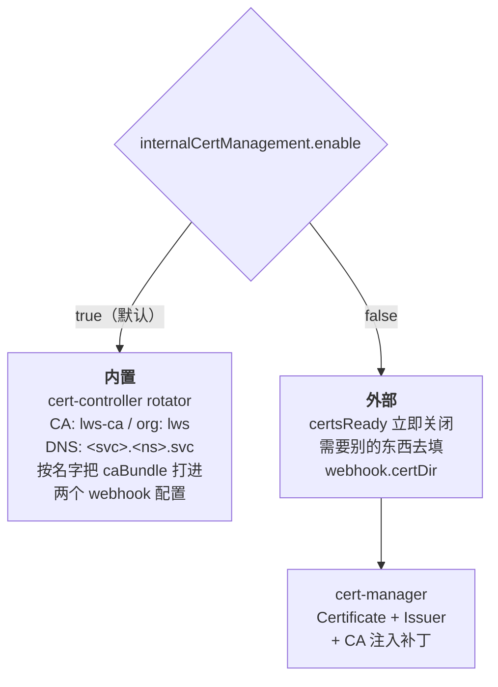
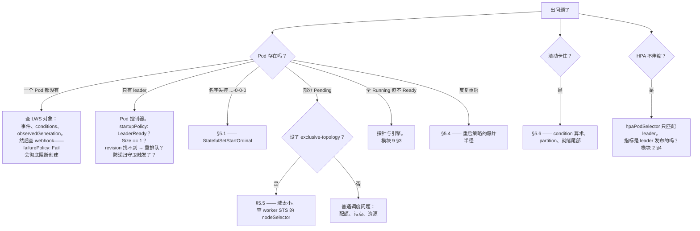

# 模块 10：运维与排障

生产上真正会咬人的失效模式，很少是 API 参考里写着的那些。而是：一次 Helm 升级删光了集群里所有 LeaderWorkerSet；一个 LWS 名字多了一个字符；一个静默表现为 1 的 `maxUnavailable`；以及一个每三十秒重启一次、任何单条日志都解释不清的组。

本模块是前面各模块在运维侧的对应物：**安装与升级风险**、**证书管理**、**指标**、**版本兼容矩阵**、**诊断决策树**，以及**已知失效模式及其根因**。

!!! info "溯源信息"
    对照 `kubernetes-sigs/lws` 的 `32a9c37`（2026-08-06）、**v0.9.0** 核实。下文的版本字符串由 `make prepare-release-branch` 固定；照抄前请先确认当前发布版本。

---

## 第一部分：安装

### 1.1 前置条件

| 要求 | 细节 |
| :--- | :--- |
| Kubernetes | **≥ 1.26**。恰好 1.26 时必须手动启用 `StatefulSetStartOrdinal` feature gate |
| `MaxUnavailableStatefulSet` gate | `maxUnavailable > 1` 需要它。**自 Kubernetes 1.35 起为 beta 且默认开启**；更早版本必须手动开。不开的话，无论你怎么设，LWS 都会一次滚一个组 |
| 容量 | 至少一个有 1 CPU、1 GiB 的节点，供 controller-manager Deployment 使用 |

`StatefulSetStartOrdinal` 依赖既非可选也非表面文章——[模块 3](03_group_lifecycle_and_identity.md) §1.3 解释了原因，下文 §5.1 讲了不满足时会发生什么。

### 1.2 四条安装路径

```bash
# 1 —— kubectl，最简单
VERSION=v0.9.0
kubectl apply --server-side -f \
  https://github.com/kubernetes-sigs/lws/releases/download/$VERSION/manifests.yaml
kubectl wait deploy/lws-controller-manager -n lws-system --for=condition=available --timeout=5m

# 2 —— 从 OCI registry 用 Helm
CHART_VERSION=0.9.0
helm install lws oci://registry.k8s.io/lws/charts/lws \
  --version=$CHART_VERSION --namespace lws-system --create-namespace --wait --timeout 300s

# 3 —— 最新开发版
kubectl apply --server-side -k github.com/kubernetes-sigs/lws/config/default?ref=main

# 4 —— 从源码，用你自己的镜像
git clone https://github.com/kubernetes-sigs/lws.git && cd lws
IMAGE_REGISTRY=<registry>/<project> make image-push deploy
```

路径 1 的 `--server-side` 不是可选的。CRD 大到超过了客户端 apply 所依赖的 `kubectl.kubernetes.io/last-applied-configuration` annotation 上限。

想装到别的命名空间，得改 `config/default/kustomization.yaml` 里的 `namespace:`——没有对应的命令行参数。

### 1.3 DisaggregatedSet 是随发的，但两条路径的开关不同

自 v0.9.0 起 DisaggregatedSet 随 LWS 一起发布。两条安装路径有差别：

| 路径 | DS CRD | DS 控制器 RBAC | DS validating webhook | editor/viewer/admin ClusterRole |
| :--- | :---: | :---: | :---: | :---: |
| kubectl / kustomize | ✓ | ✓ | ✓ | ✓ |
| Helm | ✓ | ✓ | 需要 `--set enableDisaggregatedSet=true` | 需要同一个开关 |

如果你用 Helm 安装且漏了那个开关，DisaggregatedSet 对象会**不经校验**被接受——CRD 的结构化 schema 和 CEL 规则仍然生效，但[模块 8](08_disaggregatedset.md) §9.1 里的一切（`partition` 禁令、放置冲突检查、scaler 名字长度检查）都静默缺席。验证方法：

```bash
kubectl get validatingwebhookconfiguration lws-validating-webhook-configuration \
  -o jsonpath='{range .webhooks[*]}{.name}{"\n"}{end}'
```

你应该看到 `vdisaggregatedset.kb.io` 与 `vleaderworkerset.kb.io` 并列。

---

## 第二部分：升级——真正的危险所在

### 2.1 Helm 的 CRD 风险

!!! danger "从 chart v0.7.0 或更早升级，可能删光集群里所有 LeaderWorkerSet"
    v0.7.0 及更早的 chart 从 `templates/crds/` 渲染 CRD，使它成为 Helm release 的一部分。v0.8.0 把它挪到了 `crds/`。跨过这条边界的第一次 `helm upgrade` 会认为 CRD **已从 release 中移除**并删掉它——**级联删除集群里每一个 LeaderWorkerSet 对象**（上游 issue #880）。

    升级**之前**的一次性缓解：

    ```bash
    kubectl annotate crd leaderworkersets.leaderworkerset.x-k8s.io \
      helm.sh/resource-policy=keep --overwrite
    ```

    这件事记录在安装页和 chart README 里，但**没有**记在排障页——可以说是已知最具破坏性的失效模式，却归错了档。把它加到排障页是一个高价值的文档 PR（[附录 B](appendix_pr_opportunities.md)）。

### 2.2 通用规则：CRD 优先

Helm 只在**第一次** `helm install` 时安装 `crds/`。它在 `helm upgrade` 或 `helm uninstall` 时既不更新也不删除它们。所以 CRD schema 变更和新增的 CRD **不会**仅靠 `helm upgrade` 进到集群。

每一次都要用的正确顺序：

```bash
CHART_VERSION=0.9.0
helm pull oci://registry.k8s.io/lws/charts/lws --version=$CHART_VERSION --untar
kubectl apply --server-side --force-conflicts -f lws/crds     # ← 永远先上 CRD
helm upgrade lws oci://registry.k8s.io/lws/charts/lws \
  --version=$CHART_VERSION --namespace lws-system --wait --timeout 300s
```

注意 v0.9.0 的 `lws/crds` 里有**三个**文件。上游页面那段 pre-v0.9.0 的升级片段只 apply 了 `disaggregatedset.x-k8s.io_disaggregatedsets.yaml`，漏了 chart 同样附带的 `disaggregatedsetrolescalers`。apply 整个目录就能避开这个问题。

### 2.3 升级 operator 不会滚动你的集群

这是让人安心的另一半。如[模块 4](04_lws_reconciler_internals.md) §5.3–5.4 所述：

- `SetMatchesRevision` 击败序列化漂移，所以 operator 里 client-go 版本变化不会产生一个虚假的新 revision。
- 从 ControllerRevision 之前的版本升级时，`NewRevision` 会收养遗留的 `template-revision-hash`，使新的 ControllerRevision *被打上*活 Pod 已经带着的那个 hash。

两者存在的目的，正是让升级控制器不会重启集群里每一个模型服务器。任何升级之后都可以验证：

```bash
kubectl get controllerrevision -l leaderworkerset.sigs.k8s.io/name=<lws>
kubectl get pods -l leaderworkerset.sigs.k8s.io/name=<lws> \
  -o jsonpath='{range .items[*]}{.metadata.name}{"\t"}{.status.startTime}{"\n"}{end}'
```

启动时间没变，就说明什么都没滚。

### 2.4 0.5.0 → 0.6.0+ 的子组 annotation 变更

跨过这条边界升级的子组用户会经历一次 leader Pod 的滚动更新，因为 annotation key 从 `leaderworkerset.gke.io/subgroup-size` 改成了 `leaderworkerset.sigs.k8s.io/subgroup-size`（PR #434）。这是预期内的一次性事件，也有文档——但要为容量影响做好计划。

---

## 第三部分：证书

webhook 需要一张服务证书。恰好有两种模式，由一个配置字段选择。



内置模式是默认的，不需要额外组件。它用 `github.com/open-policy-agent/cert-controller` 的 rotator，CA 名 `lws-ca`、组织 `lws`、DNS 名 `<webhookServiceName>.<namespace>.svc`，并启用就绪检查（[模块 4](04_lws_reconciler_internals.md) §1.2）。

切到 cert-manager，两条路径都需要把内置管理**关掉**：

| 路径 | 步骤 |
| :--- | :--- |
| Kustomize | 设 `internalCertManagement.enable: false`；在 `config/default/kustomization.yaml` 里注释掉 `../internalcert`；取消注释 `../certmanager`；取消注释所有 `CERTMANAGER` 段；`kubectl apply --server-side -k config/default` |
| Helm | 设 `internalCertManagement.enable: false` 和 `enableCertManager: true` |

!!! bug "上游 cert-manager 页面有三个问题"
    1. Helm 那节说要禁用 **`internalCertManager`**。实际字段是 **`internalCertManagement.enable`**（`api/config/v1alpha1/configuration_types.go`，默认 `true`）。照字面做完全不起作用。
    2. 开头那句话语法就是坏的：「This page shows how you can a third party certificate authority solution like Cert Manager.」
    3. kustomize 步骤漏了 `webhookcainjection_patch.yaml` 和 `cainjection_in_leaderworkersets.yaml` 这个 CRD 补丁，而 `hack/e2e-test.sh` 在 `USE_CERT_MANAGER=true` 时两者都会加。文档化的手工流程**比被测试的流程更不完整**——这也强烈提示了修法：照着 e2e 脚本抄。

    三条都在[附录 B](appendix_pr_opportunities.md)。

rotator 按**名字**把 `caBundle` 打进两个 webhook 配置：`lws-validating-webhook-configuration` 和 `lws-mutating-webhook-configuration`。如果你在 fork 里改了任何一个的名字，准入会 fail-closed（`failurePolicy: Fail`），且没有明显线索。

---

## 第四部分：指标

指标端点是 `:8443`，始终 `SecureServing: true` 并带 `filters.WithAuthenticationAndAuthorization`。HTTP/2 被一个引用 GHSA-qppj-fm5r-hxr3 和 GHSA-4374-p667-p6c8 的 TLS mutator 无条件禁用——如果你在排查一个非要 h2 的抓取器，这点值得知道。

| 路径 | 步骤 |
| :--- | :--- |
| Kustomize | 在 `config/default/kustomization.yaml` 里启用 prometheus，并取消注释各 `PROMETHEUS` 段 |
| Helm | `enablePrometheus: true` |
| 带 TLS 校验 | 另外还要 `internalCertManagement.enable: false` + cert-manager，并提供 `metrics.prometheusNamespace` 和 `metrics.serviceMonitor.tlsConfig` |

!!! bug "文档里的那些 Helm 值在 chart 里并不存在"
    `metrics.prometheusNamespace` 和 `metrics.serviceMonitor` 都没有出现在 `charts/lws/values.yaml` 或 chart README 的参数表里。它们是未声明的默认值——也许靠透传能生效，但在 chart 自身里既不受支持也无文档。

    这一页还说要取消注释标记为 `PROMETHEUS-WITH-CERTS` 的段落，但 `config/default/kustomization.yaml` 里根本没有这个标记；真实标记是 `[WEBHOOK]`、`[CERTMANAGER]`、`[PROMETHEUS]`、`[METRICS]` 和 `[VOLCANO]`。而且资源实际在 **`config/components/prometheus/`**，另外还有一个独立的 `config/prometheus/`，页面里那句「启用 `prometheus`」并没有说清是哪一个。

    把这些值在 `values.yaml` 和 chart README 里声明出来，是一个具体、可控的「chart + 文档」PR。

!!! warning "完全没有 DisaggregatedSet 指标"
    你能拿到的是 controller-runtime 的标准指标集——按控制器的 reconcile 次数、耗时、队列深度、错误率。**没有 LWS 专有指标，也没有 DisaggregatedSet 专有指标。** KEP-766、KEP-846 和 KEP-849 都把指标列为 Beta 毕业标准，所以这是一块动机充分、有 KEP 背书的工作（[模块 8](08_disaggregatedset.md) §10）。

在此之前，从对象层面做监控：

```bash
kubectl get lws -A -o custom-columns=\
'NS:.metadata.namespace,NAME:.metadata.name,DESIRED:.spec.replicas,READY:.status.readyReplicas,UPTODATE:.status.updatedReplicas'
```

对「`readyReplicas < spec.replicas` 持续超过你的冷启动预算」和「`Available=False` 持续超过你的滚动预算」告警。

---

## 第五部分：已知失效模式

### 5.1 无限创建 StatefulSet——Pod 名叫 `…-0-0-0-0`

| | |
| :--- | :--- |
| **症状** | Pod 名字越来越长；LWS 控制器陷入无限 reconcile 循环，「可能耗尽集群资源」 |
| **原因** | 集群忽略 `.spec.ordinals.start`——1.27 以下且没开 `StatefulSetStartOrdinal` gate。worker StatefulSet 产出一个看起来像 leader 的序号 0 Pod，它又去创建自己的 worker StatefulSet，如此递归 |
| **修法** | Kubernetes ≥ 1.26 且开了 gate；≥ 1.27 默认就开 |
| **代码里的缓解** | `PodReconciler.Reconcile` 第 6 步的防递归守卫（[模块 3](03_group_lifecycle_and_identity.md) §1.3），它发出 `FailedCreate` 而不是递归下去 |

注意上游排障页把原因写成「< 1.27」、把修法写成「≥ 1.26」——自相矛盾的措辞，值得收紧。

### 5.2 LWS 名字超过约 51 个字符

| | |
| :--- | :--- |
| **症状** | `metadata.labels: Invalid value: "<worker-sts-name>-<10-char-hash>": must be no more than 63 characters` |
| **原因** | StatefulSet 名字 57 字符上限（kubernetes/kubernetes#64023），叠加 LWS 的两级命名 `<lws>-<groupIndex>-<workerIndex>` 以及 StatefulSet 自己的 hash 后缀 |
| **真实上限** | **`51 - int(replicas / 10)`** 个字符 |

这个公式值得记牢：**名字预算会随你扩容而缩水**，因为更高的组索引是更长的字符串。一个在 `replicas: 5` 时能用的 LWS，可能在 `replicas: 100` 时失败。准入阶段没有任何东西校验这一点——失败会以一个 StatefulSet 事件的形式出现，离你创建的那个 LWS 很远。加一条 webhook 检查会是个有用的贡献。

### 5.3 `maxUnavailable` 静默表现为 1

| | |
| :--- | :--- |
| **症状** | 设了 `maxUnavailable: 4`，但组严格一个一个更新 |
| **原因** | `MaxUnavailableStatefulSet` gate 没开（1.35 之前且未手动启用） |
| **诊断** | 无论 gate 开没开，值**都会**传到 StatefulSet 上，所以查 StatefulSet spec 什么也证明不了。要数实际并发更新的组数 |

### 5.4 一个组每约 30 秒重启一次

几乎总是这三件事之一，按可能性递减：

1. **liveness probe 在模型加载期间触发。** 加一个 `startupProbe`（[模块 9](09_inference_engine_integration.md) §3.2）。
2. **worker 进程干净退出。** `RecreateGroupOnPodRestart` 下任何容器重启都会摧毁整组。worker 必须永远阻塞。
3. **UID 不匹配循环。** `workerPodBelongsToLeader` 守卫（[模块 5](05_pod_controller_and_failure_handling.md) §4.3）就是为防它而存在的，但如果你真遇到了，把控制器日志抓下来——那会是一个真 bug。

```bash
kubectl get events --field-selector reason=RecreateGroup --sort-by=.lastTimestamp
kubectl get pod <pod> -o jsonpath='{range .status.containerStatuses[*]}{.name}{"\t"}{.restartCount}{"\t"}{.lastState.terminated.reason}{"\n"}{end}'
```

### 5.5 带独占拓扑的组永远 Pending

| | |
| :--- | :--- |
| **症状** | leader Running，一个或多个 worker 无限期 Pending |
| **原因** | leader 占住了一个装不下整组的拓扑域（[模块 5](05_pod_controller_and_failure_handling.md) §6） |
| **修法** | gang 调度（[模块 7](07_scheduling_placement_and_networking.md) §3），或更粗的 `topologyKey`，或更小的 `size` |
| **诊断** | `kubectl get sts <组> -o jsonpath='{.spec.template.spec.nodeSelector}'` 显示被钉住的域值 |

那里如果是空值，说明 `topologyValueFromPod` 吞掉了一个不存在的 Node——见[模块 5](05_pod_controller_and_failure_handling.md) §6 记的两个缺陷。

### 5.6 滚动永远完不成

倒着推 condition 算术（[模块 4](04_lws_reconciler_internals.md) §6.3）。`Available` 需要**同时**满足 `readyNonBurstWorkerCount == spec.replicas` **和** `partitionedUpdatedAndReadyCount == partitionedCurrentNonBurstCount`。常见原因：

- `partition` 停在了某个非零的灰度边界。查 `spec.rolloutStrategy.rollingUpdateConfiguration.partition`。
- 某个高索引的组不就绪，于是「已更新且就绪的尾部」不增长，partition 下不去（[模块 6](06_rollout_and_revisions.md) §4）。
- partition 以下某个被冻结的组不健康——它让第一个子句不满足，却不影响第二个。

### 5.7 改名或证书出问题导致 webhook 失败

三个 webhook 都是 `failurePolicy: Fail`，意味着一个坏掉的 webhook 会阻塞**所有**匹配其对象选择器的 LWS 和 Pod 创建。检查：

```bash
kubectl -n lws-system get secret lws-webhook-server-cert
kubectl get validatingwebhookconfiguration lws-validating-webhook-configuration \
  -o jsonpath='{.webhooks[0].clientConfig.caBundle}' | head -c 40; echo
kubectl -n lws-system logs deploy/lws-controller-manager | grep -i 'cert\|rotator'
```

`caBundle` 为空说明 rotator 没能打上补丁——通常是 webhook 配置被改名了，或者缺少对 `*webhookconfigurations` 的 RBAC。

---

## 第六部分：诊断决策树



### 6.1 值得背下来的命令

```bash
# 一条命令看清一个 LWS 的对象图
LWS=my-lws
kubectl get lws,sts,svc,controllerrevision,pods -l leaderworkerset.sigs.k8s.io/name=$LWS

# 每个组在哪个 revision 上？
kubectl get pods -l leaderworkerset.sigs.k8s.io/name=$LWS,leaderworkerset.sigs.k8s.io/worker-index=0 \
  -o custom-columns='NAME:.metadata.name,REV:.metadata.labels.leaderworkerset\.sigs\.k8s\.io/template-revision-hash,READY:.status.conditions[?(@.type=="Ready")].status'

# 滚动位置
kubectl get sts $LWS -o jsonpath=\
'partition={.spec.updateStrategy.rollingUpdate.partition} replicas={.spec.replicas} annotated={.metadata.annotations.leaderworkerset\.sigs\.k8s\.io/replicas}'; echo

# Conditions
kubectl get lws $LWS -o jsonpath='{range .status.conditions[*]}{.type}={.status} ({.reason}){"\n"}{end}'

# 控制器对这个 LWS 说过的一切
kubectl get events --field-selector involvedObject.name=$LWS --sort-by=.lastTimestamp

# 控制器日志，按对象过滤
kubectl -n lws-system logs deploy/lws-controller-manager | grep $LWS
```

### 6.2 读 `managedFields`

由于 leader StatefulSet 是以 field manager `lws` 加 `Force: true` 做 Server-Side Apply 写入的（[模块 4](04_lws_reconciler_internals.md) §4）：

```bash
kubectl get sts $LWS -o yaml --show-managed-fields | yq '.metadata.managedFields'
```

任何由 `lws` 拥有的字段都会在下一次 reconcile 时被改回去。任何**不**属于它的字段都会保留。这就是「我手改的东西为什么消失了」的权威答案，十秒钟就能查完。

---

## 第七部分：兼容矩阵

| 组件 | 版本 | 来源 |
| :--- | :--- | :--- |
| LWS | v0.9.0 | 写作时的最新发布 |
| Kubernetes | **≥ 1.26** | 硬下限；1.26 需手动开 `StatefulSetStartOrdinal` |
| `maxUnavailable > 1` 所需的 Kubernetes | ≥ 1.35 默认开启，更早需开 gate | `MaxUnavailableStatefulSet` |
| Go | **1.26.0** | `go.mod` |
| `k8s.io/api` | **v0.36.3** | `go.mod`；同时也固定了 code-generator |
| Volcano（gang 调度） | v1.12.1 | 仅 e2e；被测试过的版本 |
| cert-manager | v1.17.0 | 仅 e2e；被测试过的版本 |
| Kueue（TAS 示例） | 0.16.1 | 上游 TAS 示例 |

!!! note "API 参考文档是对着 Kubernetes 1.28 生成的"
    `hack/genref/config.yaml` 把 `k8s.io/api...` 类型映射到 **v1.28** 的 Kubernetes API 参考，而项目构建用的是 `k8s.io/api v0.36.3`。因此 `site/content/en/docs/reference/*.v1.md` 里每一个指向核心类型的交叉链接都指向 1.28 的文档。把这个配置值升上去是一个一行的 PR。

---

## 实验：把失败演练一遍

本实验的意义是：在一个你不介意搞坏的集群里，刻意把每种失效模式都见一次——这样当你在生产里遇到它时，是几秒钟认出来，而不是几小时。

!!! warning "用一次性集群"
    A2 部分会**刻意销毁 LeaderWorkerSet 对象**。别在你在乎的地方跑它。

### A 部分 — 安装与升级

用 Helm 装 v0.9.0，然后验证 §1.3 的 DisaggregatedSet 开关：

```bash
helm install lws oci://registry.k8s.io/lws/charts/lws \
  --version=0.9.0 --namespace lws-system --create-namespace --wait
kubectl get validatingwebhookconfiguration lws-validating-webhook-configuration \
  -o jsonpath='{range .webhooks[*]}{.name}{"\n"}{end}'
```

`vdisaggregatedset.kb.io` 应当**不存在**。现在创建一个在某个 role 上带 `partition: 5` 的 DisaggregatedSet——[模块 8](08_disaggregatedset.md) §9.1 说它必须被拒绝——观察它被**接受**了。然后带 `--set enableDisaggregatedSet=true` 重装，确认同一个对象现在被拒绝。

这就是那个开关的全部理由，两条命令演示完毕。

### A2 部分 — 复现 CRD 删除风险（破坏性）

在一次性集群上装 chart v0.7.0，创建一个 LeaderWorkerSet，然后**不带** resource-policy annotation 升级到 v0.8.0。看着 CRD 和每一个 LWS 对象一起消失。

然后先打上 annotation 再重做一遍：

```bash
kubectl annotate crd leaderworkersets.leaderworkerset.x-k8s.io \
  helm.sh/resource-policy=keep --overwrite
```

见过一次之后，你再也不会跳过这一步——而且你手里就有了 §2.1 那个排障页 PR 的素材。

### B 部分 — 名字长度上限

```bash
# 恰好 51 个字符
kubectl create -f - <<'EOF'
apiVersion: leaderworkerset.x-k8s.io/v1
kind: LeaderWorkerSet
metadata:
  name: aaaaaaaaaabbbbbbbbbbccccccccccddddddddddeeeeeeeeeff
spec:
  replicas: 2
  leaderWorkerTemplate:
    size: 2
    workerTemplate: { spec: { containers: [{ name: c, image: nginxinc/nginx-unprivileged:1.27 }] } }
EOF
```

它应该被接受。现在把它扩到 100 副本，按 `51 - int(replicas/10)` 公式看着高索引的组失败。找到那个错误：

```bash
kubectl get events --field-selector reason=FailedCreate --sort-by=.lastTimestamp
```

注意这个错误离你创建的那个对象有多远——一个关于 label 值的 StatefulSet 事件，完全没提到 LWS。然后勾勒一下你会加的 webhook 校验：确切的界是多少？它需要依赖 `replicas` 吗？

### C 部分 — 证书故障

```bash
kubectl -n lws-system delete secret lws-webhook-server-cert
kubectl -n lws-system logs deploy/lws-controller-manager -f | grep -i 'cert\|rotator'
```

看着 rotator 把它重新生成出来。然后来点真的：改掉 webhook 配置的名字，观察**所有** LWS 创建现在都以 webhook 错误失败——`failurePolicy: Fail` 在起作用。然后恢复它。

### D 部分 — 建立监控基线

部署三个处于不同状态的 LWS：一个健康、一个设了 `partition` 处于滚动中、一个 readiness probe 是坏的。然后写一条能把三者区分开的命令：

```bash
kubectl get lws -A -o custom-columns=\
'NAME:.metadata.name,DESIRED:.spec.replicas,READY:.status.readyReplicas,UPTODATE:.status.updatedReplicas,AVAIL:.status.conditions[?(@.type=="Available")].status,UPD:.status.conditions[?(@.type=="UpdateInProgress")].status'
```

确认 `maxSurge` 滚动期间 `status.replicas` 超过 `spec.replicas`，确认 `Available` 和 `UpdateInProgress` 的行为与[模块 4](04_lws_reconciler_internals.md) §6.3 的预测一致，确认被冻结的灰度会无限期停在 `Progressing`。

这条命令，加上对「`readyReplicas < spec.replicas` 持续」的告警，在 LWS 专有指标出现之前，是一份够用的监控基线。

### 检查点问题

- 名字上限是 `51 - int(replicas/10)`。请从 StatefulSet 的 57 字符上限和 LWS 的两级命名方案把它推导出来。每一个字符都花在哪了？
- 不管 gate 开没开，`maxUnavailable` 都会传到 StatefulSet 上。设计一个诊断方法，把「gate 没开」和「因为就绪尾部的关系，滚动本来就该一次一个组」区分开。
- Helm 不升级 CRD。基于这一点，给一个跑着 200 个 LeaderWorkerSet、横跨 30 个命名空间的集群写出正确的升级 runbook。

继续阅读[模块 11：贡献者工作流](11_contributor_workflow.md)。
