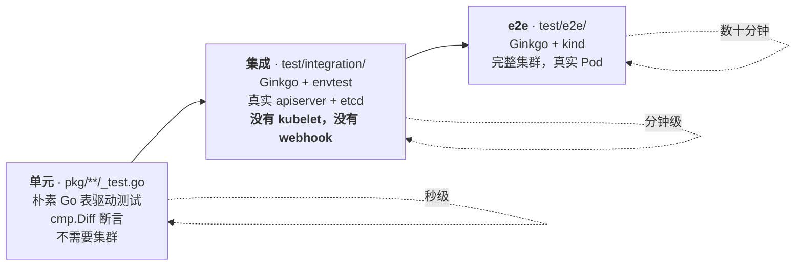

# 模块 11：贡献者工作流

到这里为止的一切都是为了*理解* LWS。本模块讲的是*改动*它：仓库布局、把守 CI 的 `make` 目标、三层测试及其惯例、linter、代码生成链、KEP 流程、发布机制，以及谁必须批准你的 PR。

它是为「读完了前十个模块、想提第一个 PR」这个具体情境写的。其中最有用的一条事实是：**`make verify` 就是提交前的门禁**，推之前跑一遍，每次都能省下一轮 review。

!!! info "溯源信息"
    对照 `kubernetes-sigs/lws` 的 `32a9c37`（2026-08-06）核实。工具版本固定在 `Makefile` 和 `Makefile-deps.mk` 里；别想当然，先查。

---

## 第一部分：仓库布局

```
api/                   ← API 类型。动这里任何东西都会触发完整的代码生成链。
  leaderworkerset/v1/    LeaderWorkerSet —— KAL 唯一检查的那棵树
  disaggregatedset/v1/   DisaggregatedSet + DisaggregatedSetRoleScaler
  config/v1alpha1/       Configuration（控制器自身的配置文件格式）
cmd/main.go            ← manager 装配、命令行参数、启动顺序
pkg/
  controllers/           leaderworkerset_controller.go、pod_controller.go、metadata.go
  controllers/disaggregatedset/   planner.go、executor.go、*_manager.go
  webhooks/              LWS 与 pod webhook；disaggregatedset/ 子包
  utils/                 revision/、pod/、statefulset/、controller/、accelerators/、disaggregatedset/
  schedulerprovider/     gang 调度接口 + volcano provider
  config/、cert/、version/
client-go/             ← 生成的。永远不要手改。
config/                ← kustomize：crd/ default/ manager/ rbac/ webhook/ internalcert/
                          certmanager/ components/{prometheus,volcano}
charts/lws/            ← Helm chart；crds/ 由 `make crds` 生成
keps/                  ← 每个 KEP 一个目录：README.md + kep.yaml
site/                  ← Hugo + Docsy 文档站
test/                  ← wrappers/ testutils/ integration/ e2e/
hack/                  ← 代码生成、e2e 脚手架、chart 推送、TOC、KAL 构建配置
```

由布局推出三条规则：

1. **`client-go/` 和每个 `zz_generated.*.go` 都是生成的。** `make verify` 会重新生成并 diff；手改会挂 CI。
2. **KAL 只检查 `api/leaderworkerset/*`。** `api/disaggregatedset/` 和 `api/config/` 不受检——见[模块 2](02_api_surface_anatomy.md) §8.2。
3. **恰好只有两个 `OWNERS` 文件。** 没有按包的所有权，所以每个非站点 PR 都需要四位根 approver 之一。

---

## 第二部分：要紧的 Make 目标

!!! warning "必须用 GNU sed"
    如果 `sed --version` 不是 GNU，Makefile 会硬报错：*"!!! GNU sed is required. If on OS X, use 'brew install gnu-sed'."* 存在 `gsed` 时会优先用它。macOS 贡献者在第一条命令就会撞上。

### 2.1 日常循环

| 目标 | 做什么 |
| :--- | :--- |
| `make manifests` | `controller-gen` → CRD 到 `config/crd/bases`、RBAC 到 `config/rbac`、webhook 配置到 `config/webhook` |
| `make generate` | deepcopy + `hack/update-codegen.sh`（clientset、lister、informer、apply configuration）+ API 参考文档 + Helm CRD |
| `make fmt` / `make vet` | `go fmt` / `go vet` |
| **`make test`** | 基于 envtest 的单测，覆盖 `./api/... ./pkg/... ./cmd/...`，带覆盖率 |
| **`make test-integration`** | 对 `./test/integration/...` 跑 Ginkgo，配 envtest |
| **`make test-e2e`** | `hack/e2e-test.sh`——建 kind 集群、构建并加载镜像、部署、跑 Ginkgo |
| **`make lint`** | `golangci-lint run --timeout 15m0s` |
| **`make lint-api`** | 自行编译的 kube-api-linter 二进制 |
| **`make verify`** | **提交前门禁**——见下 |

### 2.2 `make verify` 就是门禁

```
gomod-verify lint lint-api fmt-verify toc-verify manifests generate prepare-release-branch
  → git --no-pager diff --exit-code config/components api client-go site/ charts/
  → 上述路径下出现任何未跟踪文件即失败
```

它把一切重新生成一遍，然后要求工作树是干净的。有两个后果常常绊人：

- **改了 API 却忘了 `make generate` 会挂 CI**，因为重新生成的 `client-go/` 与你提交的不一致。
- **手改版本字符串会挂 CI。** `prepare-release-branch` 会重写 `README.md`、`site/hugo.toml`、`charts/lws/README.md`、`site/content/en/docs/installation/_index.md` 和 `charts/lws/Chart.yaml` 里的版本字符串。你手改的那个会被重新生成覆盖回去，然后 diff 失败。

每次推之前跑一遍 `make verify`。它比 CI 反馈慢，但比一个来回快得多。

### 2.3 固定的工具版本

| 工具 | 版本 |
| :--- | :--- |
| Go | **1.26.0**（来自 `go.mod`——唯一真相来源） |
| controller-gen | v0.17.2 |
| kustomize | v5.2.1（版本不对会被重装） |
| golangci-lint | v2.12.2 |
| kube-api-linter | 由 `hack/.custom-gcl.yaml` 按 commit 固定 |
| envtest Kubernetes | **1.36.0** |
| kind 节点镜像 | `kindest/node:v1.36.1` |
| helm | v3.19.0 · yq v4.45.1 · hugo v0.152.2（extended） · genref v0.28.0 |
| Volcano（e2e） | v1.12.1 · cert-manager（e2e） v1.17.0 |
| code-generator | 跟随 `k8s.io/api` → **v0.36.3** |

所有东西装到 `./bin`。KAL 二进制是**编译**出来的而不是下载的（`make golangci-lint-kal` 从 `hack/.custom-gcl.yaml` 构建），所以第一次 `make lint-api` 会比较久。

---

## 第三部分：三层测试



### 3.1 单元测试——表驱动惯例

朴素 Go，不用 Ginkgo，用 `cmp.Diff` 断言：

```go
func TestGenGroupUniqueKey(t *testing.T) {
    tests := []struct {
        name        string
        podName     string
        namespace   string
        expectedKey string
    }{
        {name: "same namespace, pod name", podName: "test-sample", namespace: "default",
         expectedKey: "95e88034e460983f51a9952fe128729fbc0663b5"},
    }
    for _, tc := range tests {
        t.Run(tc.name, func(t *testing.T) {
            key := genGroupUniqueKey(tc.namespace, tc.podName)
            if diff := cmp.Diff(tc.expectedKey, key); diff != "" {
                t.Errorf("unexpected key %s", diff)
            }
        })
    }
}
```

注意那些**黄金哈希值**。如果你改了 `genGroupUniqueKey` 的入参顺序或哈希方式，这些测试会大声挂掉——这是刻意的，因为那个值是亲和性 key，改了它会静默地把每个组重新放置一遍。

Testify 是直接依赖，但用得很少；`cmp.Diff` 才是本项目的风格。

DisaggregatedSet 的 planner 是整个项目里最适合写单测的地方：它是四个整数向量的纯函数，`planner_test.go` 是 38 KB 的表驱动测试，还含一个全序列断言。改滚动算法的 PR 应当带上那里的条目。

### 3.2 集成测试——envtest，以及那个陷阱

`test/integration/` 跑真实的 apiserver 和 etcd、真实的 `ctrl.NewManager`、真实的 reconciler——但**没有 kubelet，也没有准入 webhook**。

第二个缺失是 API PR 最常见的陷阱：

!!! danger "集成测试是在没有 defaulting webhook 的情况下跑的"
    `wrappers.BuildLeaderWorkerSet` 带着注释 *"Manually set this for we didn't enable webhook in controller tests"*，并显式填充了 `RolloutStrategy`、`StartupPolicy` 和 `NetworkConfig`——也就是 defaulting webhook 本该填的那些字段。

    **如果你加了一个有默认值的 API 字段，你必须同时把它加到 wrapper 里。** 否则一个未设置的指针会在 reconciler 内部空指针 panic，而失败看起来像控制器 bug，而不是测试 fixture 的缺口。

这个套件里还有一个值得修的真 bug：

```go
BinaryAssetsDirectory: filepath.Join("..", "..", "..", "bin", "k8s",
    fmt.Sprintf("1.28.3-%s-%s", runtime.GOOS, runtime.GOARCH)),
```

硬编码了 **1.28.3**，而 Makefile 里是 `ENVTEST_K8S_VERSION = 1.36.0`。通过 `make test-integration` 跑不受影响，因为 `KUBEBUILDER_ASSETS` 胜出——但注释里明说这条路径是「if you want to run the tests directly without call the makefile target」，而那条路径是坏的。小而安全的 PR。

### 3.3 Ginkgo 表驱动惯例

```go
var _ = ginkgo.Describe("LeaderWorkerSet controller", func() {
    type update struct {
        lwsUpdateFn       func(*leaderworkerset.LeaderWorkerSet)
        checkLWSState     func(*leaderworkerset.LeaderWorkerSet)
        checkLWSCondition func(context.Context, client.Client, *leaderworkerset.LeaderWorkerSet, time.Duration)
    }
    type testCase struct {
        makeLeaderWorkerSet func(nsName string) *wrappers.LeaderWorkerSetWrapper
        updates             []*update
    }
    ginkgo.DescribeTable("leaderWorkerSet creating or updating",
        func(tc *testCase) {
            ns := &corev1.Namespace{ObjectMeta: metav1.ObjectMeta{GenerateName: "lws-ns-"}}
            // …
        },
        ginkgo.Entry("scale up number of groups", &testCase{ /* … */ }),
        ginkgo.Entry("scale down to 0", &testCase{ /* … */ }),
    )
})
```

每个 entry 都拿到一个**全新的、生成名字的命名空间**。`updates` 切片建模的是「一串变更，中间夹着断言」，这正是测试滚动更新该有的形状。

注意在测试主体里 Ginkgo 是**带包名**导入的（`ginkgo.Describe`），而套件文件用的是 dot-import。两种风格并存；跟着你正在改的那个文件走。

### 3.4 wrapper 构建器惯例

只要你加字段，就照这个模式来：

```go
type LeaderWorkerSetWrapper struct {
    leaderworkerset.LeaderWorkerSet
}

func (w *LeaderWorkerSetWrapper) Obj() *leaderworkerset.LeaderWorkerSet {
    return &w.LeaderWorkerSet
}

func (w *LeaderWorkerSetWrapper) Replica(count int) *LeaderWorkerSetWrapper {
    w.Spec.Replicas = ptr.To[int32](int32(count))
    return w
}

// 嵌套的可选结构体由 setter 惰性分配——你的字段如果落在一个新的
// 指针子结构下面，就照抄这个惯例。
func (w *LeaderWorkerSetWrapper) SubGroupType(t leaderworkerset.SubGroupPolicyType) *LeaderWorkerSetWrapper {
    if w.Spec.LeaderWorkerTemplate.SubGroupPolicy == nil {
        w.Spec.LeaderWorkerTemplate.SubGroupPolicy = &leaderworkerset.SubGroupPolicy{}
    }
    w.Spec.LeaderWorkerTemplate.SubGroupPolicy.Type = &t
    return w
}
```

两个构造函数：`BuildBasicLeaderWorkerSet(name, ns)` 给一个裸对象，`BuildLeaderWorkerSet(nsName)` 给大多数条目使用的那个「贴近真实」的版本。

配套的包：

- **`test/testutils/util.go`**——40 多个集群状态 helper：`MustCreateLws`、`CreateLeaderPods`、`CreateLeaderPodsWithInjectFn`（任意改 Pod 的逃生口）、`SetLeaderPodsToReady(start, end)`、`SetStatefulsetToUnReady`、`UpdateWorkerTemplateImage`、`ValidatePodExclusivePlacementTerms` 等等。
- **`test/testutils/validators.go`**——内含 `Eventually` 的 `Expect*` 断言：`ExpectValidLeaderStatefulSet`、`ExpectLeaderWorkerSetAvailable`、`ExpectStatefulsetPartitionEqualTo`、`ExpectRevisions(…, numRevisions)`、`ValidateEvent`。

写 helper 之前先 grep 这两个文件。它们几乎肯定已经有了。

### 3.5 e2e

`hack/e2e-test.sh` 就是整套脚手架：

```
trap cleanup EXIT
startup → pull_upgrade_images → kind_load → deploy_cert_manager
        → deploy_gang_scheduler → lws_deploy → run_tests
```

值得注意的行为：

- `lws_deploy` 会**动态写出 `config/manager/controller_manager_config.yaml`**，cert-manager 变体加 `internalCertManagement.enable: false`，Volcano 变体加 `gangSchedulingManagement.schedulerProvider`。Volcano 情况下它还会在缺失时补上 `podgroups` 的 RBAC 规则。
- cert-manager 变体会加 `cainjection_in_leaderworkersets.yaml`、`webhookcainjection_patch.yaml` 和 `cert_metrics_manager_patch.yaml`——**比上游 cert-manager 文档描述的还多**（[模块 10](10_operations_and_troubleshooting.md) §3）。
- `run_tests` 用一个**字面的 Ginkgo 描述字符串**来选 gang 调度套件（一个分支用 `--focus=`，另一个用 `--skip=`）。给那个 `Describe` 改名会静默地把两个分支都弄坏。
- `cleanup` 会把控制器日志、Pod 列表、Volcano 日志和 `kind export logs` 收集到 `$ARTIFACTS`——CI 上 e2e 挂了先看那里。

变体：`make test-e2e-cert-manager`、`make test-e2e-gang-scheduling-volcano`、`make test-e2e-upgrade`（装 `LWS_UPGRADE_FROM_VERSION`、跑 `before` 阶段、升级、跑 `after` 阶段）。

想对着已有集群快速迭代：

```bash
USE_EXISTING_CLUSTER=true KIND_CLUSTER_NAME=kind make test-e2e
```

---

## 第四部分：Lint

### 4.1 `.golangci.yaml` 极其精简

```yaml
version: "2"
linters:
  default: none
  enable:
    - unparam
formatters:
  enable:
    - goimports
```

配置就这么多。`default: none` 连 golangci-lint 的标准集都禁了，所以**唯一**启用的 linter 是 `unparam`——未使用的函数参数、总是返回同一个值的返回值——外加 `goimports` 格式化器。没有 `errcheck`、没有 `staticcheck`、没有 `unused`。`go vet` 作为 Makefile 的前置目标单独跑。

实践中 `make lint` 的失败几乎总是 `unparam` 或 import 顺序。而 `unparam` 也解释了[模块 8](08_disaggregatedset.md) §10.1 里那几个「死参数」为什么能活下来——靠的是显式的 `//nolint:unparam` 注释。

### 4.2 约束 API PR 的 KAL 规则

见[模块 2](02_api_surface_anatomy.md) §8.2。绊倒几乎所有人的那一条：

> **`commentstart`**——字段的文档注释必须以**序列化后**（JSON）的字段名开头。`json:"replicas"` 上写 `// Replicas is …` 会挂；写 `// replicas is …` 才过。

同时启用的还有：`conditions`、`conflictingmarkers`、`duplicatemarkers`、`jsontags`、`nodurations`、`nofloats`、`nonullable`、`notimestamp`、`statusoptional`、`statussubresource`、`uniquemarkers`、`nophase`。明确禁用、待讨论的有：`integers`、`maxlength`、`nobools`、`nomaps`、`optionalfields`、`optionalorrequired`、`requiredfields`、`ssatags`。

那份禁用清单在提 API PR 之前值得读一读。linter 不会拦你加 `bool` 或 `map`，但 reviewer 可能会——不管工具管不管，那些都是 Kubernetes 的 API 约定。

### 4.3 Codespell 会拦 PR

`.github/workflows/codespell.yaml` 在每次 push 和 PR 上运行，且带 `check_filenames: true`。拼写失败会拦住 PR，这件事常常让人意外。忽略清单很短：`complies, ro, NotIn, notin, implementors, AfterAll, afterall`。

---

## 第五部分：CI 实际跑什么

**只有三个 GitHub Actions workflow。** 更重的东西都跑在 **Prow** 上，配置在仓库之外的 `kubernetes/test-infra`，因此在本仓库里看不见。

| Workflow | 触发 | 做什么 |
| :--- | :--- | :--- |
| `codespell.yaml` | push + PR | 拼写检查，含文件名。失败即拦 |
| `test_coverage.yaml` | push + PR | `go test -race -covermode=atomic ./pkg/... ./cmd/...` → Coveralls。注意它与 `make test` 不同，**排除了 `./api/...`**，而且不需要 envtest 资产 |
| `trivy.yaml` | push 到 main + PR | `make build`、docker build，然后 Trivy，配 **`severity: CRITICAL,HIGH,MEDIUM,LOW,UNKNOWN`** 和 `exit-code: 1` |

!!! warning "Trivy 对*任何*严重级别都失败"
    包括 `LOW` 和 `UNKNOWN`。这就是提交历史里源源不断出现「唯一目的是解开 CI」的依赖升级的原因——「Bump golang.org/x/text to fix CVE-…」、「chore: unblock CI」。

    如果你的 PR 因为一个你没碰过的传递依赖里的 CVE 而挂在 Trivy 上，那是正常的。先 rebase 到 main；通常已经有人升过了。

`cloudbuild.yaml` 是 postsubmit 的发布器：`make image-push helm-chart-push` 推到 `us-central1-docker.pkg.dev/k8s-staging-images/lws`。

Dependabot 每周跑 gomod，把 `k8s.io/*` 和 `sigs.k8s.io/*` 归为 `kubernetes` 组，并且**对 `k8s.io/*` 忽略 major/minor**（只收 patch 和安全更新）——所以 Kubernetes 库的升级是人为的、刻意的决定。

---

## 第六部分：KEP 流程

非平凡特性需要 KEP。语料在 `keps/`，每个 KEP 一个目录，含 `README.md` 和 `kep.yaml`。

### 6.1 `kep.yaml` schema

```yaml
title: <人可读的标题>
kep-number: <与目录编号一致>
authors: [...]
status: provisional | implementable | implemented | deferred | rejected | withdrawn | replaced
creation-date: YYYY-MM-DD
reviewers: [...]
approvers: [...]
see-also: [...]        # 可选
replaces: [...]        # 可选
stage: alpha | beta | stable
latest-milestone: "vX.Y.Z"
milestone:
  alpha: "vX.Y.Z"
  beta: "vX.Y.Z"
  stable: "vX.Y.Z"
# PRR：
feature-gates:
  - name: <GateName>
disable-supported: true    # alpha 阶段必填
metrics: [...]             # beta 阶段必填
```

!!! tip "自己写之前先读一遍现有语料"
    `keps/` 里的 15 份 KEP 是了解 reviewer 期待什么的最好材料，同时也展示了各种失败模式。有几份在 `status: implementable` 的文档里还留着未填的占位符；有几份描述了从未被实现的 API（KEP-552 的 `ResizePolicy`、KEP-407 的 `PodGroupPerReplica` gate）；有一份的 `kep-number` 和目录名对不上。

    这些都能用一个文档 PR 修掉——而修其中一个，是把某份 KEP 读到足以自己写一份的好办法。

### 6.2 什么算写得好

语料里最强的那几份 KEP 有共同的形状：

- **KEP-766**——它的「Alternatives」章节真正解释了为什么所选设计是*必要*的，而不只是说别的更差。它的替代方案 4 那段讨论，正是整个 DisaggregatedSet planner 存在的原因。
- **KEP-849**——一份「坑」清单，每一条都是真实踩过的 bug，带缓解和推理（[模块 8](08_disaggregatedset.md) §7.6）。
- **KEP-820**——一节「Why No `Failed` Before」，给出了「某个东西为什么不存在」的历史背景，这比列一串特性难写得多。

共同模式：解释约束，而不只是解释设计。

### 6.3 KEP 与代码之间的落差

这是本笔记反复出现的主题，也是把 KEP 当文档读时的真实风险：

| KEP | 说的是 | 代码里是 |
| :--- | :--- | :--- |
| 407 | feature gate `PodGroupPerReplica`；三个 provider 接口 | 没有 gate；只有 `SchedulerProvider`；换成了一个配置字段 |
| 552 | 一个 `ResizePolicy` 字段 | 没这个字段——`size` 直接可变 |
| 766 | `RolloutStrategy` 不会传播到子 LWS | 会传播（虽然是惰性的） |
| 820 | `maxGroupRestarts`、一个 `Failed` condition | 什么都没实现 |
| 849 | `Replicas *int32`；selector 只写一次 | 非指针带默认值；每次 reconcile 都重写 |

**永远去查代码。** 上面每一条落差，都是一个等着被写的文档 PR。

---

## 第七部分：治理，以及如何让 PR 被合

### 7.1 谁来批准

```
/OWNERS
  approvers:  ahg-g, kerthcet, edwinhr716, yankay
  reviewers:  ahg-g, ardaguclu, hasB4K, kerthcet, edwinhr716, yankay
  emeritus_approvers: liurupeng

/site/OWNERS
  approvers: ahg-g, edwinhr716, kerthcet
```

**没有按包的 OWNERS 文件。** 每个非站点 PR 都需要这四个人之一批准。实际含义是：**限速环节通常是 review 带宽，而不是意见分歧。** 一个小的、显然正确的、描述清晰的 PR 合得比大 PR 快得多——这也是拆分工作的有力理由。

顺带一提，`SECURITY_CONTACTS` 里还列着 `liurupeng`，而他在 `OWNERS` 里已是 `emeritus_approvers`——多半过时了，是个极小的 PR。

### 7.2 PR 模板

`.github/PULL_REQUEST_TEMPLATE.md` 要求：

- 一个 `/kind` 标签：`bug`、`cleanup`、`documentation` 或 `feature`；可选 `api-change`、`deprecation`、`failing-test`、`flake`、`regression`。
- 「What this PR does / why we need it」。
- `Fixes #<issue>`。
- 一个 ` ```release-note ` 块——不面向用户就写 `NONE`。

Issue 模板：`BUG_REPORT.md`、`CLEANUP.md`、`ENHANCEMENT.md`、`NEW_RELEASE.md`、`SUPPORT.md`。

### 7.3 去哪里讨论

这里存在一个真实的不一致：

| 来源 | Slack | 邮件列表 |
| :--- | :--- | :--- |
| `CONTRIBUTING.md` 和 `README.md` | `#sig-apps` | `kubernetes-sig-apps` |
| `site/content/en/docs/contribution guidelines/` | `C071WA7R9LY` | `wg-serving` |

两者不可能都是权威。`#sig-apps` 是更稳妥的默认（LWS 是 SIG-Apps 项目），但把两者统一起来本身就是个小 PR——而问一句「哪个才对」是一条合理的开场消息。

### 7.4 仓库里最有价值的文档 PR

**`CONTRIBUTING.md` 完全是模板样板。** 它是未经修改的 Kubernetes 模板，连一条遗留的 HTML 注释都还在：

```
<!--- If your repo has certain guidelines for contribution, put them here ahead of the general k8s resources -->
```

它完全没提 `make test`、`make lint`、`make verify`、envtest、wrapper 惯例、KEP 流程，也没提 GNU sed。而这里面每一项都是新贡献者需要、却只能靠碰壁才发现的。

`RELEASE.md` 有同样的问题，而且是明确错误的——它还写着「The Kubernetes **Template Project** is released on an as-needed basis」，描述的 `git tag -s` 流程与 `make artifacts`、`make prepare-release-branch`、`cloudbuild.yaml`、`hack/cherry_pick_pull.sh` 里的真实机制对不上。

在 `CONTRIBUTING.md` 里写一节真正的开发环境搭建，可以说是当前可做的杠杆率最高的贡献者 PR。它不需要任何设计讨论，惠及所有后来者——而且很有用的一点是：刚刚一路踩着坑学完这一切的你，正是写它的最合适人选。

---

## 第八部分：发布机制

| 目标 | 做什么 |
| :--- | :--- |
| `make artifacts` | 设置 manager 镜像、重建 `artifacts/`、`kustomize build config/default -o artifacts/manifests.yaml`、用 `yq` 把 `charts/lws/values.yaml` 打到发布仓库/tag、`helm package`、重命名为 `lws-chart-$(GIT_TAG).tgz`，然后把 values.yaml 还原 |
| `make prepare-release-branch` | 版本号变更的自动化。用 `sed` 改 `README.md`、`site/hugo.toml`、`charts/lws/README.md`、`site/content/en/docs/installation/_index.md` 里的版本字符串，并用 `yq` 改 `charts/lws/Chart.yaml` |
| `make crds` | 从 `kustomize build config/default` 经 `yq` 重新生成三个 Helm CRD 文件，每个文件带一个 `test -s` 守卫 |
| `hack/cherry_pick_pull.sh` | 发布分支的回合并 |

因为 `make verify` 会跑 `prepare-release-branch` 然后 diff，**这五个文件里任何手改的版本字符串都会挂 CI**。这点值得重复，因为它的失败很迷惑：你改了一个 README，CI 却在抱怨 `charts/`。

---

## 实验：提出第一个 PR

目标是一个被合入上游的 PR。这里挑的每一项都小、显然正确、可验证——正是能让 PR 快速被合的那些性质。

### 步骤 1 — 搭好环境并验证工具链

```bash
git clone https://github.com/kubernetes-sigs/lws && cd lws
go version                # 必须是 1.26.x
sed --version | head -1   # 必须是 GNU；macOS 上：brew install gnu-sed

make test                 # 首次运行会下载 envtest 资产
make lint
make lint-api             # 会编译 KAL 二进制；第一次很慢
make verify               # 门禁——在干净 checkout 上必须是干净的
```

如果 `make verify` 在未修改的 checkout 上不干净，先停下来查清楚。那本身就是个 bug，值得报上去。

### 步骤 2 — 挑一个第一 PR

从[附录 B](appendix_pr_opportunities.md) 的文档层挑。好的候选，本笔记里都有据可查：

1. **`concepts/_index.md` 写了不存在的 `SubGroupType: LeaderOnly`**。真实取值是 `LeaderExcluded`，含义相反（[模块 3](03_group_lifecycle_and_identity.md) §6.2）。用户影响最大的文档修复。
2. **`rollout-strategy` 与 `installation` 之间关于 `MaxUnavailableStatefulSet` 的矛盾**（[模块 6](06_rollout_and_revisions.md) §9）。
3. **label/annotation 参考页缺的四个 key**（[模块 2](02_api_surface_anatomy.md) §6.2）。
4. **`cert_manager.md` 写的是 `internalCertManager`**，真实字段是 `internalCertManagement.enable`（[模块 10](10_operations_and_troubleshooting.md) §3）。
5. **排障页缺了 Helm CRD 删除风险**（[模块 10](10_operations_and_troubleshooting.md) §2.1）。

挑一个。别打包——一个聚焦的 PR 比五个捆一起的 review 得快，而且把不相关的修复混在一起，会给 reviewer 一个要求拆分的理由。

### 步骤 3 — 写出来

```bash
git checkout -b fix-subgroup-type-docs
# 编辑 site/content/en/docs/concepts/_index.md
make verify        # 是的，文档改动也要跑——toc-verify 和 codespell 都在这里
```

然后对着代码核实你的论断，并把出处放进 **PR 描述**：

```bash
grep -n "LeaderExcluded\|LeaderOnly" api/leaderworkerset/v1/leaderworkerset_types.go
```

一个能用一条命令核实你说法的 reviewer，会一轮就批。一个得自己去找证据的 reviewer，不会。

### 步骤 4 — 提交

把模板填完整：

```markdown
/kind documentation

**What this PR does / why we need it**:
The concepts page documents a `SubGroupType: LeaderOnly` value that does not exist
in the API. The actual enum value is `LeaderExcluded`
(api/leaderworkerset/v1/leaderworkerset_types.go:243), and its semantics are the
inverse of what the page describes: the leader is excluded from all subgroups,
rather than having one created exclusively for it.

**Which issue(s) this PR fixes**:
Fixes #<编号，如果有>

```release-note
NONE
```
```

然后在 PR 上：确认 codespell 通过、及时回应 review、等四位根 approver 之一批准。

### 步骤 5 — 第二个带代码的 PR

第一个合入之后，挑一个带测试的小代码改动。本笔记里的好候选：

| 改动 | 位置 | 为什么小 |
| :--- | :--- | :--- |
| 修掉硬编码的 envtest `1.28.3` | `test/integration/controllers/suite_test.go` | 一行；正确的值 Makefile 里已经有了 |
| 删掉 DS 子系统里的死代码 | `pkg/utils/disaggregatedset/utils.go` | `NumRequiredRoles` 零引用，grep 可证 |
| 修 LWS 校验器里的空指针顺序 | `pkg/webhooks/leaderworkerset_webhook.go` | 把一次读取挪到已有的 nil 检查之后；加一条表驱动测试 |
| 修拓扑报错信息 | `pkg/controllers/pod_controller.go` | 它插值的是值而不是 key |

每一项的流程都一样：写修复、加或扩一条表驱动测试、跑 `make test` 和 `make verify`、在描述里给出证据。

### 步骤 6 — 把一份 KEP 读到能给出批评

挑 KEP-820，自己核实它的第二个前提（[模块 5](05_pod_controller_and_failure_handling.md) §7.3）：

```bash
grep -n "PublishNotReadyAddresses" pkg/utils/controller/controller_utils.go
grep -n "PublishNotReadyAddresses" test/testutils/validators.go
```

然后把你的发现评论到那份 KEP 上。这是一个有实质内容、零成本、能改进一份在议提案的贡献，也是与维护者建立联系的好开场——比一上来就丢一个大 PR 好得多。

### 检查点问题

- `make verify` 先跑 `prepare-release-branch` 再 diff。为什么这意味着你永远不能手改 `README.md` 里的版本字符串？
- 集成测试是在没有 defaulting webhook 的情况下跑的。如果你给 `LeaderWorkerSetSpec` 加了一个有默认值的指针字段却忘了改 wrapper，panic 具体发生在哪里？为什么调用栈指向的是控制器而不是测试？
- Trivy 对 `LOW` 和 `UNKNOWN` 也判失败。请把「这对本项目是不是正确策略」的两面都论证一遍。

---

继续阅读[附录 A：术语总表](appendix_glossary.md)、[附录 B：PR 机会清单](appendix_pr_opportunities.md)、[附录 C：一手资料阅读清单](appendix_reading_list.md)。
