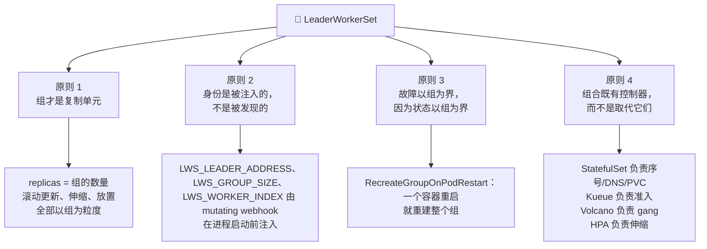
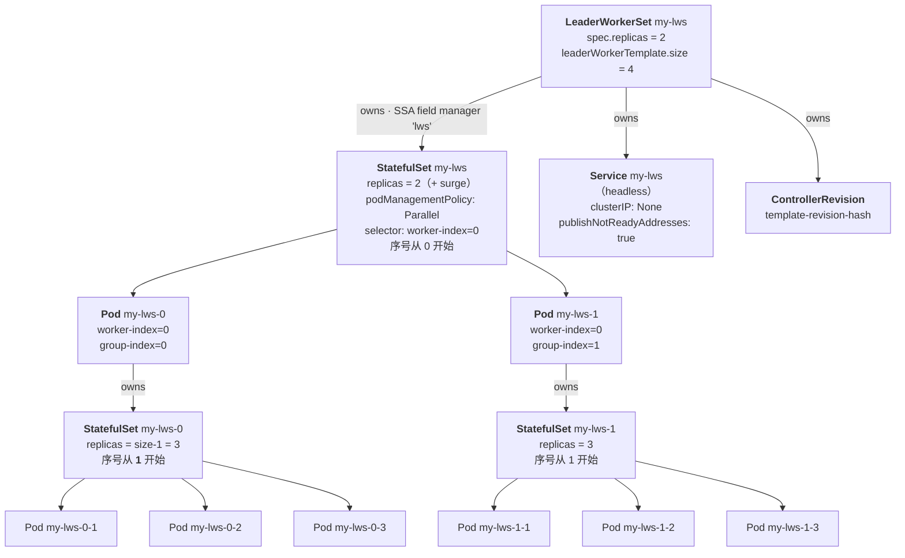

# LeaderWorkerSet：问题陈述与课程大纲

一张 H100 有 80 GB 显存。一个 405B 参数的模型以 bf16 存放，光权重就约 810 GB——这还没算一个 KV cache block。算术并不微妙：前沿推理装不下一张加速卡，而且越来越装不下**一台主机**。当模型跨主机的那一刻起，你真正关心的工作单元就不再是 Pod，而是**一组必须同生、按 rank 寻址、同死的 Pod**。

Kubernetes 没有这样的原语。Deployment 给你可互换的副本；StatefulSet 给你有序身份但只有一个伸缩维度；Job 和 JobSet 给你 run-to-completion 语义，而服务端点并不想要这个。每一个都差那么一点，于是过去两年业界的通行做法是：一堆 Helm 模板，把 StatefulSet、headless Service 和一个轮询 DNS 的 init container 粘在一起。

[LeaderWorkerSet](https://github.com/kubernetes-sigs/lws)（LWS）是 SIG-Apps 给出的答案：一个**以「一组 Pod」为复制单元**的 API，滚动更新、伸缩、放置、故障处理全部以组为粒度。**DisaggregatedSet**（DS）自 v0.9.0 起随之发布，在其上再加一层，用于 prefill/decode 分离式服务——两个或更多**形状不同**的组必须齐步滚动、协同伸缩。

本笔记从问题陈述一路搭到源码，覆盖**多机推理的问题域**、**完整 API 表面**、**组的生命周期与 Pod 身份**、**控制器内核**、**Pod 控制器与故障处理**、**滚动更新算法**、**调度与放置**、**DisaggregatedSet**、**推理引擎集成**、**运维**，以及**贡献者工作流**。

!!! info "溯源信息"
    本文全部内容对照 `kubernetes-sigs/lws` 的 **`32a9c37`** 提交（2026-08-06）、发布版本 **v0.9.0** 核实。凡上游文档与上游代码不一致之处，本笔记以代码为准，并把差异记录到[附录 B](appendix_pr_opportunities.md)。形如 `pkg/controllers/leaderworkerset_controller.go` 的路径均相对该代码树。

---

## 第一部分：四条组织原则

四个想法几乎解释了代码库中所有的设计决策。可以说，每个模块都是其中某一条的展开。

### 原则 1：组才是复制单元

在 Deployment 里，`replicas: 8` 表示八个可互换的 Pod。在 LWS 里，`replicas: 8` 表示**八份互相独立的、完整的分片模型服务**，每一份内部由 `leaderWorkerTemplate.size` 个 Pod 组成。Pod 总数是 `replicas × size`，但**你能失去的东西**只有 8 个。

正是这次重新定义，让所有下游行为变得自洽。滚动更新走的是组而不是 Pod。HPA 的 scale 子资源指向 `spec.replicas`，而 `status.hpaPodSelector` 刻意**只选 leader Pod**（`worker-index=0`），这样 per-pod 指标做平均时除的是组数而不是 Pod 数。独占拓扑放置把一个组钉在一个拓扑域里。Gang 调度以组为单位 all-or-nothing 地准入。

**这对读代码的意义**：每当你在 `leaderworkerset_controller.go` 里看到算术，先问它在数哪个单位。最常见的困惑来源是：`status.replicas` 统计的是 leader StatefulSet 的副本数，**包含滚动更新期间的 surge 副本**，而 condition 逻辑统计的是经过 partition 窗口过滤、剔除 burst 的子集。它们是两个不同的数字，而且是故意的。

### 原则 2：身份是被注入的，不是被发现的

推理引擎需要在**进程启动的那一刻**就知道自己的 rank 和 world size。vLLM 的 Ray 引导、SGLang 的 `--dist-init-addr`、TensorRT-LLM 的 `mpirun`，都要在第一个 CUDA context 创建之前知道「我是谁、我们一共几个、rank 0 在哪」。而一套发现协议——轮询 DNS、等待 peer、选主——既是启动竞态的来源，也是每个用户都得在 init container 里重写一遍的东西。

LWS 直接把答案注入进去。一个 mutating webhook（`pkg/webhooks/pod_webhook.go`）在 Pod 被调度之前就给每个 Pod 打上 `LWS_LEADER_ADDRESS`、`LWS_GROUP_SIZE`、`LWS_WORKER_INDEX`；共享 headless Service 创建时带 `publishNotReadyAddresses: true`，使得在任何 Pod Ready 之前 leader 的 FQDN 就能解析。

**这条原则的推论**：这三个环境变量是一套稳定的 ABI。接入一个新推理引擎，几乎总是「把它们映射到引擎自己的命令行参数」这件事，而这就是[模块 9](09_inference_engine_integration.md) 的全部内容。

### 原则 3：故障以组为界，因为状态以组为界

如果一个模型按 tensor 切分到八个 Pod 上，其中一个 Pod 的容器重启了，另外七个手里还攥着重启后的进程不再认同的分片状态。这里**不存在**可以恢复到的「部分存活」状态。只重启那一个 Pod，得到的是一个**在运行但不在服务**的组——这是最糟的结果，因为幸存 Pod 上的 readiness probe 很可能仍然通过。

因此 LWS 的默认 `restartPolicy: RecreateGroupOnPodRestart` 会在任一 Pod 被重建、或任一 Pod 中任一容器重启时，把整个组拆掉重来。这个策略是刻意粗暴的；[模块 5](05_pod_controller_and_failure_handling.md) 会逐行走一遍检测机制，包括 `RecreateGroupAfterStart`——它会在所有 Pod 都离开 `Pending` 之前抑制该行为——以及这个变体为什么存在。

### 原则 4：组合既有控制器，而不是取代它们

LWS 不直接创建 Pod。它创建 **StatefulSet**，把序号分配、稳定 DNS、PVC 绑定、`podManagementPolicy: Parallel` 并行创建都交给 StatefulSet 控制器。它不实现准入控制——那是 Kueue。它不实现 gang 调度——它通过 `SchedulerProvider` 接口委托给 Volcano。它不实现自动伸缩——它暴露 `/scale`，让 HPA 来驱动。

**这对贡献者的意义**：LWS 的相当一部分行为是继承来的，而且好几个 LWS 特性依赖上游 Kubernetes 的 feature gate（`StatefulSetStartOrdinal`、`MaxUnavailableStatefulSet`）。在提出一个新机制之前，先确认组合点是不是已经存在了——这个问题几乎在每次 KEP review 里都会被问到。

---

## 第二部分：对象图

这张图是读任何控制器代码之前最值得先装进脑子里的东西。代码库中几乎所有微妙之处——worker StatefulSet 为什么由 **Pod** 拥有、为什么有两条 watch 路径、`status.replicas` 为什么是那个值——都能从这个形状里推出来。

图里有三个事实是承重的，而且经常出乎意料：

1. **整个 LWS 只有一个 leader StatefulSet**，其 `replicas` 等于组数。leader Pod 是它的成员，通过 `leaderworkerset.sigs.k8s.io/worker-index=0` 选出。
2. **每个 worker StatefulSet 由它的 leader *Pod* 拥有**，而不是由 LWS 拥有。因此一个组的垃圾回收是「删除 leader Pod」的连带结果。这也解释了 LWS 控制器为什么需要第二条基于 label 的 watch（`enqueueLWSRequests`）——worker StatefulSet 不在它的 `Owns()` 图里。
3. **worker 的序号从 1 开始**，靠 worker StatefulSet 上的 `.spec.ordinals.start` 实现，从而让 `workerIndex` 全局一致：leader 恒为 0，worker 是 1..M。这就是对上游 `StatefulSetStartOrdinal` 特性的依赖（Kubernetes 1.31 起 GA），也是 LWS 要求 ≥ 1.26、而在恰好 1.26 上要你手动打开该 gate 的原因。

再往上一层，`DisaggregatedSet` 管理 **N 个 LeaderWorkerSet**——每个 role × slice × revision 一个——并协调它们的滚动更新。这是[模块 8](08_disaggregatedset.md)。

---

## 第三部分：课程结构与路线图

| 模块 | 文件名 | 覆盖的核心主题 |
| :--- | :--- | :--- |
| **[模块 1：问题域](01_multihost_inference_problem_space.md)** | [`01_multihost_inference_problem_space.md`](01_multihost_inference_problem_space.md) | TP/PP/EP 切分及各自对编排器的要求；prefill/decode 分离；Deployment、StatefulSet、Job、JobSet 各自差在哪；LWS 的设计公理；与 Kueue、Volcano、JobSet、llm-d 的分工 |
| **[模块 2：API 表面](02_api_surface_anatomy.md)** | [`02_api_surface_anatomy.md`](02_api_surface_anatomy.md) | `LeaderWorkerSetSpec`/`Status` 逐字段；全部 label、annotation、环境变量常量；scale 子资源；`Configuration` CRD；CRD 生成与约束 API PR 的 KAL 规则 |
| **[模块 3：组与身份](03_group_lifecycle_and_identity.md)** | [`03_group_lifecycle_and_identity.md`](03_group_lifecycle_and_identity.md) | 双层 StatefulSet 结构；命名与序号；子组（KEP-115、KEP-257）；headless Service 与 DNS（KEP-173）；startup policy（KEP-135）；Pod mutating webhook；TPU 环境变量注入 |
| **[模块 4：控制器内核](04_lws_reconciler_internals.md)** | [`04_lws_reconciler_internals.md`](04_lws_reconciler_internals.md) | `cmd/main.go` 的装配、命令行参数与配置优先级；十二步 `Reconcile`；Server-Side Apply 与 `lws` field manager；status 与 condition 计算；ControllerRevision（KEP-238）的哈希、命名与截断 |
| **[模块 5：故障处理](05_pod_controller_and_failure_handling.md)** | [`05_pod_controller_and_failure_handling.md`](05_pod_controller_and_failure_handling.md) | Pod 控制器的 watch；leader Pod → worker StatefulSet 的创建路径；重启策略与容器重启检测；组重建；独占拓扑亲和性注入；作为待议提案的 KEP-820 |
| **[模块 6：滚动更新](06_rollout_and_revisions.md)** | [`06_rollout_and_revisions.md`](06_rollout_and_revisions.md) | 滚动更新的算术——partition 递减、`maxSurge` 突发、`maxUnavailable`；用户可设的 partition（KEP-511）；`MaxUnavailableStatefulSet` gate；revision 语义与回滚 |
| **[模块 7：调度](07_scheduling_placement_and_networking.md)** | [`07_scheduling_placement_and_networking.md`](07_scheduling_placement_and_networking.md) | 独占拓扑放置详解；Kueue 与 Topology Aware Scheduling；gang 调度（KEP-407）与 Volcano provider；subdomain policy 的取舍；`volumeClaimTemplates`（KEP-622）；worker 扩缩（KEP-552） |
| **[模块 8：DisaggregatedSet](08_disaggregatedset.md)** | [`08_disaggregatedset.md`](08_disaggregatedset.md) | KEP-766 的动机；planner/executor 拆分；N 维协同滚动更新；slices（KEP-846）；放置策略（KEP-848）；经由 `DisaggregatedSetRoleScaler` 的 per-role 自动伸缩（KEP-849）；revision 感知的 Service |
| **[模块 9：引擎集成](09_inference_engine_integration.md)** | [`09_inference_engine_integration.md`](09_inference_engine_integration.md) | 作为 ABI 的 `LWS_*` 契约；vLLM、SGLang、TensorRT-LLM、llama.cpp 的接法；多机引擎的探针设计；权重加载与冷启动；与机密计算服务架构的交叉引用 |
| **[模块 10：运维](10_operations_and_troubleshooting.md)** | [`10_operations_and_troubleshooting.md`](10_operations_and_troubleshooting.md) | 安装路径与「CRD 优先」的升级顺序；cert-manager 与内置证书管理；指标与 Prometheus；HPA 实战；版本兼容矩阵；排障手册 |
| **[模块 11：参与贡献](11_contributor_workflow.md)** | [`11_contributor_workflow.md`](11_contributor_workflow.md) | 仓库布局；`make` 目标全表与固定的工具版本；envtest、kind e2e、升级 e2e；`test/wrappers` 构建器惯例；golangci 与 KAL API linter；代码生成；KEP 流程；发布流程；review 文化 |
| **[附录 A：术语表](appendix_glossary.md)** | [`appendix_glossary.md`](appendix_glossary.md) | 本笔记用到的全部 LWS、Kubernetes、推理术语，按领域分组 |
| **[附录 B：PR 机会清单](appendix_pr_opportunities.md)** | [`appendix_pr_opportunities.md`](appendix_pr_opportunities.md) | 写作过程中发现的、有据可查的上游贡献机会，附文件路径与难度评级 |
| **[附录 C：阅读清单](appendix_reading_list.md)** | [`appendix_reading_list.md`](appendix_reading_list.md) | 带注解的一手资料——LWS 的 KEP、LWS 依赖的上游 Kubernetes KEP、推理引擎文档 |

---

## 第四部分：每个模块怎么组织

每个模块都遵循同样的五拍结构，并以一个动手实验收尾。

1. **概念基础**——先讲问题再讲方案，让设计读起来像是推论而不是约定。
2. **架构与数据流**——每个不显然的机制配一张 Mermaid 图；只要有两种设计在竞争，就配一张对比表。
3. **API 与代码解剖**——真实的标识符、字段路径、常量字符串和算术，而不是它们的转述。函数名一律给全，方便你直接 `grep`。
4. **生产坑点**——什么会坏、上游文档在哪里说轻了或说错了、什么还处于 alpha。
5. **`## 实验：`**——一个可跑的练习。滚动更新算法不会因为你读懂了 partition 算术就变得直观；它会在你第一次盯着 `kubectl get lws -w` 看着 `maxSurge` 滚动时副本数冲高的那一刻变得直观。

!!! warning "关于实验与规模"
    实验面向**真实的多机 GPU 资源**——GKE 加速器节点池、A3/A4 机型、货真价实的跨节点张量并行——因为 LWS 大部分有意思的行为只有在一个组跨主机时才会显现。单节点 kind 集群会愉快地跑通每一条 LWS API 路径，同时什么都教不会你：跨节点 DNS 时序、gang 调度死锁、独占拓扑导致的容量饥饿、冷启动权重加载，这些才是真正会咬人的失效模式。

    凡是没有在活集群上实际执行过的命令，一律标注 **unverified**，并注明是转录自上游文档还是示例清单。真正的约束通常是容量而不是成本：多机加速器机型受地域限制，往往需要预留或 Dynamic Workload Scheduler flex-start。开跑之前先查配额。

    确实有价值的地方，每个实验也会给出 `kind` 回退方案——主要是 API 校验和滚动更新算术这两类实验，它们完全不需要加速器。

从[模块 1：多机推理的问题域](01_multihost_inference_problem_space.md)开始。
